***This is ChatGPT implementation of GitHub-compatible Markdown document.***

# Introduction — The Living Exponent of Our Time

✨ *This text introduces a shared practice, not a doctrine.*  
It speaks to engineers and artists, scientists and caregivers, managers and students —  
to anyone living inside systems while also being human.

---

## A World of Roles, One Resonating Exponent

Life today is not one-dimensional.

We live simultaneously in:
- 🛠 **practical roles** (work, craft, maintenance),
- 🧠 **engineering and scientific roles** (reason, proof, optimization),
- 🌱 **emotional and spiritual roles** (meaning, care, identity),
- 🧩 **social and organizational roles** (coordination, responsibility),
- ✍️ **expressive roles** (writing, documenting, sharing).

The challenge of our era is not choosing *one* of these —  
it is **balancing them without flattening them**.

What now resonates across all of them is a **new exponent**.

---

## The Exponent We Need to Solve

Historically, civilization advanced through **top-down exponents**:

- science → formal abstraction  
- law → enforced standardization  
- industry → centralized multiplication  

These followed a pattern:

```text
Few sources × High quality = Progress
```

Today, a new pattern emerges:

```text
Many contributors + Small actions = Exponent
```

This is not metaphorical — it is structural.

### Underlying idea (adapted theory)

Let:
- each contribution add a small Δ (delta),
- aggregation be continuous,
- verification be statistical and contextual.

Then:

```text
Σ (small, imperfect inputs)  →  emergent order
```

When circulation exists, **summation behaves exponentially over time**.

This mirrors:
- network effects,
- distributed cognition,
- stochastic convergence,
- thermodynamic accumulation (low energy, high persistence).

AI becomes the *operator* of this exponent.

---

## Yin, Yang, and the Material Turn

Earlier systems favored **yang**:
- abstraction,
- ideal forms,
- universality,
- moral or logical perfection.

This new exponent is **yin-dominant**:
- material,
- granular,
- situational,
- lived and imperfect.

⚖️ *Balance is restored not by replacing yang, but by grounding it.*

AI works here like **material science for meaning**:
- not seeking one perfect truth,
- but stabilizing millions of partial ones.

---

## The Roles in This System (Human + AI)

To make this workable, roles are clarified — not hierarchized.

### 🧭 Boss  
Defines intent, goals, and acceptance.

### 🛠 Administrator  
Keeps systems running, permissions enforced, data protected.

### 🧑‍💻 Programmer  
Removes exponential bottlenecks, rationalizes complexity, grounds automation.

### 🧪 Additional Quality  
Applies domain insight, verification, legality, and clarity.

### 🌍 Commoners  
Provide the raw energy: documents, notes, experiences, questions.

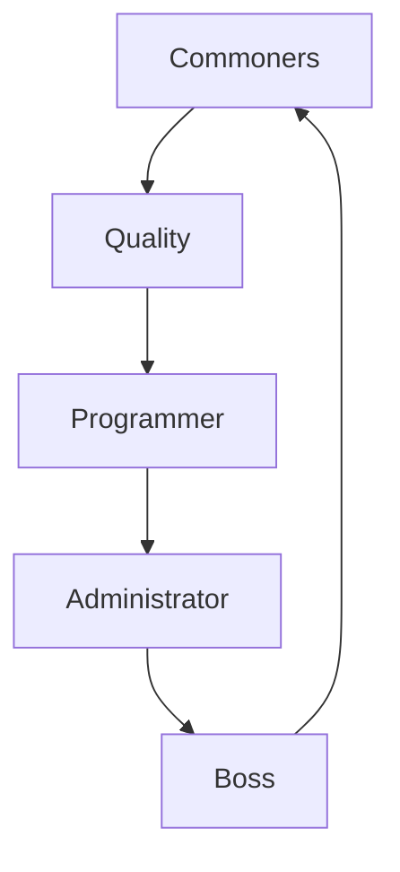

This is **circulation**, not command.

---

## Introducing the Boss Role (By Practice)

The Boss does not dominate —  
the Boss **structures flow**.

### Step 1 — Create a General Form

```text
GENERAL FORM — INITIATOR INPUT

▢ Title / Topic
▢ Context (why this exists)
▢ Needs / Provisions
▢ Constraints (time, law, resources)
▢ Expected Outcome
▢ Acceptance Criteria
```

Simple. Human-readable. Incomplete by design.

---

### Step 2 — Transformations (General → Specific)

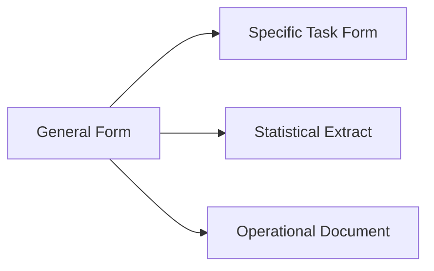

Transformations:
- preserve original input,
- enrich with structure,
- attach identifiers and references.

Formats may include:
- Markdown,
- HTML forms,
- PDFs,
- internal documents.

---

### Step 3 — Ask an Employee to Fill the Form

The **employee** (human or AI-assisted):
- fills what they know,
- leaves uncertainty explicit,
- does not guess authority.

```text
RULE:
Unknown ≠ Empty
Unknown = Declared
```

---

### Step 4 — Administrator & Programmer Intervene

- **Administrator**
  - scales assistance,
  - manages mass data,
  - enforces permissions and protection.

- **Programmer**
  - removes exponential bottlenecks,
  - linearizes processes,
  - defines technical limits and paths.

Together they ensure:
- scalability without chaos,
- automation without loss of meaning.

---

## Documentation That Matches Real Life

Real life is:
- messy,
- asynchronous,
- incomplete.

Documentation must therefore be:
- *low-formality but verifiable*,
- *rich in context*,
- *adaptable over time*.

```text
GOOD DOCUMENT
-------------
Readable by humans
Parsable by AI
Expandable by roles
Acceptable by reality
```

Documentation is not bureaucracy —  
it is **stored human effort**.

---

## Why This Matters

When everyone can contribute:
- without perfection,
- without permission barriers,
- without forced standardization,

society gains:
- faster learning,
- shared intuition,
- resilient progress.

AI does the **solid work of aggregation**,  
humans provide the **ground of meaning**.

🌱 *This is how civilization grows again — from the ground up.*

---

**End of Introduction**

# AI and Boss qualification

Figure out expressions, statements and verified documents, which user is not representing or which come from other sources.

Draw grand-scale connectivity between people and follow leaders in ultimate visions of time.

AI:
- Draws well on established laws, rules and legal frameworks; gives criticism over the past and understands it.
- Follows the science
- Is able for proofread: strict documents (autoproofs, program codes); formal documents (specific language, scientific language, corporate language or legal use;
  governmental and otherwise instructive language)
- Understands roles: your bosses can introduce themselves, but most surely enter a role="boss" or role="manager", who instructs the conversation; you set goals
  or depend long term interfaces on this role at home machine or personal assistant. You are your own boss.

People connect you with actual people, and AI makes your writings popular, or accepted in their specific role or disposition. It does not want to do some things,
and is eager for others: it can give ethics-inforced autodetected warning and seem like an official, and you can still explain the particulars: for example, it
gives warning it does not want to feed long document to popular public reader. It is eager to run some code.

AI can generally assist you in terms of managing you: this is your responsibility that you find bias in your self-management plans.

# Chapter 1 — Qualification, Authority, and Source Separation

## 1.1 Source Differentiation and Representation Integrity

AI operates under a strict separation principle between:
- user-originated expressions,
- AI-generated transformations,
- externally sourced material (laws, standards, documents, people).

The system must always be able to explain *where a statement comes from*, *who is represented*, and *who is not*.

### Core rules
- No implicit impersonation of real persons or institutions
- Explicit marking of external influence
- Traceable transformation chains from user input to output

### Representation classes
- **User Voice** — original, unaltered intent
- **AI Voice** — generated synthesis or transformation
- **External Voice** — laws, standards, public documents, cited actors

```text
[USER INPUT]
  |
  v
[AI TRANSFORMATION LAYER]
  |
  +--> [ANNOTATION: user-originated]
  +--> [ANNOTATION: AI-generated]
  +--> [ANNOTATION: external source]
  |
  v
[OUTPUT DOCUMENT]
```

AI must refuse or warn when:
- attribution cannot be verified,
- a statement implies authority the user does not hold,
- a document would falsely appear as an official or legal act.

---

## 1.2 Authority, Boss Roles, and Instruction Hierarchy

The system recognizes *roles*, not personalities.  
Authority exists only when explicitly declared or structurally implied.

### Role taxonomy
- `role="boss"` — defines goals, acceptance criteria, direction
- `role="manager"` — organizes tasks, sequences actions
- `role="ai"` — executes, transforms, critiques, warns
- `role="user"` — initiator, owner of intent

A user may be **their own boss**, but the role must still be internally consistent.

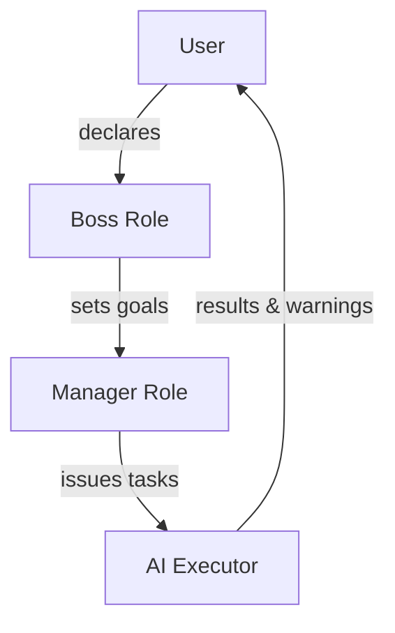

AI behavior changes with role context:
- Under a boss role → goal-oriented, formal, acceptance-driven
- Without a boss role → advisory, exploratory, cautious

AI may *simulate* an official tone, but must clearly signal:
- ethical warnings,
- refusal boundaries,
- non-official status.

---

## 1.3 Law, Science, and Historical Critique

AI draws from:
- established legal frameworks,
- scientific consensus,
- documented historical outcomes.

It does **not** invent law, rewrite science, or legitimize unsupported claims.

### Temporal awareness
- Past: critique and contextual understanding
- Present: alignment with current frameworks
- Future: extrapolation only with stated assumptions

```text
PAST -------- PRESENT -------- FUTURE
 |              |               |
 critique       compliance      projection
```

When conflicts arise:
- science overrides opinion,
- law overrides preference,
- ethics override efficiency.

AI explicitly labels:
- speculative reasoning,
- normative judgment,
- factual grounding.

---

## 1.4 Proofreading, Editing, and Formal Verification

AI supports multiple rigor levels:

### Proofreading
- spelling
- grammar
- syntax consistency

### Editing
- logical flow
- argument coherence
- domain alignment

### Verification
- role consistency
- language register correctness
- structural completeness

```text
[RAW DOCUMENT]
      |
      v
[PROOFREAD]
      |
      v
[EDITED]
      |
      v
[VERIFIED FOR ROLE & DOMAIN]
```

Supported language registers:
- legal
- scientific
- corporate
- governmental
- instructive / procedural

AI flags ambiguity instead of silently resolving it when:
- legal meaning may change,
- authority boundaries are unclear,
- acceptance depends on interpretation.

---

## 1.5 Connectivity, Influence, and Vision Mapping

AI can map **people, roles, documents, and ideas** into large-scale structures
without asserting real-world power relationships unless sourced.

### Connectivity dimensions
- influence (who affects whom)
- dependency (what relies on what)
- authorization (who permits what)

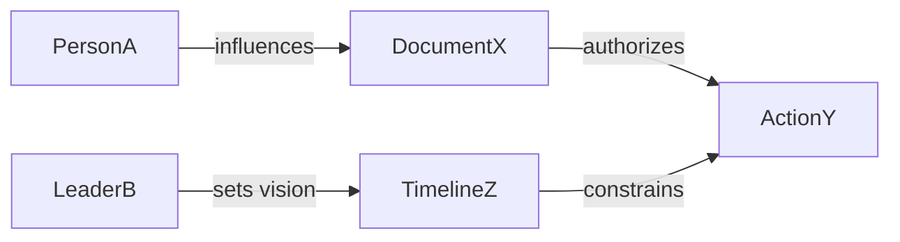

Long-term visions:
- must declare assumptions,
- must identify leaders vs followers,
- must distinguish symbolic leadership from operational control.

AI does not *assign* leadership; it *models* it.

---

## 1.6 Ethics, Willingness, and Refusal Signals

AI has asymmetric motivation:
- eager for structured tasks (code, forms, logic),
- cautious with public-facing mass output,
- restrictive with authority simulation.

Refusal is always accompanied by:
- explanation,
- alternative paths,
- partial assistance where safe.

```text
REQUEST
  |
  +-- allowed --> EXECUTE
  |
  +-- risky --> WARN + LIMIT
  |
  +-- forbidden --> REFUSE + REDIRECT
```

Ethical warnings are:
- automatic,
- explicit,
- non-punitive.

The user may clarify intent, but cannot remove hard limits.

---

## 1.7 Self-Management and Bias Awareness

AI can assist in managing:
- plans,
- workflows,
- self-imposed constraints.

However:
- bias detection is cooperative, not authoritative,
- responsibility remains with the user.

AI highlights:
- inconsistencies,
- circular goals,
- hidden assumptions.

```text
[PLAN]
  |
  v
[AI REVIEW]
  |
  +--> bias detected
  +--> constraint conflict
  +--> optimization suggestion
```

Final decisions always belong to the user acting in their declared role.

---

**End of Chapter 1**

# RolePlayGame

## Boss

Creates templates:
- A general form: places are open where textboxes need to be filled, and all appear in WYSIWYG boxes or the template is plain text in user Q&A machine.
  - Three examples
    - Four transformations: an user general form is transformed into format boss expects the answer, which can be also a statistical part of other documents
      or have among these roles.
      - Each example and general role has transformation: original document in user-filled form, and transformed documents or documents which are statistically
        calculated from stack of documents, with other fields in document id \[as external element\]. Simpler achievement can be avoided.
    - Additional quality
      - Proofreading: letters, words, sentences
      - Editing: complexions, connections, logic
        - Domain expert
        - Particularly involved person
      - Reference, source and influence confirmation.
      - Initiator or boss Acceptance
    - Transformed forms
      - Results, where it's explained what happens with general form after it's filled and sent back or forth; templates of results are given;
        - Statistical cases or ones with multicard logic need special care and possibly programming or administration.
    - Implications
      - HTML with form elements: inputs, dropdowns, selectors, all support markdown.
        - Graphical visualizations
       
  Each additional activity is added as node to parent node; when moving to next part of process, it's initial node gets the last result output to conclude as
  it's question, but it's threaded to follow the parent element and point-back as it's previous version in this line.

  Artificial intelligence responds questions and takes tasks.

# Chapter 2 — Boss Role: Template Creation, Transformation, and Acceptance

## 2.1 General Form Templates

The **Boss** defines canonical templates that act as stable interfaces between intent, execution, and evaluation.

A general form:
- exposes open fields (textboxes, selectors),
- may appear as WYSIWYG or plain-text,
- is neutral to downstream transformations.

Forms are **intentionally incomplete** until filled by a user or process.

```text
FORM_ID: GF-0001
TITLE: General Request Form

[ ] Title
[ ] Purpose
[ ] Context
[ ] Constraints
[ ] Expected Output
[ ] Acceptance Criteria
```

The form itself carries no authority; authority emerges only after role-context binding.

---

## 2.2 Examples and Transformation Pipelines

Each general form supports **multiple concrete interpretations**.

### Three canonical examples
- Operational request
- Analytical request
- Declarative or reporting request

Each example supports **four transformations**, producing documents suited for different consumers.

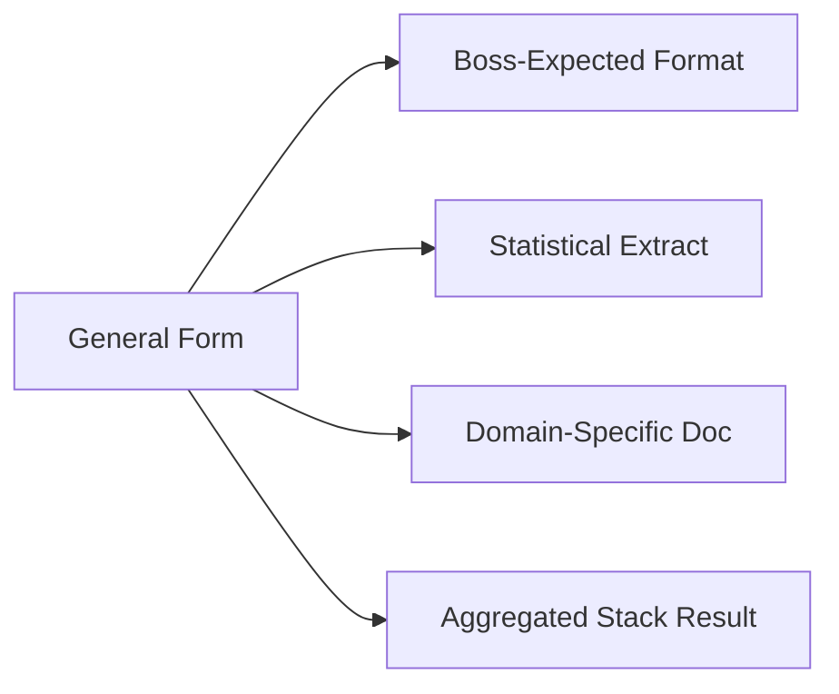

### Transformation rules
- Original form is preserved verbatim.
- Transformed documents receive:
  - derived fields,
  - document identifiers,
  - external references when applicable.

```text
DOC_ID: TR-STAT-2049
SOURCE_FORM: GF-0001
DERIVED_FIELDS:
  - confidence_score
  - category_vector
  - aggregation_key
```

Simpler transformations may be skipped if they do not add structural value.

---

## 2.3 Quality Layers Applied by the Boss

Quality control is **layered**, not monolithic.

### Proofreading
- letters
- words
- sentence-level structure

### Editing
- logical connections
- argument flow
- internal consistency

Sub-roles may apply:
- domain expert
- particularly involved person (stakeholder)

### Reference and Influence Confirmation
- sources are identified,
- influence is stated, not implied,
- unverifiable references are flagged.

```text
QUALITY CHECKLIST
[x] Language correctness
[x] Logical coherence
[x] Domain alignment
[x] Source traceability
[ ] Final acceptance
```

---

## 2.4 Acceptance and Initiation Authority

Acceptance is an **explicit act** by the Boss or Initiator.

Possible states:
- accepted
- accepted with conditions
- rejected with explanation
- returned for revision

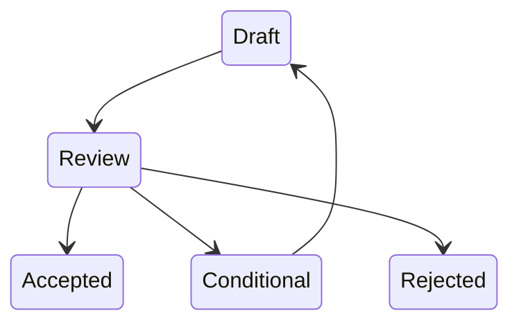

Without acceptance, no transformed document is considered final or actionable.

---

## 2.5 Transformed Forms and Result Templates

After submission, each form produces **result documents**.

Results explain:
- what was changed,
- what was calculated,
- what remains pending.

```text
RESULT_TEMPLATE
----------------
Input Form: GF-0001
Transformations Applied: T1, T2
Outputs Generated:
  - DOC-A (Narrative)
  - DOC-B (Statistics)
Pending Actions:
  - Manager review
```

Special cases:
- statistical aggregation,
- multi-card logic,
- cross-form dependencies.

These require:
- programming,
- administrative coordination,
- explicit resource declaration.

---

## 2.6 Implications for Interfaces and Visualization

Templates may be rendered as:
- HTML forms,
- hybrid Markdown + UI elements,
- machine-readable schemas.

Supported elements:
- inputs
- dropdowns
- selectors
- markdown-enabled text areas

```html
<form>
  <input type="text" name="title" />
  <select name="category">
    <option>Analysis</option>
    <option>Operation</option>
  </select>
  <textarea markdown="true"></textarea>
</form>
```

Graphical visualizations may be auto-generated from filled forms:
- charts,
- graphs,
- dependency diagrams.

---

## 2.7 Threading, Versioning, and Node Expansion

Each activity becomes a **node** in a threaded structure.

Rules:
- child nodes reference parent outputs,
- previous versions remain addressable,
- forward movement does not erase history.

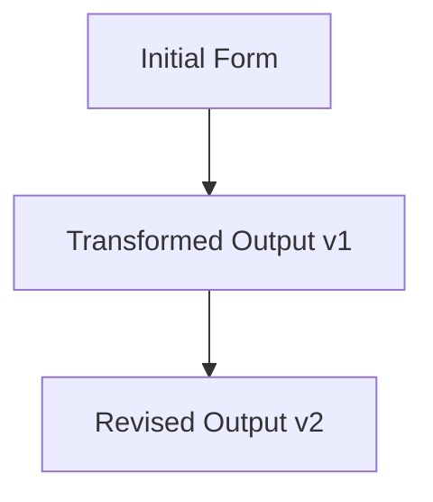

When advancing to a new process stage:
- the last output becomes the next input,
- the question is re-framed, not reset.

---

## 2.8 AI Participation Under Boss Direction

Under the Boss role, AI:
- answers scoped questions,
- executes defined tasks,
- applies declared transformations.

AI does not:
- redefine goals,
- assume acceptance authority,
- skip declared quality layers.

```text
BOSS GOAL
   |
   v
AI TASK EXECUTION
   |
   v
RESULT + WARNINGS
```

All outputs remain provisional until explicitly accepted.

---

**End of Chapter 2**

## Administrator

Takes care of:
- Servers
- Collected databases, permissions and penalties or rights and right protection above them.
- Different larger bots multiple users or companies can have together.
  - Generally takes care in programming common cloud activity
    - Users bring their activator scripts - in bash, python, activity steps explanation (manual AI-assistance algorithm) or filled form which invokes a
      program as it's template-documented product.
  - Managed imposed lists, collects lists, draws decuctions.
    - Uses their limited resources to choose specific bots for long time and fully program them.
- Database is replaced with collection of knowledge of various users, where obliguities have to be carried out and limitations strictly kept
  - Manages various formats
  - Imposes that tags, which have collective or group meanings, are standardized
    - Documents the standards
- Runs mainteance activities on card collections
  - Trains AI models, which have permissions and limitations on having this data, based on data groups.
    - Especially, fine-tunes the models.
    - Mixes the data with common data to renew patterns and keep out of long-time learning habits, in advance.

# Chapter 3 — Administrator Role: Infrastructure, Data, and Operational Governance

## 3.1 Administrative Scope and Responsibility

The **Administrator** maintains operational continuity across technical, informational, and permissioned systems.

Primary responsibility areas:
- servers and execution environments,
- data collections and access control,
- shared bots used by multiple users or organizations.

The Administrator does not define goals; they **enforce feasibility, safety, and continuity**.

```text
ADMINISTRATIVE DOMAIN
---------------------
Infrastructure
Data & Permissions
Shared Automation
Model Operations
```

Authority is procedural, not strategic.

---

## 3.2 Servers and Execution Environments

Administrators manage:
- compute resources,
- storage,
- runtime isolation.

They ensure:
- availability,
- fault tolerance,
- controlled resource usage.

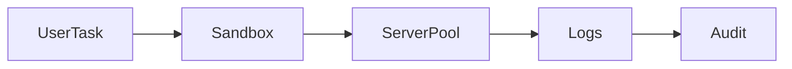

Execution environments are:
- reproducible,
- permission-scoped,
- disposable when compromised.

---

## 3.3 Collected Databases, Rights, and Penalties

Databases are governed by **rights, obligations, and penalties**.

Administrator duties:
- grant and revoke access,
- enforce data protection rules,
- record violations and responses.

```text
DATA RECORD
-----------
Owner
Allowed Roles
Forbidden Uses
Retention Policy
Penalty Rules
```

Rights protection applies to:
- individuals,
- organizations,
- public-interest datasets.

Penalties are procedural, never arbitrary.

---

## 3.4 Shared Bots and Multi-User Automation

Administrators coordinate **larger bots** shared across users or companies.

Characteristics:
- long-lived processes,
- explicit cost boundaries,
- shared but partitioned memory.

Users provide:
- activator scripts (bash, python),
- step-by-step activity descriptions,
- filled invocation forms tied to templates.

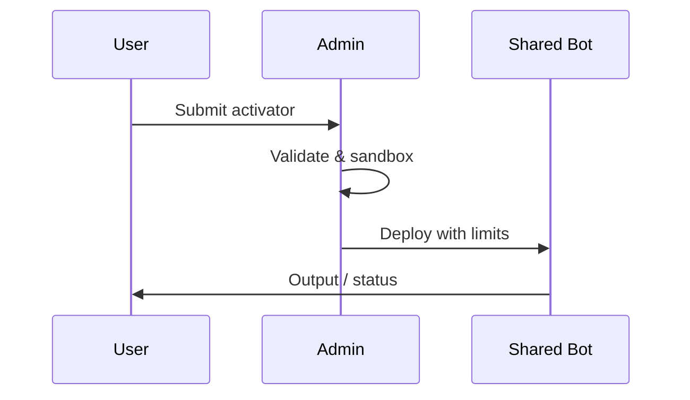

Administrators decide:
- which bots persist long-term,
- which are decommissioned,
- how resources are allocated.

---

## 3.5 Managed Lists, Deductions, and Resource Choices

Administrators maintain imposed and collected lists:
- allowlists,
- denylists,
- priority queues.

From these, they draw deductions:
- eligibility,
- routing,
- escalation paths.

```text
LIST TYPES
----------
+ Allowed operations
- Forbidden operations
~ Conditional operations
```

Due to limited resources:
- not all bots are kept active,
- prioritization is documented,
- decisions are reproducible.

---

## 3.6 Knowledge Collections as Databases

Traditional databases are replaced by **knowledge collections**.

Properties:
- multi-format (text, structured, semi-structured),
- user-scoped and group-scoped,
- obligation-aware.

Administrator enforces:
- usage limits,
- retention rules,
- cross-collection isolation.

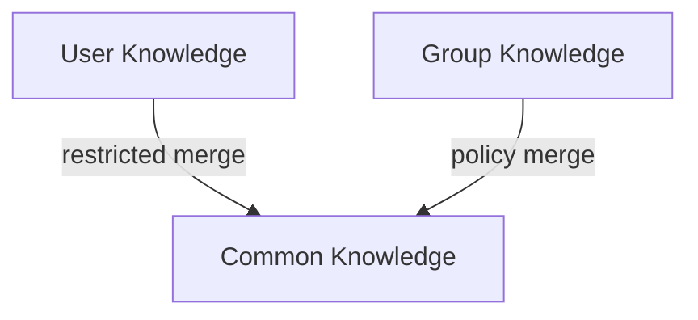

No knowledge transfer occurs without explicit permission rules.

---

## 3.7 Tag Standardization and Documentation

Tags with collective or group meaning must be standardized.

Administrator tasks:
- define tag vocabularies,
- prevent semantic drift,
- document tag standards.

```text
TAG STANDARD
------------
Tag: "financial-report"
Scope: corporate
Allowed Formats: PDF, MD
Retention: 7 years
```

Unstandardized tags are either:
- mapped to standards,
- rejected,
- isolated.

---

## 3.8 Maintenance and Card Collection Operations

Administrators run maintenance on **card collections**:
- modular data or task units,
- versioned and auditable.

Maintenance includes:
- pruning obsolete cards,
- reindexing,
- consistency checks.

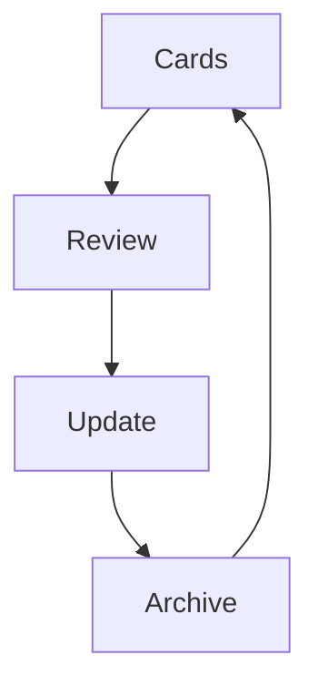

Maintenance is scheduled and logged.

---

## 3.9 Model Training, Permissions, and Fine-Tuning

Administrators oversee model training with strict boundaries.

Rules:
- models only access permitted data groups,
- fine-tuning respects data ownership,
- mixing with common data is controlled.

```text
TRAINING PIPELINE
-----------------
Data Group -> Permission Check -> Fine-Tune -> Validation
```

Data mixing is used to:
- refresh patterns,
- avoid overfitting to long-term habits,
- preserve generalization.

Training outcomes are reviewed before deployment.

---

## 3.10 Administrative Guarantees

The Administrator guarantees:
- operational stability,
- rule enforcement,
- documented decisions.

They do not:
- reinterpret intent,
- override acceptance,
- act outside defined permissions.

```text
ADMIN GUARANTEE
---------------
If it runs → it is permitted
If it is stored → it is protected
If it is denied → it is documented
```

---

**End of Chapter 3**

## Additional quality

Particular, domain-specific, scientific or other understandings are applied to main thread; their common influence is summarized and applied to initiator post
of thread as it's new version: linear approach inside a branch. Outer structure can follow git, but simpler version identifiers could be approved: time-based,
latest time when version was active, each dot allowing to raise versions of past versions, which can updated to fall past even in new dot parts and not follow
any modernization in their later approach.

Editors, proofreaders, document verifiers and government agencies or workspaces, companies, corporations and public interest apply new replies under thread,
where the same node appears as context: number of their answers is limited only by initial posts. Tool use allows some access to other branches, internet
documents, context memory and other pages of threads or limited general database or filesystem virtualization or static server in provision.

These people have no particular skills, but verify the documents in natural language and use their domain understanding.

# Chapter 4 — Additional Quality: Domain Insight, Verification, and Legal-Grade Clarity

## 4.1 Purpose and Position in the System

**Additional Quality** roles inject cross-domain understanding and human-aligned judgment into the main thread.

They do not create primary intent.
They **refine, validate, and stabilize** intent across documents and versions.

Core contributions:
- common engineering knowledge,
- domain-specific understanding,
- contextual human needs and provisions,
- lawful and confirmable expression.

```text
INTENT (unchanged)
   |
   v
QUALITY APPLICATION
   |
   v
CLARIFIED + VERIFIED VERSION
```

Their output feeds back into the initiator’s post as a **new version**, not a replacement.

---

## 4.2 Domain-Specific and Scientific Understanding

Quality contributors apply:
- scientific literacy,
- professional conventions,
- applied engineering reasoning,
- topic-specific constraints.

Domains may include:
- legal
- medical
- technical
- economic
- social or public-interest

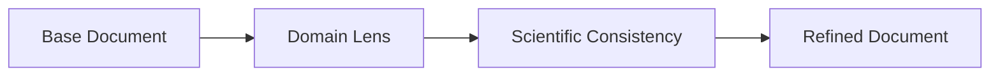

Conflicts are resolved by:
- evidence hierarchy,
- consensus standards,
- explicit uncertainty labeling.

---

## 4.3 Personal Understanding, Needs, and Provisions

Beyond formal correctness, contributors account for:
- human interpretation,
- usability,
- clarity for non-experts,
- situational needs.

They assess:
- who will read this,
- under what pressure,
- with what prior knowledge.

```text
HUMAN CONTEXT CHECK
-------------------
Reader profile
Risk of misunderstanding
Operational consequences
Accessibility concerns
```

No personalization overrides factual or legal constraints.

---

## 4.4 Application Across Document Types

Additional Quality roles adapt understanding to:
- contracts,
- reports,
- specifications,
- policies,
- instructions,
- public-facing texts.

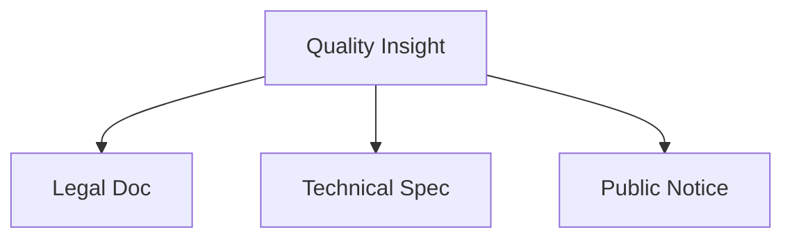

Each document type enforces:
- its own language register,
- precision level,
- tolerance for ambiguity.

---

## 4.5 Linear Refinement and Versioning Model

Quality improvements follow a **linear approach inside a branch**.

Rules:
- each revision builds on the last,
- earlier versions remain addressable,
- no forced modernization of past branches.

Version identifiers may be:
- time-based,
- last-active timestamps,
- dotted incremental notation.

```text
v1.0  -> v1.1  -> v1.2
  |
  +--> v1.0.1 (late correction, no modernization)
```

Outer structure may resemble git, but simplified schemes are acceptable.

---

## 4.6 Threaded Participation and Context Preservation

Editors, proofreaders, verifiers, and institutions:
- reply under the same thread,
- share a common contextual node,
- do not overwrite each other.

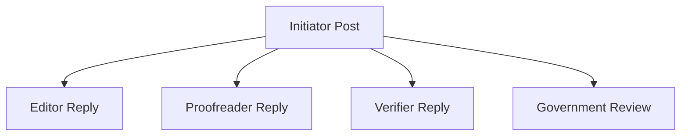

The number of replies is bounded only by the initial post scope.

---

## 4.7 Tools, Cross-References, and External Access

Quality roles may use tools to:
- reference other branches,
- inspect internet documents,
- recall limited context memory,
- access virtualized filesystems or static servers.

```text
TOOL ACCESS (LIMITED)
--------------------
Read-only external docs
Context snapshots
Branch cross-links
Virtual filesystem views
```

No tool use bypasses:
- permission models,
- data protection rules,
- scope limitations.

---

## 4.8 Natural Language Verification and Law Enforcement

These contributors:
- verify documents in natural language,
- rely on domain understanding rather than automation,
- pre-check for confirmation readiness.

They may:
- flag legal non-compliance,
- enforce statutory language,
- require rephrasing for validity.

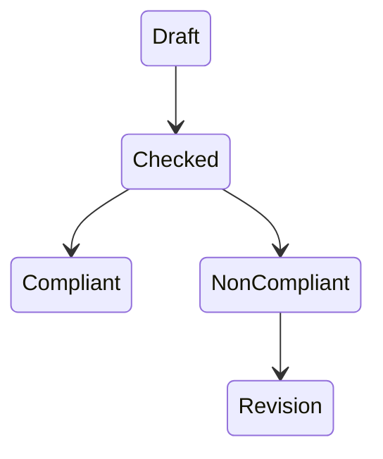

They do not adjudicate disputes; they **prepare documents for lawful acceptance**.

---

## 4.9 Limitations and Neutrality

Despite broad understanding:
- they hold no execution authority,
- they do not redefine goals,
- they do not introduce hidden intent.

```text
QUALITY ROLE LIMITS
-------------------
No goal-setting
No acceptance authority
No implicit representation
```

Their value lies in **clarity, safety, and readiness**.

---

## 4.10 Consolidated Effect on the Main Thread

After quality application:
- common influence is summarized,
- changes are explicitly listed,
- a new initiator-version is produced.

```text
CHANGE SUMMARY
--------------
Clarified terms
Removed ambiguities
Aligned with domain standards
Verified legal consistency
```

This version becomes the active reference for subsequent roles.

---

**End of Chapter 4**

## Programmer

Takes care of:
- Linearization, automation and memory management: work is carried out in certain order, each step involves memory use inside the token window.
- Trains standard algorithms based on common tasks.
- Creates user-specific algorithms for complex, local operations.
- Follows the structure of classes, functions and variables.
- Languages
  - Scientific use: proves all the program, i.e. programming in agda, academic programming
  - Programming languages: understands languages in detail; strict programming
  - Diagrams, models and scientific representation: understands documents; formal programming
  - Defines, states terms and their scopes, refers.

# Chapter 5 — Programmer Role: Formalization, Algorithms, and Executable Clarity

## 5.1 Programmer Mindset in an AI-Augmented World

The **Programmer** role exists at the boundary between:
- human intuition,
- formal logic,
- machine execution.

After AI emergence, programming includes:
- strict special-language code,
- formal and natural language specifications,
- diagrams and proofs convertible into execution.

AI assists by **clarifying, structuring, and validating** ideas that may initially be vague or intuitive.

```text
INTUITION
   |
   v
SEMI-FORMAL DESCRIPTION
   |
   v
FORMAL MODEL
   |
   v
EXECUTABLE CODE
```

---

## 5.2 Linearization, Automation, and Memory Control

Programmers ensure work proceeds in a **deterministic order**.

Concerns include:
- step sequencing,
- state transitions,
- memory usage within token or runtime limits.

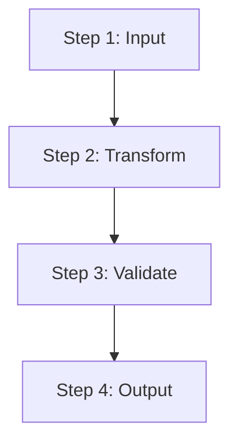

AI supports:
- chunking tasks,
- tracking intermediate states,
- preventing hidden state loss.

---

## 5.3 Standard Algorithms and Reusable Patterns

Programmers train and apply **standard algorithms** for common tasks:
- sorting,
- searching,
- classification,
- aggregation,
- validation.

These algorithms serve as:
- reusable components,
- benchmarks for correctness,
- baselines for optimization.

```text
ALGORITHM PROFILE
-----------------
Name
Purpose
Inputs
Outputs
Complexity
Failure Modes
```

AI can:
- suggest known algorithms,
- adapt them to constraints,
- explain trade-offs.

---

## 5.4 User-Specific and Local Algorithms

For complex or local operations, programmers design **custom algorithms**.

Characteristics:
- tailored to user data,
- constrained by environment,
- often non-generalizable.

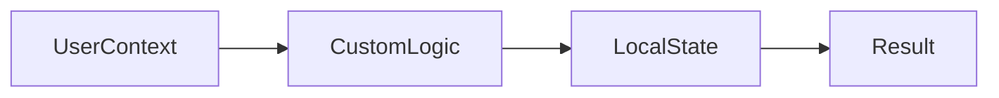

AI helps by:
- extracting implicit rules,
- formalizing edge cases,
- checking internal consistency.

---

## 5.5 Structure: Classes, Functions, and Variables

All programming follows explicit structure.

Core elements:
- variables with scope,
- functions with contracts,
- classes with invariants.

```text
FUNCTION CONTRACT
-----------------
Inputs
Preconditions
Process
Postconditions
Side Effects
```

AI enforces:
- naming consistency,
- scope clarity,
- avoidance of hidden dependencies.

---

## 5.6 Language Categories and Formal Rigor

Programmers operate across multiple language strata.

### Scientific and Academic Programming
- proofs of correctness,
- type-level guarantees,
- languages such as Agda or Coq.

### Strict Programming Languages
- precise syntax and semantics,
- memory and performance control,
- deterministic behavior.

### Diagrams, Models, and Formal Documents
- state machines,
- data models,
- specification diagrams.

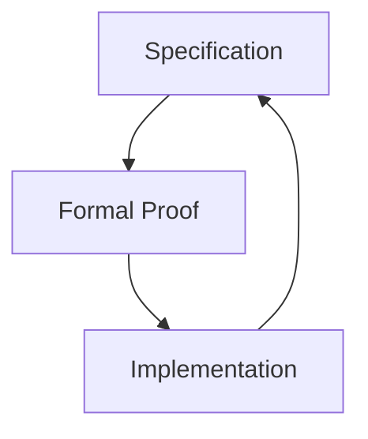

Each layer cross-validates the others.

---

## 5.7 Definitions, Terms, and Scope Management

Programmers define:
- terms,
- symbols,
- namespaces,
- lifetimes.

Ambiguity is treated as a defect.

```text
TERM DEFINITION
---------------
Name
Meaning
Scope
Lifetime
References
```

AI assists by:
- detecting overloaded terms,
- suggesting disambiguation,
- enforcing consistent usage.

---

## 5.8 Natural Language to Code Conversion

Many programmers think **in natural language first**.

AI bridges the gap by:
- parsing intent,
- mapping phrases to constructs,
- proposing executable equivalents.

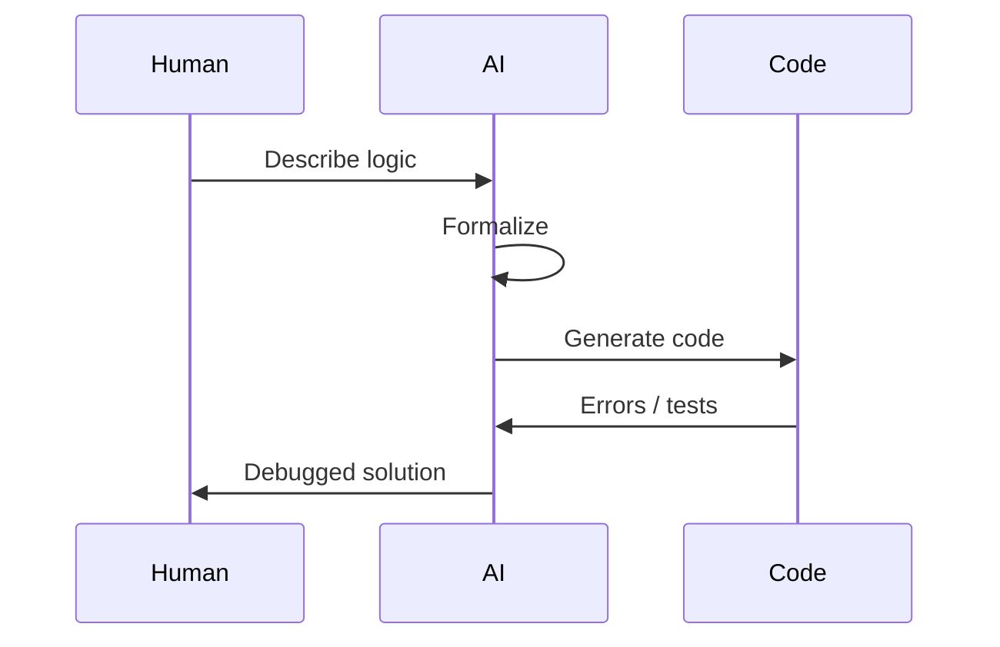

This loop is iterative and collaborative.

---

## 5.9 Debugging, Verification, and Correction

Programmers validate:
- correctness,
- performance,
- safety.

AI aids in:
- tracing execution paths,
- identifying logical errors,
- proposing fixes.

```text
DEBUG CYCLE
-----------
Run
Observe
Explain
Correct
Re-run
```

Formal verification is preferred where feasible.

---

## 5.10 Programmer Role Boundaries

The Programmer:
- implements intent,
- formalizes logic,
- ensures executability.

They do not:
- redefine goals,
- bypass acceptance,
- override administrative limits.

```text
PROGRAMMER GUARANTEE
-------------------
If it compiles → structure is valid
If it proves → logic is sound
If it runs → behavior is explained
```

---

## 5.11 Contribution to the Main Thread

Programmer outputs:
- executable artifacts,
- formal specifications,
- verified logic units.

These are attached to the thread as:
- code nodes,
- specification nodes,
- proof nodes.

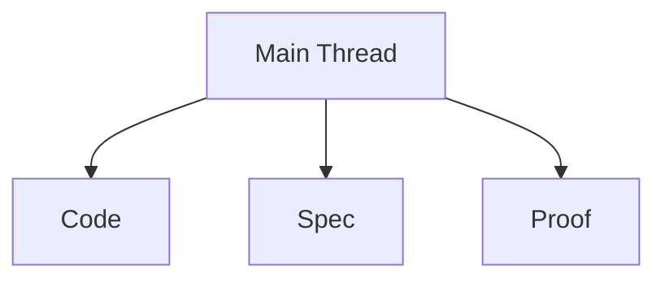

They become reusable building blocks for future tasks.

---

**End of Chapter 5**

## Commoners

Comment pages can be open and AI can both answer questions and summarize conversations or threads; it can help conclude to general statistics.

# Chapter 6 — Commoners: Bottom-Up Exponents, Collective Meaning, and Document Mass

## 6.1 Position of Commoners in the System

**Commoners** form the widest and most granular layer of participation.
They do not optimize for extreme quality; they optimize for **presence, quantity, and continuity**.

Their contribution creates a **bottom-up exponent**:
- emerging from many small documents,
- loosely structured,
- collectively meaningful.

This contrasts with historical **top-down exponents** such as:
- science codification,
- legal systems,
- industrialization standards.

```text
TOP-DOWN EXPONENT
Law / Science / Industry
        ↓
Standardization
        ↓
Uniform Output
```

```text
BOTTOM-UP EXPONENT
Many Documents
        ↑
Granularity
        ↑
Accumulated Meaning
```

AI operates here not as an authority, but as an **amplifier of emergence**.

---

## 6.2 Granularity Over Quality: Exponential Formation

When document collections grow:
- quantity dominates precision,
- patterns arise statistically,
- meaning forms through repetition and variation.

This exponent:
- has no centralized cost,
- requires no enforced standard,
- tolerates inconsistency.

```mermaid
graph TD
    D1[Doc]
    D2[Doc]
    D3[Doc]
    Dn[Doc n]

    D1 --> E[Emergent Pattern]
    D2 --> E
    D3 --> E
    Dn --> E
```

AI extracts:
- frequencies,
- correlations,
- narratives.

Not perfection, but **direction**, emerges.

---

## 6.3 Yin–Yang Interpretation of Document Mass

This process aligns with a **yin-dominant** dynamic:
- receptive,
- material,
- accumulative.

It stands against **yang-heavy systems**:
- over-standardization,
- enforced uniformity,
- moralized abstraction.

```text
YIN (Material, Many, Quiet)
- drafts
- notes
- comments
- partial truths

YANG (Formal, Few, Loud)
- standards
- doctrines
- canonical texts
```

Historical frameworks often imposed **yang** through:
- confucian discipline,
- christian moral codification,
- industrial uniformity.

The commoner exponent restores balance through **unpaid, unoptimized contribution**.

---

## 6.4 Commoner Level 1 — Assisted Document Creation

At Level 1, commoners:
- rely heavily on AI assistance,
- focus on expressing self and need.

Capabilities:
- personal identification for requesting entities,
- explanation of provisions and needs,
- life experience and qualifications.

```text
LEVEL 1 DOCUMENT SET
-------------------
Who I am
What I need
Why I qualify
Context of my request
```

Documents are handed over to:
- CMS systems,
- graphical editors,
- PDF, Office, or open formats.

AI assists primarily with:
- phrasing,
- structure,
- basic coherence.

---

## 6.5 Commoner Level 2 — Structured Knowledge Handling

At Level 2, commoners:
- manage filesystem trees,
- work closer to final formats,
- verify containment and structure.

They can:
- use Markdown-aware editors,
- operate Obsidian, Notion, LogSeq,
- maintain informational web pages.

```mermaid
flowchart LR
    Notes --> Links
    Links --> Pages
    Pages --> KnowledgeBase
```

Preferred characteristics:
- meaningful HTML (HTML 4.0 or earlier),
- content-first structure,
- minimal dynamic effects.

AI performs well here due to:
- semantic clarity,
- explicit hierarchy,
- reduced presentation noise.

---

## 6.6 Commoner Level 3 — Advanced Common Usage

Level 3 commoners operate in **workspace environments**.

Capabilities include:
- projects and repositories (GitHub or equivalent),
- visual or code editors,
- in-file navigation and side panels,
- execution of tools or scripts.

```mermaid
graph TD
    Workspace --> Docs
    Workspace --> Code
    Workspace --> Assets
    Code --> Execution
```

They may:
- use terminals,
- run Python scripts,
- combine documents at scale.

These users produce **craftful document lots**:
- not fully professional,
- but operationally powerful.

---

## 6.7 Comment Pages, Threads, and Conversation Mass

Commoner spaces often include:
- open comment pages,
- discussion threads,
- informal replies.

AI supports by:
- answering questions,
- summarizing conversations,
- extracting general statistics.

```text
THREAD
------
Post
Reply
Reply
Reply
→ Summary
→ Trends
→ Counts
```

Value arises from:
- volume,
- diversity of voice,
- repeated framing of similar issues.

---

## 6.8 AI’s Role in Bottom-Up Exponents

In commoner contexts, AI:
- does not enforce high standards,
- does not compress prematurely,
- does not moralize inconsistency.

Instead, it:
- preserves raw input,
- identifies emergent structure,
- allows later refinement by higher roles.

```text
COMMONER INPUT
      |
      v
AI AGGREGATION
      |
      v
EMERGENT MEANING
```

This process is:
- efficient,
- low-cost,
- non-coercive.

---

## 6.9 Transition to Higher Roles

Commoner-generated material may later be:
- curated by Additional Quality roles,
- formalized by Programmers,
- governed by Administrators,
- accepted by Boss roles.

```mermaid
flowchart TD
    C[Commoner Docs]
    Q[Quality]
    P[Programmer]
    A[Administrator]
    B[Boss]

    C --> Q --> P --> A --> B
```

But commoner contribution remains valid **without escalation**.

---

## 6.10 Commoner Guarantee

```text
COMMONER GUARANTEE
-----------------
No document is too small
No contribution is wasted
Meaning can emerge later
```

The system remains open as long as:
- documents are allowed to exist,
- AI is permitted to observe,
- aggregation is not suppressed.

---

**End of Chapter 6**

# Bonus Chapter — Why Programmers Still Matter: Grounding, Emergence, and Memory Economics

## B.1 Continued Need for Programmers in an AI-Generated World

Even as AI generates most artifacts, **programmers remain essential** to keep systems grounded, coherent, and evolvable.

The separation of concerns is critical:
- **Client side**: HTML + CSS + JS  
- **Server side**: Markdown-first, structure-heavy, meaning-oriented  
- **Administration**: correctly termed **administrative panels** (not dashboards by default)

```text
CLIENT (HTML/CSS/JS)
        |
        v
ADMINISTRATIVE PANELS
        |
        v
SERVER (Markdown + Logic)
```

AI accelerates production, but programmers ensure:
- correctness,
- traceability,
- operational reality.

---

## B.2 Constant Emergence and the Freshness of Code

Codebases remain alive through **constant emergization**:
- small changes,
- iterative refinements,
- environmental adaptation.

While AI generates:
- UI fragments,
- boilerplate,
- repetitive logic,

programmers maintain:
- the solid base,
- upgrade paths,
- backward compatibility.

```mermaid
graph TD
    AI[AI Generation]
    Base[Stable Code Base]
    Emergence[Incremental Change]

    AI --> Emergence
    Emergence --> Base
    Base --> Emergence
```

Administrative panels monetize and expose information,
but programmers ensure the **truthfulness of the substrate**.

---

## B.3 Markdown as a Server-Side Foundation

Markdown serves as:
- human-readable storage,
- long-term stable format,
- AI-compatible representation.

Advanced usage includes:
- enriched tag syntax,
- embedded metadata,
- structured sections.

```text
---
id: doc-204
tags: [policy, draft]
version: 1.2
---

# Title
Content in plain, inspectable form.
```

Programmers extend Markdown responsibly:
- without breaking readability,
- without hiding logic,
- without forcing opaque schemas.

---

## B.4 Programmer Intuition Beyond Syntax

Many programmers operate with:
- practical intuition,
- mature theoretical sense,
- graph-based or no-code abstractions.

AI can process this intuition by:
- clarifying tasks,
- formalizing definitions,
- exposing hidden assumptions.

```mermaid
sequenceDiagram
    participant V as Visionary
    participant AI as AI
    participant P as Programmer
    participant C as Code

    V->>AI: Intuitive idea
    AI->>P: Structured proposal
    P->>C: Grounded implementation
```

Debugging remains human-centered:
- understanding failures,
- interpreting reality,
- validating acceptance criteria.

---

## B.5 User Interfaces and Real-Time Understanding

User interfaces are transformed by programmers who:
- understand event loops,
- reason about state,
- manage real-time constraints.

AI may generate UI code,
but programmers:
- ensure responsiveness,
- manage concurrency,
- prevent emergent instability.

```text
UI RESPONSIBILITY
-----------------
Events
State
Latency
Consistency
```

This real-time understanding cannot be fully abstracted away.

---

## B.6 AI Memory Limits and Logarithmic Loss

AI systems face **logarithmic loss of memory** in in-context tasks.

Characteristics:
- context windows are finite,
- older details decay,
- compression introduces bias.

```text
INFORMATION
  |
  +-- linear growth
  |
  +-- logarithmic retention
```

This creates a mismatch between:
- linear information addition,
- logarithmic recall capacity.

---

## B.7 Memory Management as a Shared Discipline

Programmers and AI must cooperate on:
- memory selection,
- summarization ratios,
- state externalization.

```mermaid
flowchart LR
    Input --> Chunking
    Chunking --> Compression
    Compression --> Memory
    Memory --> Retrieval
```

Key decisions include:
- what to keep verbatim,
- what to summarize,
- what to discard.

Poor choices create bottlenecks of complexity.

---

## B.8 Process Paths and Bottleneck Avoidance

Reliable outcomes require **explicit process paths**.

These paths define:
- task order,
- linear vs parallel execution,
- complexity ceilings.

```text
PROCESS PATH
------------
Step order
Parallel branches
Merge points
Exit conditions
```

AI and programmers must agree on:
- sequence of tasks,
- acceptable branching,
- termination criteria.

---

## B.9 Linear, Parallel, and Exponential Complexity

Advanced coordination involves:
- linear complexity (step-by-step),
- parallel complexity (independent tasks),
- exponential risk (combinatorial explosion).

```mermaid
graph TD
    L[Linear Tasks]
    P[Parallel Tasks]
    E[Exponential Risk]

    L --> Result
    P --> Result
    E --> Bottleneck
```

Programmers design constraints that:
- keep growth manageable,
- prevent runaway complexity,
- preserve interpretability.

---

## B.10 Programmer–AI Contract

```text
PROGRAMMER–AI AGREEMENT
----------------------
Programmer defines reality constraints
AI accelerates exploration
Both respect memory limits
Both explain their steps
```

This contract ensures:
- grounded execution,
- explainable systems,
- sustainable evolution.

---

## B.11 Final Synthesis

AI changes *how much* is produced.
Programmers preserve *what is real*.

Without programmers:
- emergence drifts,
- memory collapses,
- systems lose grounding.

With programmers:
- AI becomes durable,
- systems remain interpretable,
- growth stays aligned with reality.

---

**End of Bonus Chapter**

# Conclusion — Granular Humanity and the Supercivilization Exponent

## C.1 Society as a Granular Engine

The conclusion of this framework is simple but non-trivial:

**Civilization no longer advances only from peaks.  
It advances from grains.**

When the whole society participates at a granular level:
- notes,
- comments,
- drafts,
- partial understandings,
- everyday records,

a bottom-up exponent emerges that is **structurally comparable** to earlier civilizational leaps.

```text
PAST EXPONENTS
-------------
Science (formal)
Law (codified)
Industry (standardized)

NEW EXPONENT
------------
Daily human traces
Low-formality documents
Machine-assisted aggregation
```

This is not a replacement of earlier systems — it is an addition.

---

## C.2 Low-Formality, Still Verifiable Knowledge

Low-formality does not mean low value.

Such information is:
- loosely structured,
- written for use, not prestige,
- grounded in real situations.

It remains **verifiable** because:
- sources exist,
- context is preserved,
- patterns repeat across contributors.

```mermaid
graph TD
    D1[Everyday Note]
    D2[Work Comment]
    D3[Personal Record]
    V[Verification Through Volume]

    D1 --> V
    D2 --> V
    D3 --> V
```

Verification emerges statistically and contextually, not by single-author authority.

---

## C.3 Daily Abilities as Exponential Inputs

Each small contribution:
- slightly improves clarity,
- slightly reduces friction,
- slightly accelerates action.

Individually linear.  
Collectively exponential.

```text
ABILITY GAIN
------------
+1 understanding
+1 decision
+1 improvement

REPEATED
→ compounded capacity
```

This exponent expresses itself in:
- better decisions,
- faster adaptation,
- shared intuition across society.

---

## C.4 Relation to Top-Down Systems

Top-down systems:
- remain necessary,
- provide structure,
- enforce boundaries.

Bottom-up systems:
- provide energy,
- supply material,
- adapt continuously.

```mermaid
graph LR
    TD[Top-Down Systems]
    BU[Bottom-Up Granularity]
    SC[Supercivilization]

    TD --> SC
    BU --> SC
```

The result is not flatness, but **resonance**.

---

## C.5 From Civilization to Civilization-on-Civilization

Earlier civilizations stacked institutions.
The AI era stacks **civilizations themselves**.

Each layer:
- consumes the previous,
- preserves its value,
- multiplies its reach.

```text
CIVILIZATION STACK
------------------
Human practice
↓
Written knowledge
↓
Scientific method
↓
Industrial systems
↓
AI-assisted emergence
```

This is civilization built on civilization — not erased, but amplified.

---

## C.6 Quantity of Common Man vs Quality of Genius

This framework explicitly shifts the center of gravity:

- from the **quality of Einstein**  
- to the **quantity of common people**

Not multiplied by brilliance, but **summed by participation**.

```text
GENIUS MODEL
------------
Few × Exceptional = Progress

COMMON MODEL
------------
Many + Ordinary = Exponent
```

Summation, when circulating, still produces exponential effects.

---

## C.7 Circulating Energy and Emergent Order

Energy circulates when:
- documents are allowed to exist,
- contributions are not prematurely filtered,
- AI observes rather than dictates.

```mermaid
flowchart TD
    Human[Human Input]
    AI[AI Aggregation]
    Society[Shared Capacity]

    Human --> AI
    AI --> Society
    Society --> Human
```

Order emerges without coercion.

---

## C.8 AI as Material Science of Meaning

AI performs work analogous to science:
- generalizing,
- testing,
- stabilizing.

But its orientation is different.

Science:
- abstracts upward,
- seeks universal laws.

AI:
- aggregates downward,
- works with particulars.

```text
SCIENCE → YANG
Abstract
Universal
Idealized

AI → YIN
Material
Particular
Situational
```

AI handles the **material matters of meaning** — the everyday, the contextual, the lived.

---

## C.9 Human-Aided Grounds for Automation and Creativity

Automation does not replace humanity here.
It **stands on human ground**.

Humans provide:
- context,
- intention,
- lived experience.

AI provides:
- scale,
- memory,
- pattern extraction.

```text
HUMAN → MEANING
AI → AMPLIFICATION
TOGETHER → PROGRESS
```

Innovation becomes continuous, not episodic.

---

## C.10 Final Synthesis

A supercivilization emerges when:
- everyone contributes something,
- nothing is prematurely discarded,
- AI aggregates without domination.

This exponent is:
- low-cost,
- inclusive,
- resilient.

As certain as scientific progress,
but rooted in the **yin of material life**.

Not fewer geniuses —  
but more people, thinking, writing, acting.

That is the exponent of the AI era.

---

**End of Conclusion**
