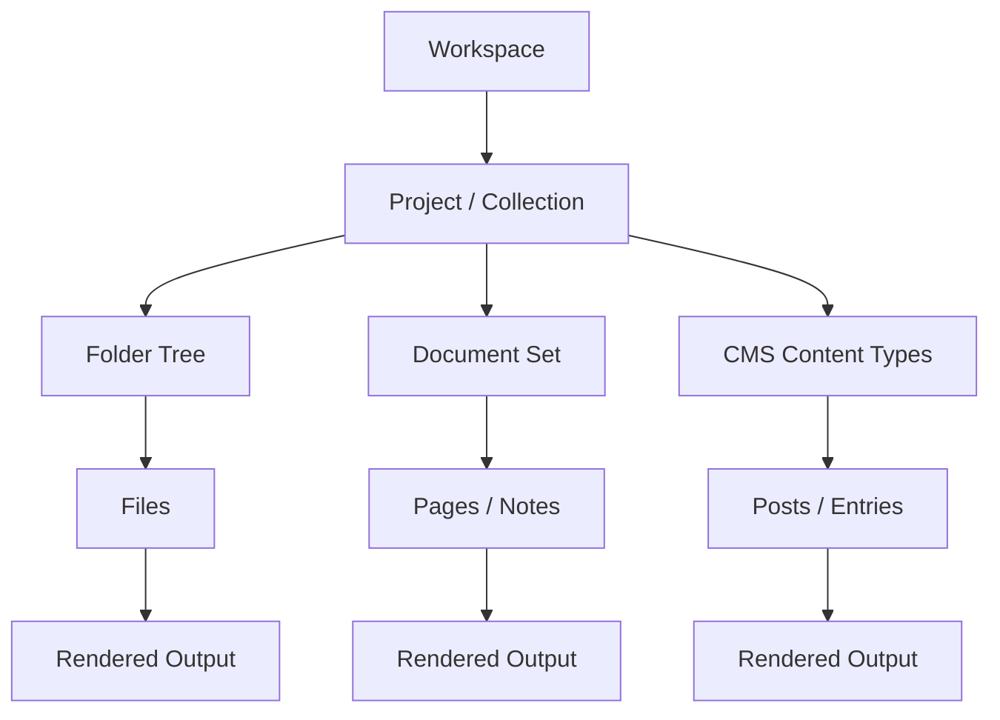
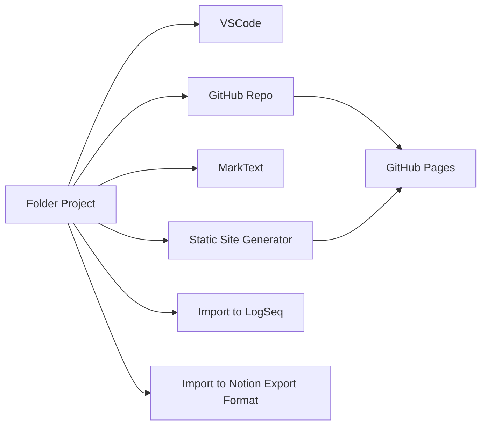
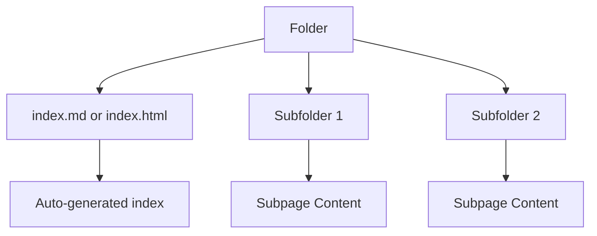
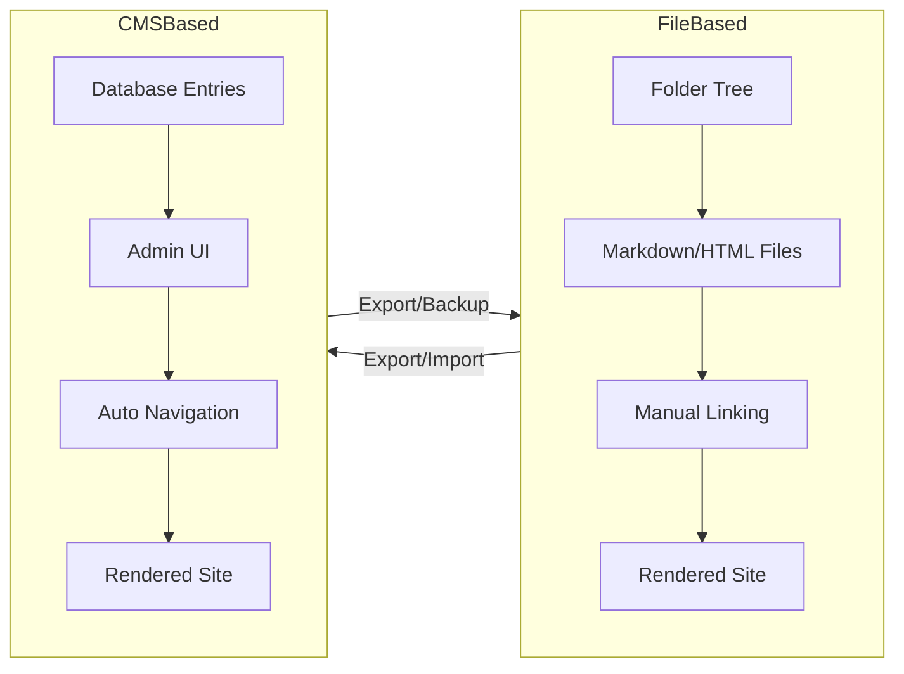

# 🌿 Unified View of Workspaces, Projects, and Document Collections

This document presents a tool‑agnostic explanation of how **projects**, **document collections**, and **folder structures** relate across editors, CMS systems, and knowledge tools.  
It also includes **Mermaid diagrams** to visualize workflows and structural abstractions.

---

# 🧭 1. Core Concepts

## 📁 Workspaces and Projects (Tool‑Agnostic)

Across tools, the same pattern repeats:

- A **workspace** is the *context* in which you view or manage content.
- A **project** is a *collection of related items*—often a folder, but not always.
- A **document collection** is simply a project where the items are documents.
- A **CMS** (Content Management System) is a project where the items are stored in a database or structured interface instead of a visible folder tree.

### Why tools ask “Do you trust the author?”

Tools like VSCode ask this because:

- Opening a folder may load scripts, tasks, or extensions.
- These can run code on your machine.
- Trust = “Is this folder safe to execute code from?”

This is a **security question**, not a philosophical one.

---

# 🧭 2. How Different Tools Map to the Same Abstraction

Below is a conceptual mapping:

| Tool | What a “Project” Really Is | How Structure Is Shown |
|------|-----------------------------|--------------------------|
| VSCode | A folder or multi-folder workspace | File Explorer |
| GitHub | A repository (folder with version control) | Repo tree + README |
| Notion | A page with nested subpages | Page sidebar |
| LogSeq | A folder of Markdown pages + graph | Page tree + backlinks |
| RemNote / RemNina | Nested “rems” (hierarchical notes) | Document tree |
| MarkText | A folder of Markdown files | File tree |
| CMS (WordPress, Drupal, Ghost) | Database-backed content types | Admin UI, menus, categories |

All of these are **project inspectors**—just with different skins.

---

# 🧭 3. Mermaid Diagram: General Abstraction of a Project



This diagram shows that **all systems ultimately produce content from structured items**, regardless of how they store them.

---

# 🧭 4. Mermaid Diagram: How Projects Flow Between Tools



This shows how a simple folder can travel across tools.

---

# 🧭 5. Notion‑Style Nodes and HTML Index Folders

Notion exports a page as:

```
MyPage/
  MyPage.md
  Subpage1/
  Subpage2/
```

This mirrors a website:

```
docs/
  index.html
  chapter1.html
  chapter2.html
```

Both treat **folders as documents**.

You can replicate this in VSCode by:

- using `README.md` as a root document  
- generating an index in `index.html`  
- using scripts to auto-list folder contents  

---

# 🧭 6. Mermaid Diagram: Folder-as-Document Pattern



This is the same pattern used by:

- Notion exports  
- Static site generators  
- GitHub README navigation  
- CMS category pages  

---

# 🧭 7. Project Inspector Sidebars Across Tools

## VSCode  
Shows the **actual filesystem**.

## Notion  
Shows **pages and subpages**, but conceptually identical to folders.

## LogSeq  
Shows **pages**, but also backlinks—like a dynamic index.

## RemNote / RemNina  
Shows **nested rems**, which behave like nested folders.

## MarkText  
Shows **folders and Markdown files** directly.

---

# 🧭 8. How CMS Systems Fit In

A CMS (WordPress, Drupal, Ghost, etc.) provides:

- A **simplified interface** for managing content  
- A **menu or category system** instead of a folder tree  
- A **database** instead of files  
- A **visual inspector** instead of a file explorer  

### Why CMS feels simpler

- Users don’t see the filesystem.
- Content is organized by:
  - categories  
  - tags  
  - menus  
  - content types  
- The system handles indexing automatically.

### CMS as an alternative to a project inspector

A CMS replaces:

- manual folder navigation  
- manual index creation  
- manual linking  

with:

- dashboards  
- content lists  
- auto-generated navigation  

This is why non-technical users often prefer CMS tools.

---

# 🧭 9. Mermaid Diagram: CMS vs File-Based Workflow



Both workflows lead to the same outcome: **structured content**.

---

# 🧭 10. How Normal Folders Become Projects for Beginners

Tools like MarkText or VSCode allow beginners to:

1. Create a folder  
2. Add Markdown files  
3. Use the sidebar to navigate  
4. Treat the folder as:
   - a book  
   - a wiki  
   - a project  
   - a documentation set  

This is the simplest possible project system.

---

# 🌟 Final Thoughts

All tools—VSCode, Notion, LogSeq, RemNote, MarkText, GitHub, CMS systems—are just different ways of presenting the same underlying idea:

> **A project is a structured collection of content.  
> The structure can be a folder tree, a page tree, a graph, or a CMS interface.**

Understanding this abstraction lets users move freely between tools and choose the workflow that fits their style.

# 🤖 How AI Navigates Projects, Folders, Files, and Root Items  
### RAG, Search Patterns, Tool Training, Session Separation, and Open-Source Transparency

AI does not navigate a project by “opening folders” or “scrolling” the way humans do.  
Instead, it uses **semantic representations**, **tool calls**, **retrieval systems**, and **interaction traces** to understand and move through a project’s structure.

This section explains how that works.

---

# 🧭 1. How AI Understands a Project’s Structure

A project—whether in VSCode, GitHub, Notion, or a CMS—contains:

- **root items** (top-level folders or documents)  
- **subfolders**  
- **files**  
- **metadata** (names, paths, tags, timestamps)  
- **content** (text, code, images, configuration)  

AI builds an internal representation of this structure using:

### 1. File paths  
These act like a **map**:

```
/project
  /docs
    intro.md
    api.md
  /src
    main.js
    utils.js
```

### 2. Embeddings  
Each file or section is converted into a **semantic vector**, allowing AI to:

- compare meaning  
- find related files  
- match queries to content  
- jump directly to relevant items  

### 3. Tool outputs  
Tools that list files, search content, or inspect metadata give AI a **live snapshot** of the workspace.

This combination allows AI to “navigate” a project without opening anything manually.

---

# 🧭 2. How RAG Helps AI Navigate Projects

**RAG (Retrieval-Augmented Generation)** means:

1. AI receives a question  
2. It retrieves relevant files or sections  
3. It uses them to produce an answer  

### How retrieval works in a project
- embeddings match the question to the right file  
- keyword search finds exact terms  
- structural cues (headings, filenames) guide relevance  
- tool calls fetch the actual content  

### Example  
User asks:

> “Where is the configuration for authentication?”

AI can:
- search filenames for “config”, “auth”, “settings”  
- embed the question and compare to file embeddings  
- retrieve the top matches  
- read the relevant section  
- answer accurately  

RAG turns the project into a **searchable knowledge base**.

---

# 🧭 3. Refining and Reinforcing Search Patterns

AI can improve its navigation by learning from:

### ✔ Successful patterns
- correct file retrieved  
- correct section found  
- user confirms the answer  
- user continues working in the retrieved file  

### ✘ Failing patterns
- wrong file retrieved  
- irrelevant section  
- user corrects the AI  
- user manually navigates to the right place  

These outcomes can be labeled and fed back into:

- **fine-tuning**  
- **preference optimization**  
- **search ranking adjustments**  
- **embedding improvements**  

Over time, AI learns:

- which filenames matter  
- which headings are important  
- which patterns users rely on  
- how to interpret ambiguous queries  

This is similar to how IDEs learn code completion patterns.

---

# 🧭 4. Enforcing Proper Tool Use

AI can be trained to use tools correctly by:

### 1. Reading tool documentation  
Tool descriptions act as **rules**:

- what the tool does  
- when it should be used  
- what parameters it accepts  
- what errors to avoid  

### 2. Using examples  
Training includes:

- correct tool calls  
- incorrect tool calls  
- explanations of why one is correct  

### 3. RAG over tool documentation  
The AI retrieves:

- tool descriptions  
- usage examples  
- constraints  

This ensures the AI chooses the right tool for:

- file search  
- workspace inspection  
- content retrieval  
- metadata extraction  

### 4. Reinforcement  
If the AI uses the wrong tool:

- the failure is labeled  
- the correct tool is shown  
- future behavior improves  

This is how AI learns to behave like a **disciplined assistant** rather than a guesser.

---

# 🧭 5. Session Separation and Recognition of Repeated Patterns

AI can treat each session as a **card**:

- a self-contained interaction  
- with its own context  
- with its own goals  

### How AI separates sessions
- timestamps  
- conversation resets  
- new project roots  
- new user intent  

### How AI connects repeated patterns
If the user repeatedly:

- opens similar projects  
- asks similar questions  
- uses similar search terms  
- follows similar workflows  

AI can recognize the pattern and refine:

- retrieval  
- tool selection  
- navigation heuristics  
- summarization style  

This allows AI to handle “fresh” sessions while still benefiting from **pattern recognition**.

---

# 🧭 6. Recording File Search Patterns

Users can help AI by recording:

- which files they search for  
- which terms they use  
- which sections they jump to  
- which tools they prefer  
- which patterns are standard in their domain  

### Examples of recorded patterns
- “config” → configuration files  
- “auth” → authentication modules  
- “intro” → documentation entry points  
- “index” → root documents  
- “README” → project overview  

These patterns can be:

- stored  
- reused  
- generalized  
- shared across sessions  

This improves both **accuracy** and **efficiency**.

---

# 🧭 7. Standard-Compatibility and Self-Evident Sources

AI can detect:

- conventional filenames (`README.md`, `index.html`)  
- standard folder structures (`src`, `docs`, `assets`)  
- common documentation patterns  
- typical CMS layouts  
- Notion export formats  
- static site generator conventions  

This allows AI to navigate unfamiliar projects using **industry standards**.

---

# 🧭 8. Open-Source Documentation: Transparent Sources and Methods

Open-source projects publish:

- their documentation  
- their folder structure  
- their code  
- their methods  
- their tool usage  
- their workflows  

This transparency allows AI to:

- learn from real examples  
- retrieve documentation directly  
- understand conventions  
- follow best practices  
- explain how things work  

Open-source documentation is a **training ground** for AI navigation.

---

# 🌟 Final Summary

AI navigates projects using:

1. **Embeddings** — semantic maps of files and folders  
2. **RAG** — retrieving relevant content before answering  
3. **Tool calls** — inspecting the workspace and searching files  
4. **Structural cues** — filenames, headings, anchors  
5. **Reinforced patterns** — learning from success and failure  
6. **Session cards** — separating or connecting interactions  
7. **Recorded search patterns** — user-specific navigation habits  
8. **Open-source transparency** — learning from public methods  

This allows AI to move through projects, root items, folders, and files with precision, context-awareness, and continual improvement.
