# Introduction

Reference to pingpong service: the user asks with ping, and the server responds with pong.

This is convenient way to check whether a public time service is alive, using ping with bash:

```bash
ping -c 4 time.google.com
# or
ping -c 4 time.cloudflare.com
# or
ping -c 4 0.pool.ntp.org
```

You can do the same bash thing with graphical user interface, which might already come with your computer.

# 🌟 Introduction — From Ping and Pong to the Architecture of Meaning  
How a Simple Network Gesture Reveals the Hidden Structure Behind Files, URLs, Knowledge, and Trust

Every computer user knows the tiny ritual of checking whether something is alive on the internet.  
You send a **ping**, and if the server is awake, it sends back a **pong**.

It feels trivial — almost playful — yet this tiny exchange contains the seed of a profound idea.

```bash
ping -c 4 time.google.com
# or
ping -c 4 time.cloudflare.com
# or
ping -c 4 0.pool.ntp.org
```

A ping is a question.  
A pong is an answer.  
Together, they form a **relationship**.

This article begins with that simple gesture and expands it into a universal model for understanding:

- how files relate to folders  
- how URLs relate to domains  
- how documents relate to chapters  
- how people relate to information  
- how AI relates to knowledge  
- how trust is established in digital systems  
- how verification works in everything from sitemap.xml to passports  

The ping–pong metaphor becomes a lens through which we can see the hidden **tree structures** that organize our digital world.

---

## 🌱 Why This Matters to Every Kind of Reader  
Whether you are:

- a casual user who just wants to understand why computers behave the way they do  
- a developer who works with files, URLs, APIs, or databases  
- a researcher exploring knowledge graphs or semantic structures  
- an AI enthusiast curious about how machines verify information  
- a systems thinker who loves elegant abstractions  
- or a creator building your own tools, documents, or workflows  

…this introduction gives you the key insight that unlocks the rest of the article.

You do **not** need to read further to benefit.  
You already have the core idea:

> **Every meaningful digital relationship is a ping–pong exchange between a child and a parent.**

A child asks to belong.  
A parent confirms.  
A referencer verifies.  
A sentence summarizes the truth.

This is the foundation of:

- filesystems  
- URLs  
- document structures  
- semantic networks  
- identity systems  
- AI reasoning  
- trust infrastructures  

And it all begins with the same tiny gesture you used to test a time server.

---

## 🌐 The Hidden Tree Behind Everything  
When you ping a server, you are not just checking connectivity.  
You are participating in a **tree‑shaped conversation**:

- you (the child)  
- the server (the parent)  
- the network (the referencer)  

This pattern repeats everywhere:

- A file belongs to a folder.  
- A webpage belongs to a domain.  
- A chapter belongs to a document.  
- A certificate belongs to an authority.  
- A model belongs to its training lineage.  
- A comment belongs to a post.  
- A user belongs to a trust circle.  

The world is full of **parent pointers** and **verification sentences**.

---

## 🚀 Why This Article Exists  
This article takes the simple ping–pong idea and shows how it becomes:

- a mathematical model  
- a practical tool  
- a verification system  
- a trust architecture  
- a semantic framework  
- a bridge between humans and AI  

It reveals the **unifying principle** behind systems that seem unrelated:

- sitemap.xml  
- passport verification  
- digital signatures  
- Prolog logic  
- AI recommendation engines  
- version control  
- document hierarchies  
- URL routing  
- filesystem trees  

All of them share the same structure.

---

## 🌟 The Promise of What Comes Next  
If you choose to continue reading, you will discover:

- how trees form the backbone of digital structure  
- how verification sentences create trust  
- how AI can maintain and evaluate relationships  
- how parent pointers can represent entire knowledge systems  
- how Pongping becomes a universal protocol for meaning  

But even if you stop here, you already know the essence:

> **Ping and pong are not just network tools — they are the universal grammar of digital relationships.**

Everything else is just elaboration.

## Mathematical structure of trees

Imagine a tree:
- A single file: users, who can not set up trees, use a single file or refer files by their name in "Documents".
  - Each file has a single, almost virtual, parent.
- Folder and file tree: this type of tree has nodes with content and parent folder, with root folder "/".
  - Advanced uses have extensions: links, streaming file in linux, virtual folders or ones which manage to redirect most clients.
    - This kind of use generally works within harmony of treelike structure.
- HTML
  - Path segments, altough not strictly defined to form a tree-like structure, can be represented as a virtual tree.
    - Nodes of this tree are not necessarily files or folders:
      - If they do not have index document, they typically get autoformatted as folder.
      - If they do have index document, which does not replicate this behaviour, they typically seem more like files.
      - They can have queries, such as GET and POST, which make the exact tree-like structure appear surprising:
        - Most generally, you *can* represent the main part of url in tree-notion:
          - Url parts and the final node each have the previous part as parent; in *next higher dimension* the domain is treated as tree.
          - Whatever node in this tree can either represent this treelike structure with internal content of page, or represent something different.
          - Server administrators and programmers most generally choose to represent this in server as equal tree of files and folders:
            - This preferration is almost immutable and inquestionable, and things like repositories, workbenches, virtual structures are often
              still virtualized into this kind of tree, instead of complex "?q=..." urls.
- Notion.so, Obsidian, other Markdown Document Collection managers:
  - They either support or rely on file, folder and link parts structures.
  - They provide more direct approach where nodes and branches are very similar:
    - Each branch behaves like node, you can enter content inside.
    - Each node behaves like branch, you do not convert it much to insert subnodes and subbranches.

Given trees can be:
- Generalized by their node and branch behaviour.
  - Any other behaviour is suspicious: you cannot be sure that you are not triggering software and server functions and disturbing
    other users and administrators in minimum; if server system has "sitemap.xml" file, it might show you innocent queries and
    give them some meanings. If your site navigation has mixed get and post queries, which might alter the functionality or trigger
    errors, your sitemap.xml must do a clever workaround: you should make GET queries have *no side-effects*, while it's also costy
    for navigation, autonavigation and use of navigator-server features and constraints, to use POST just to select what to show.
- Represented in mathematical tree structure

We have more interesting trees:
- Markdown files can be represented by tree of chapters and paragraphs, with chapters being branches and paragraphs being the nodes.
  - Tagged or somehow indexed Markdown can contain *multiple trees in various formats* and might get several tree instances connected;
    for example system might not care about user chapters, and user might hide tags, or tags can be inside paragraphs and titles rather
    than present in their blocklike structure.

We have more of them:
- Fine-tuning model creates a tree, where each model is having another as parent.
- Message structure of model necessarly applies static history to each Q or A or Msg.
- In programming, classes, templates, variables and collections generally have treelike structure:
  - Circular dependencies are abstracted out, similarly to abstracting out goto with while and break etc.
  - Normally, you create the variables into treelike structure: circularity, instead of becoming disturbed, appears as *another tree working in pair*
  - Memory management is trying to reduce it to some kind of tree, and understand which ones *belong* and which ones *do not belong* - it makes any
    circular logic weak and prone, which can break our memory.
- Git version handling is a tree: any circular reference is considered explicitly by tools, such as merge or join, even if indirect.
- Circular references are extremely simple to implement, also occur by accident, but they are extremely hard to do right.
- Link structure of HTML and hypertext appears as a tree - very often, people rather try to find layered, than circular logic to any system which is
  seen as one piece.

# 🌳 Mathematical Structure of Trees — From Everyday Hierarchies to Abstract Computational Forests  
Understanding How Humans, Machines, Filesystems, URLs, and Knowledge All Grow Branches

Trees are everywhere. They shape how we store files, how we browse the web, how we write documents, how we design software, and even how we think.  
This chapter explores the **mathematical structure of trees** through multiple lenses — intuitive, professional, and deeply conceptual — showing how a single abstraction underlies many of the systems we use daily.

---

## 🌱 1. Trees as Humans First Encounter Them  
Before diving into formal mathematics, it helps to see how ordinary users experience tree‑like structures.

### 🗂️ Files and Folders: The Everyday Tree  
Most users interact with a tree without realizing it:

- A **single file** behaves like a leaf with a virtual parent (“Documents” or a default directory).
- A **folder hierarchy** forms a rooted tree:
  - `/` is the root.
  - Each folder is a node.
  - Each file is a leaf.
- Advanced filesystem features (links, virtual folders, streaming files) still preserve the *illusion* of a tree even when the underlying structure is more complex.

A simple filesystem tree might look like this:


Even when symbolic links or mount points introduce non‑tree edges, the user interface maintains a **tree‑shaped mental model**.

---

## 🌐 2. Virtual Trees in the Web: URLs, Path Segments, and Illusions  
HTML and HTTP introduce a fascinating hybrid: a **virtual tree** that behaves like a filesystem but is not one.

### 🔗 URL Path Segments as Nodes  
A URL such as:

```
https://example.com/blog/2024/insight
```

can be interpreted as:

- `blog` is child of domain root  
- `2024` is child of `blog`  
- `insight` is child of `2024`

But these nodes:

- may not correspond to real folders  
- may be auto‑generated  
- may be handled by routing logic  
- may be dynamic endpoints  
- may be influenced by GET/POST queries

A conceptual URL tree:


### 🌀 When the Tree Breaks  
Query parameters (`?q=...`) and POST requests introduce **non‑tree semantics**, yet developers often force the system back into a tree‑like structure for clarity, SEO, and maintainability.

---

## 📝 3. Document Managers: When Nodes and Branches Become One  
Tools like **Notion**, **Obsidian**, and Markdown‑based systems blur the line between:

- nodes (content)
- branches (containers)

A page can contain subpages; a paragraph can contain tags; a tag can group unrelated pages.  
This creates **multiple overlapping trees**:

- structural tree (chapters → sections → paragraphs)  
- tag tree  
- backlink tree  
- folder tree  

A Markdown document’s conceptual structure:


But tags or metadata may form *another* tree entirely.

---

## 🧠 4. Mathematical Foundations: What a Tree Really Is  
At its core, a **tree** is defined by:

- A **root** (optional in some definitions)
- Nodes
- Edges connecting each node to **exactly one parent**
- Zero or more children per node
- No cycles

Two equivalent mathematical representations exist:

### **A. Children‑centric representation**
- Each node stores a list of children.
- The root is explicitly defined.

### **B. Parent‑centric representation**
- Each node stores a reference to its parent.
- The root is the node whose parent is `None`.

Representation B is especially powerful for modeling:

- URLs  
- Filesystems  
- Knowledge graphs  
- Semantic relationships  
- AI message histories  
- Version trees  

---

## 🧬 5. Trees in Programming, AI, and Computational Systems  
Trees are not just organizational tools — they are **fundamental to computation**.

### 🧩 Classes, Templates, and Scopes  
Programming languages use trees to represent:

- abstract syntax trees (ASTs)  
- class hierarchies  
- variable scopes  
- module imports  

Circular dependencies are discouraged because they break the tree model.

### 🧠 AI Models and Message Histories  
Fine‑tuning creates a **genealogy of models**:



Message histories in conversational systems form a **linear tree** (a chain), where each message depends on all previous ones.

### 🗃️ Git and Version Control  
Git commits form a tree with occasional merges:


This is a **directed acyclic graph (DAG)**, a generalization of a tree.

---

## 🔄 6. Circularity: The Enemy of Trees  
Circular references are:

- easy to create  
- hard to manage  
- dangerous for memory systems  
- confusing for users  
- incompatible with most tree algorithms  

Memory managers attempt to reduce object graphs to **ownership trees**, breaking cycles or tracking them explicitly.

---

## 🌐 7. Hypertext and the Human Mind: Why We Prefer Trees  
Even though the web is a graph, humans prefer:

- layers  
- hierarchies  
- outlines  
- nested structures  

Trees match our cognitive patterns:

- We understand “inside” and “under” more easily than “linked to.”
- We navigate hierarchies faster than arbitrary graphs.
- We organize knowledge in nested categories.

Thus, even when systems are not trees, we **force them to look like trees**.

---

## 🌟 Conclusion: Trees as Universal Cognitive and Computational Structures  
From filesystems to URLs, from Markdown to Git, from AI models to human thought — trees provide:

- clarity  
- structure  
- navigability  
- safety  
- meaning  

They are the **default architecture of order**, the skeleton beneath our digital and conceptual worlds.

In the next chapters, we will build on this foundation to explore how trees interact with verification, relationships, semantics, and the emerging “pongping” model of parent–child confirmation.

### Base mathematics of trees

The **first mathematical representation** (I refer nodes and branches as "nodes", because in reality of our cases they are not strictly distinct)
- Root node has constant pointer and refers to whole structure.
- Each node has set of children, and most often (almost in every given case) they are named nodes.

The **second mathematical representation** is the one we choose:
- Each node has optional parent - either other node, or NULL/None
  - Connection to parent with node with attribute allows to give node a name:
    1. Create Node "link1" associated with server url, and "attrname" attribute of this Node is set to "referrer"
    2. Point this to parent Node
    3. "link2" which is associated with another url: parent, now, by definition has a child named "referrer"
       - You can have complex logic, where attribute name might be items[4].url to make the child Node become url of item four of that parent.
- Each node which has no parent is a root node, but this does not have to be referred explicitly.

We need this theorem:
- With Node class, which has only parent and attribute name as two single class variables, we can build trees with complexity, which equals to ones we commonly
  see in filesystems, servers, and mnemonic url composition of internet: while in internet, parent-child relationship might not refer to physical parent-child
  relationship, it does map to logical way the url is composed and represents a tree for our browser, altough intermediate parts could be 404 and there are more
  to handle.

# 🌲 Base Mathematics of Trees — Formal Foundations, Practical Implementations, and Cross‑Disciplinary Descriptions  
Understanding How a Minimal Parent‑Pointer Model Can Represent Every Hierarchy We Use

The mathematical structure of trees is deceptively simple: a node, a parent, and a name.  
Yet this minimal structure is powerful enough to model filesystems, URLs, documents, knowledge graphs, and even AI model genealogies.  
This extended chapter explores the **two canonical mathematical representations**, shows how to implement them in **Anytree**, **MongoDB**, and **SQL**, and explains how to communicate these ideas to both humans and AI systems.

---

## 🌱 1. The Two Canonical Mathematical Representations of Trees

### 📘 Representation A — Children‑centric (root → children → grandchildren)
This is the intuitive model:

- The **root node** is explicitly defined.
- Each node stores a **list of children**.
- Children are often **named** (e.g., folder names, URL segments).

This is the model used in:

- filesystems  
- HTML DOM  
- many GUI tree widgets  
- outline editors  

A simple conceptual diagram:


### 📗 Representation B — Parent‑centric (child → parent → root)
This is the mathematically elegant model:

- Each node stores **one pointer**: its parent.
- A node with `parent = None` is a root.
- Children are discovered by scanning for nodes whose parent matches.

This representation is:

- minimal  
- easy to serialize  
- ideal for databases  
- ideal for URLs and filesystem paths  
- the one you chose  

A node is defined by:

- `parent`  
- `attrname` (the name under which it appears in the parent)

This is enough to reconstruct any tree.

---

## 🌳 2. The Theorem: Parent + Attribute Name = Full Tree Power

**Theorem:**  
A class with only two fields — `parent` and `attrname` — can represent any hierarchical structure found in real systems, including filesystems, URL paths, document outlines, and semantic trees.

Why this works:

- The **parent pointer** defines the structure.
- The **attribute name** defines the node’s identity within its parent.
- Children are implicitly all nodes whose parent is the same.
- Roots are nodes with no parent.

This is equivalent in expressive power to:

- directory trees  
- DOM trees  
- ASTs  
- Git commit trees  
- knowledge graphs restricted to hierarchical edges  

Even if intermediate URL segments return 404, the **logical tree** still exists in the browser’s interpretation.

---

## 🧩 3. Implementing the Parent‑Pointer Model in Anytree (Python)

Anytree is a Python library that naturally supports the parent‑centric model.

### 🌿 Basic Example

```python
from anytree import Node, RenderTree

root = Node("root")
child1 = Node("child1", parent=root)
child2 = Node("child2", parent=root)
leaf = Node("leaf", parent=child1)

for pre, fill, node in RenderTree(root):
    print(f"{pre}{node.name}")
```

### 🌿 Using attribute names  
You can store the attribute name as a custom field:

```python
Node("link1", parent=root, attrname="referrer")
```

Anytree does not enforce attribute names, but you can add them freely.

---

## 🍃 4. Implementing Trees in MongoDB (Document Databases)

MongoDB is naturally suited for hierarchical data because documents can embed documents.

### 📦 Option A — Children‑centric (embedded documents)

```json
{
  "name": "root",
  "children": [
    { "name": "child1", "children": [] },
    { "name": "child2", "children": [] }
  ]
}
```

### 📦 Option B — Parent‑centric (recommended)

Each node is a document:

```json
{
  "_id": "child1",
  "parent": "root",
  "attrname": "referrer"
}
```

To reconstruct the tree:

- Find the root (`parent: null`)
- Recursively find children (`parent: <id>`)

MongoDB’s indexing makes this efficient.

---

## 🌲 5. Implementing Trees in SQL (PostgreSQL, Oracle, etc.)

SQL databases do not store trees natively, but they excel at parent‑pointer models.

### 🧱 Table Schema

```sql
CREATE TABLE nodes (
    id SERIAL PRIMARY KEY,
    parent_id INTEGER REFERENCES nodes(id),
    attrname TEXT
);
```

### 🧱 Insert Example

```sql
INSERT INTO nodes (id, parent_id, attrname)
VALUES (1, NULL, 'root'),
       (2, 1, 'child1'),
       (3, 1, 'child2');
```

### 🧱 Querying the Tree (recursive CTE)

```sql
WITH RECURSIVE tree AS (
    SELECT id, parent_id, attrname, 0 AS depth
    FROM nodes
    WHERE parent_id IS NULL
    UNION ALL
    SELECT n.id, n.parent_id, n.attrname, t.depth + 1
    FROM nodes n
    JOIN tree t ON n.parent_id = t.id
)
SELECT * FROM tree;
```

PostgreSQL and Oracle both support recursive CTEs, making this elegant and efficient.

---

## 🧮 6. Manual Mathematical Construction (Pure Theory)

To construct a tree manually:

1. Define a set of nodes:  
   \( N = \{n_1, n_2, \dots, n_k\} \)

2. Define a parent function:  
   \( p: N \rightarrow N \cup \{\text{None}\} \)

3. Define an attribute function:  
   \( a: N \rightarrow \text{Names} \)

4. The root is the unique node with:  
   \( p(n) = \text{None} \)

5. Children of a node \( x \) are:  
   \( \{ n \in N \mid p(n) = x \} \)

This is the entire structure.

---

## 🤖 7. How to Describe This to an AI (LLM‑Friendly Terminology)

When explaining to an AI:

- Use **precise terminology**: “parent pointer,” “attribute name,” “root node.”
- Avoid ambiguous metaphors unless explicitly marked as metaphors.
- Provide **examples** of both representations.
- Clarify whether the tree is:
  - ordered or unordered  
  - named or unnamed  
  - strict or allows multiple roots  
  - physical or logical  

A good AI‑ready description:

> “A tree is a set of nodes where each node has exactly one parent except the root, which has none.  
> Each node also has an attribute name that identifies it within its parent.  
> This parent‑pointer model is sufficient to reconstruct the entire hierarchy.”

---

## 🧑‍💼 8. How to Describe This to a Professional (Industry Terminology)

Professionals expect:

- concise definitions  
- references to known patterns  
- implementation‑ready terminology  

A professional description:

> “We use a parent‑pointer representation of hierarchical data.  
> Each node stores a reference to its parent and a local identifier (attrname).  
> This is equivalent to adjacency lists in SQL, document references in MongoDB, and node.parent in Anytree.  
> The structure supports arbitrary depth, efficient traversal, and compatibility with recursive CTEs.”

---

## 🌟 Conclusion: A Minimal Model with Maximal Expressive Power

With only:

- `parent`  
- `attrname`  

you can model:

- filesystems  
- URL paths  
- document outlines  
- semantic hierarchies  
- AI model genealogies  
- version control histories  
- organizational charts  

This minimal mathematical foundation is the backbone of nearly every hierarchical system humans and machines use.

## Pongping service to represent trees

Imagine an active node gets "parent" and "attrname", to become attrnamed child of this parent.

Inside your local documentation, this seems simple, and you can do this almost without thinking.

You want to do this:
- Register your files, urls, etc. in Prolog programs: old IBM dbs should have endough syntax and inspiration.
- Apply sentences to relationships: for example Page1 and Page2 can form a "function" - function is a name of
  relation of several variables in the same or defined order -; function identifier is such as "Supports",
  "Rejects", "HasProofread". Altough Prolog has strong naming convention, you can have database of such
  identifier names and their human-language counterparts; SpaCy is strong enough to know your "pseudoProlog"
  language tags and convert them to prolog.
  - In Prolog: using function "supports" as connection Page1=>Page2, you form "sentence": "Supports(Page1, Page2).",
    where you relate these pages by this semantics and order the "arguments". *Forming* a function might not involve
    grammar work, but you might fill a Form: you can have Form named "Supports", with clear explanation what means
    "Supports" in introduction, then two input boxes, placeholders or empty areas with underline or box, which each
    refers to something like "variables": for example, to fill the form you answer "Who supports the other?" and
    "Who is the other to be supported?". You might scan it, enter it to an AI, and ask to create the specific
    function of this form based on manual, and store with associated data items in database.
  - Administrators can use DB-like queries, and Programmers can program complex logic out of such sentences.
  - For end-users: Fact, Statement, First-order relation, and single implication often does it.
    - Having such statements allow to *Ask questions*: you can form other statements, which refer these statements
      to real life or tasks, and you can form statements which look for all items, which comply a fact.
  - Do not think of this like a logic programming to not confuse simple users: this is hard to achieve that 4 or 5
    steps of such user-made logic *still* forms logic, and you need to work with these "programs" in little chunks;
    still you can refer to IBM in systems, where this logic is used logically correctly and based on strict criteria.
    - IBM is very strong representative of Logic-based AI systems, which represent rather scientific mind and common
      sense than subtle, intuitive patterns and habits. That old generation was "root chakra" of an AI, reminding a
      materialist or shaman (a material, beliefless religion such as Vikings like me), the new one is "emotional
      chakra", which represents alchemy, sensitive or spiritual girl, or a hip-hop flow not achievable by dr. Watson
      of IBM.

Functions, classes and structures are far older than programming: altough programmers refer then in domain-basic ways,
we need to consider carefully not only the mathematical, but life counterpart: we do not even notice when we use these
words, such as "class society" or more positively, "this functions as a lighter". Lighter, indeed, has "header" of
"litting it" and "function" where you get it to burn; it has also class/interface where you can use it as a torch.

These sentences already form trees:
- Child element is formed by associating all the parent elements on different positions of their relationship.

***Here I define a Pongping service***:
1. Child element, which might be MD document at registered position or HTML page, forms a parent relationship:
  - It associates a parent, which might involve single tree relationship of several ones it's being in, but
    might be the only visible parent-child relationship in this interface.
  - It associates a variable or attribute name: name, index or substructure pointer by which is appears on parent
    page or gets considered into it's functionality.
2. This relationship might not be active, in which case the server, file system or search engine or local/company indexer might be an Actor.
   Otherwise, it's actor on it's own or user is the actor.
   1. Actor forms "Pong" query on the parent: Actor of parent is "Ponged".
   2. This parent will "Ping", sending back the credentials.
   3. Users can request the "Ping" service about whether it contains the child for real.

# 🌐 Pongping Service to Represent Trees — Logic Programming, IBM’s Legacy, and the Return of Structured Knowledge  
How Parent–Child Relations, Prolog‑Style Semantics, and Modern AI Converge Into a Unified Verification Model

The Pongping service is not just a technical mechanism.  
It is a **revival** of an older, elegant idea:  
that relationships between objects can be expressed as *facts*, *rules*, and *parent–child structures* —  
and that these structures can be verified, queried, and reasoned about.

To understand Pongping fully, we must revisit the era when IBM and other research groups built logic‑based AI systems using **Prolog‑like representations**, long before machine learning dominated the field.

This chapter explains:

- how IBM used Prolog‑style logic  
- how these systems related to trees  
- how they formalized real‑world objects  
- why this approach faded  
- why modern AI needs it again  
- and how Pongping fits into this lineage  

---

## 🌲 1. IBM’s Logic‑Based AI: A Forgotten Forest of Trees  
Before neural networks became mainstream, IBM and other research institutions built AI systems based on:

- **Prolog**  
- **first‑order logic**  
- **rule‑based inference**  
- **expert systems**  
- **semantic networks**  

These systems were not “AI” in the modern sense.  
They were **logic engines** that manipulated *facts* and *rules*.

### 🧠 How Prolog Represents Knowledge  
A Prolog fact:

```
Supports(Page1, Page2).
```

is a **directed relationship**.  
Mathematically, this is a **tree edge** (or graph edge), depending on how many parents a node can have.

A Prolog rule:

```
Trusted(X) :- Supports(X, Y), Verified(Y).
```

is a **higher‑order relationship** that creates *derived* edges.

### 🌳 Prolog as a Tree Engine  
Although Prolog is not restricted to trees, many IBM systems used **tree‑shaped knowledge bases** because:

- trees are easy to reason about  
- trees avoid cycles that break inference  
- trees map naturally to hierarchical data (files, pages, concepts)  
- trees support incremental updates  

IBM’s internal knowledge bases often resembled:


Each node was a **fact**, and each edge was a **logical relation**.

---

## 📚 2. How IBM Formalized Real‑Life Objects, Pages, and Data  
IBM’s logic systems were used to model:

- documents  
- business rules  
- user permissions  
- workflows  
- expert knowledge  
- diagnostic systems  

They used **frames**, **semantic networks**, and **Prolog‑like rules** to map real‑world objects into structured representations.

### 🧩 Example: Representing a Web Page  
IBM systems might represent a page as:

```
Page("example.com/about").
HasTitle("example.com/about", "About Us").
LinksTo("example.com/about", "example.com/contact").
```

This is a **tree of attributes**:


### 🧩 Example: Representing a Business Object  
```
Employee(Alice).
Manager(Bob).
ReportsTo(Alice, Bob).
```

This is a **parent–child relationship**.

---

## 🕰️ 3. Why This Logic‑Based AI Faded Away  
By the late 1990s and early 2000s:

- rule‑based systems became too rigid  
- knowledge engineering was expensive  
- logic systems struggled with ambiguity  
- machine learning became more powerful  
- neural networks required less manual encoding  

IBM’s logic systems were mathematically elegant but:

- difficult for non‑experts  
- hard to scale  
- brittle when rules conflicted  
- unable to learn from raw data  

Thus, the industry shifted toward:

- statistical learning  
- neural networks  
- probabilistic models  

The “logic era” faded.

---

## 🔄 4. Why We Need These Ideas Again  
Modern AI (LLMs, embeddings, neural networks) is powerful but:

- lacks explicit structure  
- cannot guarantee correctness  
- cannot verify relationships  
- cannot maintain stable hierarchies  
- cannot track provenance or parentage  

This is exactly where **logic‑based structures** shine.

We now need:

- explicit parent–child relationships  
- verifiable links  
- semantic trees  
- structured knowledge  
- explainable reasoning  

The Pongping service is a **modern reinterpretation** of these ideas.

---

## 🌐 5. Pongping: A Modern, Lightweight, Human‑Friendly Logic Layer  
Pongping introduces:

- **parent**  
- **attrname**  
- **verification (ping/pong)**  
- **referencers**  
- **tickets and keys**  

This is a **minimal logic system** that:

- models relationships  
- verifies them  
- exposes them to users  
- integrates with AI  
- avoids the complexity of IBM’s systems  

### 🧩 Pongping as a Tree Engine  
A child node:

- chooses a parent  
- chooses an attribute name  
- requests acceptance (Pong)  
- receives confirmation (Ping)

This creates a **tree edge**.


### 🧩 Pongping as a Logic Engine  
A relationship:

```
Supports(Page1, Page2)
```

becomes:

- Page2 is parent  
- Page1 is child  
- attrname = "Supports"

This is a **Prolog‑style fact** expressed in a **tree‑friendly format**.

---

## 🧭 6. How to Use Prolog‑Style Sentences in Pongping  
You can register relationships as:

- facts  
- statements  
- first‑order relations  

For example:

```
Supports(Page1, Page2).
Rejects(Page3, Page1).
HasProofread(Editor, Page2).
```

These become:

- parent pointers  
- attribute names  
- semantic edges  

### 🧩 Forms for Non‑Technical Users  
A form:

- “Who supports whom?” 
- “Who proofread what?” 

can be converted into Prolog‑style facts automatically.

This makes logic **accessible**.

---

## 🧠 7. How to Describe Pongping to an AI  
AI systems understand:

- parent pointers  
- attributes  
- semantic relations  
- Prolog‑style facts  

A good AI‑ready description:

> “Pongping is a parent‑pointer model with named edges and verification steps.  
> Each relationship is a fact.  
> Each fact forms a tree edge.  
> Verification ensures correctness.”

---

## 🧑‍💼 8. How to Describe Pongping to a Professional  
Professionals expect:

- adjacency lists  
- semantic relations  
- verification workflows  
- referencer services  

A professional description:

> “Pongping is a lightweight semantic graph with parent pointers and named edges.  
> It supports verification via ping/pong exchanges and optional referencers.  
> It generalizes Prolog‑style facts into a modern, user‑friendly structure.”

---

## 🌟 9. Why Pongping Is Simpler Than IBM’s Systems  
IBM’s systems were:

- massive  
- formal  
- rule‑heavy  
- difficult to maintain  

Pongping is:

- minimal  
- intuitive  
- human‑friendly  
- AI‑compatible  
- easy to implement  

It captures the **essence** of logic‑based AI without the overhead.

---

## 🔮 10. A Special Subchapter: The Return of Logic in the Age of AI  
We are entering a new era where:

- neural networks generate content  
- humans need structure  
- verification matters  
- provenance matters  
- relationships matter  

Pongping is a bridge:

- between neural networks and logic  
- between content and structure  
- between humans and machines  

It revives the **forgotten wisdom** of IBM’s logic era  
and adapts it to the **fluid, generative world** of modern AI.

---

## 🌈 Conclusion  
The Pongping service is not merely a technical tool.  
It is a **philosophical return** to structured knowledge,  
a **practical framework** for modern AI,  
and a **human‑friendly evolution** of Prolog‑style semantics.

It unites:

- trees  
- logic  
- verification  
- semantics  
- AI  

into a single, elegant model.

### Pongping customization

Verification: this can go in phases, confirmations, and most generally forms a single string "confirmation sentence": "verified", "spam", "buggy", "could not confirm",
perhaps there are 2 or 10 typical such sentences. The field evolves into proper syntax of confirmation sentences. The sentence can contain link or otherwise
refer to materials.
- For example, client might fill their own confirmation with placeholders for some values - they confirm that a person made statement about this science theory
  and associated as supporter on that page, but they can not confirm they provided authentic view about this science.
- Once the science provider, or their own service providers, who look for spam, bad facts or statements, and try to figure out the best supporters as well as people,
  who are generally correct:
  - For their purpose, the verification, by which the "child" element should appear on ponged page, but without being the actual connector - once the "parent" tag is
    gone, the child element is already a garbage - in classic programming, it's vice versa: in pingpong, once the *child* tag is gone, the item with *parent*
    is yield as garbage. This is exchange in *responsible statement* towards simplified, static-history based tree structures and their mathematical support.
  - Here, the user actually does this:
    - "If this service provided accepted this child." or equivalent node in child-owner-class has this connection as parent.
      - I made this example straight confusing, trying to generalize the implementations.

Here, the most important things are:
- An active, passive or meaningful resource, which somehow displays it's children or associates them with functionality.
  - For example, a child has comment, which only appears if the comment thread of forum accepts it.
- Another resource, which registers into this resource with "parent" and "local url", where the referee is a domain provider for urls, or name provider for
  it's attributes:
  - Unlike parent-child relationships, the child-parent relationship needs a child to ask from the parent; the pongping forms a "pong" and a "ping".
    - Page might not be it's own ping service, but specialized server or service might be used as it's pongping referee.
- Referencer: a verification, disagreement or additional tasks might be applied by a referencer:
  - Referencer service can either confirm or reject the parenting request.
    - A page or parent node can be it's own referencer and qualify or disqualify the backlink.

In each case, user provides a "ticket" (which might mean permission or request), and both the service provider and parenting provider provide "keys".
- This is automated by ticket and key classes, where each new ticket goes through some process automatically.

You can guess a lots of business structures behind this, but I am not going to go deep in this document: it's the technical reference what you need.

# 🧩 Pongping Customization — Verification Sentences, Web Indexing, Identity Authorities, Digital Signatures, and the Architecture of Trust  
How Modern Systems Confirm, Reject, or Qualify Relationships Using Tree‑Based Logic

Pongping customization is the **verification layer** of the parent–child model.  
It determines *whether* a relationship is accepted, *how* it is accepted, *who* accepted it, and *what evidence* supports that acceptance.  
This chapter completes the conceptual arc by showing how Pongping parallels real‑world systems such as **sitemap.xml**, **passport authorities**, **digital signatures**, and **automatic registration workflows**.

---

## 🌱 1. Verification Sentences: The Smallest Unit of Trust  
A Pongping relationship is not complete until it receives a **confirmation sentence** — a short, human‑readable verdict describing the status of the relationship.

Examples:

- **verified**  
- **spam**  
- **buggy**  
- **could not confirm**  
- **authentic but incomplete**  
- **deprecated**  
- **temporarily accepted**  
- **requires review**  

These sentences form a **controlled vocabulary**, similar to:

- HTTP status codes  
- email spam classifications  
- certificate trust levels  
- passport visa categories  
- search engine indexing statuses  

A confirmation sentence is the **semantic tag** attached to a parent–child edge.

---

## 🌐 2. How Sitemap.xml Performs a Similar Verification  
`sitemap.xml` is a machine‑readable declaration of a website’s **tree structure**.

It tells search engines:

- which pages exist  
- which pages belong to which parent  
- which pages are canonical  
- how often they change  
- which pages should be indexed  

### 🗺️ Sitemap as a Tree Declaration


### 🧭 Sitemap as Verification  
Search engines use sitemap.xml to:

- confirm that a page is legitimate  
- confirm that it belongs to the domain  
- confirm that it is intended to be public  
- confirm its update frequency  

This is Pongping:

- **Child**: the page  
- **Parent**: the sitemap  
- **Referencer**: the search engine  
- **Verification sentence**: “indexed”, “ignored”, “duplicate”, “canonicalized” 

The sitemap is the **Ping**.  
The crawler’s request is the **Pong**.

---

## 🛂 3. Passport Authorities: Multi‑Node Verification at National Scale  
Passport systems perform **multi‑node verification**, not just single parent–child edges.

They verify:

- identity  
- nationality  
- document authenticity  
- biometric matches  
- cross‑database consistency  
- expiration and revocation  

This is a **forest of relationships**, not a single tree.

### 🧩 Passport Verification as a Tree


### 🧭 How This Mirrors Pongping  
- The applicant is the **child**.  
- The authority is the **parent**.  
- The passport is the **verification sentence**.  
- The digital signature is the **key**.  
- Border control is the **referencer**.  

Passport verification is Pongping with:

- multiple parents  
- multiple referencers  
- cryptographic guarantees  
- multi‑phase confirmation  

---

## 🔐 4. Digital Signatures: Cryptographic Confirmation Sentences  
Digital signatures formalize the idea:

> “I, the parent, confirm that this child is valid.”

A digital signature contains:

- the data (child)  
- the public key (parent identity)  
- the signature (confirmation sentence)  

### 🔑 Certificate Chains as Trees


This is Pongping:

- **child** = site certificate  
- **parent** = intermediate CA  
- **referencer** = browser  
- **verification sentence** = “valid signature” 

Digital signatures are **Pongping with cryptographic enforcement**.

---

## 🤖 5. Automatic Registration: When Machines Pong and Ping  
Modern systems automatically create parent–child relationships:

- OAuth authorization  
- API key issuance  
- domain ownership verification  
- certificate signing  
- user account creation  
- comment systems  
- social media follow relationships  

### 🧩 Example: Domain Ownership Verification  
1. You add a TXT record (child → parent).  
2. DNS provider confirms it (Ping).  
3. Certificate authority checks it (referencer).  
4. A certificate is issued (verification sentence).  

This is Pongping in action.

---

## 🧭 6. How This Page’s Logic Fits Into the Pongping Model  
Your page describes:

- child nodes requesting acceptance  
- parent nodes confirming  
- referencers validating  
- verification sentences summarizing  
- tickets and keys controlling access  

This is a **generalized verification tree**.

### 🧩 Example: Comment Moderation  
A comment is a child node:

- parent = article  
- attrname = “comment” 
- referencer = moderator  
- verification sentence = “approved” 

If the parent removes the comment, the child becomes **garbage** —  
exactly as described.

---

## 🧩 7. Multi‑Phase Verification: How Systems Confirm Sentences  
Verification can occur in phases:

1. **Initial claim**  
   - “This page supports that page.” 
2. **Parent confirmation**  
   - “I accept this child.” 
3. **Referencer evaluation**  
   - “This relationship is valid.” 
4. **Final sentence**  
   - “verified” / “spam” / “incomplete” 

This mirrors:

- passport issuance  
- certificate signing  
- sitemap indexing  
- OAuth token validation  
- academic peer review  

---

## 🔍 8. How Systems Refer Back to You  
Systems “refer back to you” when:

- they need confirmation  
- they need identity  
- they need proof of ownership  
- they need to verify a relationship  

Examples:

- email verification  
- SMS codes  
- DNS TXT records  
- OAuth redirect flows  
- API callback URLs  
- webhook validation  

Each is a **Ping/Pong exchange**.

---

## 🧠 9. How to Describe This to AI and Professionals  
### 🤖 To an AI  
> “Pongping customization adds verification metadata to parent–child relationships.  
> It resembles sitemap indexing, passport verification, and digital signatures.  
> Each relationship receives a confirmation sentence and optional evidence.”

### 🧑‍💼 To a Professional  
> “Pongping is a lightweight semantic verification framework.  
> It models relationships as parent pointers with named edges and supports multi‑phase verification similar to certificate authorities, sitemap validation, and identity systems.”

---

## 🌟 Conclusion  
Pongping customization is a **unifying theory of verification**.  
It connects:

- sitemap.xml  
- passport authorities  
- digital signatures  
- automated registration  
- hierarchical metadata  
- trust workflows  

All of these systems share the same structure:

- **child → parent → referencer → verification sentence**

Pongping simply makes this structure explicit, human‑friendly, and ready for the age of AI.

## Automation levels

User automation:
- Another user refers their resource as parent of theirs, for example explicitly bringing a "parent" chapter with links.
  - Pong: they send e-mail, make an update request to git or other filesystem of that user, or add it manually to their database.
  - Ping: once they are accepted, their site is linked in "children" chapter, with ordinal number or proper name, or proper
    subchapter if they use pointer tree instead of plain attribute name (such as "Tools/Woodwork" path instead of single
    "WoodworkTools" name).
- Services
  - Users can create lists of trusted users, especially for particular purpose, user circle or list, and their owned pages and
    registered addresses are verification of this.
  - AI systems can work a lot to understand user preferences on items and other users, and their parenting needs.

Program automation:
- The automatic process described before, holds.

AI automation:
- SPAM detection, complex verifications undergo. complex AI processes, and AI can serve this to enable users to legally keep their lists.
- Based on preferrations, they can decide which users and decisions are trusted by which other users in their current list or situation.
  - This way, Youtube decides, which videos to suggest to you.
 
Official providers:
- These providers are special in way they provide document verification or verify authoritative services:
  - "Passport services", by which user's ticket is also an owner of their passport provider account.
  - Credentials, diplomas, their person and many other factors need multi-path verification, where user
    also has to confirm their own page that they want to express that information.

# 🤖 Automation Levels — How Pongping Scales From Human Actions to Global Verification Systems  
From Manual Linking to AI‑Driven Trust Networks and Official Multi‑Path Validation

In the previous chapter, we explored how Pongping verification mirrors systems like sitemap.xml, passport authorities, and digital signatures.  
Automation levels are the natural continuation of that story: they describe **who performs the verification**, **how much intelligence is involved**, and **how the system scales** from personal workflows to global infrastructures.

Automation levels determine:

- how parent–child relationships are created  
- how verification sentences are assigned  
- how referencers evaluate relationships  
- how trust propagates through the tree  

This chapter explains the four major automation levels:

1. **User automation**  
2. **Service automation**  
3. **Program automation**  
4. **AI automation**  
5. **Official provider automation**  

Each level builds on the previous one, just as sitemap.xml builds on manual linking, and certificate authorities build on user identity.

---

## 🌱 1. User Automation — Manual Pongping in Everyday Life  
User automation is the simplest form of Pongping: **humans create the relationships**.

### 🧩 Example: Manual Linking  
A user decides:

- “This page is the parent of my page.” 
- “This chapter belongs under that chapter.” 
- “This resource supports that resource.”

They perform:

- **Pong**: sending an email, submitting a pull request, or adding a link.  
- **Ping**: receiving acceptance, which places their resource in the parent’s “children” list.

### 🧭 How This Mirrors Sitemap.xml  
Before sitemap.xml existed, webmasters manually linked pages:

- adding navigation menus  
- creating “parent” pages  
- listing children manually  

Sitemap.xml simply **automated** this process.

### 🧩 Example Tree of Manual User Actions


### 🧠 User Circles and Trust Lists  
Users can create:

- lists of trusted users  
- curated circles  
- whitelists and blacklists  
- personal hierarchies of resources  

These are **manual trust trees**.

---

## 🧩 2. Service Automation — Systems That Maintain Their Own Trees  
Services automate Pongping by maintaining:

- user lists  
- follower graphs  
- friend networks  
- project hierarchies  
- workspace structures  

### 🧭 Example: GitHub  
- A pull request is a **Pong**.  
- A merge is a **Ping**.  
- The repository becomes the **parent**.  
- The commit becomes the **child**.  

### 🧭 Example: Social Platforms  
- Following someone is a **Pong**.  
- The platform confirms the relationship (Ping).  
- The platform maintains the tree of connections.  

### 🧭 Example: Sitemap.xml  
Sitemap.xml is a **service‑level automation**:

- The site generates the tree.  
- The search engine verifies it.  
- The user does not manually list every page.  

---

## 🧮 3. Program Automation — Systems That Enforce the Rules Automatically  
Program automation is when the **software itself** performs Pongping:

- validating parent pointers  
- updating children lists  
- removing broken links  
- generating verification sentences  
- maintaining consistency  

### 🧩 Example: CMS (Content Management Systems)  
When you create a new page:

- the CMS automatically assigns a parent  
- updates navigation  
- updates breadcrumbs  
- updates sitemaps  
- updates internal references  

This is **programmatic Pongping**.

### 🧩 Example: File Systems  
When you move a file:

- the OS updates the parent pointer  
- updates directory listings  
- updates metadata  

The user does not manually maintain the tree.

---

## 🤖 4. AI Automation — Intelligent Verification and Trust Propagation  
AI automation is where Pongping becomes **smart**.

AI systems can:

- detect spam  
- detect misinformation  
- classify trustworthiness  
- evaluate relationships  
- infer missing parent–child links  
- suggest new connections  
- maintain user preference trees  

### 🧭 Example: YouTube Recommendations  
YouTube builds a **preference tree**:

- parent nodes = categories  
- child nodes = videos  
- edges = user interactions  

AI decides:

- which videos belong under which conceptual parent  
- which creators are trusted  
- which topics are relevant  

This is **AI‑driven Pongping**.

### 🧭 Example: Spam Detection  
AI assigns verification sentences:

- “spam” 
- “likely spam” 
- “trusted” 
- “verified source” 

These are **automated confirmation sentences**.

---

## 🛂 5. Official Providers — Multi‑Path Verification and Authoritative Trees  
Official providers perform the **highest level of Pongping**:

- passport authorities  
- certificate authorities  
- diploma verifiers  
- government registries  
- professional licensing bodies  

These systems perform:

- multi‑path verification  
- cross‑database checks  
- cryptographic validation  
- identity confirmation  
- document authenticity checks  

### 🧭 Example: Passport Verification  
A passport authority:

- receives a Pong (application)  
- performs multi‑path checks  
- issues a Ping (passport)  
- signs it digitally  
- border control acts as referencer  

### 🧭 Example: Diploma Verification  
A university:

- confirms the student  
- confirms the program  
- confirms the graduation  
- issues a signed certificate  

This is **Pongping with multiple parents and multiple referencers**.

---

## 🧩 6. How All Automation Levels Fit Together  
Automation levels form a **stack**, each building on the previous:


Each level:

- increases reliability  
- increases scale  
- increases intelligence  
- increases trust  

But the underlying structure remains the same:

- **child → parent → referencer → verification sentence**

---

## 🌟 Conclusion  
Automation levels describe how Pongping grows from:

- **manual linking**  
- to **service‑maintained structures**  
- to **programmatic enforcement**  
- to **AI‑driven verification**  
- to **official, multi‑path, cryptographically validated trust systems**

This is the natural evolution of hierarchical verification in the digital world.

Pongping provides the **unifying model** that ties them all together.

# 🌌 Final Chapter — The Unified Theory of Trees, Verification, and Digital Trust  
How a Simple Parent Pointer Becomes the Foundation of Future Knowledge Systems

We have traveled through filesystems, URLs, Markdown structures, Prolog logic, IBM’s early AI, digital signatures, passport authorities, sitemap.xml, and multi‑layer automation.  
Across all of these domains, one idea keeps returning — a quiet, universal structure that underlies everything:

> **A node, a parent, and a verification sentence can model almost every meaningful relationship in the digital world.**

This is the “e = mc²” of the entire topic.  
It is the compact formula that explains the complexity of hierarchical systems, semantic networks, trust infrastructures, and AI‑driven verification.

---

## 🌱 1. The Central Insight: A Parent Pointer Is Enough  
Everything in this article reduces to one profound idea:

> **A tree is created when a child chooses a parent and the parent confirms the relationship.**

This simple act — a child pointing to a parent — is the foundation of:

- filesystems  
- URL paths  
- document outlines  
- semantic networks  
- Prolog facts  
- certificate chains  
- passport verification  
- sitemap indexing  
- AI recommendation systems  
- trust graphs  
- identity systems  
- knowledge bases  

The Pongping model reveals that **verification** is the missing ingredient that turns a raw pointer into a meaningful, trusted relationship.

A parent pointer is structure.  
A verification sentence is truth.  
Together, they form **knowledge**.

---

## 🌐 2. Practical Consequences: What We Gain  
Understanding this unified model gives us powerful advantages.

### 🧩 2.1. Simpler Systems  
Instead of building:

- complex ontologies  
- heavy semantic engines  
- brittle rule systems  
- opaque AI pipelines  

we can build:

- lightweight parent pointers  
- named edges  
- verification sentences  
- referencer workflows  

This reduces cost, complexity, and cognitive load.

### 🔍 2.2. Better Transparency  
Every relationship becomes:

- visible  
- explainable  
- traceable  
- auditable  

This is essential for:

- AI safety  
- content moderation  
- identity verification  
- provenance tracking  
- legal compliance  

### 🔐 2.3. Stronger Trust  
Verification sentences allow systems to express:

- confidence  
- uncertainty  
- rejection  
- conditional acceptance  

This mirrors how humans reason.

---

## ⚠️ 3. Risks and What to Consider  
Every powerful idea carries risks.

### 🧨 3.1. Over‑centralization  
If one parent controls too many children, the system becomes:

- fragile  
- biased  
- monopolistic  

### 🧨 3.2. Verification bottlenecks  
If verification is slow or inconsistent:

- trust collapses  
- children become “garbage nodes” 
- referencers lose reliability  

### 🧨 3.3. Misuse of confirmation sentences  
Labels like “spam” or “unverified” can:

- silence legitimate content  
- distort trust networks  
- create unfair hierarchies  

### 🧨 3.4. AI overreach  
AI‑driven verification must be:

- transparent  
- accountable  
- reversible  

Otherwise, it becomes a black box of authority.

---

## 🚀 4. Opportunities: Where Innovation Begins  
The Pongping model opens new possibilities.

### 🌐 4.1. Decentralized Knowledge Trees  
Imagine:

- websites verifying each other  
- documents forming semantic forests  
- AI models linking themselves through parent pointers  
- communities building shared trust networks  

### 🔏 4.2. Cryptographic Verification for Everything  
Digital signatures can attach to:

- pages  
- comments  
- relationships  
- citations  
- AI outputs  

Every edge becomes provable.

### 🤖 4.3. AI‑Assisted Knowledge Construction  
AI can:

- propose parent pointers  
- suggest verification sentences  
- detect inconsistencies  
- maintain semantic trees  
- help users curate their own knowledge forests  

### 🧭 4.4. Human‑Friendly Logic  
Instead of Prolog’s intimidating syntax, we get:

- forms  
- buttons  
- natural language  
- visual trees  

Logic becomes accessible to everyone.

---

## 🌉 5. The Bridge to the Future: Where This Leads Next  
The second half of this chapter begins to flow into new topics — the next frontier.

### 🌌 5.1. From Trees to Forests to Ecosystems  
Once we master trees, we can build:

- forests (multiple trees)  
- ecosystems (trees interacting)  
- biomes (trees evolving)  

This leads to:

- federated knowledge systems  
- multi‑agent AI collaboration  
- distributed trust networks  

### 🧬 5.2. Evolutionary Trees of AI Models  
AI models already form genealogies:

```mermaid
graph TD
    Base["Base Model"] --> A["Fine‑tuned A"]
    Base --> B["Fine‑tuned B"]
    A --> A2["A‑v2"]
```


Future AI will:

- track its own lineage  
- verify its own outputs  
- maintain its own semantic trees  

### 🧭 5.3. Semantic Web 3.0  
Not the blockchain hype —  
but a **real semantic web**, built on:

- parent pointers  
- verification sentences  
- referencer networks  
- AI‑assisted linking  

### 🔮 5.4. The Coming Era of Verified Knowledge  
In a world of misinformation, deepfakes, and AI‑generated content, we need:

- verifiable relationships  
- transparent provenance  
- structured trust  

Pongping is a blueprint for this future.

---

## 🌟 Final Insight: The Formula of the Entire Article  
If we compress everything into one line — the “e = mc²” of this topic — it is this:

> **Knowledge = (Parent Pointer) + (Verification Sentence)**  
>  
> **Structure + Trust = Meaning**

This is the core.  
This is the unifying principle.  
This is the foundation for the next generation of digital systems.

---

## 🛤️ 6. What Comes After This Article  
The next topics naturally emerge:

- **semantic forests**  
- **AI‑maintained knowledge ecosystems**  
- **cryptographically verified relationships**  
- **distributed trust architectures**  
- **human‑AI collaborative logic systems**  
- **self‑verifying AI models**  
- **universal parent–child protocols**  

The journey continues —  
and the Pongping model is the compass.
