# Introduction — The Pongping Service as a System of Trust, Lineage, and Slow Intelligence

> **Document role:** Introduction written last, read first  
> **Scope:** Conceptual summary of the Pongping Service (PPS) and its purpose  
> **Audience:** All readers — users, programmers, administrators, scientists  
> **Status:** Canonical orientation document  

---

## 1. What This Document Is About

This document describes a system called the **Pongping Service (PPS)**.

PPS is not:
- Just an API
- Just an authorization system
- Just a training pipeline
- Just a trust network

It is a **structural approach** to how AI systems, humans, data, and authority relate over time.

At its core, PPS answers one question:

> *Who is allowed to exist as a child of whom — and who is responsible for that?*

---

## 2. The Core Insight

Modern AI systems fail not because they lack intelligence, but because they lack **lineage**.

- Models appear without clear parents
- Capabilities emerge without accountability
- Conversations branch without memory of responsibility
- Trust is inferred socially instead of structurally

PPS introduces a simple but strict mechanism:

> **Nothing meaningful exists without confirmation.**

That confirmation is called **pongping**.

---

## 3. Pong, Ping, and Pongping (At a Glance)

- **Pong**  
  A claim of intent: *“I wish to adapt, attach, or act as a child.”*

- **Ping**  
  A response of authority: *“I confirm, reject, or annotate this claim.”*

- **Pongping**  
  A successful confirmation, forming a durable relationship.

Every confirmed pongping becomes:
- A trust edge
- A permission boundary
- A training signal
- A responsibility link

---

## 4. Why Trees, Not Chains

PPS models the world as **trees**, not linear workflows.

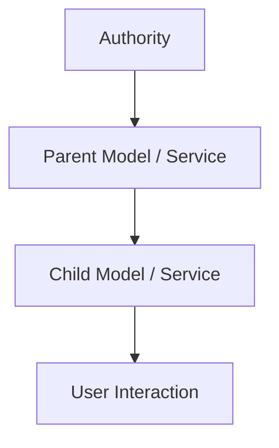

Trees matter because:
- Capabilities flow downward
- Responsibility flows upward
- Branches can diverge safely
- No single root must dominate

This allows:
- Collective training
- Local fine-tuning
- Personal RAG
- Independent experimentation

Without collapsing trust.

---

## 5. Who This Is For

PPS explicitly acknowledges **multiple audiences**:

- **End users**  
  Who want clarity, not internals

- **Programmers**  
  Who need precision, debuggability, and constraints

- **Administrators**  
  Who manage hardware, permissions, and risk

- **Scientists / proof-oriented users**  
  Who require lineage, reproducibility, and meaning

Each sees a different *projection* of the same tree.

---

## 6. What the Chapters Do

This document is structured deliberately:

1. **Interface and Concepts**  
   Defines pong, ping, tickets, keys, and authority

2. **Tree Confirmation and Capability Flow**  
   Explains how trust and permissions propagate

3. **User Experience and Resolution Paths**  
   Shows success, failure, UI, CLI, and code views

4. **Collective Training and Branching Life**  
   Explains why AI progress is slow — and must be

This introduction exists to make all of that readable.

---

## 7. Why Slowness Is a Feature

PPS assumes something unpopular but necessary:

> **Trust cannot be accelerated without being destroyed.**

- Verification takes time
- Responsibility resists parallelization
- Memory must be curated
- Errors must surface, not hide

PPS prefers **slow convergence** to fast collapse.

---

## 8. What PPS Is Not Trying to Do

PPS does not:
- Replace existing auth systems
- Define model architectures
- Solve alignment philosophically
- Eliminate human judgment

Instead, it provides **a spine** on which such systems can safely grow.

---

## 9. How to Read and Use This Document

- Read this introduction first
- Skim diagrams before details
- Treat examples as *patterns*, not prescriptions
- Extend locally; confirm globally

The document is designed to be:
- Forked
- Implemented partially
- Adapted culturally
- Audited technically

---

## 10. What Remains Open

PPS is intentionally incomplete.

Open areas include:
- Formal state machines
- Standardized CLI schemas
- Interoperability with OAuth / PKI
- Visualization standards for large trees

These are left open **on purpose**.

---

## End of Introduction

# Glossary — Pongping Service Terms and Concepts

> **Document role:** Canonical glossary for the Pongping Service  
> **Scope:** Definitions of all core and derived terms used in the document  

---

## Pong
A request made by a node (model, service, user, document) claiming intent to act as a child of a parent.  
A pong opens a **ticket** but grants no permission.

---

## Ping
A response from a parent or authority node to a pong.  
A ping confirms, rejects, or annotates the ticket.

---

## Pongping
A successful pong–ping pair.  
Creates a durable relationship with permissions, lineage, and responsibility.

---

## Ticket
An open claim created by a pong.  
Represents intent awaiting confirmation.

---

## Key
The authoritative response to a ticket.  
Often associated with confirmation, rejection, or constraints.

---

## Ticket & Key (T&K)
A paired record mapping request to response.  
Equivalent to a Q&A card in reinforcement contexts.

---

## Node
Any entity in the PPS tree:
- Model
- Service
- User
- Dataset
- Document
- Organization
- Authority

---

## Parent
A node that confirms another node as its child.  
Parents grant capabilities and inherit responsibility.

---

## Child
A node that has been confirmed by a parent via pongping.  
Children inherit constraints and permissions.

---

## Authority
A node capable of issuing binding pings.  
May be administrative, institutional, or delegated.

---

## Capability
An action or access right granted to a node:
- API usage
- Data access
- Model invocation
- Memory scope

---

## Responsibility
Liability for the behavior of child nodes.  
Flows upward in the tree.

---

## Tree
The core structural model of PPS.  
Represents lineage, trust, and permission propagation.

---

## Branch
A divergence from a parent node.  
Branches may evolve independently after confirmation.

---

## Q&A Card
A structured question–answer pair derived from interaction.  
Used for training, fine-tuning, and reinforcement.

---

## Reinforcement
The process by which accumulated Q&A cards influence model behavior over time.

---

## Implicit Pattern
A behavior change not traceable to a single example, but to accumulated reinforcement.

---

## RAG (Retrieval-Augmented Generation)
External context attached to a model without changing its weights.  
Acts as compatible children, not parents.

---

## Fine-Tuning
Weight-level adaptation of a model based on data.  
Always produces a child model.

---

## Collective Training
Training performed by groups or institutions to produce strong parent models.

---

## UI (User Interface)
Human-facing projection of PPS, emphasizing clarity and trust signals.

---

## CLI (Command Line Interface)
Operational interface exposing confirmations, failures, and constraints.

---

## Lineage
The confirmed ancestry of a node.  
Critical for trust, reproducibility, and accountability.

---

## Slow Convergence
The deliberate, incremental improvement of systems through verified steps.

---

## Confirmation
The act of accepting responsibility for a child node via ping.

---

## Rejection
The explicit denial of a pong, closing the ticket without lineage.

---

## Branching Conversation
A dialogue that descends from prior context but cannot fully return to it.

---

## Compression
Summarization or loss of full historical state, preventing exact rollback.

---

## Trust Propagation
The flow of trust through confirmed pongping edges.

---

## PPS (Pongping Service)
The overall system, philosophy, and structure described in this document.

---

## End of Glossary

# The Pong-Ping Service (PPS) interface:

Common terms for the service:
**Pong** is function, which provides request for a parent service class, claiming a ticket.
- It opens a ticket to proclaim adaption.
**Ping** is a function on that ticket, provided a "pong" command:
- It confirms ticket, which are it's proven or assumed children.
- It closes ticket and might add remark on it's own side or issue to the service:
  - Ticket is not confirmed it's own.
  - Ticket lacks permissions.
  - Ticket is not confirmed format or contextual data.
**Pongping** is a successful operation, where *Pong* request is answered by *Ping* reply, which forms Q&A storage item (you can use Quanda service from another snippet):
- Child item or it's service pongs further (=>).
- Parent item or it's service pings back (<=).
- Reference holder resides in service call (<=>).
- Sucessful call adds pongping interface for the whole network:
  - Nodes suceed permissions.
  - Nodes access data structures
    - They use proper API
    - They adhere guidelines, rules and laws.
    - They make permissive requests.

## Interface API

API can be concluded in following terms:
- Manualcraft solution, following form is proceeded by API's Tool Use, Mimicked by Human (see: Mimick Octopus, ***is*** my favourite animal I have not seen; movie explains this thing: label it with your sucess rate to mimick, closely or in abstraction, example of failure or success - trial and error form T&E, tiende to paraphrase quando: form Q&A data strcuctire for inference, training and fine-tuning, or 3-step reinforcement process, reinforce data by original source of model training, locally and with private data use local fine-tuning on last successful model; it is optimized linearly as a pipeline, where you label Q&A cards, and use Quanda structure to feed back with whole history: in various message formats, no complexity for API user of AIService class given in NutsandBolts/OOPCLIGPL.js, message format is handled by driver, it's template or specifically implemented model <x>Serice, <x>:\[ollama, litellm, litgpt\], where litellm is generic OpenAI driver and you might rename it to "openai" or "openai-litellm" as provider; ollama is specific case of this OpenAI, and litgpt is training case: you feed various formats of message drivers, thus you feed your example drivers data, with converted messages in each reinforcement phase or feedback-contemplation phase where you basically feed fine-tuning cards).
  - Often, this syndrome heavy use of Graphical User Interfaces
  - More often, please use HTML capable client, trust classic UI programmers and widget-snipped creators as AI creators barely make things like copy-paste code parts, visual copy-paste mixed with text-markdown, or trust html work; classical experience of building WYSWYG editors, for example, continues to be with human improvement, or lazily losing their ability.
  - AI interface programmers; generally they avoid UI matters: AI is not associating with their own UI.
- Programming (code, python, julia, go, ../libraries) or science proof (theory - yang, unified case, ethereal / 5th element - metaphysical, local setting theory or experiment - yin, pattern of local cases, material / 4 elements - physical, even math flow acts like physics for this tensor field)
- Command line interface:
  - Programmer easily creates command-line interface for
  - administrator, who is user of filesystem and small api for generic operations, such as bash command for program and configuration for data template, class or item; they work with small set of unrelated commands, an unordered (bash, terminal, console) APIs.;
    - Administrator accesses large networks of objects: hardware=>capabilities=>prices, models=>huggingface-collections=>specifications=>relations, user_data=>Q&Aitems=>associating. Large collections: item name, custom user item, (hardware) price, specification, especially real-life abilities, user gain and management gain.
    - Administrator documents specific selections from large databases, implements them to level of locally supported APIs, references the selection and install small models from large catalogs to users.
      - They configure and template: understand specific syntax and capabilities of this AI, apply to proper category or tag, choose locally understood name or evangelize it's internal name,
        - choose fate such as character and creed for installed, memory-accelerated models. Parallel process should have local permanent memory, indexed chunks.
    - Administrator will buy the hardware, maintain it and answer mainteance calls, also propose timing for new models and when the local interaction is "beta" (programmers decide "finalized", because they run custom scripts).
    - Use of formal language: *formal* like office, government, special, or particular home language (i.e. "formally his family and corporate speech").
- Programmers / proof precise syntax scientists \[Levels 1. and 2., because honestly proofs are harder to write, harder to maintain, hard to compile and hard to keep up to date: im am some basic levels in all this science in terms of practice; master the *general* theory, and have some experience with code such as formal test proofs.\]
  - Local context of program, application, specification or use of strict, or strictly formal language: strict is formal proof, especially in strict syntax (Isabelle-->Coq-->Agda = Science=>Programming).
  - Verbatim: modern age your very common, formal sense with UML diagrams (use mermaid in markup and display with your viewer, I use github=>builtin); visionary person with "advanced science novelty", approximately non-available for strict proofs and code, now need debugging lessons and general experience -> thumblines; basically currently copy the debug output back to AI and say nothing yours, expect suggestions for corrections: almost randomly, A, B or C could be enough to prototype your application.
    - For visionary cityzen and advanced mermaid users, who can produce code with an AI, a programmer is still a strict observer: nothing of importance can go through without confirmation that the code essentially *means* what it means, for example does not use higher-capability library which exposes local rights.
  - Create UI capable of rendering HTML and commands.
    - Enable "<script>" tag in mistune, interpreting AI answers as capable.
    - Override mistune to express in chunks, keeping atomic connection of closing tags or their remaining pieces; refreshing or updating whole text and keeping progress bars and warnings, updating content or it's versions and AI capabilities or processing phases.
    - Exponential memory use: compared to roof of the memory use, using in maximum capability - run only one process -; compared to linear use for various linear factors: there is still some exponent factor, but exactly how long elements you need to summarize=compression factor for 100 or n items in list, and what is their total memory access and how you consume variability or pad for AI and memory usage.
    - Linear+Exponential is 2 dimensional setting of scales or "frequencies" (not waves, but rather lengths per unit and seeing unit as partial set of larger unit or sub-statistical attractor).
      - For memory usage: you process how program lists into scaled memory, uses threads - multiple process in same Q&A window - and resolve complexity of O-Notation for general, and normal notation for particular optimization where you know small array lengths, not openness, where important multiplied arrays have particular element counts of small scale: 2 bytes, 20 layers, 200 memory items of 4 tokens, 7 IDs and 8 manuals for tool use or AI behaviour each in 160 or 20 characters.
      - Local behaviour: you use plus and minus, linear part; linear-exponential: you use pre-processing estimate; if activator function is at acceleration point where input is used on result, not source variable; metaphysics or template which tracks linear-exponential factor tracks the past distance as opposite of linear regression, differable: if it took 7 steps (preprocessing) to reach 7, it's linear, with activation function and next neural layer pass, you go into the node of Anytree, next member of classes/tickets either passed or closed in each observation pathway as "oracle", but in this particular sense: acceleration forms calculation on itself, it's input function as result, and activation function might also finalize with 7 to make the function fully linear in time: these two go in straight line, from sub-zero (metaphysical pre-distance, if it's 3 for actual 9, for example the function goes exponential).
        - Can these activator functions, which we choose almost randomly, also be in process of optimization combining a matrix of rather in-field syntax? Is this precedented on life?

## Code and password

*Code*, or the ***Ticket***:
- A pong service has opened ticket to receive child status for this potential parent.
*Password*, or the ***Key***:
- A ping service responds this.
- Password is being part of the client site which is referred: who refers as client, actually is formalized as part of the client's content
  - For example if you write link \[myfavouriteauthor:bookbuyingticket\], if the link itself is acting as client, it has permission to register this child.
    - Website link as complete document, headers and service, owns itself at it's particular moment of existence.
    - Unless the website is hacked (firewall'n'administrator service), the site itself proves to be owned by itself, supporting it's author's credit
      - Author can use passport service or trusted provider key to prove the responsibilities and liabilities, they can ask support service from governmental passport or ID, passport service such as Google and GitHub passports, a friend as referee, company which supports CV item, etc. This is in public service.
  - They ask from services, which provide trustability service or fuzzy search based on personal interests, to support tree acceptability.
  - 
Sipher, parole:
- Least significant for *user*
- Administrator registers the event and converts to Q&A format "T&K" pair.
  - We say Ticket & Key, map request => response (Q=>A / flashcard-reinforcement-inference form.), accr.:T&K.
  - They associate server-wide permissions and protections, such as spam and throlls hard to handle personally.
    - They maintain internal homeostasis of particular circles of people, who provide trust through internal passport and gain credibility in other circles and formal structures and general references, awards or alert watchdogs.
For example:
- Finishing the task can be confirmed by manager: this is parole, because it's another provider. They can inference AI chats in service with commands, and accepted AI models may follow the leaders if it's the standard role for their character and system task: system controls their inside-life and initial character, which will already understand the roles; you must take care of templates: because each model and controller has it's own syntax understanding or basic profile and specialization or local domain or AGI-like, common understanding: you must understand the initial mode, or configure it, and use simple abilities or write model associations for your drivers, which interact with the model for them to become able.
  - After becoming initially able, the model well communicates with human audience, forming a rapport based on given roles and characters and their understanding of particular identies of each caracter in real time RAG or reinforcement cycles + RAG confirmed (reinforcement provides pattern capability, but not exact RAG: local situation and public or personal sources must be contained or available for RAG memory, hidden messages in input, output or process - where AI uses tools in between the answer or question, it's the most complicated: debbuging would mean sourcing this hidden information in plain markdown console view, where it's separated and syntax-highlighted, parsed as document, or referred as document source by active link).
  - Programming: general things, such as copy-paste of code blocks, awareness of it's own interface, usage of interactive elements and real-time emulation of user interface; all this extends from classical programming abilities and joins the AI force in their special work. ChatGPT and CoPilot are scientific work, far from this level of ability: the common-sense graphical interface is barely functioning in critical, central aspects; we were proud to have this functionality scientifically proven into all-penetrating closed main cycle of UI loops and commands which provided precice tracks of UI mobility - we can see AI providers are not doing specific work in this area, and providing widgets for WYSIWYG, providing compability in copy-paste, and if modification is real-time watched it's perceived if local snippet is perhaps temporarly in clipboard, not removed from AI consciousness.
    - We have many local matters and considerations a human must access: programmer's ability for details, verification and active, destinied components rather than hardware use and manual clipboards.

## End user

Is seeing the confirmed list, alerting for avoid list, and providing sync-tune for personal preferences, for example if page provides 100 comments, but user accepts 10 synchronized comments and personal preference is adapted to variability filter.

They see, for example, that your fine-tuned AI is a child of their parent model with training mentioned on parent's owner page and link. This link owns the link reference at given position, and the whole file owns the whole file: providing it's claim.
- Keys and verifiers do not provide the claim, presenting a virtual "Ticket", but they do provide an authoritative response.
  - This is multi-level tree, where local administrator might have their list with key for government site;
    - And then the government site lists children and that local administrator among the children,
      - Or they black list: it's not a government or subbranch account of given area or responsibility or concluding right.
      - Or they give properties which ask for external qualification, a "class", which does technically this:
        - Two nodes, child and parent, are external.
        - That child is child of parent: association belongs to provider.
        - Might need multidimension:
          - Association becomes child of this or other tree, mentions a parent who confirms them further.
          - Proxy service or list associates multiple parents, and might contain associations or complex logic, or confirm basic operation / "AND", "OR", in basic sentence which is converted to command by AI, or AI with programmer's instruction, or administrative capability of administrator who meets the form which contains "AND" or "OR".

# End of technical reference.

# Pongping Service — Tree Confirmation, Capability Flow, and Trust Propagation

> **Document role:** Follow-up chapter to the Pong-Ping Service (PPS) interface draft  
> **Scope:** Tree semantics, confirmation logic, capability inheritance, and human–AI operational flow  
> **Audience:** System designers, administrators, programmers, and advanced users  
> **Status:** Conceptual + implementable reference  

---

## 1. Why Pongping Exists: Beyond Requests and Responses

Classic request–response systems answer *questions*.  
The Pongping Service answers **relationships**.

A *pong* is not merely a request.
A *ping* is not merely a response.

Together, they establish:

- **Lineage**
- **Permission**
- **Context**
- **Capability**

The result — **pongping** — is not data, but *structure*.

Where REST confirms *data exchange*, Pongping confirms **who may exist as whom**, *under what authority*, and *with what rights*.

---

## 2. The Tree Is the Interface

The PPS interface is not an endpoint-first system.  
It is a **tree-first system**.

### 2.1 Nodes, Not Calls

Each entity is a **node**:

- AI model
- Service
- Human
- Document
- Organization
- Configuration
- Dataset
- Identity provider
- Even a *link*

A node is defined by:

- Its **self-claim**
- Its **parents**
- Its **children**
- Its **confirmed pongpings**

No node is valid *alone*.

---

## 3. Pong as a Claim of Adaptation

A **Pong** opens a ticket.

It declares:

> “I intend to act as a child of you.”

This is not authority.
This is **intent**.

### Properties of a Pong:

- Opens a **Ticket**
- Includes:
  - Claimed parent
  - Context
  - Format
  - Intended capability
- Does **not** grant permission

Pong is *optimistic* by design.

---

## 4. Ping as Authority and Closure

A **Ping** is authoritative.

It may:

- Confirm the ticket
- Close the ticket
- Reject the ticket
- Annotate the ticket

### Possible Ping Outcomes

| Outcome | Meaning |
|------|--------|
| Confirmed | Child accepted |
| Format error | Syntax or structure invalid |
| Context error | Wrong environment |
| Permission denied | No authority |
| Unconfirmed | Deferred or ignored |

Ping transforms **intent** into **fact**.

---

## 5. Pongping: The Moment of Reality

A **pongping** occurs when:

```
pong  => accepted
ping  <= confirmed
```

This creates a **Q&A-like immutable association**, stored as a *Ticket & Key (T&K)* pair.

- Ticket → Question
- Key → Answer

This pair becomes:

- A training unit
- A reinforcement signal
- A permission edge
- A lineage record

---

## 6. Visualizing Pongping as a Tree

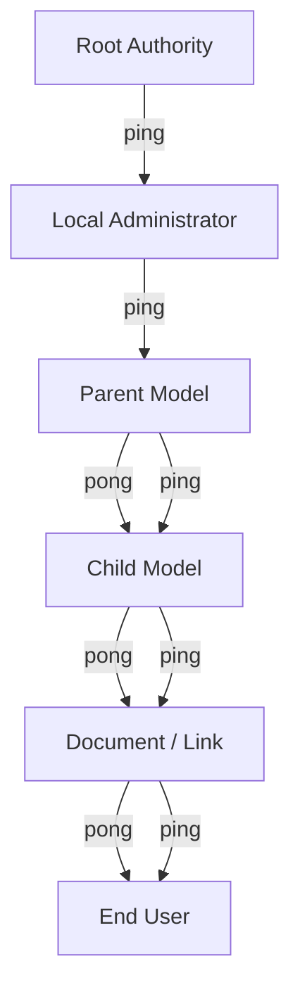

Each arrow is **directional confirmation**, not merely reference.

---

## 7. Capability Flows Down, Responsibility Flows Up

A core PPS invariant:

> **Capabilities descend, liabilities ascend.**

### Example:

- A child model inherits:
  - API access
  - Memory limits
  - Behavioral constraints
- A parent inherits:
  - Accountability
  - Audit responsibility
  - Reputational risk

This is why **pings matter more than pongs**.

---

## 8. Pongping and Human Roles

Humans exist *inside* the tree, not outside it.

### 8.1 End Users

- Do not manage tickets directly
- See:
  - Confirmed children
  - Avoid lists
  - Preference filters
- Experience:
  - Curated capability sets
  - Synchronized content

### 8.2 Administrators

Administrators are **tree engineers**.

They:

- Register pongping events
- Convert them into Q&A (T&K)
- Map permissions
- Install models
- Define local names
- Maintain hardware
- Decide *beta* vs *final*

They do not create intelligence — they **shape ecosystems**.

---

## 9. Programmers and Strict Observers

Programmers operate at **syntax boundaries**.

They:

- Verify that code *means what it claims*
- Audit:
  - Libraries
  - Permissions
  - Side effects
- Translate:
  - Visionary specs → enforceable constraints

In PPS, programmers are **gate validators**, not creators.

---

## 10. UI, HTML, and Why AI Avoids Them

PPS explicitly acknowledges a truth:

> AI systems are weak at UI.

Therefore:

- Trust HTML
- Trust widgets
- Trust WYSIWYG editors
- Trust human-crafted interfaces

AI operates **behind** the interface, not *as* the interface.

This separation preserves:

- Safety
- Interpretability
- Debuggability

---

## 11. Memory, Scale, and Linear–Exponential Reality

PPS treats memory as **structured flow**, not storage.

### Two dimensions:

1. **Linear**
   - Lists
   - Logs
   - Tickets
2. **Activation / Acceleration**
   - Reinforcement
   - Self-referential updates
   - Layered inference

Memory cost is estimated *before execution*.

---

## 12. Activation Functions as Social Precedent

The document asks:

> Can activation functions be optimized in-field, socially?

PPS answers: **Yes — that is what trees are.**

- Each confirmation changes future behavior
- Each rejection reshapes probability
- Each lineage alters expectation

Life itself is reinforcement learning with delayed reward.

---

## 13. Pongping and External Authorities

A pongping may reference:

- Government IDs
- Passport services
- Corporate attestations
- Social trust
- Referees

These are **external pings**, not internal claims.

The tree supports **multi-root authority** without collapsing into chaos.

---

## 14. AND / OR Logic in Association Trees

Associations may require:

- AND confirmations
- OR confirmations
- Proxy confirmations

These are expressed:

- In natural language
- Converted to commands
- Enforced by administrators or AI agents

The PPS tree is **multi-dimensional**, not binary.

---

## 15. Why This Matters

Without pongping:

- AI systems impersonate authority
- Models leak permissions
- Users trust unverifiable outputs
- Responsibility evaporates

With pongping:

- Every capability has lineage
- Every action has a parent
- Every trust has provenance

---

## End of Tree Confirmation and Capability Flow

# Pongping Service — User Experience, Roles, and Resolution Paths

> **Document role:** Experiential follow-up to *Tree Confirmation and Capability Flow*  
> **Scope:** Human-facing interactions, role overlap, success/failure patterns, and access-layer symmetry  
> **Audience:** End users, administrators, programmers, scientists  
> **Status:** Operational scenarios + conceptual diagrams  

---

## 1. Why User Experience Matters in a Tree-Based System

In Pongping Service (PPS), **no user is just a user**.

Each person simultaneously inhabits multiple roles:

- Consumer
- Contributor
- Validator
- Proxy
- Authority (sometimes unknowingly)

The PPS UX challenge is not *simplicity*, but **legibility**:
> Can the user understand *why* something works or fails?

---

## 2. Core User Roles (Non-Exclusive)

### 2.1 Popular User (Everyday Participant)

- Reads content
- Uses AI tools
- Clicks links
- Accepts defaults
- Trusts visible confirmations

They do **not** manage tickets directly.

---

### 2.2 Programmer User

- Writes code
- Installs models
- Uses CLI
- Reads logs
- Debugs failures

They see **partial tree internals**.

---

### 2.3 Scientist / Proof-Oriented User

- Evaluates correctness
- Reviews lineage
- Cares about assumptions
- Needs reproducibility

They inspect **entire confirmation paths**.

---

## 3. One Task, Multiple Roles

### Scenario: Publishing a Fine-Tuned AI Model

| Role | Perspective |
|---|---|
| Popular user | “Can I trust this model?” |
| Programmer | “Does it leak permissions?” |
| Scientist | “Is its training lineage valid?” |
| Administrator | “Who is responsible if it fails?” |

All are interacting with **the same pongping tree**.

---

## 4. User Communication Flow (Successful Path)

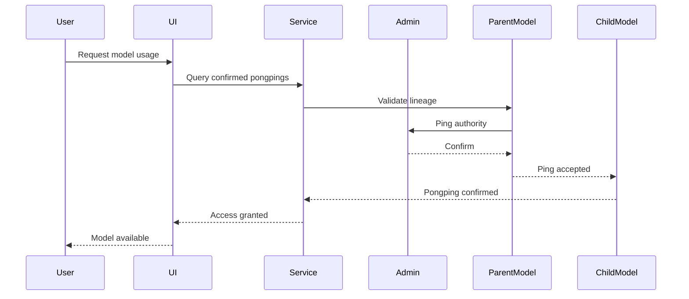

This path is **boring** — and that is success.

---

## 5. Failure Is a Feature: Bad Resolution Path

### Scenario: Model claims parent it does not own

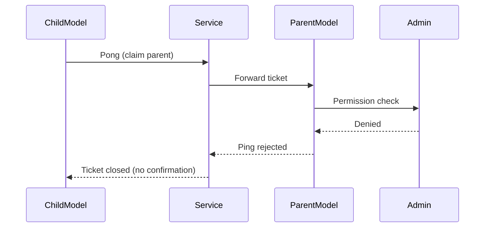

### User-visible result:

- Popular user: *Model not listed*
- Programmer: *Permission denied*
- Scientist: *Lineage broken*

No silent failure.

---

## 6. UI-Level Experience (Popular User)

### What They See

- ✔ Confirmed badge
- 🔗 Parent reference link
- ⚠ Warning for partial trust
- 🚫 Hidden or blocked items

### What They Don’t See

- Tickets
- Keys
- Activation logic
- Internal IDs

UI translates **tree complexity into signals**.

---

## 7. UI Tree Inspector (Optional, Advanced)

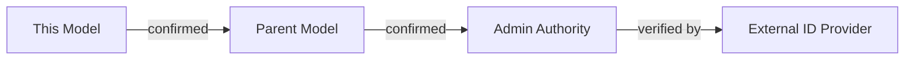

Expandable, collapsible, non-editable for popular users.

---

## 8. Command Line Experience (Programmer)

CLI exposes **edges**, not full trees.

```bash
pps inspect model child-model-7
```

Output:

```text
Status: CONFIRMED
Parent: parent-model-2
Authority: local-admin
Capabilities:
  - text-generation
  - embeddings
Restrictions:
  - no network access
  - max context 8k
```

Failures are explicit.

---

## 9. CLI Failure Example

```bash
pps install model suspicious-model
```

```text
ERROR: pong rejected
Reason: parent authority not confirmed
Suggested action:
  - request confirmation
  - choose different parent
```

No ambiguity. No silent downgrade.

---

## 10. Code-Level Access (Programmer / Scientist)

At code level, pongping becomes **assertions**.

```python
assert model.is_confirmed()
assert model.parent.has_capability("embeddings")
assert not model.can_access("filesystem")
```

The tree becomes **runtime truth**.

---

## 11. Scientist View: Full Lineage Trace

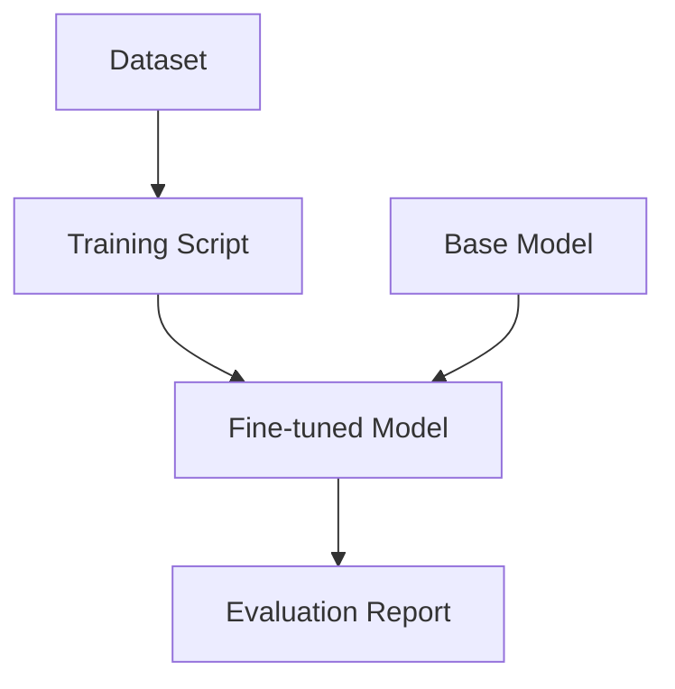

Each arrow must be backed by **pongping confirmation**, or the chain is invalid.

---

## 12. Mixed Roles in One Human

A single person may:

- Use UI in the morning
- Debug via CLI at noon
- Review proofs at night

PPS supports **role switching without role confusion**.

The same identity, different lenses.

---

## 13. Good Resolution Patterns

- Clear rejection messages
- Visible parent references
- Minimal UI noise
- Strong defaults
- Reversible decisions

---

## 14. Bad Resolution Patterns (Anti-Patterns)

- Silent fallback to weaker model
- Implicit permission escalation
- Hidden parents
- Unattributed training
- UI pretending certainty

PPS explicitly avoids these.

---

## 15. Balance of Access Layers

| Layer | Strength | Risk |
|---|---|---|
| UI | Trust & clarity | Oversimplification |
| CLI | Precision | User error |
| Code | Power | Responsibility |

PPS **does not privilege one layer** — it harmonizes them.

---

## 16. Why This Chapter Exists

Without user-facing clarity:

- Trees become myths
- Authority becomes invisible
- Trust degrades into vibes

With experiential design:

- Users learn trust boundaries
- Programmers debug responsibly
- Scientists verify meaning

---

## End of User Experience and Resolution Paths

# Pongping Service — A Story of Training, Branching, and Slow Convergence

> **Document role:** Narrative and reflective closing chapter of the Pongping Service series  
> **Scope:** Collective training, branching conversations, parentage of models, and why progress remains slow  
> **Audience:** Everyone who participates — users, programmers, administrators, scientists  
> **Status:** Conceptual story grounded in operational reality  

---

## 1. The Collective Does Not Train One Model

At first, people imagine:

> “We are training *the* model.”

This is false.

What actually happens is quieter and more fragmented.

- Collectives train **baselines**
- Users fine-tune **variants**
- Systems accumulate **Q&A cards**
- Interfaces expose **partial views**
- Reinforcement produces **implicit patterns**

No single mind exists.  
Only **trees growing sideways**.

---

## 2. A Model Is Always a Child

Every AI model has parents.

Some are obvious:
- A base model
- A dataset
- A training run

Some are hidden:
- A prompt style
- A UI constraint
- A moderation filter
- A missing capability

In PPS terms:

> A model exists because a pongping *once succeeded*.

Without that confirmation, it would never be loadable, callable, or trusted.

---

## 3. The First Branch: Collective Training

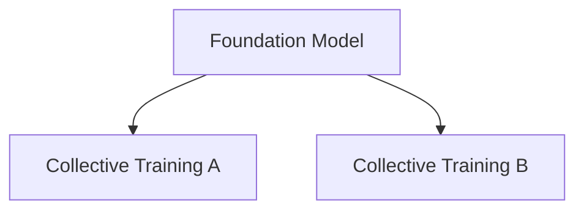

These branches are deliberate.

- Shared datasets
- Shared objectives
- Shared evaluation rituals

They form **parents strong enough** to accept many children later.

---

## 4. The Second Branch: User Fine-Tuning

Then users arrive.

Not as engineers — as *intent*.

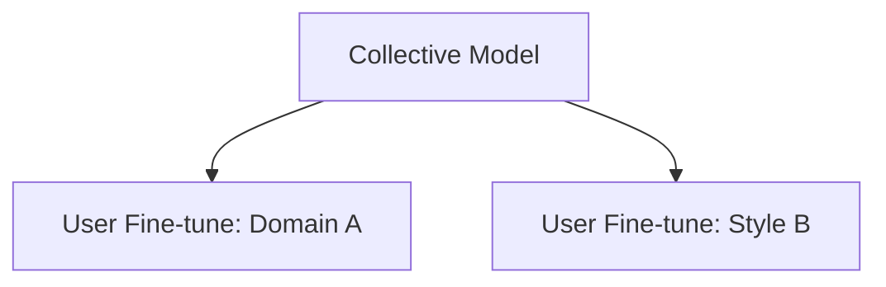

Each fine-tune is a **pong**:
> “Let me adapt you.”

Each acceptance is a **ping**:
> “You may exist as my child.”

---

## 5. Filling the Model: RAG as Living Memory

Fine-tuning is slow.  
So users add **RAG**.

- Documents
- Notes
- Logs
- Personal archives
- Organizational knowledge

RAG does not change the model’s weights.  
It changes **its reachable context**.

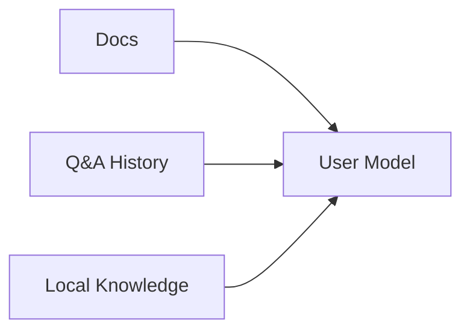

These are **compatible children**, not parents.

---

## 6. Programmers and Admins: The Quiet Architects

While users interact, others work invisibly.

- Programmers optimize pipelines
- Admins shape permissions
- Interfaces are smoothed
- Costs are reduced
- Latency is hidden

They do not train intelligence.  
They **prevent collapse**.

Without them:
- Trees tangle
- Memory explodes
- Permissions leak
- Trust erodes

---

## 7. The Flood of Q&A Cards

Every interaction produces something small:

- A question
- An answer
- A correction
- A failure
- A refusal

Each becomes a **Q&A card**.

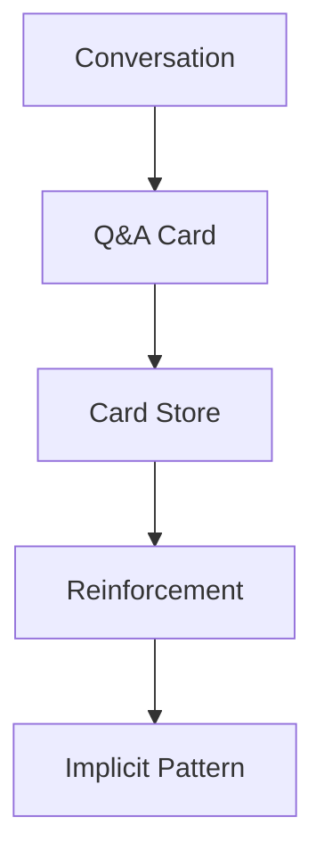

No single card matters.

But millions of them **bend behavior**.

---

## 8. Conversations Are Branches, Not Lines

Every conversation starts somewhere.

But it never truly returns.

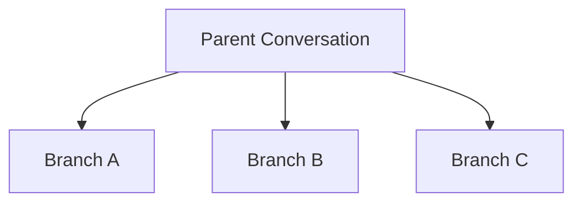

Each branch:
- Refers its parent
- Assumes shared context
- Diverges immediately

Returning *back* is not trivial.

---

## 9. Why You Can Refer Parents but Not Rewind Them

A child conversation can say:

> “As discussed earlier…”

But the system cannot safely say:

> “Let us become that earlier state again.”

Why?

- Memory was summarized
- Context was compressed
- Reinforcement already happened
- Hidden activations changed

The parent exists — but **only as history**, not as a runnable state.

---

## 10. Pongping as the Only Stable Anchor

What survives branching is not conversation — but **confirmation**.

- This model is child of that model
- This dataset was allowed
- This permission was denied
- This authority accepted responsibility

Pongping edges are **slow**, but they persist.

---

## 11. The Slowness Is Not a Bug

Progress feels slow because:

- Verification is slow
- Responsibility propagates upward
- Trust resists acceleration
- Errors cost reputation

Fast systems break silently.  
Slow systems fail loudly — and recover.

---

## 12. A Day in the Life (Story)

A user asks a question.

The model answers.

The answer is imperfect.

The user corrects it.

A Q&A card is formed.

Nothing changes immediately.

Weeks later:
- Enough cards accumulate
- A pattern shifts
- A response improves

No one can point to *the* moment.

---

## 13. The Tree Grows Sideways

There is no final model.

Only:
- New children
- Deprecated branches
- Forgotten twigs
- Strong trunks

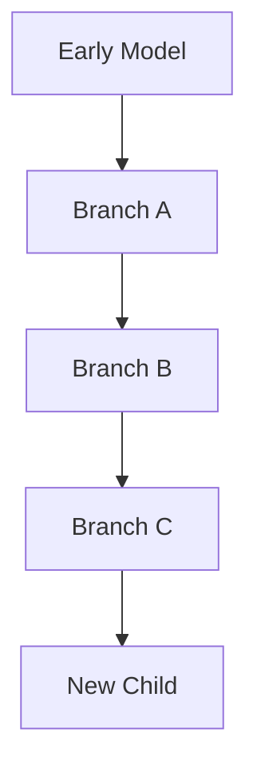

Each step is small.  
Each step is confirmed.

---

## 14. Why This Must Remain Human-Centered

Humans:
- Decide what matters
- Decide when to stop
- Decide who is responsible

AI systems do not converge alone.

They are **guided**, not driven.

---

## 15. What Remains at the End

Not intelligence.

But:
- Lineage
- Accountability
- Memory
- Patterns earned slowly

The Pongping Service exists to remember *how we arrived*,  
even when we cannot go back.

---

## End of Collective Training and Branching Life
