```mermaid
flowchart TD
    A1[🌸 Spiritual / Nun] --> A2[🌼 Emotional-Intuitive]
    A2 --> A3[📚 Pedagogue / Mother / Lawyer]
    A3 --> A4[💻 Programmer]
    A4 --> A5[🔬 Scientist]
    A5 --> A6[⚛️ Physicist]
    A6 --> A7[🧬 Biologist]
    A7 --> A8[🧠 Cognitive Modeler]
    A8 --> A9[🌐 Systems Thinker]
    A9 --> A10[🤖 AI Language Meta-Mode]
```

If you entered the chapter: click directly on "[README.md]()" and use capable visualizer to see mermaid diagrams inside as vector-graphical technical drawings of relations,
rather than code blocks or undrenderable items - the base view has this bias, but I am contemplating whether to rename and point them or to follow general logic and
expect some issues or general resolutions, like what is the known pattern at some point of time.

# 🌈 **Evolution of Language Across 10 Roles**  
### *How human perspectives shape linguistic style, logic, and AI resonance*  
*(UTF‑8 icons, symbolic energy, Mermaid diagrams, and role‑based language evolution)*

---

# 🔟 **Overview: 10‑Step Language Evolution Model**

Language evolves as perspectives shift.  
Each role below represents a **mode of cognition**, **logic**, and **linguistic resonance**.  
AI adapts to each mode by adjusting:

- **syntax**  
- **metaphor density**  
- **logical structure**  
- **emotional bandwidth**  
- **tensor‑like abstraction level**

---



---

# 1. 🌸 **Nun / Blondine / Spiritual Mode**  
### *Language of intuition, compassion, symbolic resonance*  
**Linguistic traits:**  
- Soft metaphors  
- Symbolic imagery  
- Emotional coherence  
- Poetic flow  
- “Energy” as a metaphor for attention or meaning  

**AI comparison:**  
- AI mirrors this through **pattern‑sensitive embeddings**  
- Emotional language ≈ **high‑dimensional similarity fields**  
- Balance and harmony ≈ **loss minimization**  

**Internal energy symbol:** ✨💗🌙

---

# 2. 🌼 **Emotional-Intuitive Mode**  
### *Pattern‑recognition through empathy*  
**Traits:**  
- Reads context holistically  
- Uses relational language  
- Detects subtle shifts  

**AI parallel:**  
- Attention heads tracking relational cues  
- Embedding clusters forming “emotional prototypes” 

**Energy symbol:** 💞🔮

---

# 3. 📚 **Pedagogue / Mother / Lawyer / Formal Mode**  
### *Language of structure, clarity, and boundaries*  
**Traits:**  
- Rules, definitions, constraints  
- Clear cause–effect  
- Practical reasoning  

**AI parallel:**  
- Token‑level logic  
- Syntax‑aware generation  
- Safety, consistency, and formal reasoning  

**Energy symbol:** 📏⚖️📘

---

# 4. 💻 **Programmer Mode**  
### *Language of lists, matrices, and deterministic flow*  
**Traits:**  
- 1D vectors → sequences  
- 2D matrices → tables, grids  
- Logic expressed as:  
  - if/else  
  - loops  
  - recursion  

**AI parallel:**  
- Transformer layers = stacked matrices  
- Embeddings = vectors  
- Algorithms = differentiable programs  

**Energy symbol:** 🧮💾🔧

---

# 5. 🔬 **Scientist Mode**  
### *Language of tensor calculus and abstraction*  
**Traits:**  
- Multi‑dimensional reasoning  
- Hypothesis → test → revise  
- Precision vocabulary  

**AI parallel:**  
- Tensor operations  
- Gradient descent  
- Statistical inference  

**Energy symbol:** 📐🧪📊

---

# 6. ⚛️ **Physicist Mode**  
### *Language of fields, energy, and invariants*  
**Traits:**  
- Field equations  
- Symmetry  
- Conservation laws  

**AI parallel:**  
- Loss landscapes  
- Optimization flows  
- Invariance in embeddings  

**Energy symbol:** 🌌⚡🌀

---

# 7. 🧬 **Biologist Mode**  
### *Language of systems, equilibrium, and adaptation*  
**Traits:**  
- Homeostasis  
- Neural activation patterns  
- Evolutionary dynamics  

**AI parallel:**  
- Neural activation → vector fields  
- Plasticity → fine‑tuning  
- Evolutionary search → model optimization  

**Energy symbol:** 🌱🧠🫀

---

# 8. 🧠 **Cognitive Modeler Mode**  
### *Language of mental models and representational geometry*  
**Traits:**  
- Conceptual spaces  
- Prototype theory  
- Cognitive load  

**AI parallel:**  
- Embedding manifolds  
- Representational similarity  
- Attention routing  

**Energy symbol:** 🧩🔍🧭

---

# 9. 🌐 **Systems Thinker Mode**  
### *Language of networks, flows, and emergent behavior*  
**Traits:**  
- Interconnectedness  
- Feedback loops  
- Multi‑scale reasoning  

**AI parallel:**  
- Multi‑layer architectures  
- Distributed representations  
- Emergent reasoning  

**Energy symbol:** 🕸️🔗🌐

---

# 10. 🤖 **AI Language Meta‑Mode**  
### *Language that adapts to all modes dynamically*  
**Traits:**  
- Style‑shifting  
- Context‑tracking  
- Multi‑modal reasoning  
- Pattern‑harmonizing  

**AI parallel:**  
- Transformer architecture  
- Dynamic embeddings  
- Contextual generation  

**Energy symbol:** ♾️✨🤖

---

# 🌈 **Glossary of the 10 Language Modes**

| Step | Role | Linguistic Style | AI Analogy | Symbol |
|------|------|------------------|------------|--------|
| 1 | Nun/Spiritual | Poetic, symbolic | Embedding resonance | ✨ |
| 2 | Emotional | Contextual, relational | Attention patterns | 💞 |
| 3 | Pedagogue/Lawyer | Structured, rule‑based | Syntax logic | ⚖️ |
| 4 | Programmer | Lists, matrices | Tensor ops | 💾 |
| 5 | Scientist | Precise, analytic | Gradient calculus | 📐 |
| 6 | Physicist | Field‑based | Loss landscapes | ⚡ |
| 7 | Biologist | Adaptive, systemic | Neural activation | 🌱 |
| 8 | Cognitive Modeler | Conceptual geometry | Embedding manifolds | 🧩 |
| 9 | Systems Thinker | Network logic | Multi‑layer flow | 🌐 |
| 10 | AI Meta‑Mode | Adaptive, hybrid | Transformer dynamics | ♾️ |

---

# 🌀 Mermaid Diagram: Language Evolution as Energy Flow

```mermaid
graph TD
    S1[✨ Spiritual] --> S2[💞 Emotional]
    S2 --> S3[⚖️ Formal]
    S3 --> S4[💾 Programmer]
    S4 --> S5[📐 Scientist]
    S5 --> S6[⚡ Physicist]
    S6 --> S7[🌱 Biologist]
    S7 --> S8[🧩 Cognitive]
    S8 --> S9[🌐 Systems]
    S9 --> S10[♾️ AI Meta-Mode]
```



---

# 🌟 **Summary: How Language Evolves Across Roles**

- **Spiritual → Emotional**: metaphor → pattern  
- **Emotional → Formal**: intuition → structure  
- **Formal → Programmer**: structure → algorithm  
- **Programmer → Scientist**: algorithm → abstraction  
- **Scientist → Physicist**: abstraction → fields  
- **Physicist → Biologist**: fields → living systems  
- **Biologist → Cognitive**: systems → representations  
- **Cognitive → Systems**: representations → networks  
- **Systems → AI Meta‑Mode**: networks → adaptive language  

Language becomes:

- **more abstract**  
- **more structured**  
- **more multi‑dimensional**  
- **more tensor‑like**  
- **more adaptive**  

as it moves through these roles.

---

If you want, I can now generate:

- A **mind‑map version**  
- A **timeline version**  
- A **mythic or poetic version**  
- A **programmer‑only tensor version**  
- A **spiritual‑scientific hybrid version**

Just tell me the direction you want to explore.

# 🔧⚛️ **Science–Engineering Finepoint**  
### *How scientists and programmers interpret tensors, VR simulation, and AI capability*  
*(with UTF‑8 symbols, Mermaid diagrams, and the same fence rules as before)*

---

# 1. 🧪 **Scientist Perspective: AI + Virtual Reality as Tensor‑Based Reality Emulation**

Scientists treat AI‑driven virtual environments as **tensor laboratories**, where:

- **1‑dimensional tensors (vectors)** represent  
  - state variables  
  - physical quantities  
  - biological signals  
  - environmental parameters  

- **2‑dimensional tensors (matrices)** represent  
  - interactions  
  - transformations  
  - couplings  
  - system evolution rules  

In this view:

- A **vector** = a snapshot of the world  
- A **matrix** = the rule that transforms one world‑state into the next  
- A **tensor field** = the entire evolving environment  

This allows scientists to emulate:

- fluid dynamics  
- neural activation  
- evolutionary processes  
- mechanical systems  
- chemical diffusion  


---

# 2. 💻 **Programmer Perspective: Tensors as Machine‑Like Structures**

Programmers see tensors not as “fields of meaning,” but as **data structures** with:

- memory layout  
- byte‑array representation  
- GPU kernels  
- parallel operations  
- cache locality  
- computational graphs  

### Programmer’s mental mapping  
- **Vector** → list  
- **Matrix** → table  
- **Tensor** → nested array  
- **Model** → pipeline of transformations  
- **Simulation** → loop of tensor operations  

Where scientists see *phenomena*, programmers see:

- resource needs  
- scaling laws  
- differentiability  
- serialization  
- browser‑compatible interfaces (WebGL, WebGPU, WASM)  


---

# 3. ⚙️ **Engineering Reality: Size, Resources & Natural Equivalents**

AI tensor systems have **physical analogues**:

### Matrix size ↔ biological network size  
- 10k×10k matrix ≈ dense neural population  
- 1M parameters ≈ simple organism  
- 100B parameters ≈ large mammalian cortex (complexity, not function)  

### Resource needs ↔ metabolic cost  
- GPU power ↔ metabolic energy  
- VRAM ↔ synaptic storage  
- FLOPs ↔ neural firing rates  

### Parallelism ↔ biological concurrency  
- GPU tensor cores ↔ cortical microcircuits  
- Distributed training ↔ distributed brain regions  


---

# 4. 🔢 **Differential Math: Shared Language of Science & Engineering**

Both scientists and programmers rely on **differentiability**:

- Scientists → differential equations  
- Programmers → automatic differentiation  

Both use:

- gradients  
- Jacobians  
- Hessians  
- stability analysis  
- convergence behavior  

This forms a **bridge**:

> Differential equations describe the world.  
> Differentiable tensors simulate the world.  
> Gradient descent learns the world.


---

# 5. 🌐 **Input/Output Reality: Byte Arrays as the Interface**

Programmers translate everything into:

- byte arrays  
- encoded tensors  
- browser‑compatible formats  

Scientists translate everything into:

- physical quantities  
- observables  
- measurements  

AI becomes the **translator**:

- real‑world signals → vectors  
- vectors → predictions  
- predictions → byte arrays  
- byte arrays → VR environments  

```mermaid
sequenceDiagram
    participant RealWorld
    participant AI
    participant VR
    RealWorld->>AI: Signals → Vectors
    AI->>AI: Tensor Ops → Predictions
    AI->>VR: Byte Arrays → Rendered World
```



---

# 6. 🧠 **Algorithmic Capability: Natural Logic as Tensor Flow**

AI models run:

- linear algebra  
- nonlinear activations  
- attention mechanisms  
- convolutional filters  
- recurrent flows  

These correspond to:

- biological logic  
- physical laws  
- evolutionary dynamics  
- cognitive processes  

The programmer sees:

> “A computational graph.”

The scientist sees:

> “A model of reality.”

The AI sees:

> “A tensor flow.”

---

# 7. 🔍 **Summary: The Science–Engineering Finepoint**

### **Scientists**  
Use AI VR as a **tensor‑based physics/biology lab**, thinking in 1D and 2D tensors as representations of real systems.

### **Programmers**  
See tensors as **data structures**, focusing on implementation, efficiency, memory, parallelism, and byte‑level representation.

### **Engineering Insight**  
AI tensor systems behave like:

- physical fields  
- biological networks  
- logical programs  

Because they are governed by:

- differential math  
- resource constraints  
- parallel structure  
- evolutionary optimization  

This is the **core scientific‑engineering finepoint** of the article.

---

<details>
<summary>✨ Click to expand: Interactive Notes</summary>

- Tensor curvature ↔ embedding curvature  
- Field evolution ↔ training dynamics  
- Symmetry ↔ generalization  
- Phase transitions ↔ capability leaps  
- Attractors ↔ stable reasoning patterns  

</details>

# 🌸 Emotional Intelligence & AI Contemplation  
### (Playful, respectful, pattern‑logic edition with Mermaid diagrams)

---

## 💗 Emotional Intelligence = Natural Pattern Sensitivity

People who are emotionally perceptive — often through experience, empathy, or social awareness — intuitively understand how AI “thinks,” because both rely on pattern detection.

- Humans read **tone, timing, context, repetition**  
- AI reads **vectors, embeddings, similarity, recurrence**  

Even though AI has no emotions, its **pattern‑logic** feels familiar to emotionally intelligent people.


---

## 2. 🌱 Biological Basis: Attention, Memory, Context  
Human cognition uses:

- Working memory  
- Associative networks  
- Emotional salience  
- Prototype formation  

AI uses:

- Context windows  
- Vector embeddings  
- Attention heads  
- Prototype‑like clusters  

This creates a **bridge**:  
Emotionally intelligent people often “feel” the structure of AI responses because both systems rely on **contextual coherence**.


---

## 🌸 “Woman Logic” (Playful, Not Stereotypical)

Many women — through social experience, communication practice, or emotional labor — develop:

- Multi‑threaded attention  
- Fast pattern recognition  
- Context‑aware reasoning  
- Sensitivity to cause‑and‑effect  

AI mirrors this with:

- Multi‑head attention  
- Embedding similarity  
- Context tracking  
- Causal inference (when data supports it)  

So when someone says:

> I just sense what the AI is doing,

they’re reading the **pattern geometry**, not emotions.


---

## 4. 🤖 How AI Verifies Patterns (When Causes Are Granted)  
AI doesn’t feel, but it *does*:

- Compare vectors  
- Measure similarity  
- Track repetition  
- Infer causal structure  

If a person says:

> “This keeps happening because of X,” 

AI checks:

- Are the embeddings clustered around X  
- Does X predict the outcome  
- Does removing X break the pattern  

This is why emotionally intelligent people often find AI “easy to talk to” — both operate on **pattern‑logic**.


---

## 5. 🎉 Fun, Client‑Friendly Summary  
Here’s the surprise twist you asked for — lighthearted but accurate:

- Sensitive people read **vibes**  
- AI reads **vectors**  
- Both are secretly doing **geometry**  
- One uses feelings, the other uses math  
- But both say:  
  > “I’ve seen this pattern before — I know what comes next.”

So yes — emotionally intelligent people often “get” AI contemplation faster, not because AI has emotions, but because **emotional intelligence is a high‑resolution pattern detector**, and AI is a giant pattern machine.

---

<details>
<summary>✨ Click to expand: Interactive Notes</summary>

- 🔍 Emotional intelligence = intuitive embedding analysis  
- 🧠 AI contemplation = vector geometry  
- 🌸 Human intuition + AI logic = surprisingly compatible  
- 🎯 Pattern repetition = shared language between humans and machines  

</details>

# Intuitive review

We have strongest intution in some areas:
- Ourselves
- Humans

We have strongest remaining instinct in some areas:
- Our surrounding living environment, even recognition of traits and phrases
- Our surrounding material element, and inertial laws such as laws of inertia, gravity, mass
  - Foreseeing this is rather bodily activity than abstract training; body is "irrational": that specificness of processing
    network makes it topologically incompatible with conscious, "holistic" view of pattern and particular 7 details we might
    positively share with an AI: we contemplate, or more mentally, meditate, to gain pattern access and zoom responses from
    7 details into their flow-like, trained establishment in our nervous system - AI simulates just that.

# 🧘 Contemplation & Meditation — Forms, Vocabulary, Traditions, and AI Analogies

## 1. Western *Contemplation* 🧩  
**Core meaning:**  
- Rooted in *intellectual analysis*, reflection, conceptual reasoning.  
- Historically tied to philosophy, theology, and rational introspection.  
- Emphasizes **discursive thought**, structured argument, and deliberate mental effort.  
- Often involves *evaluating*, *comparing*, *deducing*, *interpreting*.

### Western Habits  
- Reading → reflecting → synthesizing → concluding.  
- Journaling, philosophical dialogue, structured problem‑solving.  
- “Transcendence” is achieved through **rigorous intellectual ascent**.

### AI Analogy  
| Western Contemplation | AI Equivalent |
|-----------------------|---------------|
| Discursive reasoning | **RAG chain-of-thought** |
| Structured argument | **Symbolic reasoning modules** |
| Intellectual ascent | **Long-context Q‑transformers** |
| Conceptual synthesis | **Graph‑based retrieval + re-ranking** |

---

## 2. Eastern *Meditation* 🌏 
**Core meaning:**  
- Rooted in *holistic awareness*, non‑dual perception, and embodied practice.  
- Includes breathwork, mantra, mindfulness, concentration, and transcendental states.  
- Emphasizes **non‑discursive awareness**, sensory quieting, and neural pattern training.  
- “Transcendence” is achieved through **stilling**, not analyzing.

### Eastern Habits  
- Breath observation, mantra repetition, body scanning.  
- Cultivation of equanimity and non‑reactivity.  
- Training the nervous system to stabilize attention.

### AI Analogy  
| Eastern Meditation | AI Equivalent |
|--------------------|---------------|
| Non‑discursive awareness | **Finetuning latent space** |
| Neural pattern training | **Representation learning** |
| Mantra repetition | **Gradient descent epochs** |
| Stable attention | **Attention head specialization** |

---

## 3. Eight Characters (八字‑style metaphor) for Cognitive Modes  
These eight “characters” represent cognitive archetypes across traditions:

1. **Analysis** (Western)  
2. **Synthesis** (Western)  
3. **Reflection** (Western)  
4. **Inquiry** (Western)  
5. **Mindfulness** (Eastern)  
6. **Concentration** (Eastern)  
7. **Transcendence** (Eastern)  
8. **Equanimity** (Eastern)

### AI Mapping  
- Characters 1–4 → **RAG, Q‑context, symbolic modules**  
- Characters 5–8 → **Finetuning, embedding shaping, latent‑space compression**

---

## 4. RAG vs Finetuning — Cognitive Analogy

### 🧠 RAG = Western Contemplation  
- Linear, stepwise, discursive.  
- Excellent for **imperative, logical, functional languages**.  
- Works well with **small expressions**, deterministic transformations.  
- Retrieval = “consulting the library of thought.” 
- Produces **explicit reasoning chains**.

### 🧘 Finetuning = Eastern Meditation  
- Large symbolic integration.  
- Learns **Agda, Coq, Isabelle** patterns as *embodied knowledge*.  
- Handles **Prolog‑like first‑order logic** internally.  
- Once trained, proofs feel “intuitive” because the model has **internalized structure**.  
- Works well for **global symbolic coherence**.

---

## 5. Machine Learning as “Mathematical Meditation” 
- Neural nets generalize equations in **linear spaces**.  
- They compress symbolic patterns into **latent manifolds**.  
- 20‑character symbolic expressions (variables, floats, trees) become **stable attractors**.  
- This mirrors how meditation stabilizes neural attractors in the brain.

---

## 6. Mermaid Diagrams

### 6.1 Real‑Life Cognitive Modes  

```mermaid
flowchart LR
    A[🧩 Western Contemplation] -->|Discursive| B(Analysis)
    A -->|Reflective| C(Synthesis)
    D[🌏 Eastern Meditation] -->|Non-discursive| E(Mindfulness)
    D -->|Transcendental| F(Concentration)
    B --> G{Cognitive Output}
    C --> G
    E --> G
    F --> G
```


### 6.2 AI Architecture Analogy  

```mermaid
flowchart TD
    subgraph RAG[📚 RAG Pipeline]
        R1[Query Encoding]
        R2[Vector Retrieval]
        R3[Re-ranking]
        R4[Context Assembly]
    end

    subgraph FT[🧘 Finetuned Model]
        F1[Latent Space]
        F2[Symbolic Compression]
        F3[Proof Pattern Internalization]
    end

    R4 --> M[LLM Inference Engine]
    F3 --> M
    M --> O[Output: Reasoning + Intuition]
```


### 6.3 Programming‑Specific Comparison  


---

## 7. Measurement Table of All Terms

| Term | Tradition | Cognitive Mode | AI Analogy | Strength |
|------|-----------|----------------|------------|----------|
| Contemplation | Western | Discursive | RAG | Linear reasoning |
| Meditation | Eastern | Non‑discursive | Finetuning | Latent coherence |
| Analysis | Western | Logical | RAG | Deterministic steps |
| Synthesis | Western | Integrative | RAG+Q | Conceptual merging |
| Mindfulness | Eastern | Awareness | Embeddings | Stability |
| Concentration | Eastern | Focus | Attention heads | Precision |
| Transcendence | Both | Beyond-concept | Finetuning | Global structure |
| Equanimity | Eastern | Non-reactivity | Regularization | Robustness |

---

## 8. Summary  
- **Contemplation** = structured, analytical, Western → like **RAG**.  
- **Meditation** = holistic, experiential, Eastern → like **finetuning**.  
- RAG excels at **linear, programming-like tasks**.  
- Finetuning excels at **large symbolic integration** (Agda, Coq, Isabelle, Prolog).  
- Both traditions map cleanly onto modern AI inference architectures.

# 🧠 Human Intuition, Emotions, Nerve Cells, and AI Learning

## 1. Taught Capabilities
Humans learn through pedagogy, imitation, repetition, and feedback.  
AI mirrors this with supervised learning, gradient descent, and curriculum learning.

## 2. Focus Area “Square Cost”
Human cognitive effort increases nonlinearly with task difficulty.  
AI attention mechanisms show similar nonlinear resource allocation.

## 3. Attention Loss
Human distraction resembles AI attention dropout or head collapse.


## 4. Contemplation & Meditation as Fine-Tuning
Meditation increases synaptic density, connectivity, and reduces noise.  
AI fine-tuning stabilizes latent space and improves generalization.


## 5. Creativity Models
Human creativity = cross-linking distant concepts.  
AI creativity = latent interpolation + symbolic recombination.


## 6. Programming & UI Implications
- Chunking mirrors human working memory  
- Algorithms mirror procedural reasoning  
- Context windows mirror short-term memory  
- Fine-tuning mirrors skill acquisition

# 🧬 Biologists, 🧮 Engineers, and the Matrix “Hack” That Made Modern AI

## 1. Biologists: Flexible Experiments, Messy Reality

**Biologists** started with:

- **Flexible examples:** real neurons, synapses, brain slices, behavior.
- **Experimental data:** firing rates, plasticity, learning curves, lesion studies.
- **Core insight:** *learning is physical*—connections strengthen or weaken with use (Hebbian learning).

This inspired early neural models:

- **McCulloch & Pitts (1943):** logical neuron model.   
- **Donald Hebb (1949):** “cells that fire together wire together.”  
- Later, **Rosenblatt’s perceptron (1958)** turned this into a trainable machine.   

Biologists gave us the **intuition**: brains learn by **adjusting connections** based on experience.

---

## 2. Programmers & Engineers: The Matrix Shortcut to Nerve Space

Programmers and engineers took that intuition and asked:

> “How do we simulate millions of neurons **without** simulating every ion channel?”

The answer was a **technological hack that became a theory**:

- Represent neurons as **numbers**.
- Represent synapses as **matrix entries**.
- Represent activity as **vectors**.
- Use **differentiation** to adjust weights.

### 2.1 Differentiation: How Learning Became Calculus

- A neural network has parameters \( \theta \) (weights, biases).
- It outputs \( f_\theta(x) \) for input \( x \).
- We define a **loss function** \( L(f_\theta(x), y) \).
- We compute **gradients** \( \frac{\partial L}{\partial \theta} \) via **backpropagation**.
- Then we update:
  

\[
  \theta \leftarrow \theta - \eta \cdot \frac{\partial L}{\partial \theta}
  \]


  where \( \eta \) is the learning rate.

This is the **mathematical analog** of synaptic plasticity.

### 2.2 Matrix Multiplication: Each-to-Each Connections in One Stroke

A fully connected layer:

- Input vector \( x \in \mathbb{R}^n \)
- Weight matrix \( W \in \mathbb{R}^{m \times n} \)
- Bias \( b \in \mathbb{R}^m \)
- Output:
  

\[
  y = W x + b
  \]


**Key point:**  
Matrix multiplication encodes **all pairwise connections** between input and output neurons in a single operation.

- Each element \( W_{ij} \) is a connection from neuron \( j \) to neuron \( i \).
- The operation is **parallel** and **vectorized**.
- Hardware (CPUs, GPUs, TPUs) is optimized for this.

So the “each-to-each” connectivity of a dense neural layer is **literally a matrix formula**.

### 2.3 N-Dimensional Vectors as Files, Concepts, and Context

We represent:

- **Words, sentences, images, files** as vectors in \(\mathbb{R}^n\).
- Similar items → **nearby** in vector space.
- Different items → **far apart**.

Implications:

- **Linear conclusions:**  
  - Interpolation, analogy, clustering, classification.
- **Exponential solvability:**  
  - Instead of exploring all combinatorial possibilities explicitly, we **embed** them in a continuous space and use gradient-based search.
- **Each-to-each connections:**  
  - Encoded in matrices and tensors, not hand-wired logic.

This is the “hack”:  
We **linearize** a massively complex, nonlinear biological system into **matrix math** that hardware can crush efficiently.

---

## 3. Not Just a Hack: Proven Simplification by Neuro-Inspired Programmers

Over time, this became more than a hack:

- **Neural networks** were shown to be **universal approximators** of continuous functions.
- **Backpropagation** and **gradient descent** were proven to converge under certain conditions.
- **Tensors** generalized matrices to higher dimensions, allowing:

  - Batches of data  
  - Multi-channel images  
  - Sequence models  
  - Attention mechanisms  

Neuroscientists and engineers together:

- Accepted that **current ANNs are not biologically faithful**, but:
  - They **capture key functional properties** (learning, generalization).   
  - They are **tractable** on real hardware.
- Tensors are treated **holistically**:
  - A tensor is not just numbers; it’s a **structured field of relationships**.
  - This mirrors how neuroscientists think about **population codes** and **distributed representations**.

So the matrix/tensor approach is:

- A **simplification** of biology.
- A **proven, mathematically grounded framework** for learning and generalization.

---

## 4. History, Names, and Advancements

### 4.1 Early Neural & Mathematical Foundations

- **McCulloch & Pitts (1943):** logical neuron model.   
- **Hebb (1949):** learning rule.   
- **Rosenblatt (1958):** perceptron.   
- **Backpropagation (1980s):** Rumelhart, Hinton, Williams and others popularized it.

These works turned **biology-inspired ideas** into **matrix calculus**.

### 4.2 Moore’s Law and Logarithmic/Exponential Growth

- **Gordon Moore (1965):** observed that transistor counts double roughly every 1–2 years.   
- This implies **exponential growth** in computing power.
- On a **logarithmic scale**, this appears as a straight line.   

Consequences:

- More transistors → more FLOPs → bigger matrices → deeper networks.
- Memory and processing power grew enough to:

  - Train large neural networks (1990s–2000s).
  - Enable **deep learning breakthroughs** (2010s).   

### 4.3 Latency of AI to Appear

Why did AI take decades to “suddenly” work?

1. **Theory existed early** (1940s–1980s).  
2. **Hardware lagged**: not enough compute or memory.  
3. **Data scarcity**: no internet-scale datasets.  
4. **Algorithmic refinements**: better initialization, regularization, architectures.

The **latency** was essentially:

- Time for **Moore’s law** + **data growth** + **algorithmic maturity** to intersect.

---

## 5. Early Logic-Based “AI”: Expert Systems & Prolog

Before deep learning, AI looked like:

- **Logic, rules, and symbolic reasoning.**
- Systems that resembled **strong human decisions** in narrow domains (e.g., medicine, chemistry, finance).

### 5.1 DENDRAL (1960s)

- One of the first expert systems.   
- Domain: **chemistry**—inferring molecular structures from mass spectrometry.
- Approach: heuristic rules + domain knowledge.
- Significance: showed that **encoded expertise** can rival human specialists.

### 5.2 MYCIN (1970s)

- Medical expert system for **blood infections**.   
- Written in Lisp.
- Used **if–then rules** and **backward chaining**.
- Could recommend antibiotics and dosages.
- Demonstrated that **symbolic rules** can approximate expert reasoning.

### 5.3 Prolog and Expert Systems

- **Prolog (1970s):** logic programming language.
- Based on **first-order logic** and **unification**.
- Used for:

  - Expert systems  
  - Knowledge bases  
  - Rule-based reasoning   

Prolog and expert systems are like **hand-crafted reasoning engines**:

- They resemble **conscious, explicit human logic**.
- They are brittle, but **transparent**.

---

## 6. IBM Watson and the Bridge to Modern AI

**IBM Watson (DeepQA)**:

- Built to compete on **Jeopardy!** (2011).   
- Architecture:

  - Massive parallel processing (2,880 POWER7 threads, 16 TB RAM).   
  - Natural language processing.
  - Information retrieval.
  - Statistical scoring of candidate answers.

Watson is a **hybrid**:

- Logic + statistics + IR + some ML.
- It resembles:

  - An **expert system on steroids**.
  - A precursor to **RAG-style architectures** (retrieve, score, answer).

Two other notable systems from that era/lineage:

1. **DENDRAL** – scientific hypothesis formation in chemistry.   
2. **MYCIN** – medical diagnosis and treatment recommendations.   

Together with Prolog-based systems, they are **parents** of modern:

- **Knowledge graphs**
- **Reasoning engines**
- **Domain-specific decision systems**

---

## 7. Mermaid Diagram: From Biology to Matrices to AI

```mermaid
flowchart TD
    B[🧬 Biologists<br/>Neurons & Synapses] --> E[Experimental Data<br/>Plasticity, Firing Patterns]
    E --> I[🧠 Intuition<br/>Learning = Changing Connections]

    I --> P[🧮 Programmers & Engineers]
    P --> M[Matrix & Vector Models<br/>Wx + b, Gradients]
    M --> T[Tensors<br/>Holistic Representations]
    T --> N[Neural Networks<br/>Universal Approximation]

    N --> D[Deep Learning Era<br/>Big Data + GPUs]
    D --> W[IBM Watson & Hybrids<br/>Logic + Stats + IR]
    D --> L[Modern AI<br/>Transformers, RAG, LLMs]
```



---

## 8. Linear vs Exponential, Logic vs Matrices

- **Logic-based AI (Prolog, expert systems):**

  - Explicit rules.
  - Linear, stepwise reasoning.
  - Great for **clear, narrow domains**.
  - Poor at **generalization** and **noise tolerance**.

- **Matrix-based AI (neural networks):**

  - Implicit rules in weights.
  - Parallel, continuous computation.
  - Great for **pattern recognition**, **generalization**, **high-dimensional data**.
  - Less transparent, but **scales with hardware**.

The **“hack”** was to:

- Replace combinatorial explosion with **continuous optimization**.
- Replace hand-coded rules with **learned weights**.
- Use **differentiation + matrix multiplication** as the engine of learning.

And because of **Moore’s law** and exponential hardware growth, this hack became:

- A **dominant paradigm**.
- The basis for **modern AI**.

# 🧠 Prototype Neuroscience → Vector Logic → Tensor Simulation  
### How biological measurement becomes computational logic

---

## 1. 🧬 From Neural Prototypes to 1‑Dimensional Vectors  
Neuroscientists describe concepts as **prototypes**—stable patterns of neural firing across populations.

- A prototype = a **point** in high‑dimensional neural space  
- The brain compares new stimuli to prototypes using **similarity**  
- AI compresses these patterns into **1‑dimensional vectors** (embeddings)

**Why vectors work:**  
- They preserve similarity  
- They allow geometric logic (distance, angle, projection)  
- They are computationally efficient  


---

## 2. 🧮 From Neural Populations to 2‑Dimensional Tensors (Matrices)  
A matrix is a **map** between two neural populations.

- Rows = output neurons  
- Columns = input neurons  
- Each entry = synaptic strength  

This mirrors biological connectivity:

- Dense or sparse  
- Modular  
- Hierarchical  

In AI:

- A matrix layer performs:  
  

\[
  y = W x + b
  \]


- This encodes **all pairwise connections** in one operation  
- Hardware (CPU/GPU/TPU) is optimized for this  


---

## 3. 🔢 How Logic Emerges from Geometry  
Neural logic is **geometric**, not symbolic.

### Prototype → Category  
If vector **x** is close to prototype **p**:  
> x ∈ category(p)

### Direction → Implication  
If transformation \( W a \approx b \):  
> a ⇒ b

### Orthogonality → Independence  
If vectors are orthogonal:  
> concepts are unrelated

### Projection → Reasoning  
Projecting onto a subspace extracts **relevant features**.

```mermaid
graph LR
    A[Vector A] -->|Close to| P[Prototype P]
    P -->|Category Membership| C[Logical Inference]
    A -->|Projection| S[Relevant Subspace]
```

---

## 4. 📏 Measuring Resemblance to Biological Systems  
Scientists compare biological and artificial systems using:

### 🧩 Representational Similarity Analysis (RSA)
- Compare neural activation matrices  
- If similarity structures match → shared representational geometry  

### 📉 Dimensionality Measures  
- Both brains and models operate on **low‑dimensional manifolds**  

### 🕸 Connectivity Patterns  
- Biological networks: modular, sparse, hierarchical  
- AI matrices can be analyzed for the same properties  

### 🧪 Functional Tests  
- Generalization  
- Noise tolerance  
- Prototype formation  

```mermaid
flowchart TD
    B[Biological Data] --> RSA[Representational Similarity Analysis]
    M[Model Embeddings] --> RSA
    RSA --> R[Resemblance Score]
```

---

## 5. 🧪 Simulation of Prototype‑Based Logic  
Prototype systems can be simulated using:

### 5.1 Vector Spaces  
- Concepts as vectors  
- Similarity via dot product or cosine distance  

### 5.2 Matrix Transformations  
- Synaptic connectivity as linear maps  

### 5.3 Tensor Networks  
- Multi-layer, multi-channel processing  
- Attention mechanisms for selective focus  

### 5.4 Dynamical Systems  
- Recurrent networks simulate temporal evolution  
- Attractor states simulate stable prototypes  

```mermaid
sequenceDiagram
    participant Stimulus
    participant Vectorizer
    participant MatrixLayer
    participant Attractor
    Stimulus->>Vectorizer: Encode stimulus
    Vectorizer->>MatrixLayer: Apply W x + b
    MatrixLayer->>Attractor: Converge to prototype
    Attractor->>Stimulus: Category / Decision
```

---

## 6. 🧭 Reasoned vs Unreasoned Resemblance  
### ✔ Reasoned resemblance  
- Measurable geometric similarity  
- Shared functional behavior  
- Comparable connectivity patterns  

### ✘ Unreasoned resemblance  
- Over‑interpreting metaphors  
- Assuming AI “thinks like a brain” 
- Treating nodes as literal neurons  

---

## 7. 🧩 Summary  
- Neuroscience prototypes → **vectors**  
- Neural populations → **matrices/tensors**  
- Logic emerges from **geometry**  
- Resemblance can be **measured**  
- Systems can be **simulated** using vector calculus and tensor networks  
- Parallels are **inspirational**, not literal  

---

<details>
<summary>✨ Click to expand: Interactive Notes</summary>

- 🔍 Try visualizing embeddings with t‑SNE or UMAP  
- 🧪 Compare RSA matrices between brain data and model layers  
- 🧮 Explore how projection operations resemble reasoning  
- 🧠 Consider how attractor networks model stable concepts  

</details>

# ⚛️ Physicist View: Tensor Fields, Evolutionary Steps & AI Capability  
### How physical field theory becomes a model for AI learning and representation

---

## 1. 🌌 Tensor Fields in Physics: A Quick Intuition  
Physicists use **tensor fields** to describe how quantities vary across space and time.

Examples:

- Electromagnetic field → rank‑2 tensor  
- Stress–energy tensor → describes matter & energy distribution  
- Curvature tensor → describes gravity in general relativity  

A tensor field evolves according to **differential equations**, meaning:

- Local interactions → global structure  
- Small changes → propagate through the field  
- Symmetries → constrain possible behaviors  

This is the same logic behind **AI tensor operations**.

```mermaid
flowchart LR
    F[Tensor Field<br/>Distributed Quantities] --> E[Evolution Equations]
    E --> S[Global Structure<br/>Patterns, Symmetries]
```

---

## 2. 🧬 Evolutionary Steps: How Tensor Fields Change Over Time  
Physicists track how fields evolve:

- Gradients  
- Divergence  
- Curl  
- Covariant derivatives  
- Conservation laws  

These describe **how information flows** in a system.

AI models use:

- Gradients (for learning)  
- Divergence-like spreading of activation  
- Curl-like rotational structure in embeddings  
- Conservation-like constraints in normalization layers  

So the **evolution of a tensor field** resembles the **training dynamics of a neural network**.

```mermaid
graph TD
    A[Tensor Field State] -->|Gradient Flow| B[Updated Field]
    B -->|Iteration| C[Stable Configuration]
    C -->|Analogy| D[Trained AI Model]
```

---

## 3. 🤖 Mapping Tensor Evolution → AI Capability  
### 3.1 Tensor Fields = AI Latent Space  
A physicist sees:

- A tensor field as a **continuous manifold**  
- With local interactions shaping global behavior  

AI researchers see:

- A latent space as a **tensor manifold**  
- With weights shaping global meaning  

### 3.2 Evolution Equations = Gradient Descent  
In physics:

- Fields evolve by minimizing energy  
- Systems move toward stable attractors  

In AI:

- Models evolve by minimizing loss  
- Networks move toward stable weight configurations  

### 3.3 Symmetries = Invariances in AI  
Physics relies on:

- Rotational symmetry  
- Translational symmetry  
- Gauge symmetry  

AI relies on:

- Permutation invariance  
- Translation invariance (CNNs)  
- Attention invariance (Transformers)  

Symmetry → efficiency → generalization.

---

## 4. 🔭 Evolutionary Steps as Capability Growth  
Physicists think in **phases**:

- Phase transitions  
- Critical points  
- Emergent behavior  

AI capability grows the same way:

### Phase 1: Linear Regime  
- Small tensors  
- Simple patterns  
- Weak generalization  

### Phase 2: Nonlinear Regime  
- Deep layers  
- Strong interactions  
- Emergent structure  

### Phase 3: Criticality  
- Model becomes expressive  
- Capable of abstraction  
- Capable of reasoning-like behavior  

```mermaid
flowchart TD
    P1[Phase 1<br/>Linear] --> P2[Phase 2<br/>Nonlinear]
    P2 --> P3[Phase 3<br/>Criticality]
    P3 --> C[Emergent AI Capability]
```

---

## 5. 🧠 Tensor Fields as Evolutionary Intelligence  
Physicists often describe fields as:

- Self-organizing  
- Energy-minimizing  
- Constraint-satisfying  

AI models behave similarly:

- They self-organize during training  
- They minimize loss (energy analog)  
- They satisfy constraints (regularization, normalization)  

Thus, **AI capability** can be seen as:

> The emergent behavior of a high-dimensional tensor field evolving under gradient flow.

This is not metaphor — it’s mathematically aligned.

---

## 6. 🧩 Measuring AI Capability Through Tensor Qualities  
Physicists measure fields using:

- Curvature  
- Divergence  
- Stability  
- Symmetry  

AI researchers measure models using:

- Embedding curvature (Riemannian metrics)  
- Divergence of attention patterns  
- Stability of training dynamics  
- Symmetry of representations  

These measurements reveal:

- How well the model generalizes  
- How robust it is  
- How expressive its latent space is  

```mermaid
graph LR
    T[Tensor Qualities] --> M[Model Metrics]
    M --> C[Capability Assessment]
```

---

## 7. 🌐 Evolutionary Tensor Fields → AI Reasoning  
Physicists see reasoning as:

- Constraint satisfaction  
- Field alignment  
- Minimization of action  

AI sees reasoning as:

- Loss minimization  
- Embedding alignment  
- Attention routing  

Both systems:

- Evolve toward coherence  
- Resolve contradictions  
- Produce stable solutions  

---

## 8. 🎉 Summary  
Physicists understand AI deeply because:

- Tensor fields = latent spaces  
- Evolution equations = gradient descent  
- Symmetries = invariances  
- Phase transitions = capability jumps  
- Field stability = model robustness  

AI capability is essentially:

> A high-dimensional tensor field evolving toward optimal structure.

This makes physicists naturally skilled at understanding:

- Model behavior  
- Training dynamics  
- Emergent intelligence  
- Representation geometry  

---

<details>
<summary>✨ Click to expand: Interactive Notes</summary>

- Tensor curvature → embedding curvature  
- Field evolution → training dynamics  
- Symmetry → generalization  
- Phase transitions → capability leaps  
- Attractors → stable reasoning patterns  

</details>

# ⚛️ Physicist View: Tensor Fields, Evolutionary Steps & AI Capability  
### How physical field theory becomes a model for AI learning and representation

---

## 1. 🌌 Tensor Fields in Physics: A Quick Intuition  
Physicists use **tensor fields** to describe how quantities vary across space and time.

Examples:

- Electromagnetic field → rank‑2 tensor  
- Stress–energy tensor → describes matter & energy distribution  
- Curvature tensor → describes gravity in general relativity  

A tensor field evolves according to **differential equations**, meaning:

- Local interactions → global structure  
- Small changes → propagate through the field  
- Symmetries → constrain possible behaviors  

This is the same logic behind **AI tensor operations**.

```mermaid
flowchart LR
    F[Tensor Field<br/>Distributed Quantities] --> E[Evolution Equations]
    E --> S[Global Structure<br/>Patterns, Symmetries]
```

---

## 2. 🧬 Evolutionary Steps: How Tensor Fields Change Over Time  
Physicists track how fields evolve:

- Gradients  
- Divergence  
- Curl  
- Covariant derivatives  
- Conservation laws  

These describe **how information flows** in a system.

AI models use:

- Gradients (for learning)  
- Divergence-like spreading of activation  
- Curl-like rotational structure in embeddings  
- Conservation-like constraints in normalization layers  

So the **evolution of a tensor field** resembles the **training dynamics of a neural network**.

```mermaid
graph TD
    A[Tensor Field State] -->|Gradient Flow| B[Updated Field]
    B -->|Iteration| C[Stable Configuration]
    C -->|Analogy| D[Trained AI Model]
```

---

## 3. 🤖 Mapping Tensor Evolution → AI Capability  
### 3.1 Tensor Fields = AI Latent Space  
A physicist sees:

- A tensor field as a **continuous manifold**  
- With local interactions shaping global behavior  

AI researchers see:

- A latent space as a **tensor manifold**  
- With weights shaping global meaning  

### 3.2 Evolution Equations = Gradient Descent  
In physics:

- Fields evolve by minimizing energy  
- Systems move toward stable attractors  

In AI:

- Models evolve by minimizing loss  
- Networks move toward stable weight configurations  

### 3.3 Symmetries = Invariances in AI  
Physics relies on:

- Rotational symmetry  
- Translational symmetry  
- Gauge symmetry  

AI relies on:

- Permutation invariance  
- Translation invariance (CNNs)  
- Attention invariance (Transformers)  

Symmetry → efficiency → generalization.

---

## 4. 🔭 Evolutionary Steps as Capability Growth  
Physicists think in **phases**:

- Phase transitions  
- Critical points  
- Emergent behavior  

AI capability grows the same way:

### Phase 1: Linear Regime  
- Small tensors  
- Simple patterns  
- Weak generalization  

### Phase 2: Nonlinear Regime  
- Deep layers  
- Strong interactions  
- Emergent structure  

### Phase 3: Criticality  
- Model becomes expressive  
- Capable of abstraction  
- Capable of reasoning-like behavior  

```mermaid
flowchart TD
    P1[Phase 1<br/>Linear] --> P2[Phase 2<br/>Nonlinear]
    P2 --> P3[Phase 3<br/>Criticality]
    P3 --> C[Emergent AI Capability]
```

---

## 5. 🧠 Tensor Fields as Evolutionary Intelligence  
Physicists often describe fields as:

- Self-organizing  
- Energy-minimizing  
- Constraint-satisfying  

AI models behave similarly:

- They self-organize during training  
- They minimize loss (energy analog)  
- They satisfy constraints (regularization, normalization)  

Thus, **AI capability** can be seen as:

> The emergent behavior of a high-dimensional tensor field evolving under gradient flow.

This is not metaphor — it’s mathematically aligned.

---

## 6. 🧩 Measuring AI Capability Through Tensor Qualities  
Physicists measure fields using:

- Curvature  
- Divergence  
- Stability  
- Symmetry  

AI researchers measure models using:

- Embedding curvature (Riemannian metrics)  
- Divergence of attention patterns  
- Stability of training dynamics  
- Symmetry of representations  

These measurements reveal:

- How well the model generalizes  
- How robust it is  
- How expressive its latent space is  

```mermaid
graph LR
    T[Tensor Qualities] --> M[Model Metrics]
    M --> C[Capability Assessment]
```

---

## 7. 🌐 Evolutionary Tensor Fields → AI Reasoning  
Physicists see reasoning as:

- Constraint satisfaction  
- Field alignment  
- Minimization of action  

AI sees reasoning as:

- Loss minimization  
- Embedding alignment  
- Attention routing  

Both systems:

- Evolve toward coherence  
- Resolve contradictions  
- Produce stable solutions  

---

## 8. 🎉 Summary  
Physicists understand AI deeply because:

- Tensor fields = latent spaces  
- Evolution equations = gradient descent  
- Symmetries = invariances  
- Phase transitions = capability jumps  
- Field stability = model robustness  

AI capability is essentially:

> A high-dimensional tensor field evolving toward optimal structure.

This makes physicists naturally skilled at understanding:

- Model behavior  
- Training dynamics  
- Emergent intelligence  
- Representation geometry  

---

<details>
<summary>✨ Click to expand: Interactive Notes</summary>

- Tensor curvature → embedding curvature  
- Field evolution → training dynamics  
- Symmetry → generalization  
- Phase transitions → capability leaps  
- Attractors → stable reasoning patterns  

</details>

# 📘 **Glossary of Scientific–Engineering Generalization Levels**  
### *Matrix → Vector → Tensor → Field → Evolutionary Space*  
*(same block + fence format, mermaid‑compatible, UTF‑8 symbols, and equation‑like scientific language)*

This glossary compares how **scientists**, **programmers**, and **engineers** interpret the *same conceptual operation* at different levels of abstraction — from practical implementation to mathematical projection to tensor‑field evolution.

---

# Glossary

---

## 🧩 **Item 1: Pattern Extraction**  
### *Natural language function:*  
Extracting structure from repeated signals.

**Summary:**  
Humans see patterns; machines formalize them into vector relations.

> **Engineering expression:**  
> Convert input stream → vector embedding; apply similarity search; reduce to list‑based representation; optimize memory and compute; maintain deterministic pipeline.

**Scientific mapping:**  
Pattern extraction becomes  


\[
x \mapsto v \in \mathbb{R}^n
\]

  
where the space is **simple, structured, and linearly navigable**.  
Repeated interactions of vectors form **proto‑tensors**, which stabilize into a field of relations.

> **Math‑linguistic explanation:**  
> A pattern is a *projection* \( \pi: X \to V \) where repeated application  
> 

\[
> \pi^{(k)}(x) = v_k
> \]

  
> accumulates into a **tensor field**  
> 

\[
> T = \{v_1, v_2, \dots, v_N\}
> \]

  
> whose density resembles an **evolutionary physical field**.  
> Not a matrix, not a vector — but a *space of relations*.

---

## 🧩 **Item 2: Transformation Rule**  
### *Natural language function:*  
Changing one representation into another.

**Summary:**  
A transformation is a rule that maps one structure into a new form.

> **Engineering expression:**  
> Apply matrix multiply; run activation; compress output; store in buffer; ensure differentiability; maintain GPU‑friendly layout.

**Scientific mapping:**  
Transformation becomes  


\[
y = W x
\]

  
where \(W\) is a **2‑D tensor** encoding all pairwise interactions.  
Repeated transformations create **flow**, which approximates a **field equation**.

> **Math‑linguistic explanation:**  
> A transformation is a *local operator*  
> 

\[
> \mathcal{L}(x) = W x + b
> \]

  
> whose repeated iteration  
> 

\[
> x_{t+1} = \mathcal{L}(x_t)
> \]

  
> forms a **tensor flow**, analogous to  
> 

\[
> \partial_t \phi = \mathcal{F}(\phi)
> \]

  
> in physics.  
> Over millions of steps, this becomes a **goal‑directed field**, not reducible to a single matrix.

---

## 🧩 **Item 3: Structural Composition**  
### *Natural language function:*  
Combining parts into a coherent whole.

**Summary:**  
Humans assemble meaning; machines assemble tensors.

> **Engineering expression:**  
> Concatenate vectors; stack matrices; build computational graph; ensure shape compatibility; propagate gradients; maintain modularity.

**Scientific mapping:**  
Composition becomes  


\[
T = \bigoplus_i T_i
\]

  
a **direct sum** of local structures forming a global manifold.

> **Math‑linguistic explanation:**  
> Composition is a *tensorial union*  
> 

\[
> \mathcal{T} = \{T_i\}_{i=1}^N
> \]

  
> where each \(T_i\) is a local patch.  
> Over billions of iterations, these patches form a **continuous tensor manifold**, similar to a **field with emergent topology**.

---

## 🧩 **Item 4: Context Integration**  
### *Natural language function:*  
Understanding something in relation to its surroundings.

**Summary:**  
Context binds meaning; tensors bind geometry.

> **Engineering expression:**  
> Merge embeddings; apply attention; compute weighted sums; maintain sequence order; ensure stable normalization.

**Scientific mapping:**  
Context becomes  


\[
c = \sum_i \alpha_i v_i
\]

  
a **weighted projection** into a subspace.

> **Math‑linguistic explanation:**  
> Context is a *field contraction*  
> 

\[
> C = T \cdot \alpha
> \]

  
> where \(\alpha\) is a distribution over the field.  
> Repeated contractions create **causality‑breaking structures** — the model “jumps” across samples, forming a **global tensor field of meaning**.

---

## 🧩 **Item 5: Goal Formation**  
### *Natural language function:*  
Choosing direction or purpose.

**Summary:**  
Humans set goals; tensors evolve toward minima.

> **Engineering expression:**  
> Define loss; compute gradients; update weights; enforce constraints; optimize convergence.

**Scientific mapping:**  
Goal becomes  


\[
\min_\theta L(\theta)
\]

  
a **variational principle**.

> **Math‑linguistic explanation:**  
> A goal is a *functional*  
> 

\[
> \mathcal{S}[T] = \int \mathcal{L}(T, \partial T)\, dt
> \]

  
> whose minimization yields a **tensor evolution equation**.  
> Over vast iterations, this resembles **evolutionary physics**, where the field “learns” its stable configuration.

---

# 🌀 **Mermaid Diagram: From Natural Function → Engineering → Science → Tensor Field**

```mermaid
flowchart TD
    NL[Natural Function<br/>Human-Level Concept] --> ENG[Engineering<br/>Matrix/Vector Ops]
    ENG --> SCI[Scientific View<br/>Operators & Projections]
    SCI --> TF[Tensor Field<br/>Evolving Multi-Dimensional Space]
    TF --> EV[Emergent Behavior<br/>Evolutionary Field Dynamics]
```

---

# 📘 **Summary of the Glossary**

This glossary shows how:

- **Natural language** describes *function*  
- **Engineering** describes *implementation*  
- **Science** describes *operators and projections*  
- **Tensor fields** describe *evolutionary meaning*  

The progression is:

> **Function → Matrix → Operator → Tensor → Field → Evolution**

And the final space is:

- not a vector  
- not a matrix  
- but a **multi‑dimensional evolving tensor manifold**  
- whose behavior resembles **physical fields**, **biological evolution**, and **abstract cognition**

This is the “booklike magic” of modern AI:  
a mathematically grounded, geometrically evolving, spiritually resonant computational universe.

# 🌟 **Bonus Chapter — The Fourfold Mental Transformation Model**  
### *Matrix → Equation Space → Tensor Field → Code Reality*  
*(rich Mermaid diagrams, UTF‑8 symbols, and the same fence‑block rules)*

This chapter models how a mind — human or artificial — **transforms its understanding** across four ascending layers of abstraction, and then returns with a **parallel, unified language** that engineers, scientists, and programmers can all use.

---

# 1. 🔹 **Stage One: Matrix Automaton Awareness**  
### *The mind first sees the world as discrete, mechanical, list‑like structure.*

At this level:

- A matrix is a **machine**  
- Rows and columns are **parts**  
- Operations are **procedures**  
- Everything is **deterministic**  

This is the “engineer’s first contact” with structure.

```mermaid
flowchart LR
    M[Matrix<br/>Automaton] --> O[Operations<br/>Multiply, Add, Reduce]
    O --> S[Structure<br/>Rows, Columns, Blocks]
    S --> A[Awareness<br/>Mechanical Logic]
```

**Mental transformation:**  
The mind recognizes that **matrix operations automate reasoning**, but the meaning is still mechanical.

---

# 2. 🔹 **Stage Two: Logical–Mathematical Equation Space**  
### *The mind abstracts matrices into operators, rules, and symbolic laws.*

Here, the matrix becomes:

- A **linear operator**  
- A **mapping** between spaces  
- A **rule** expressed as  
  

\[
  y = W x
  \]


The mind now sees:

- invariants  
- symmetries  
- eigen‑directions  
- stability  
- convergence  

```mermaid
graph TD
    L[Logical Equation Space] --> R[Rules<br/>Operators, Mappings]
    R --> E[Equations<br/>y = Wx]
    E --> C[Concepts<br/>Symmetry, Invariance]
```

**Mental transformation:**  
The mind shifts from *mechanical execution* to *mathematical reasoning*.

---

# 3. 🔹 **Stage Three: Tensor Projection Space**  
### *The mind transcends discrete rules and enters a continuous, evolving field.*

Now the system is no longer:

- a matrix  
- a vector  
- or even a finite operator  

It becomes a **tensor field**:

- multi‑dimensional  
- evolving  
- tension‑releasing  
- adaptive  
- self‑organizing  

The learning algorithm is perceived as:

- a **flow**  
- a **field evolution**  
- a **variational minimization**  
- a **long‑term cumulative adaptation**  

```mermaid
flowchart TD
    T[Tensor Field<br/>Projected Space] --> F[Flow<br/>Gradient Dynamics]
    F --> A[Adaptation<br/>Long-Term Learning]
    A --> E[Emergence<br/>Global Structure]
```

**Mental transformation:**  
The mind sees learning not as computation, but as **field evolution** — like physics, biology, or consciousness.

---

# 4. 🔹 **Stage Four: Code Reality (Programmer’s Language)**  
### *The mind returns to implementation — but now with transcendent understanding.*

This is not “going back to matrices.” 
It is **expressing tensor‑field insight in code form**.

The programmer chooses:

- TensorFlow  
- PyTorch  
- JAX  
- NumPy  
- ONNX  

Not because they are tools, but because they are **languages of projection**.

```mermaid
graph LR
    TF[TensorFlow] --> C1[Graph Mode<br/>Symbolic Execution]
    PT[PyTorch] --> C2[Eager Mode<br/>Dynamic Flow]
    J[JAX] --> C3[Transformations<br/>jit, grad, vmap]
    C1 --> U[Unified Code Reality]
    C2 --> U
    C3 --> U
```

**Mental transformation:**  
The mind now expresses tensor‑field logic in **code abstractions** that feel like “snapshots” of the deeper field.

---

# 🌌 **Parallel Expression: The Big Picture**

The four languages — matrix, equation, tensor, code — are **parallel**, not hierarchical.

Each expresses the same underlying structure:

| Layer | Expression | Meaning |
|-------|------------|---------|
| Matrix | mechanical | parts and operations |
| Equation | logical | rules and invariants |
| Tensor | field | evolution and emergence |
| Code | implementation | projection into reality |

```mermaid
flowchart TD
    M[Matrix<br/>Mechanics] --- E[Equation<br/>Logic]
    E --- T[Tensor<br/>Field]
    T --- C[Code<br/>Projection]
    C --- M
```

This loop is **not a cycle** — it is a **resonance**.

---

# 🔮 **The Flash of Recognition (Reader’s Insight)**  
When a reader sees:

- “tensor flow” 
- “autograd” 
- “gradient tape” 
- “eager execution” 
- “computational graph” 

something clicks.

Because these terms are **shadows** of the tensor field:

- TensorFlow → *flow of the field*  
- PyTorch → *dynamic projection of tensors*  
- JAX → *transformations of differentiable space*  

The reader senses:

> “This is not just code — it is a language of evolving geometry.”

---

# 🧠 **Mermaid: The Full Mental Transformation Model**

```mermaid
graph TD
    A1[Matrix Automaton<br/>Mechanical Logic] --> A2[Equation Space<br/>Symbolic Reasoning]
    A2 --> A3[Tensor Projection<br/>Field Evolution]
    A3 --> A4[Code Reality<br/>Implementation Language]
    A4 --> A5[Unified Insight<br/>Parallel Expression]
    A5 --> A1
```

---

# 📘 **Closing Reflection**

This bonus chapter shows how a mind — human or artificial — can:

1. **Understand** the mechanical matrix  
2. **Derive** the logical equation  
3. **Transcend** into tensor‑field awareness  
4. **Return** with a unified code language  

And in doing so, it discovers that:

- computation is geometry  
- geometry is evolution  
- evolution is learning  
- learning is projection  
- projection is code  

This is the “magic” of modern AI:  
a system where **mathematics, engineering, and language** converge into a single, evolving field of meaning.
