# 🌟 Grand Chapter I: Introduction  
## Overview of the Q&A Tree System and GPT Parallel

This chapter introduces the **core concepts**:

- We structure **Q&A as instances** with `Q` and `A`.  
- Each instance can have **parent and child links**, forming a tree.  
- **Tools and extensions** are associated with each instance.  
- **MongoDB** stores all objects and their relationships.  
- **Immutability** ensures safe forward growth.  
- The system parallels **GPT token and layer generation**.  

---

## 1️⃣ System Concept

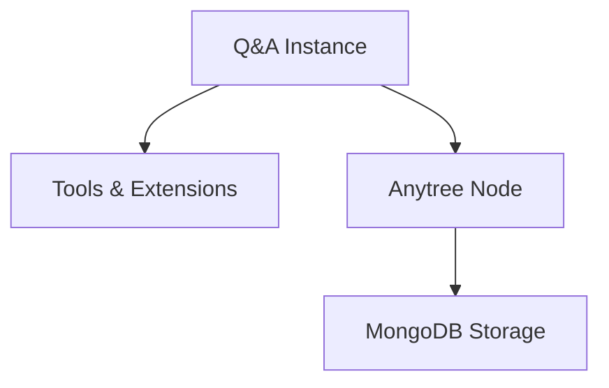

- Each QA instance can reference **tools/extensions** and an **Anytree node**.  
- MongoDB stores all instances, tools, and nodes.  

---

## 2️⃣ Parent-Child Structure

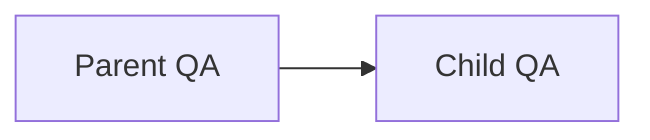

- Every new QA reply is a **child of a previous QA**.  
- Enables **recursive history reconstruction**.  

---

## 3️⃣ Open vs Immutable State

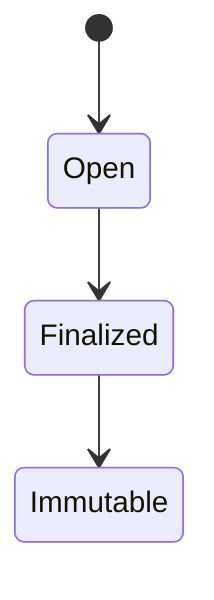

- QA instance **starts open**, feeds active streams.  
- When complete, it becomes **finalized**.  
- Finally, it becomes **immutable** and can only be referenced.  

---

## 4️⃣ GPT Parallel Concept

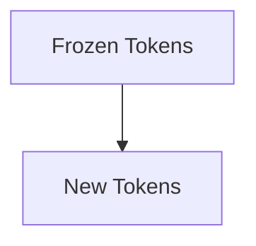

- GPT generates tokens **incrementally**.  
- Older tokens are **frozen**, like finalized QA instances.  
- Parent-child relationship in GPT layers mirrors the **QA tree**.  

---

## 🧠 Key Points

- **Forward-only growth**: Q&A tree and GPT tokens extend without rewriting parents.  
- **Branching**: New child instances or tokens inherit context from parents.  
- **Tools and extensions** follow the **same parent-child hierarchy**.  
- **Immutability** ensures **data integrity** and **deterministic behavior**.  

> This introduction gives a **high-level view** of the system. Subsequent chapters explore **OOP structures, streaming, tools, Anytree, MongoDB, immutability, and GPT token parallels** in detail.

---

**End of Grand Chapter I: Introduction**

# 🧩 Q&A Tree Architecture  
## Instances, Parents, Streaming, Tools, Storage, and GPT Parallels

This diagram set explains a **recursive Q&A system** where:
- each instance is reduced to **Q and A**
- instances form a **parent–child tree**
- streaming answers become immutable nodes
- tools and extensions inherit structurally
- storage mirrors runtime structure
- the whole system parallels **token growth in GPT models**

---

## 1️⃣ Atomic Q&A Instance Model

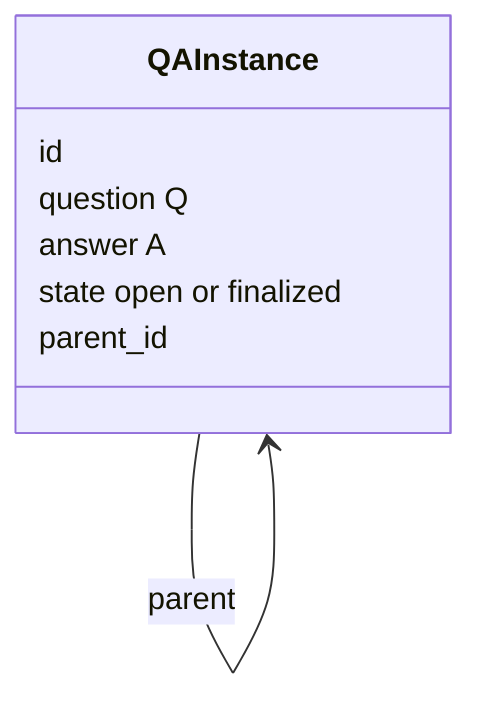

**Key idea**  
The *only semantic commitment* is:
- **Q** = input
- **A** = resolved output

Everything else is structure.

---

## 2️⃣ Conversation as Recursive Parent Chain

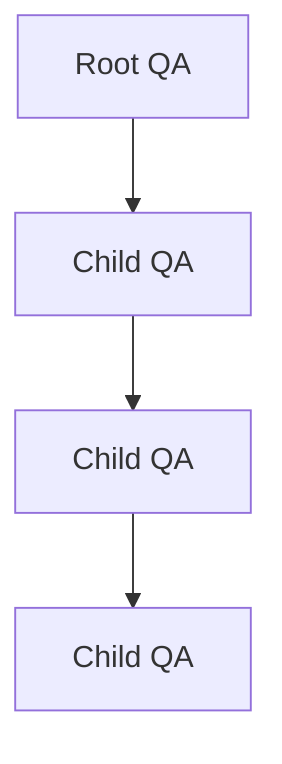

**Recursive walk**
- walking parents reconstructs *full history*
- no transcript is needed
- the tree *is* the memory

---

## 3️⃣ Streaming State → Immutable Card

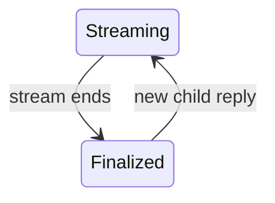

**Behavior**
- while streaming: mutable, shared to all clients
- after completion: immutable QA card
- replies always create **new nodes**

This matches how answers *solidify*.

---

## 4️⃣ Concurrent Streaming to Clients

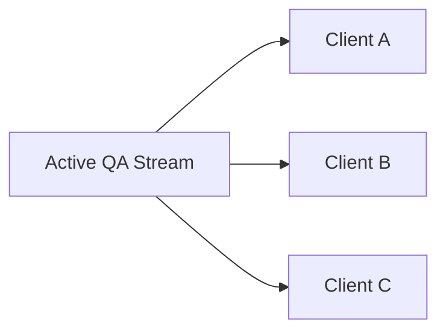

**Important**
- one source of truth
- many observers
- no duplication of state

---

## 5️⃣ Tools and Extensions as Recursive Variable Trees

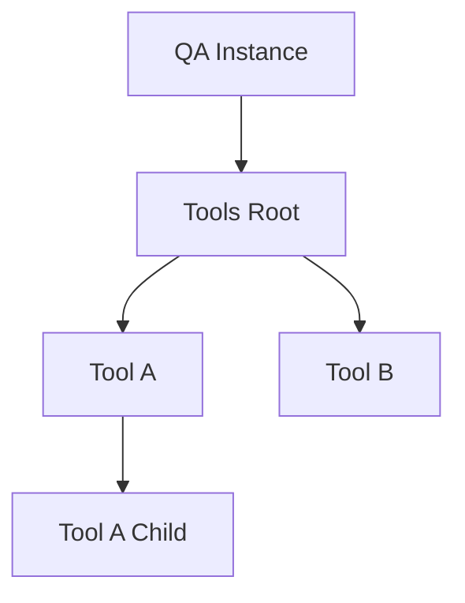

**Rules**
- tools are lists, dicts, items
- innermost nodes are active
- structure is recursive
- behavior lives in the leaves

---

## 6️⃣ Tool Inheritance on Branching

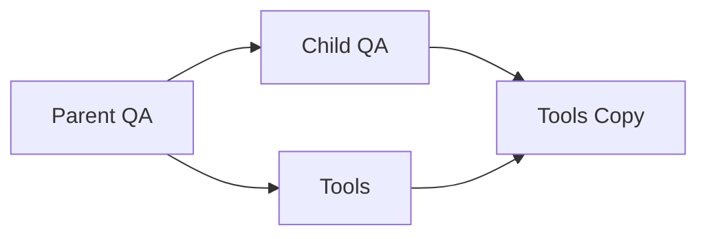

**Mechanism**
- structure is rebuilt, not reused
- each tool has `create_child()`
- removed tools disappear
- new tools propagate forward

This preserves **context without mutation**.

---

## 7️⃣ Anytree Node Association

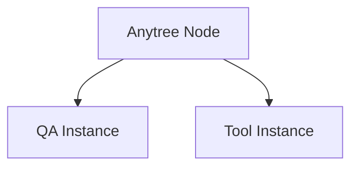

**Invariant**
- `node.instance = obj`
- `obj.node = node`

Tree traversal = object traversal  
Object flow = tree flow

---

## 8️⃣ MongoDB Persistence Model

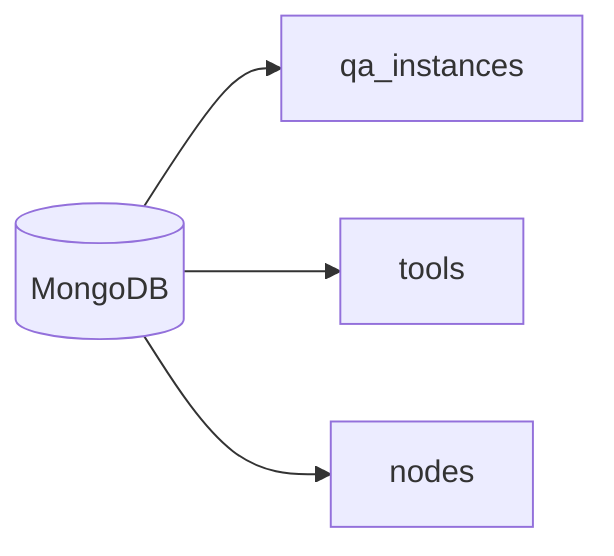

**Stored fields**
- ids and parent_ids
- immutable snapshots
- references by ObjectId
- no overwriting after finalize

Mongo reflects the **tree**, not rows.

---

## 9️⃣ Immutability After Finalization

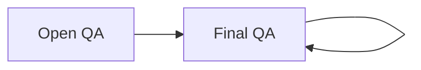

**Constraint**
- finalized means read-only
- children reference parents
- history can grow, never change

This mirrors reasoning integrity.

---

## 🔟 Parallel: GPT Token Growth Analogy

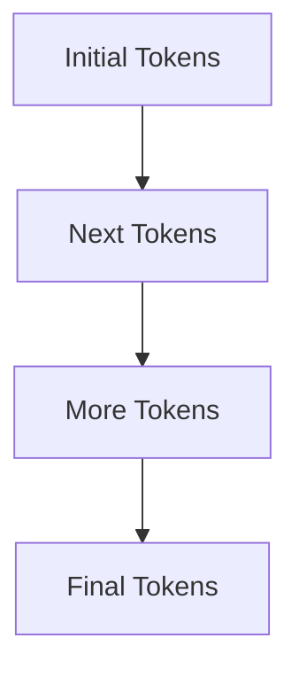

**Parallels**
- earlier tokens condition later ones
- old tokens do not change
- new tokens extend context
- generation is strictly forward

---

## 1️⃣1️⃣ Structural Alignment: QA Tree vs GPT Tokens

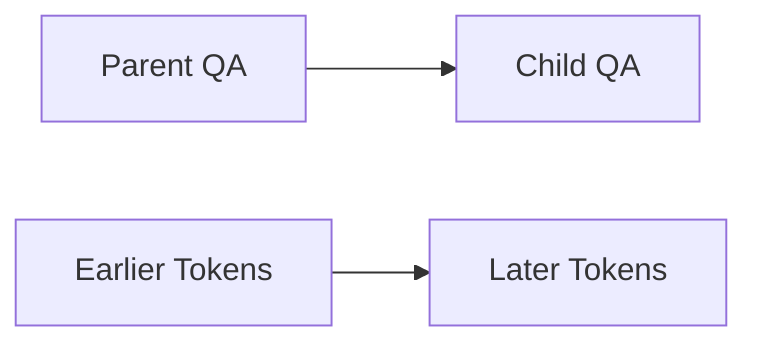

**Insight**
- QA parent = token prefix
- QA child = continuation
- both rely on immutable past
- both grow by constrained extension

---

## 🧠 Final Synthesis

This architecture is:
- **explainable**
- **immutable**
- **branchable**
- **AI-aligned**

A Q&A tree is not just storage —  
it is a **symbolic mirror of how language models think**.

# 🧱 Grand Chapter: The Q&A Atom  
## Final Simplification of Knowledge and Dialogue

This chapter defines the **irreducible unit** of the system.

Everything else — trees, tools, streaming, storage, AI parallels —  
**exists only to support this unit**.

---

## 1️⃣ The Fundamental Assumption

We intentionally reduce all interaction to:

- **Q** — a question, prompt, or intent
- **A** — an answer, response, or resolution

Nothing else is required for meaning.

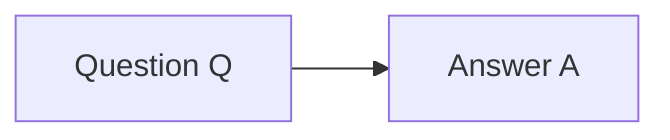

This pair is the **final semantic commitment**.

---

## 2️⃣ The Q&A Instance as an Atomic Object

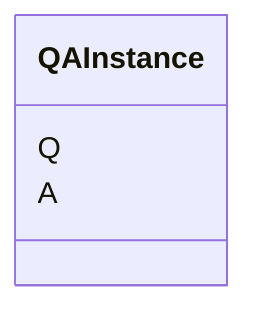

**Properties**
- No timestamps required
- No metadata required
- No session required
- Identity emerges from structure, not decoration

This is **intentional minimalism**.

---

## 3️⃣ Why Q&A Is the Correct Atom

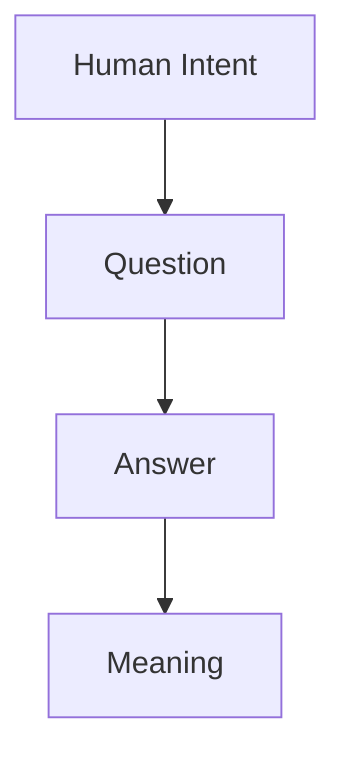

**Explanation**
- Intent becomes expressible as a question
- Meaning becomes testable as an answer
- Anything outside Q and A is *context*, not essence

---

## 4️⃣ Q&A as a Closed Semantic Loop

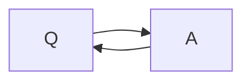

**Interpretation**
- Every answer implies new questions
- Every question anticipates an answer
- This loop is the engine of dialogue and reasoning

The system does not store *conversations* —  
it stores **resolved loops**.

---

## 5️⃣ Q&A Independence from Time and Order

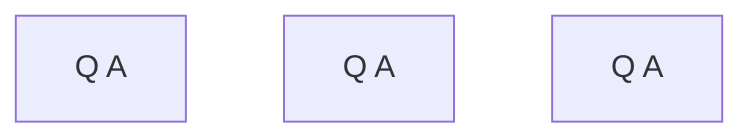

Each instance:
- stands alone
- can be re-ordered
- can be re-contextualized
- can be reused as training data

Order is reconstructed later via parents.

---

## 6️⃣ Q&A as a Compression Boundary

```mermaid
flowchart LR
    RichContext[Rich Context]
    Q[Q]
    A[A]
    Compressed[Compressed Meaning]

    RichContext --> Q
    RichContext --> A
    Q --> Compressed
    A --> Compressed
```

**Key insight**
- Q&A is **lossy by design**
- Loss is what enables generalization
- This mirrors how models learn patterns

---

## 7️⃣ Immutability of a Completed Q&A

```mermaid
flowchart LR
    Open[Open Q A]
    Final[Final Q A]

    Open --> Final
    Final --> Final
```

Once **A is finished**:
- Q and A become immutable
- meaning is frozen
- trust is established

New insight never edits — it **branches**.

---

## 8️⃣ Q&A as the Basis for Trees, Tools, and AI

```mermaid
flowchart TB
    QA[Q A]
    Tree[Conversation Tree]
    Tools[Tools and Extensions]
    Storage[Persistence]
    Model[AI Training]

    QA --> Tree
    QA --> Tools
    QA --> Storage
    QA --> Model
```

Everything else is **secondary**

# 🌳 Grand Chapter II: Parent–Child OOP Model  
## Building Recursive Structure from Q&A Instances

This chapter explains **how atomic Q&A instances become structure**  
by introducing **parent references** in an object-oriented model.

Nothing new is added to the atom —  
only **relationships**.

---

## 1️⃣ Fundamental OOP Extension

We extend the Q&A atom with **one reference**:

```mermaid
classDiagram
    class QAInstance {
        Q
        A
        parent
    }

    QAInstance --> QAInstance : parent
```

**Key rule**  
Each instance knows:
- what it answers
- *where it came from*

---

## 2️⃣ Parent as Structural Memory

```mermaid
flowchart TB
    Root[Root QA]
    Child1[Child QA]
    Child2[Child QA]

    Root --> Child1
    Child1 --> Child2
```

There is:
- no global transcript
- no session object
- no conversation log

**Memory is encoded in references.**

---

## 3️⃣ Recursive History Reconstruction

```mermaid
flowchart LR
    Current[Current QA]
    Parent[Parent QA]
    Grand[Grandparent QA]
    Root[Root QA]

    Current --> Parent
    Parent --> Grand
    Grand --> Root
```

Algorithmic idea:
- start at current instance
- follow `.parent`
- stop at root

History emerges **on demand**.

---

## 4️⃣ Minimal OOP Pseudocode

```python
class QAInstance:
    def __init__(self, Q, A, parent=None):
        self.Q = Q
        self.A = A
        self.parent = parent

    def history(self):
        node = self
        chain = []
        while node:
            chain.append(node)
            node = node.parent
        return list(reversed(chain))
```

**Observations**
- no external storage required
- recursion is natural
- ordering is implicit

---

## 5️⃣ Parent as Context, Not Container

```mermaid
flowchart LR
    Parent[Parent QA]
    Context[Context]
    Child[Child QA]

    Parent --> Context
    Context --> Child
```

Important distinction:
- parent does **not contain** child
- child **refers** to parent
- structure flows upward

This avoids circular ownership.

---

## 6️⃣ Branching Without Mutation

```mermaid
flowchart TB
    Parent[Parent QA]
    ChildA[Child QA A]
    ChildB[Child QA B]

    Parent --> ChildA
    Parent --> ChildB
```

**Rules**
- parent is immutable
- children diverge
- multiple futures coexist

This is **structural branching**, not versioning.

---

## 7️⃣ Root Nodes and Origin

```mermaid
flowchart TB
    Root[Root QA]
```

Root instances:
- have no parent
- represent initial intent
- anchor the tree

Every tree has **at least one root**.

---

## 8️⃣ Why This Model Scales

```mermaid
flowchart LR
    Instance[QA Instance]
    Tree[Tree]
    Graph[Graph]
    Storage[Persistence]

    Instance --> Tree
    Tree --> Graph
    Graph --> Storage
```

Because:
- local reasoning is simple
- global structure is emergent
- storage maps cleanly to references

---

## 9️⃣ Parallel to Human Thought

```mermaid
flowchart LR
    Thought[Thought]
    Memory[Previous Thought]
    NewThought[New Thought]

    Memory --> Thought
    Thought --> NewThought
```

Humans do not replay entire history —  
they reference **what came before**.

This model does the same.

---

## 🧠 Closure

By adding **exactly one pointer**:
- the Q&A atom becomes structural
- conversations become trees
- history becomes reconstructible
- immutability becomes possible

> Structure is not stored.  
> **Structure is implied.**

---

**End of Grand Chapter II: Parent–Child OOP Model**

# 🔁 Grand Chapter III: Recursive Parent Walking  
## Rebuilding Conversation History from Instances

This chapter explains **how history is not stored, but rebuilt**  
by recursively walking parent references.

No logs.  
No transcripts.  
Only structure.

---

## 1️⃣ The Core Mechanism

Each instance holds a reference to its parent.

History is recovered by **walking upward**.

```mermaid
flowchart TB
    Root[Root QA]
    C1[Child QA]
    C2[Child QA]
    C3[Current QA]

    Root --> C1
    C1 --> C2
    C2 --> C3
```

Starting point:
- the current node
- not the root

---

## 2️⃣ Recursive Walk Concept

```mermaid
flowchart LR
    Current[Current QA]
    Parent[Parent QA]
    Grand[Grandparent QA]
    Root[Root QA]

    Current --> Parent
    Parent --> Grand
    Grand --> Root
```

Algorithm:
1. take current instance
2. follow `.parent`
3. repeat until `None`

---

## 3️⃣ Minimal Recursive Pseudocode

```python
def walk_parents(node, chain=None):
    if chain is None:
        chain = []
    if node is None:
        return chain
    chain.append(node)
    return walk_parents(node.parent, chain)
```

To restore order:

```python
history = list(reversed(walk_parents(current)))
```

**Important**
- recursion mirrors structure
- stack depth equals conversation depth

---

## 4️⃣ Iterative Equivalent (Stack Safe)

```python
def history(node):
    chain = []
    while node:
        chain.append(node)
        node = node.parent
    return list(reversed(chain))
```

Both approaches produce the same result.

---

## 5️⃣ History as a Derived View

```mermaid
flowchart LR
    Structure[Parent Links]
    Walk[Recursive Walk]
    History[Conversation History]

    Structure --> Walk
    Walk --> History
```

**Key insight**
- history is *not persisted*
- history is *computed*
- structure is the source of truth

---

## 6️⃣ Selective History Reconstruction

```mermaid
flowchart TB
    Root[Root QA]
    A[Branch A]
    B[Branch B]
    C[Current QA]

    Root --> A
    Root --> B
    B --> C
```

Walking parents of `C` yields:
- Root
- Branch B
- Current

Branch A is ignored — by design.

---

## 7️⃣ Cost and Complexity

```mermaid
flowchart LR
    Depth[Tree Depth]
    WalkCost[Walk Cost]
    HistorySize[History Size]

    Depth --> WalkCost
    WalkCost --> HistorySize
```

Complexity:
- time: O(depth)
- space: O(depth)
- no global scan required

This scales naturally.

---

## 8️⃣ Caching Without Corruption

```mermaid
flowchart LR
    History[Computed History]
    Cache[Optional Cache]
    View[Client View]

    History --> Cache
    Cache --> View
```

Rules:
- cache is disposable
- parent links remain canonical
- cache never mutates structure

---

## 9️⃣ Parallel to Reasoning and Memory

```mermaid
flowchart LR
    Thought[Current Thought]
    Recall[Recall Previous]
    Context[Context Built]

    Thought --> Recall
    Recall --> Context
```

Humans:
- do not replay everything
- recall what matters
- build context on demand

This system behaves the same way.

---

## 🧠 Closure

Recursive parent walking means:

- history is implicit
- memory is structural
- reconstruction is deterministic
- branching is natural

> We do not store conversations.  
> **We walk them.**

---

**End of Grand Chapter III: Recursive Parent Walking**

# 🌊 Grand Chapter IV: Open State, Streaming, and Finalization  
## From Live Answer Flow to Immutable Q&A Cards

This chapter explains **how answers are born**:

- first as **open, streaming state**
- then as **finalized, immutable Q&A cards**
- which may themselves become parents of new replies

This is the bridge between **process** and **structure**.

---

## 1️⃣ Open vs Finalized State

Each Q&A instance has a **state**.

```mermaid
stateDiagram-v2
    Open: open
    Final: finalized

    Open --> Final: stream completed
```

**Meaning**
- `open` → answer is still forming
- `finalized` → answer is complete and frozen

---

## 2️⃣ Streaming as a First-Class Phase

```mermaid
flowchart LR
    Model[Answer Generator]
    Stream[Open QA Instance]
    Tokens[Partial Answer]

    Model --> Tokens
    Tokens --> Stream
```

During this phase:
- A grows incrementally
- Q is already fixed
- meaning is still unfolding

---

## 3️⃣ Concurrent Streaming to Multiple Clients

```mermaid
flowchart TB
    Stream[Open QA]
    C1[Client One]
    C2[Client Two]
    C3[Client Three]

    Stream --> C1
    Stream --> C2
    Stream --> C3
```

**Invariant**
- one stream
- many observers
- identical partial state

This prevents divergence.

---

## 4️⃣ Streaming Update Loop (Conceptual Code)

```python
class QAInstance:
    def __init__(self, Q, parent=None):
        self.Q = Q
        self.A = ""
        self.parent = parent
        self.state = "open"

    def append_token(self, token):
        if self.state != "open":
            raise RuntimeError("Cannot modify finalized answer")
        self.A += token

    def finalize(self):
        self.state = "finalized"
```

**Rule**
- only open instances accept tokens
- finalization is one-way

---

## 5️⃣ Transition to Immutable Card

```mermaid
flowchart LR
    Open[Open QA]
    Frozen[Final QA Card]

    Open --> Frozen
```

After finalization:
- no more tokens
- no edits
- no rewrites

The answer becomes **authoritative**.

---

## 6️⃣ Reply Nodes as New Open Instances

```mermaid
flowchart TB
    Parent[Final QA]
    Reply1[Open Reply QA]
    Reply2[Open Reply QA]

    Parent --> Reply1
    Parent --> Reply2
```

**Key principle**
- replies never modify parents
- replies reference parents
- dialogue continues by branching

---

## 7️⃣ One Active Stream per Node

```mermaid
flowchart LR
    QA[QA Instance]
    Stream[Active Stream]

    QA --> Stream
```

Constraints:
- at most one active stream per QA instance
- multiple children allowed
- state isolation is preserved

---

## 8️⃣ Visibility and Synchronization

```mermaid
flowchart LR
    Stream[Open Stream]
    Snapshot[Partial Snapshot]
    Clients[Clients]

    Stream --> Snapshot
    Snapshot --> Clients
```

Clients:
- subscribe to snapshots
- never mutate state
- only observe progression

---

## 9️⃣ Parallel to Model Generation

```mermaid
flowchart TB
    Prompt[Prompt Tokens]
    Gen[Generated Tokens]
    Final[Final Output]

    Prompt --> Gen
    Gen --> Final
```

**Alignment**
- generation is forward-only
- tokens accumulate
- final output becomes immutable

The QA lifecycle mirrors the model’s own behavior.

---

## 🧠 Closure

Streaming introduces **time** into structure:

- open state allows growth
- finalization freezes meaning
- replies restart the cycle
- the tree grows forward, never backward

> Knowledge is not written all at once.  
> **It streams, then solidifies.**

---

**End of Grand Chapter IV: Open State, Streaming, and Finalization**

# 🧰 Grand Chapter V: Tools and Extensions as Recursive Variable Structures  
## Context Inheritance Without Mutation

This chapter explains how **tools and extensions live alongside Q&A instances**  
as **active variable structures**, and how they:

- remain flexible in shape
- propagate through branches
- preserve parent relationships
- avoid shared mutable state

This is the **context layer** of the system.

---

## 1️⃣ Tools as Variable Structures

Tools and extensions are not fixed schemas.

They may appear as:
- lists
- dictionaries
- items
- nested combinations of the above

```mermaid
flowchart TB
    Tools[Tools Root]
    L[List]
    D[Dict]
    I[Item]

    Tools --> L
    Tools --> D
    Tools --> I
```

**Principle**
- structure is *nearly free*
- behavior is defined at leaves

---

## 2️⃣ Active Elements Are Innermost Children

```mermaid
flowchart TB
    Tools[Tools]
    Group[Group]
    Sub[Subgroup]
    Active[Active Tool]

    Tools --> Group
    Group --> Sub
    Sub --> Active
```

Only the **innermost nodes**:
- execute logic
- hold state
- interact with the Q&A process

Outer nodes are structural.

---

## 3️⃣ Recursive Self-Similarity

```mermaid
flowchart LR
    Tool[Tool Node]
    Child[Child Tool Node]

    Tool --> Child
```

Every tool node may itself contain:
- tools
- extensions
- variable structures of the same kind

This enables **infinite depth** without special cases.

---

## 4️⃣ Association with Q&A Instances

```mermaid
flowchart TB
    QA[QA Instance]
    Tools[Tools Structure]

    QA --> Tools
```

Each Q&A instance:
- owns its *own* tool structure
- never mutates its parent’s tools
- becomes the new root for context

---

## 5️⃣ Branching: Rebuilding Tools for a New Leaf

```mermaid
flowchart LR
    ParentQA[Parent QA]
    ChildQA[Child QA]

    ParentTools[Tools]
    ChildTools[Rebuilt Tools]

    ParentQA --> ParentTools
    ParentQA --> ChildQA
    ChildQA --> ChildTools

    ParentTools --> ChildTools
```

**Critical rule**
- tools are **rebuilt**, not reused
- structure is copied
- references are re-linked

This prevents shared mutable context.

---

## 6️⃣ Parent-Position Preservation

```mermaid
flowchart TB
    PT[Parent Tool]
    CT[Child Tool]

    PT --> CT
```

For every rebuilt tool:
- it is placed in the **same structural position**
- it receives a reference to its **parent tool**
- it can call `create_child()` on itself

Structure and lineage are preserved.

---

## 7️⃣ Tool Initializers and Child Creation

```mermaid
flowchart LR
    Tool[Tool Instance]
    Init[Initializer]
    Child[Child Tool Instance]

    Tool --> Init
    Init --> Child
```

Conceptually:
- each tool knows how to clone itself
- cloning preserves parent reference
- local state may reset or adapt

---

## 8️⃣ Removing and Adding Tools

```mermaid
flowchart TB
    ParentTools[Parent Tools]
    ChildTools[Child Tools]

    ParentTools --> ChildTools
```

Rules:
- tools removed at a node do not propagate
- tools added at a node continue to children
- absence is respected as much as presence

This gives **explicit control over context evolution**.

---

## 9️⃣ Parallel with Q&A Parent–Child Logic

```mermaid
flowchart LR
    QAParent[Parent QA]
    QAChild[Child QA]

    ToolParent[Parent Tool]
    ToolChild[Child Tool]

    QAParent --> QAChild
    ToolParent --> ToolChild
```

**Insight**
- tools mirror Q&A structure
- both follow parent references
- both avoid backward mutation
- both grow by branching

---

## 🧠 Closure

Tools and extensions are:

- **context, not configuration**
- **trees, not globals**
- **rebuilt, not shared**
- **alive only at the leaves**

> Context flows forward  
> without ever rewriting the past.

This allows complex behavior  
with simple, explainable rules.

---

**End of Grand Chapter V: Tools and Extensions as Recursive Variable Structures**

# 🌲 Grand Chapter VI: Anytree Coordination and Node Duality  
## Observing and Structuring Instances as Nodes

This chapter explains how **every instance, tool, or extension**  
is associated with an **Anytree node**, enabling:

- structural observation
- recursive traversal
- dual references (instance ↔ node)
- complete lifecycle monitoring

---

## 1️⃣ Core Principle: Dual Registration

```mermaid
flowchart LR
    Instance[QA / Tool / Extension Instance]
    Node[Anytree Node]

    Instance --> Node
    Node --> Instance
```

**Rule**
- `instance.node = Node`
- `Node.instance = instance`
- bidirectional references allow navigation **both ways**

---

## 2️⃣ Nodes as Structural Observers

```mermaid
flowchart TB
    RootNode[Root Node]
    ChildNode1[Child Node 1]
    ChildNode2[Child Node 2]

    RootNode --> ChildNode1
    RootNode --> ChildNode2
```

**Properties**
- track child nodes
- maintain hierarchy
- mirror Q&A tree and tool structures
- can register streaming or finalized state

---

## 3️⃣ Instances ↔ Node Mirroring

```mermaid
flowchart LR
    Instance[QA Instance]
    Node[Tree Node]
    Tools[Tools / Extensions]

    Instance --> Node
    Node --> Instance
    Instance --> Tools
    Tools --> Node
```

**Insight**
- Q&A instance knows its tools/extensions
- Node tracks **full subtree**
- Tools/extensions also get their own nodes

---

## 4️⃣ Watching Flow Through Nodes

```mermaid
flowchart TB
    OpenQA[Open QA Node]
    Token[Generated Token]
    Stream[Client Stream]

    OpenQA --> Token
    Token --> Stream
```

**Mechanics**
- node receives events from its instance
- observes open stream
- streams propagate to clients
- finalization is reflected in the node

---

## 5️⃣ Node Creation on Branching

```mermaid
flowchart LR
    ParentNode[Parent Node]
    ChildNode[Child Node]

    ParentNode --> ChildNode
```

**Rules**
- child nodes are created when Q&A or tool branches
- parent-node reference preserved
- instance ↔ node duality maintained

---

## 6️⃣ Recursive Traversal with Anytree

```mermaid
flowchart TB
    CurrentNode[Current Node]
    ParentNode[Parent Node]
    RootNode[Root Node]

    CurrentNode --> ParentNode
    ParentNode --> RootNode
```

**Purpose**
- reconstruct Q&A history
- traverse tool/extension subtrees
- monitor active streams
- compute context for new leaves

---

## 7️⃣ Integration with Tools and Extensions

```mermaid
flowchart LR
    ToolInstance[Tool / Extension]
    ToolNode[Tool Node]
    QAInstance[QA Instance]
    QANode[QA Node]

    ToolInstance --> ToolNode
    QAInstance --> QANode
    QANode --> ToolNode
```

**Insight**
- tools follow their parent QA node
- child QA nodes rebuild tools
- nodes provide **structural awareness**

---

## 8️⃣ Node as Universal Observer

```mermaid
flowchart TB
    Node[Node]
    Event[Stream / Finalize / Branch]
    Observer[Monitoring Logic]

    Node --> Event
    Event --> Observer
```

- All nodes report changes  
- Observers see streaming updates  
- Finalization is broadcast  

Nodes act as **central watchpoints**.

---

## 9️⃣ Closure

Anytree provides **the nervous system** of the structure:

- every instance has a node  
- nodes know their children and parent  
- bidirectional reference enables reconstruction  
- streaming, tools, and branching integrate seamlessly

> The system becomes fully **observable, navigable, and auditable**  
> without breaking immutability or branching rules.

---

**End of Grand Chapter VI: Anytree Coordination and Node Duality**

# 💾 Grand Chapter VII: MongoDB Persistence of Instances, Tools, Extensions, and Nodes  
## Storing, Linking, and Following Constraints

This chapter explains how **all components of the system** — Q&A instances, tools/extensions, and Anytree nodes — can be persisted in MongoDB while:

- preserving parent-child relationships  
- maintaining immutability after finalization  
- enabling branching and reconstruction  
- allowing tools/extensions to reference parent structures  

---

## 1️⃣ Core Document Structure

Each Q&A instance becomes a **MongoDB document**:

```mermaid
erDiagram
    QAInstance {
        ObjectId _id PK
        string Q
        string A
        ObjectId parent_id FK
        string state
        ObjectId node_id FK
    }

    Node {
        ObjectId _id PK
        ObjectId instance_id FK
        list children_ids
        string node_type
    }

    Tools {
        ObjectId _id PK
        ObjectId parent_id FK
        list children_ids
        dict attributes
    }
```

**Explanation**
- `_id` → unique identifier  
- `parent_id` → parent QA or tool reference  
- `node_id` → link to Anytree node  
- `children_ids` → for fast traversal  
- `attributes` → dynamic tool state  

---

## 2️⃣ Parent-Child Representation

```mermaid
flowchart TB
    RootDoc[Root QA Document]
    ChildDoc[Child QA Document]
    NodeRoot[Root Node]
    NodeChild[Child Node]

    RootDoc --> ChildDoc
    RootDoc --> NodeRoot
    ChildDoc --> NodeChild
    NodeRoot --> NodeChild
```

**Key rules**
- each child keeps **parent reference**  
- node mirrors instance  
- branching is naturally supported  

---

## 3️⃣ Tools/Extensions Storage

```mermaid
flowchart LR
    QA[QA Instance Doc]
    ToolRoot[Tools Root Doc]
    ToolChild[Tool Child Doc]

    QA --> ToolRoot
    ToolRoot --> ToolChild
```

**Principles**
- tools are stored as separate documents  
- parent references preserved  
- new tools added to children are separate documents  

---

## 4️⃣ Streaming and State

```mermaid
flowchart TB
    OpenQA[QA Document: state=open]
    Tokens[Partial Answer]
    FinalQA[QA Document: state=finalized]

    OpenQA --> Tokens
    Tokens --> FinalQA
```

MongoDB fields:
```json
{
    "_id": "...",
    "Q": "...",
    "A": "...",
    "state": "open|finalized",
    "parent_id": "...",
    "node_id": "..."
}
```

- state field enforces **immutability after finalization**  
- tokens can be appended only when `state=open`  

---

## 5️⃣ Anytree Node Linking

```mermaid
flowchart LR
    NodeDoc[Node Document]
    InstanceDoc[QA / Tool / Extension Doc]
    ChildNode[Child Node Document]

    NodeDoc --> InstanceDoc
    NodeDoc --> ChildNode
    InstanceDoc --> NodeDoc
```

- Node documents store `children_ids`  
- Each instance keeps `node_id`  
- Enables **bidirectional navigation**  

---

## 6️⃣ Branching and Tool Reconstruction

```mermaid
flowchart TB
    ParentQA[Parent QA Document]
    ChildQA[Child QA Document]
    ParentTools[Parent Tools Document]
    ChildTools[Child Tools Document]

    ParentQA --> ChildQA
    ParentTools --> ChildTools
    ChildQA --> ChildTools
```

**Behavior**
- Child tools rebuilt as new documents  
- Parent references maintained  
- Removed tools are excluded  
- Newly added tools are stored independently  

---

## 7️⃣ Recursive Queries

**Example: retrieve full history of a QA instance**

```python
from pymongo import MongoClient

def get_history(collection, current_id):
    history = []
    node = collection.find_one({"_id": current_id})
    while node:
        history.append(node)
        parent_id = node.get("parent_id")
        if not parent_id:
            break
        node = collection.find_one({"_id": parent_id})
    return list(reversed(history))
```

- Traverses parent chain  
- Reconstructs history **on-demand**  
- No global scan needed  

---

## 8️⃣ Immutable Enforcement in MongoDB

```python
def append_answer(collection, doc_id, token):
    doc = collection.find_one({"_id": doc_id})
    if doc["state"] != "open":
        raise RuntimeError("Cannot modify finalized document")
    collection.update_one({"_id": doc_id}, {"$push": {"A": token}})
```

- State field ensures **write-once after finalization**  
- Guarantees integrity of historical answers  

---

## 9️⃣ Full System Integration

```mermaid
flowchart TB
    QA[QA Document]
    Tools[Tools Document]
    Node[Node Document]
    Children[Child Docs]

    QA --> Tools
    QA --> Node
    Node --> Children
    Tools --> Children
```

- Each layer is **documented**  
- Branches maintain parent references  
- Nodes monitor and track flow  
- Tools/extensions preserve parent-child lineage  

---

## 🧠 Closure

MongoDB persistence allows the system to:

- store Q&A instances, tools, extensions, and nodes  
- enforce immutability after finalization  
- maintain full parent-child and node-instance references  
- reconstruct conversation history and context on demand  
- handle branching, streaming, and tool reconstruction  

> The database is the **durable backbone** of the system  
> while the structure remains fully navigable and auditable.

---

**End of Grand Chapter VII: MongoDB Persistence of Instances, Tools, Extensions, and Nodes**

# ❄️ Grand Chapter VIII: Immutability and AI Parallel  
## From Finalized Q&A Cards to AI Token Freezing

This chapter explains **how every element becomes immutable** after completion, and how this reflects **AI token and layer growth**:

- Q&A instances, tools, and nodes become frozen  
- Immutable objects can still be referenced  
- Parallel with GPT token growth: layers are built, then frozen  
- Structure ensures forward-only growth  

---

## 1️⃣ Open vs Immutable State

### 1️⃣ Open vs Immutable State (Fixed)

```mermaid
stateDiagram-v2
    [*] --> Open
    Open --> Finalized
    Finalized --> Immutable
```

- Open → live, streaming, mutable  
- Finalized → answer completed  
- Immutable → cannot be modified, only referenced  

---

## 2️⃣ Immutability in Code

```python
class QAInstance:
    def __init__(self, Q, parent=None):
        self.Q = Q
        self.A = ""
        self.state = "open"
        self.parent = parent

    def append_token(self, token):
        if self.state != "open":
            raise RuntimeError("Cannot modify immutable QA")
        self.A += token

    def finalize(self):
        self.state = "finalized"
        # Once finalized, object becomes logically immutable
```

- After `finalize()`, the answer cannot be modified  
- Supports consistent branching and observation  

---

## 3️⃣ Immutable Nodes

```mermaid
flowchart TB
    NodeOpen[Node: Open]
    NodeFinal[Node: Finalized]
    NodeImmutable[Node: Immutable]

    NodeOpen --> NodeFinal --> NodeImmutable
```

- Node mirrors instance state  
- Observers can read, but **cannot write**  
- Streams terminate at finalization  

---

## 4️⃣ Tool and Extension Freezing

```mermaid
flowchart LR
    ParentTool[Parent Tool]
    ChildTool[Child Tool]

    ParentTool --> ChildTool
    ChildTool --> FrozenTool[Frozen Tool]
```

- Tools follow **same immutability rules**  
- Children rebuild structure from parent references  
- Added tools appear only in new child branches  

---

## 5️⃣ MongoDB Enforcement

```python
def append_answer(collection, doc_id, token):
    doc = collection.find_one({"_id": doc_id})
    if doc["state"] != "open":
        raise RuntimeError("Cannot modify finalized document")
    collection.update_one({"_id": doc_id}, {"$push": {"A": token}})
```

- MongoDB documents enforce **write-once rules**  
- Immutable documents ensure **historical correctness**  
- Aligns with AI **forward-only growth**  

---

## 6️⃣ Parallel with GPT Tokens

```mermaid
flowchart TB
    Layer1[Layer 1 Tokens]
    Layer2[Layer 2 Tokens]
    Layer3[Layer 3 Tokens]
    Final[Final Output]

    Layer1 --> Layer2 --> Layer3 --> Final
```

- Tokens generated **incrementally**  
- Older tokens **cannot be modified**  
- Layers represent **parent-child growth**  
- Final output = frozen answer  

---

## 7️⃣ Structural Parallel

```mermaid
flowchart LR
    QAParent[Finalized QA]
    QAChild[New Reply QA]

    TokenParent[Frozen Token Layer]
    TokenChild[New Token Layer]

    QAParent --> QAChild
    TokenParent --> TokenChild
```

- Parent QA → frozen instance  
- Parent tokens → frozen layers  
- Children build forward, preserving history  
- Observers may read frozen state but **cannot change it**  

---

## 8️⃣ Benefits of Immutability

```mermaid
flowchart TB
    Integrity[Data Integrity]
    Observability[Full Trace]
    Reproducibility[Deterministic History]
    Parallel[Concurrent Access]

    Integrity --> Observability
    Observability --> Reproducibility
    Reproducibility --> Parallel
```

- Guarantees correct branching  
- Supports multiple observers/clients  
- Aligns with AI forward-only generation  
- Avoids conflicts and corruption  

---

## 🧠 Closure

Immutability is **the structural backbone of both Q&A and AI token behavior**:

- **Q&A instances** → frozen after answer completes  
- **Tools/Extensions** → rebuild for child branches, parent remains immutable  
- **Nodes** → reflect finalized state for observation  
- **GPT tokens/layers** → grow forward, older tokens frozen  

> Forward-only growth + immutability = safety, consistency, reproducibility  
> The AI system is mirrored in the Q&A tree itself.

---

**End of Grand Chapter VIII: Immutability and AI Parallel**

# 🤖 Grand Chapter IX: GPT Token Growth as a Structural Parallel  
## Parent-Child Alignment Between Q&A Tree and GPT Layers

This chapter explains how **GPT token generation mirrors the parent-child architecture** of Q&A instances and tools:

- new tokens are **incrementally added**
- each token references its **contextual parent**
- layers of tokens behave like **branching Q&A nodes**
- old tokens/layers are **immutable**, ensuring deterministic growth  

---

## 1️⃣ Token Generation Pipeline

```mermaid
flowchart TB
    Layer1[Layer 1: Initial Tokens]
    Layer2[Layer 2: Next Tokens]
    Layer3[Layer 3: Next Tokens]
    Output[Final Sequence]

    Layer1 --> Layer2 --> Layer3 --> Output
```

- Each layer depends on **all previous tokens**  
- Tokens generated are **children of previous context**  
- Forward-only: **no retroactive mutation**

---

## 2️⃣ Parent-Child Token Relationship

```mermaid
flowchart LR
    TokenParent[Token i]
    TokenChild[Token i+1]
    TokenGrandchild[Token i+2]

    TokenParent --> TokenChild --> TokenGrandchild
```

- Each new token is **aware of its parent tokens**  
- Mirrors Q&A tree: QA instance → reply → next reply  
- Older tokens become frozen, like **finalized answers**

---

## 3️⃣ Two-Layer Analogy

```mermaid
flowchart TB
    LayerN[Layer N Tokens]
    LayerNplus1[Layer N+1 Tokens]

    LayerN --> LayerNplus1
```

- Conceptually: **parent layer = context**, child layer = new generation  
- Each layer **cannot modify previous layers**  
- Supports **hierarchical reasoning**  

---

## 4️⃣ Parallel with Q&A Parent-Child

```mermaid
flowchart LR
    QAParent[Finalized QA Instance]
    QAChild[New Reply QA]
    TokenParent[Frozen Token Layer]
    TokenChild[New Token Layer]

    QAParent --> QAChild
    TokenParent --> TokenChild
```

- QA instances and GPT layers **share parent-child logic**  
- Finalized QA → immutable parent  
- Frozen token layers → immutable context  

---

## 5️⃣ Branching and Context

```mermaid
flowchart TB
    TokenContext[Token Context]
    TokenOption1[Option 1]
    TokenOption2[Option 2]

    TokenContext --> TokenOption1
    TokenContext --> TokenOption2
```

- Just like QA branching: multiple children can grow from a single parent  
- Each new branch maintains **parent references**  
- Allows **parallel streams of computation or conversation**

---

## 6️⃣ Immutability Reflection

```mermaid
flowchart LR
    OldToken[Token 1..n-1]
    NewToken[Token n]
    Output[Frozen Output]

    OldToken --> NewToken --> Output
```

- Old tokens are **never modified**  
- New tokens **extend the structure**  
- Mirrors QA finalization: once a question/answer is done, it is immutable  

---

## 7️⃣ Tools and Extensions Alignment

```mermaid
flowchart TB
    GPTLayer[Token Layer]
    ToolNode[Tool / Extension Node]
    QANode[QA Node]

    GPTLayer --> ToolNode
    ToolNode --> QANode
```

- GPT layer hierarchy parallels **tool hierarchy**  
- Both follow **parent → child references**  
- Both preserve **immutability at previous nodes/layers**  

---

## 8️⃣ Full Parallel Summary

```mermaid
flowchart TB
    QAParent[Finalized QA]
    QAChild[New QA Reply]
    ToolParent[Parent Tools]
    ToolChild[Child Tools]
    TokenParent[Frozen Tokens]
    TokenChild[New Tokens]

    QAParent --> QAChild
    ToolParent --> ToolChild
    TokenParent --> TokenChild
```

- All three systems: **QA, tools, GPT tokens**  
- Grow forward in **parent-child chains**  
- Older nodes/tokens become immutable  
- Enables **concurrent observation and reconstruction**

---

## 🧠 Closure

The system mirrors GPT architecture:

- **Forward-only growth**: QA trees and GPT tokens extend without rewriting parents  
- **Parent-child linkage**: tokens reference context, QA instances reference parent QA  
- **Immutability**: finalized QAs and frozen tokens enforce history correctness  
- **Branching**: new child nodes/tokens inherit context from parents  

> Understanding GPT token growth helps **explain design decisions** in the Q&A tree system  
> and provides **structural, behavioral, and conceptual alignment** between AI reasoning and your architecture.

---

**End of Grand Chapter IX: GPT Token Growth as a Structural Parallel**

# 🤖 Grand Chapter X: GPT Token Growth as a Structural Parallel  
## Parent-Child Alignment Between Q&A Tree and GPT Layers

This chapter explains how **GPT token generation mirrors the parent-child architecture** of Q&A instances and tools:

- new tokens are **incrementally added**
- each token references its **contextual parent**
- layers of tokens behave like **branching Q&A nodes**
- old tokens/layers are **immutable**, ensuring deterministic growth  

---

## 1️⃣ Token Generation Pipeline

```mermaid
flowchart TB
    Layer1["Layer 1: Initial Tokens"]
    Layer2["Layer 2: Next Tokens"]
    Layer3["Layer 3: Next Tokens"]
    Output["Final Sequence"]

    Layer1 --> Layer2
    Layer2 --> Layer3
    Layer3 --> Output
```

- Each layer depends on **all previous tokens**  
- Tokens generated are **children of previous context**  
- Forward-only: **no retroactive mutation**

---

## 2️⃣ Parent-Child Token Relationship

```mermaid
flowchart LR
    TokenParent["Token i"]
    TokenChild["Token i+1"]
    TokenGrandchild["Token i+2"]

    TokenParent --> TokenChild
    TokenChild --> TokenGrandchild
```

- Each new token is **aware of its parent tokens**  
- Mirrors Q&A tree: QA instance → reply → next reply  
- Older tokens become frozen, like **finalized answers**

---

## 3️⃣ Two-Layer Analogy

```mermaid
flowchart TB
    LayerN["Layer N Tokens"]
    LayerNplus1["Layer N+1 Tokens"]

    LayerN --> LayerNplus1
```

- Conceptually: **parent layer = context**, child layer = new generation  
- Each layer **cannot modify previous layers**  
- Supports **hierarchical reasoning**  

---

## 4️⃣ Parallel with Q&A Parent-Child

```mermaid
flowchart LR
    QAParent["Finalized QA Instance"]
    QAChild["New Reply QA"]
    TokenParent["Frozen Token Layer"]
    TokenChild["New Token Layer"]

    QAParent --> QAChild
    TokenParent --> TokenChild
```

- QA instances and GPT layers **share parent-child logic**  
- Finalized QA → immutable parent  
- Frozen token layers → immutable context  

---

## 5️⃣ Branching and Context

```mermaid
flowchart TB
    TokenContext["Token Context"]
    TokenOption1["Option 1"]
    TokenOption2["Option 2"]

    TokenContext --> TokenOption1
    TokenContext --> TokenOption2
```

- Just like QA branching: multiple children can grow from a single parent  
- Each new branch maintains **parent references**  
- Allows **parallel streams of computation or conversation**

---

## 6️⃣ Immutability Reflection

```mermaid
flowchart LR
    OldToken["Token 1..n-1"]
    NewToken["Token n"]
    Output["Frozen Output"]

    OldToken --> NewToken
    NewToken --> Output
```

- Old tokens are **never modified**  
- New tokens **extend the structure**  
- Mirrors QA finalization: once a question/answer is done, it is immutable  

---

## 7️⃣ Tools and Extensions Alignment

```mermaid
flowchart TB
    GPTLayer["Token Layer"]
    ToolNode["Tool / Extension Node"]
    QANode["QA Node"]

    GPTLayer --> ToolNode
    ToolNode --> QANode
```

- GPT layer hierarchy parallels **tool hierarchy**  
- Both follow **parent → child references**  
- Both preserve **immutability at previous nodes/layers**  

---

## 8️⃣ Full Parallel Summary

```mermaid
flowchart TB
    SystemRoot["System Root"]

    QAParent["Finalized QA"]
    QAChild["New QA Reply"]
    ToolParent["Parent Tools"]
    ToolChild["Child Tools"]
    TokenParent["Frozen Tokens"]
    TokenChild["New Tokens"]

    SystemRoot --> QAParent
    SystemRoot --> ToolParent
    SystemRoot --> TokenParent

    QAParent --> QAChild
    ToolParent --> ToolChild
    TokenParent --> TokenChild
```

- All three systems: **QA, tools, GPT tokens**  
- Grow forward in **parent-child chains**  
- Older nodes/tokens become immutable  
- Enables **concurrent observation and reconstruction**

---

## 🧠 Closure

The system mirrors GPT architecture:

- **Forward-only growth**: QA trees and GPT tokens extend without rewriting parents  
- **Parent-child linkage**: tokens reference context, QA instances reference parent QA  
- **Immutability**: finalized QAs and frozen tokens enforce history correctness  
- **Branching**: new child nodes/tokens inherit context from parents  

> Forward-only growth + immutability = safety, consistency, reproducibility  
> Understanding GPT token growth helps **explain design decisions** in the Q&A tree system  
> and provides **structural, behavioral, and conceptual alignment** between AI reasoning and your architecture.

---

**End of Grand Chapter X: GPT Token Growth as a Structural Parallel**
