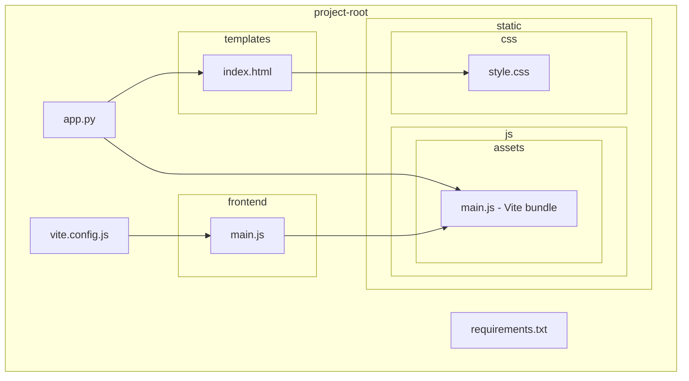
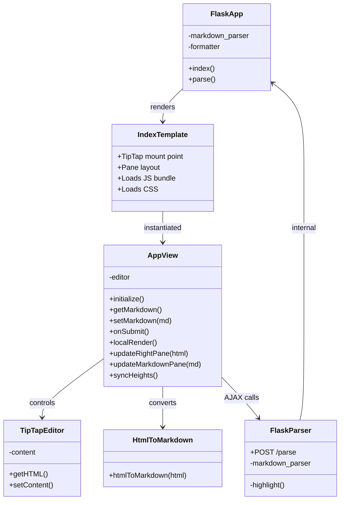
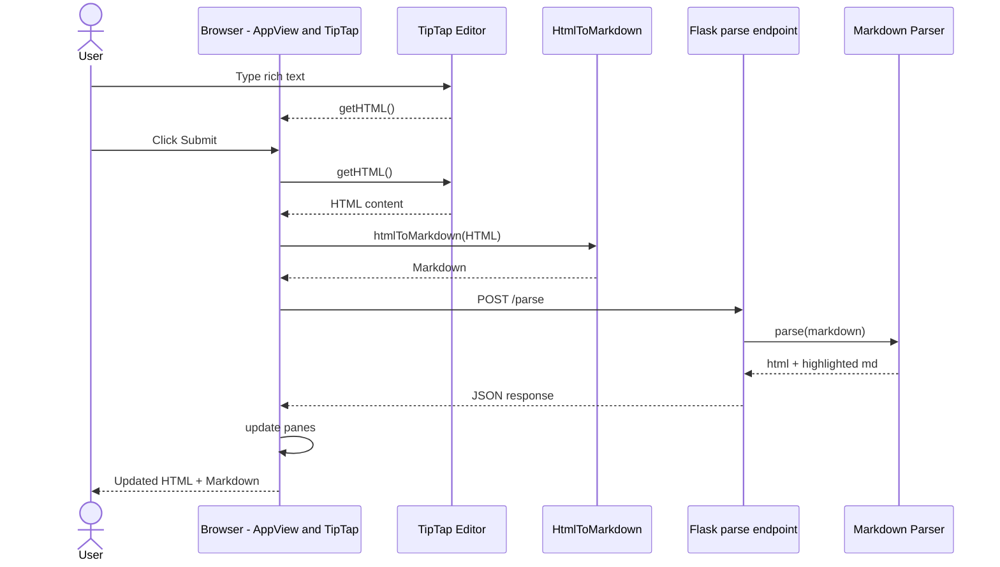
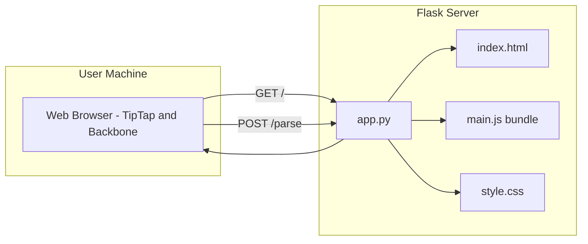
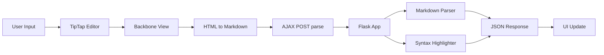
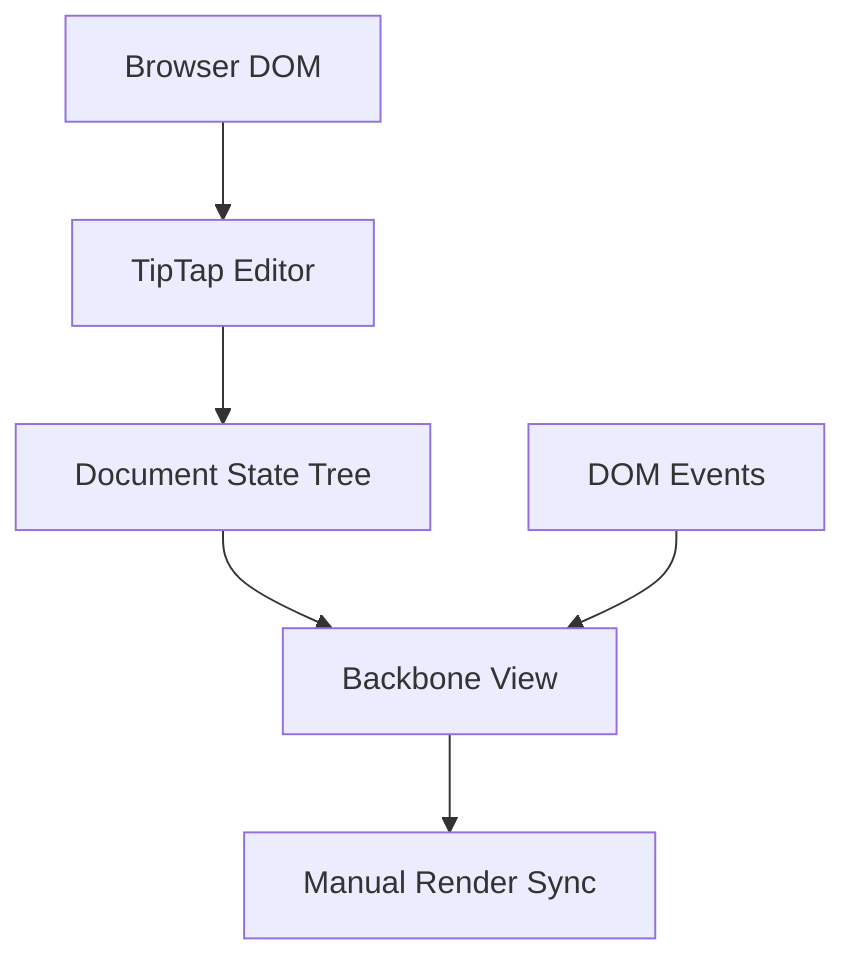
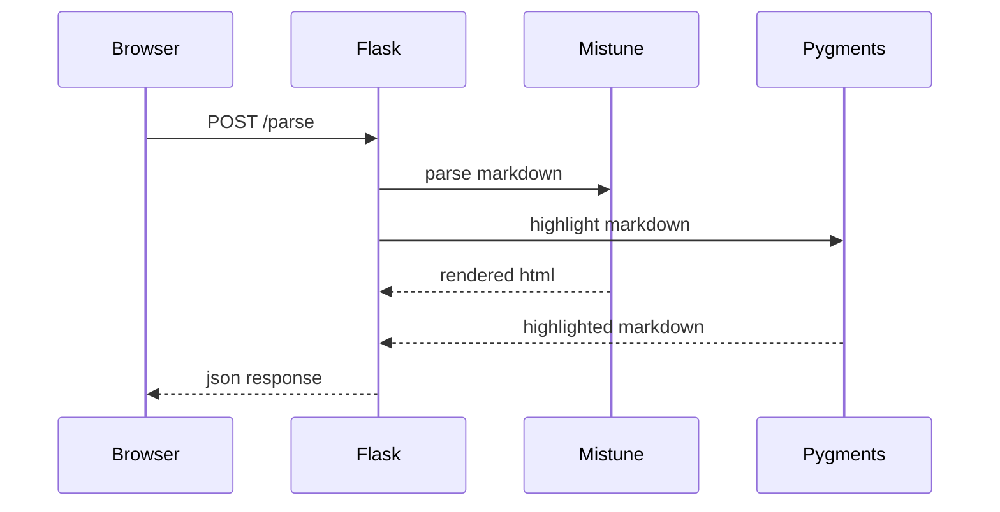
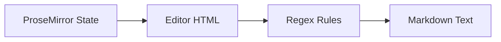
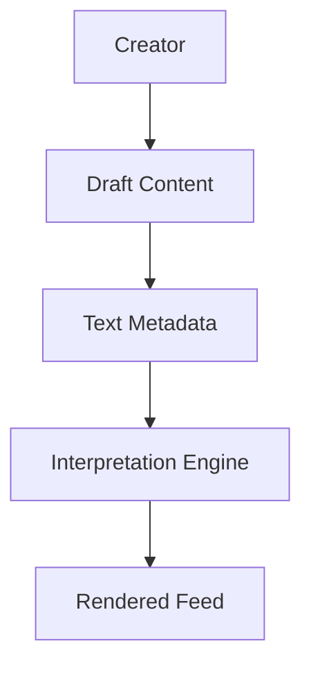
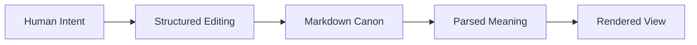

# DIAGRAMS.md — TipTap–Flask Markdown Workbench Architecture & UML

This document provides an architectural overview of the TipTap–Flask Markdown Workbench.  
All diagrams use **Mermaid**, compatible with GitHub’s renderer.

---

# 1. Introduction

## 1.1 Purpose
This document explains the structure, behavior, and intent of the system using diagrams and short narrative explanations.

## 1.2 Audience
- Architects  
- Programmers  
- Frontend engineers  
- Backend engineers  
- Non‑technical readers  

---

# 2. High‑Level Overview

The system is a **browser‑based Markdown workbench** backed by Flask:

- Left pane → TipTap rich‑text editor  
- Right pane → rendered HTML  
- Bottom pane → syntax‑highlighted Markdown  
- Backbone.js view coordinates UI and AJAX  
- Vite bundles frontend into `static/js/assets/main.js`  
- Flask serves UI and parses Markdown  

---

# 3. Project Structure Diagram

### Explanation
A map of the project’s folders and key files.



---

# 4. Core Component Architecture

### Explanation
Shows the main runtime components and how they relate.



---

# 5. Behavioral Diagram

## 5.1 Sequence: Editing → Submitting → Rendering



---

# 6. Deployment Diagram



---

# 7. Summary

## 7.1 What This Architecture Achieves
- Clear separation of frontend and backend  
- Single‑page workbench with synchronized panes  
- Simple deployment  
- Extensible Markdown + HTML pipeline  

## 7.2 Why It Matters
A clean example of integrating TipTap, Backbone, Vite, and Flask into a cohesive editing environment.

---

# End of DIAGRAMS.md

---

# 🧠📐 TipTap–Flask Markdown Workbench  
## System Flow, Internals & Conceptual Model (GitHub-safe Mermaid)

---

## 1️⃣ Whole Process Flow (End-to-End)



---

## 2️⃣ Frontend Cognitive Stack  
### TipTap + Backbone.js



**Critical control point**
```js
events: {
  'click #submit-button': 'onSubmit'
}
```

Backbone is acting as a **manual nervous system**, not a virtual DOM.

---

## 3️⃣ Flask Parsing Pipeline



**Authority boundary**
```python
rendered_html = markdown_parser(markdown_text)
```

Flask decides meaning.  
Frontend only suggests.

---

## 4️⃣ TipTap to Markdown Transformation



**Critical line**
```js
const markdown = htmlToMarkdown(this.editor.getHTML())
```

This step is:
- intentionally lossy
- transparent
- debuggable

---

## 5️⃣ TikTok Analogy  
### Attention and Interpretation Flow



**Mapping**
- TipTap = Draft content
- Markdown = Caption text
- Flask = Interpretation engine
- HTML = Feed output

Same logic, different domain.

---

## 6️⃣ System Philosophy



> Markdown is not a format here —  
> it is a **boundary of understanding**.

---

**End of GitHub-safe diagrams**
