# Implementing **Quanda** — A Minimal, Tree‑Structured Q&A Abstraction in Python

The name **Quanda** comes from “Q’n’A”, stripped of punctuation and made pronounceable by inserting a **u**.  
A *Quanda* is a single question–answer pair, but also a **node** in a conversation tree.  
Each Quanda knows:

- **Q** — the question  
- **A** — the answer (streamed or static)  
- **parent** — the previous Quanda in the conversation  
- **ask()** — creates a *child* Quanda  
- **__call__()** — streams the answer  
- **messages()** — yields the entire conversation path with oracle metadata  

This structure is ideal for building **PyQuanda**, **MyQuanda**, or any system that organizes AI conversations into a navigable tree.

---

# 1. High‑Level Structure of a Quanda

A Quanda is a node in a tree.  
Here is the conceptual diagram:

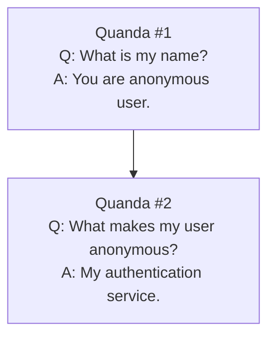

This is the simplest possible abstraction: each Quanda has **one parent** and **zero or more children**, forming a conversation tree.

---

# 2. Code Overview

Below is a structured explanation of the critical parts of the provided implementation.  
Each block is isolated to show its purpose clearly.

---

## 2.1 Oracle — Tracking “Distance From the Future”

```python
class SimpleQuandaOracle:
    def __init__(self, child=None):
        if child is not None:
            self.child = child
            self.counttofuture = child.counttofuture + 1
        else:
            self.counttofuture = 0

    def __str__(self):
        return str(self.counttofuture)
```

### What it does
- Tracks how many steps away a message is from the *current* Quanda.
- Every recursive call to `messages()` wraps the oracle in another oracle, incrementing the distance.
- Later, this can be used for:
  - summarization  
  - compression  
  - pruning  
  - perspective‑dependent message formatting  

The oracle is not about mutability; it is about **perspective**.

---

## 2.2 Quanda Initialization — Creating a Node

```python
class SimpleQuanda:
    def __init__(self, question, parent=None, mockanswer=None):
        self.node = anytree.Node(str(id(self)), quandainst=self)
        self.parent = parent
        if parent is not None:
            self.node.parent = parent.node

        self.Q = question
        self.mA = mockanswer
        self.lazy = True
```

### What it does
- Creates an `anytree.Node` to represent this Quanda in the tree.
- Stores the question and mock answer.
- Marks the answer as “lazy” (not yet streamed).
- If a parent exists, attaches this node under the parent’s node.

This is the foundation of the conversation tree.

---

## 2.3 Creating Children — The `ask()` Method

```python
def ask(self, question, mockanswer=None):
    return SimpleQuanda(question, self, mockanswer)
```

### What it does
- Creates a new Quanda whose parent is the current one.
- This is how conversation branching happens.
- The parent does not store children explicitly; **Anytree** manages that.

---

## 2.4 Streaming Answers — The `__call__()` Method

```python
def __call__(self):
    if self.lazy == False:
        yield self.A
        return

    answer = ""
    for char in self.mA:
        answer += char
        yield char

    self.A = answer
```

### What it does
- Streams the answer character‑by‑character.
- After streaming, stores the full answer in `self.A`.
- Marks the Quanda as “answered”.

This is where you would integrate a real AI model.

---

## 2.5 Collecting Messages — The `messages()` Method

```python
def messages(self, self_oracle=None):
    if self_oracle is None:
        self_oracle = SimpleQuandaOracle()

    if self.parent is not None:
        for msg in self.parent.messages(SimpleQuandaOracle(self_oracle)):
            yield msg

    yield {"Q": self.Q, "@": str(self_oracle)}
    yield {"A": self.A, "@": str(self_oracle)}
```

### What it does
- Recursively walks up the parent chain.
- Yields each Q and A with oracle metadata.
- Produces a full conversation transcript.

This is the backbone of conversation reconstruction.

---

## 2.6 Waiting for Completion — `wait()` and `done()`

```python
def wait(self):
    for a in self():
        pass
    return self.A

def done(self):
    return hasattr(self, "A")
```

### What they do
- `wait()` forces the answer to be streamed.
- `done()` checks whether the answer exists.

These are useful for synchronous access.

---

## 2.7 Path Navigation — Using Anytree

```python
def __getitem__(self, i):
    if isinstance(i, slice):
        return self.__getslice__(i.start, i.stop)
    return self.node.path[i].quandainst

def __len__(self):
    return len(self.node.path)
```

### What it does
- Allows indexing into the conversation path.
- `quanda[0]` is the root.
- `quanda[-1]` is the current node.

This makes Quanda behave like a list of its ancestors.

---

# 3. Turning This Into a Real AI Q&A Class

To adapt this into a real AI chat system:

- Replace `mockanswer` with a call to an LLM.
- Stream tokens from the model inside `__call__()`.
- Add metadata (roles, timestamps, system prompts).
- Add persistence (database or file storage).
- Add summarization logic inside the oracle.

The structure is already ideal for:

- Chat trees  
- Multi‑branching conversations  
- Memory management  
- Retrieval‑augmented generation  
- Interactive tutoring systems  

---

# 4. Understanding Immutability in Quanda

A Quanda becomes **immutable** once its answer is streamed.

### Why immutability matters
- Past messages must not change.
- AI systems rely on stable history.
- Children must reference a fixed parent.

### The paradox: immutable parents with children
Even though a Quanda is immutable, children are still “added” because:

- The parent does **not** store a list of children.
- Anytree stores the relationship externally.
- The Quanda object remains unchanged.

Thus, immutability is preserved.

---

# 5. The Oracle as Perspective, Not Mutability

The oracle represents **how far in the future** a message is being viewed from.

- If distance > 3 → compress whitespace  
- If distance > 10 → summarize  
- If distance > 100 → summarize in batches  
- If distance > 1000 → maintain rolling summaries  

This is not mutation of the Quanda.  
It is a **lens** applied when reading the past.

---

# 6. Implementing `children()` Using Anytree

Anytree already tracks children:

```python
def children(self):
    return [child.quandainst for child in self.node.children]
```

### Why this works
- Anytree stores parent/child relationships.
- The Quanda object remains immutable.
- Children are discovered dynamically.

This is ideal for conversation trees.

---

# 7. Why Anytree Beats a Database for This Use Case

### Performance advantages
- In‑memory tree operations are extremely fast.
- No network overhead.
- No serialization/deserialization.
- No query planning.

### Conceptual advantages
- The structure is inherently a tree.
- Anytree is optimized for exactly this.
- Databases are overkill unless:
  - you need persistence  
  - you need multi‑user access  
  - you need long‑term storage  

For local AI agents, Anytree is perfect.

---

# 8. Summary Diagram — Full Quanda Lifecycle

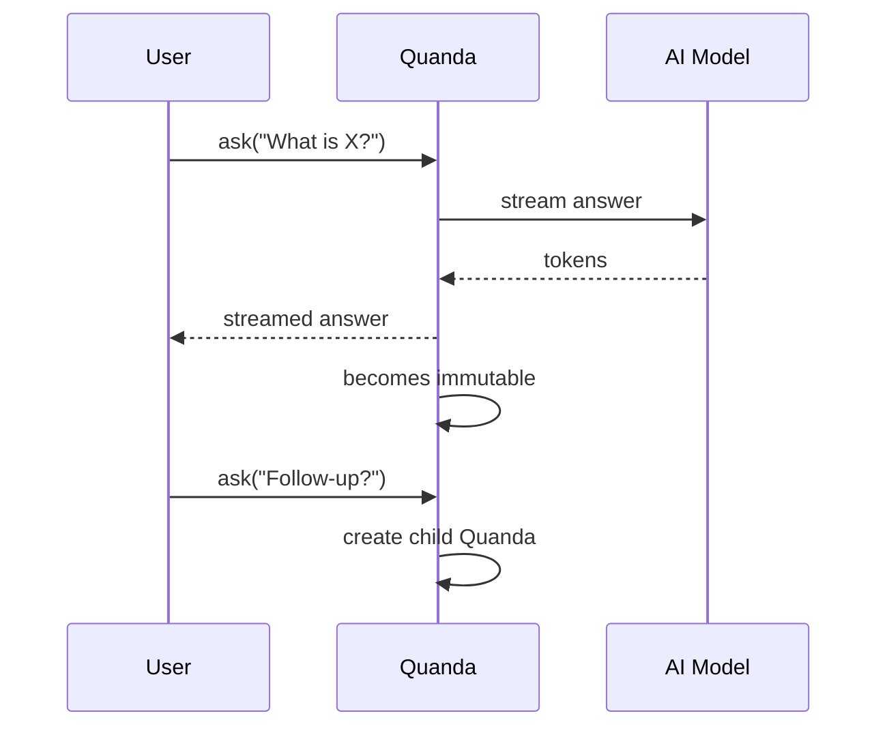

---

# Final Thoughts

This minimal Quanda abstraction gives you:

- a clean tree structure  
- immutable past messages  
- streaming answers  
- oracle‑based summarization  
- easy integration with AI models  

It is small, elegant, and extensible — perfect for building your own **PyQuanda** or **MyQuanda** system.

# Immutability in Quanda  
*A conceptual background for tree‑structured Q&A systems*

Immutability is not just a programming trick here — it is the **core philosophical and architectural principle** that makes Quanda work.  
A Quanda represents a *moment* in a conversation. Once that moment is complete, it becomes part of the past. And the past, by definition, cannot be changed without breaking the meaning of the present.

This is why Quanda treats past nodes as **immutable**.

---

## 1. Why the past must be immutable

In a conversation, the meaning of the present depends on the past.  
If you change the past, the present becomes incoherent.

### Example

If you change the question from:

> “What is my name?”

to:

> “What is the capital of France?”

then all future answers become nonsense.

This is why Quanda does **not** mutate past nodes.  
Instead, it creates **new versions** (new children) that branch from the old state.

---

## 2. Why mutating the past breaks the future

If you mutate a past Quanda:

- **Replies become unnatural:** later answers no longer match the earlier questions.  
- **Tool use becomes inconsistent:** tools may have been called with old assumptions.  
- **Verification and constraints break:** type checks, validations, or safety filters may no longer make sense.  
- **Summaries become invalid:** any summarization of the conversation is now misleading.  
- **You must rebuild the future:** logically, every descendant node should be recomputed.

This is exactly the same problem Git solves:  
**changing a commit requires rewriting all descendants**.

So instead of mutating a Quanda, you create a **new Quanda** that branches from the old one.

---

## 3. Quanda’s rule: immutable parents, mutable child

Quanda uses a simple rule:

> **Only the newest Quanda is mutable. All ancestors are immutable.**

This creates a structure like this:

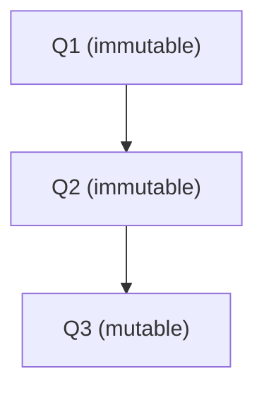

- **Q1** and **Q2** are fixed: their Q and A will never change.  
- **Q3** is still “live”: its answer may still be streaming, tools may still be running.  
- Once Q3 finishes, it becomes immutable, and Q4 (its child) becomes the new mutable node.

This mirrors real conversation:

- You can change what you’re saying **now**.  
- You cannot change what you said **five minutes ago** without rewriting reality.

---

## 4. The “paradox” of immutable parents with children

A Quanda is immutable, yet children are added to it.  
How is that possible?

Because:

- The Quanda object itself does **not** store a list of children.  
- The **Anytree node** stores the parent/child relationship.  
- The Quanda remains unchanged; only the external tree structure changes.

### Diagram: immutable Quanda, mutable tree

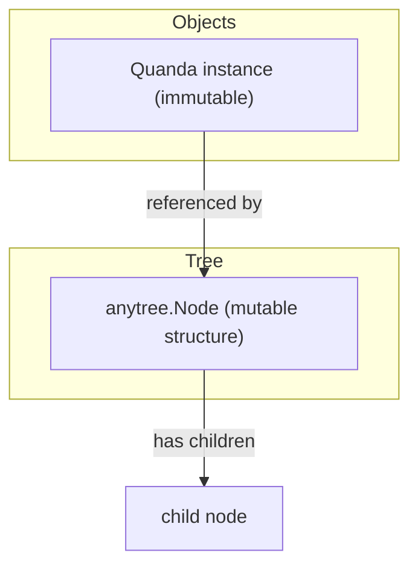

The parent *appears* to gain children when you query the tree, but the parent Quanda object never changes.  
This is the same trick used in:

- Git commit graphs  
- Functional persistent data structures  
- Immutable ASTs in compilers  

So the “paradox” is resolved: **children are added to the tree, not to the immutable Quanda object**.

---

## 5. Linear Q&A vs. tree‑structured Q&A

### Linear model

A simple chat can be seen as:

```text
Q1 → A1 → Q2 → A2 → Q3 → A3
```

This is useful when:

- You have short, single‑threaded conversations.  
- You don’t need branching, undo, or alternative paths.  
- You only care about the final transcript.

But it fails when:

- You want to explore multiple options from the same point.  
- You want to undo or fork a conversation.  
- You want to compare different solution paths.  
- You want to reuse an earlier context as a new starting point.

### Tree model

A Quanda conversation is naturally a tree:

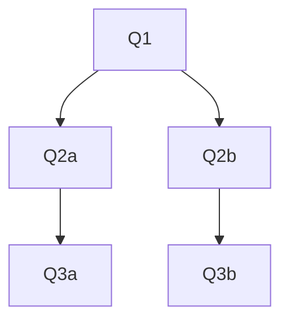

This is closer to:

- Git branching  
- Decision trees  
- Human reasoning (exploring alternatives)  
- AI exploration and planning  
- Builder tools that allow “undo” and “try another approach”

The **tree model** is more realistic for complex systems because conversations naturally branch.

---

## 6. Memory management: why you don’t want infinite conversations

Long conversations accumulate:

- irrelevant context  
- outdated assumptions  
- redundant tokens  
- expensive summarization overhead  

Quanda encourages **short, focused threads**:

- You design an architecture.  
- For each part, you open a new Quanda thread.  
- Each thread implements one file, one module, or one concern.  
- At the end, you merge results back into the original architecture Quanda.

This way:

- Each Quanda thread uses **limited memory**.  
- You can garbage‑collect or summarize old branches.  
- You can keep the architecture node as a stable “meet point”.

### Diagram: architecture meet point

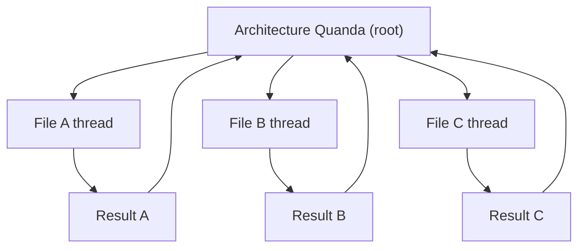

Each file thread is a **bounded conversation**, and the architecture node collects the final results.

---

## 7. Separating past, present, and latent future

Quanda’s model naturally separates:

- **Immutable past:** all completed Quandas.  
- **Active now:** the last Quanda in a thread, still streaming or being edited.  
- **Latent future:** all possible children that could be created from the current node.

This is why the estimation helper is called an **oracle**:

- It looks from the future back into the past.  
- It estimates how much context is left or needed.  
- It decides how aggressively to compress or summarize.

Mathematically, the oracle behaves like a structure that **raises efficiency** but introduces complexity similar to oracles in theoretical computer science:  
you get a powerful “peek” into structure, but you must manage circular dependencies and cost.

---

## 8. The Oracle: perspective, not mutability

In the current implementation, the oracle only tracks `counttofuture`:

- `counttofuture = 0` → current node.  
- `counttofuture = 1` → one step in the future.  
- `counttofuture = 10` → far future, heavy summarization needed.

The idea is:

- If `counttofuture > 3`, slightly condense text (remove excessive whitespace).  
- If `counttofuture > 10`, summarize each message.  
- If `counttofuture > 100`, summarize each 10 messages.  
- If `counttofuture > 1000`, maintain a rolling summary of the entire past.

This is **not implemented yet**, but the design is clear:  
the oracle is a **viewing strategy**, not a mutation mechanism.

### Diagram: same past, different future perspectives

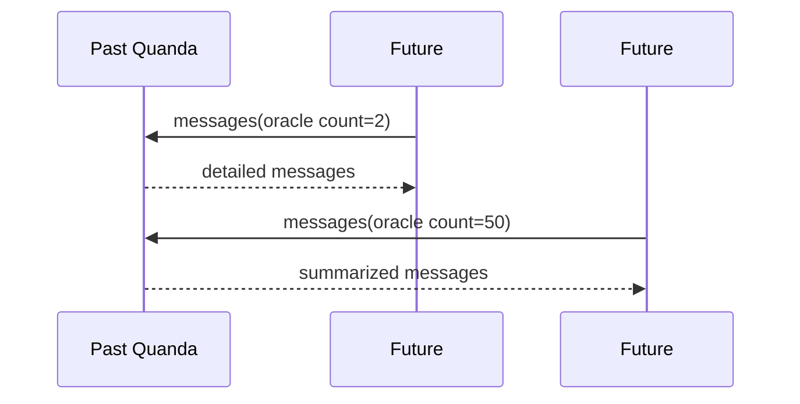

The past Quanda does not change.  
Only the **representation** changes depending on how far in the future you are.  
This is **perspective**, not **mutability**.

---

## 9. How Anytree and parent references preserve immutability

Because Quanda itself does not store children, but Anytree does, you can:

- Keep Quanda objects immutable.  
- Let Anytree manage the evolving structure.  
- Query children via a getter that reads from Anytree.

Example:

```python
def children(self):
    return [child.quandainst for child in self.node.children]
```

From the Quanda’s point of view:

- It never changed.  
- It always had the same Q and A.  
- But the **world around it** (the tree) evolved.

This is a clean separation of:

- **data** (immutable Quanda)  
- **structure** (mutable tree)  

---

## 10. Comparing mental models: linear vs. last‑mutable‑child

### Linear array of Q&A

- Easy to implement.  
- Easy to visualize.  
- Good for small, non‑branching chats.  
- Hard to undo or branch.  
- Hard to reuse earlier context as a new starting point.

### Last‑mutable‑child with immutable parents

- Slightly more complex conceptually.  
- Matches Git, ASTs, and functional data structures.  
- Natural for branching, undo, and exploration.  
- Great for architecture building, code generation, and multi‑path reasoning.  
- Much closer to how real projects evolve.

For **serious systems**, the last‑mutable‑child model is closer to reality.

---

## 11. Relation to Git‑like version control and builder tools

Quanda nodes behave like Git commits:

- Each Quanda is a **commit**.  
- Each `ask()` is a **new commit** with a parent.  
- Branching is cheap and natural.  
- History is immutable.  
- You can always go back to a previous node and branch again.

Tools like lovable.dev or other builders:

- Let you undo, retry, or fork.  
- Internally, this is a **tree of states**.  
- Quanda gives you a clean, explicit representation of that tree.

Managing a **versioned conversation tree** is often simpler than:

- trying to patch a linear log, or  
- mutating past messages in place.

---

## 12. Using branched trees for reinforcement and finetuning

A Quanda node:

- knows the **present** (its Q and A),  
- maps the **past** (its path of ancestors),  
- does not mutate history.

This makes it ideal for:

- **Reinforcement:**  
  - You can evaluate which branches led to good outcomes.  
  - You can reinforce patterns along those paths.  

- **Finetuning:**  
  - Each Quanda path can be turned into a training example:  
    - Q: full context (or summarized context)  
    - A: the answer at that node  

- **Flashcards / AI lessons:**  
  - Each Quanda is a Q&A card.  
  - The path gives context.  
  - You can generate context‑sensitive flashcards without changing the format.

Quanda is thus a **reinforcement‑ and finetuning‑compatible perspective** on flashcards and AI lessons.

---

## 13. When does a Quanda become immutable?

In practice, you need a clear event that marks a Quanda as immutable.

In this simple implementation:

- A Quanda becomes immutable **once its answer has finished streaming**.  
- At that point:
  - No more tools are called.  
  - No more verification or type checks are pending.  
  - The answer is final.

From then on:

- Children must point to this Quanda as their parent.  
- The Quanda itself cannot store children.  
- Children are discovered via the tree structure (Anytree).

This gives you a **very active immutable object**:  
it participates in many future operations, but it never changes itself.

---

## 14. Summary

Immutability in Quanda:

- keeps the past stable,  
- makes branching safe,  
- simplifies reasoning,  
- aligns with Git‑like version control,  
- supports memory management,  
- enables reinforcement and finetuning,  
- and matches how real conversations and projects evolve.

The oracle adds a **perspective layer** on top of this immutable history, allowing you to adapt how you *view* the past without ever changing it.

This combination — immutable Quandas, mutable tree structure, and oracle‑based perspective — is a powerful mental and technical model for building serious Q&A, architecture, and AI systems.

# Understanding **Anytree** as a Mathematical Primitive  
### And how it relates to Quanda, classical tree theory, and intuitive tree‑shaped data

Anytree is not “just a Python library.”  
It is a **direct implementation of a mathematical primitive**: the *rooted tree*.

A rooted tree in mathematics is defined by:

- A set of **nodes**
- A **parent** relation (each node has 0 or 1 parent)
- A **child** relation (derived from the parent relation)
- Optional **labels** or **attributes**
- A **root** (a node with no parent)

Anytree mirrors this exactly.

Below is a structured explanation, with diagrams, showing how Anytree corresponds to mathematical trees, how Quanda fits into this structure, and why queries become extremely simple.

---

# 1. Mathematical Tree Primitive

A mathematical rooted tree is defined by:

- A set of nodes \( V \)
- A parent function \( p: V \rightarrow V \cup \{\text{None}\} \)
- A root \( r \in V \) such that \( p(r) = \text{None} \)
- Children defined as:  
  \( \text{children}(v) = \{ u \in V \mid p(u) = v \} \)

### Diagram: Mathematical Tree

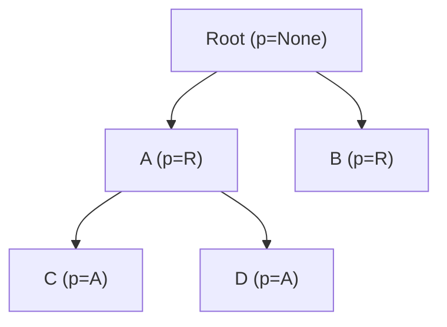

This is the pure mathematical structure.

---

# 2. Anytree as a Direct Implementation of This Primitive

Anytree implements exactly the same rules:

- You create a node:  
  `Node("A")`
- You assign a parent:  
  `Node("B", parent=A)`
- You can attach attributes:  
  `Node("C", parent=A, data=obj)`

### Key properties

### ✔ Named nodes can be created  
Each node has a `.name` attribute.

### ✔ Each node can have a parent  
`node.parent = other_node`

### ✔ Attributes can be attached  
`Node("X", value=42, ref=myobject)`

### ✔ Parent objects remain immutable  
Adding a child does **not** mutate the parent object.  
The parent simply *appears* to have children because Anytree maintains the structure externally.

### ✔ Queries are simple  
- `node.children`  
- `node.parent`  
- `node.path`  
- `node.descendants`  
- `node.siblings`

These correspond exactly to mathematical tree queries.

### Diagram: Anytree Structure

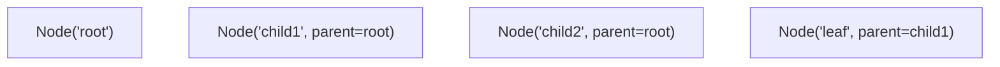

Anytree stores:

- `parent` pointer  
- `children` list (derived, not stored in the node object itself)

---

# 3. Why Parent Objects Stay Immutable

In Anytree:

- A node does **not** store its children.
- Only the **child** stores a pointer to its parent.
- The tree structure is maintained by Anytree’s internal registry.

This means:

- Adding a child does **not** modify the parent node object.
- The parent *appears* to have children because Anytree computes them.

### Diagram: Immutable Parent, Mutable Structure

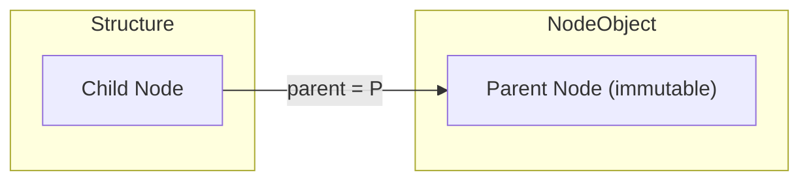

The parent node object never changes.  
The *structure* changes.

This is exactly how Quanda works.

---

# 4. Folder Structures as Trees

A folder structure is a perfect example of a mathematical tree:

- Each folder has **one parent folder** (except root)
- Each folder may contain **zero or more children**
- The parent pointer is enough to reconstruct the entire tree

### Diagram: Folder Tree

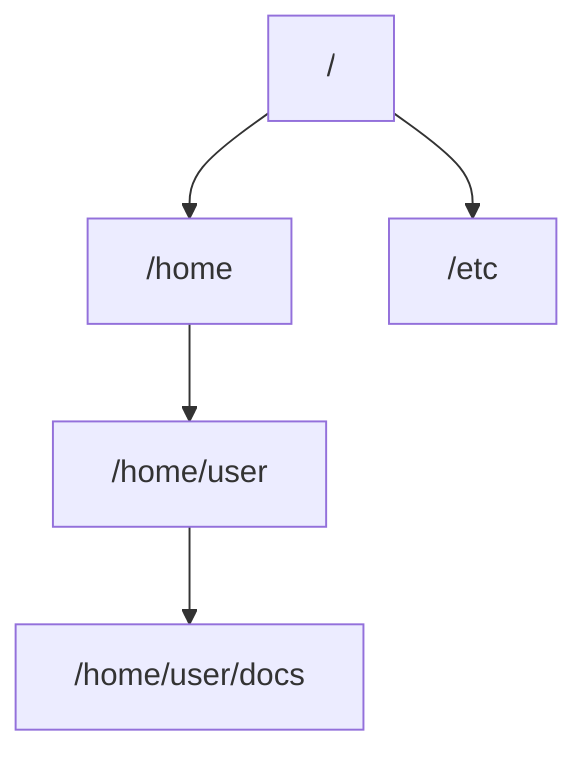

This is identical to Anytree’s structure.

---

# 5. Quanda as a Tree Element

A Quanda instance:

- Has a **parent Quanda**  
- Has **zero or more children** (via Anytree)
- Has attributes:  
  - `Q` (question)  
  - `A` (answer)  
  - `node` (Anytree node)  
  - `parent` (Quanda parent)

### Diagram: Quanda Tree

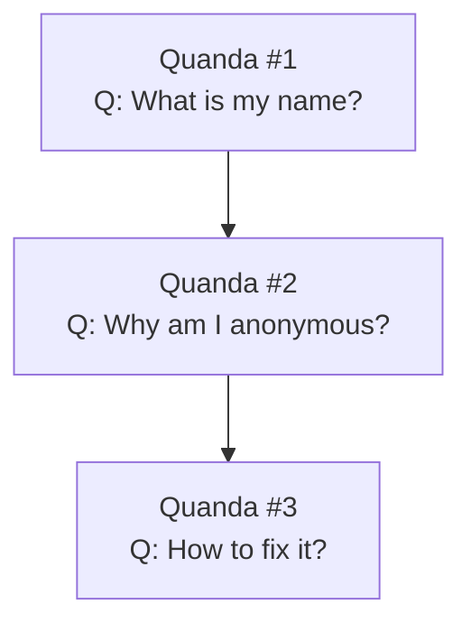

Quanda is a **tree of Q&A cards**.

---

# 6. Correspondence Table: Math → Anytree → Quanda

| Concept | Mathematical Tree | Anytree | Quanda |
|--------|-------------------|---------|--------|
| Node | Element of set \(V\) | `Node()` | `SimpleQuanda` |
| Parent | Function \(p(v)\) | `node.parent` | `quanda.parent` |
| Children | Derived from parent | `node.children` | `quanda.node.children` |
| Root | Node with no parent | `Node(..., parent=None)` | First Quanda |
| Attributes | Labels on nodes | Arbitrary kwargs | Q, A, oracle, etc. |
| Tree structure | Parent pointers | Managed by Anytree | Used to reconstruct conversation |
| Immutability | Node values fixed | Parent not mutated | Past Quanda immutable |

---

# 7. Why Queries Become Extremely Simple

Because the structure is mathematically pure, queries are intuitive:

### Mathematical  
- `parent(v)`  
- `children(v)`  
- `path(v)`  
- `descendants(v)`  

### Anytree  
- `node.parent`  
- `node.children`  
- `node.path`  
- `node.descendants`  

### Quanda  
- `quanda.parent`  
- `quanda.children()`  
- `quanda.node.path`  
- `quanda.messages()`  

### Diagram: Query Flow

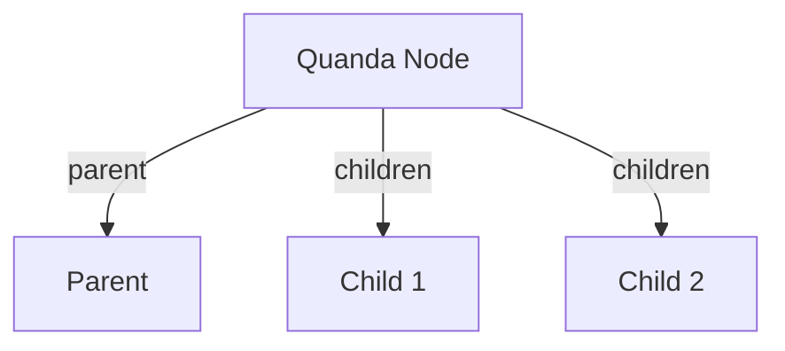

This is exactly how we intuitively think about trees.

---

# 8. Why This Model Is So Powerful

Because it unifies:

- **Mathematical clarity**  
- **Programming simplicity**  
- **Immutability guarantees**  
- **Tree‑shaped reasoning**  
- **Conversation modeling**  
- **Version control (Git‑like)**  
- **Memory management**  
- **AI context reconstruction**  

Quanda + Anytree = a clean, mathematically grounded, intuitive structure for representing conversations, code generation threads, or any branching reasoning process.

---

# 9. Summary

Anytree is a direct implementation of the mathematical primitive “rooted tree”:

- Nodes have names  
- Nodes have at most one parent  
- Attributes can be attached  
- Parents remain immutable  
- Children are derived from parent pointers  
- Queries are simple and intuitive  
- The structure matches folder trees, Git trees, and Quanda trees  

Quanda uses this structure to represent:

- Immutable past  
- Mutable present  
- Branching future  

This makes it ideal for AI conversations, architecture building, reinforcement, and finetuning.

# Implementing **children()**  
*A focused chapter on how Quanda uses Anytree to expose children while keeping parents immutable*

This chapter is intentionally compact, but it highlights a subtle and important idea:  
**Quanda nodes can discover their children without ever mutating themselves.**

---

# 1. How `children()` Works with Anytree

Anytree stores the tree structure in a very simple way:

- Each node has **one pointer to its parent**
- Children are **derived**, not stored

So if you create:

```python
child = Node("child", parent=parent)
```

Anytree automatically updates the *structure*, not the parent object.

### A Quanda getter can simply do:

```python
def children(self):
    return [node.quandainst for node in self.node.children]
```

### Why this works

- `self.node.children` is computed by Anytree  
- The Quanda object itself never changes  
- Children appear “magically” because the tree structure is maintained externally

---

# 2. Parent Immutability: Mathematical Definition

In mathematics, a rooted tree is defined by:

- A set of nodes \( V \)
- A parent function  
  

\[
  p : V \rightarrow V \cup \{\text{None}\}
  \]


- Children are defined as:  
  

\[
  \text{children}(v) = \{ u \in V \mid p(u) = v \}
  \]


Notice something important:

> **The parent function is the only primitive.  
> Children are derived, not stored.**

This means:

- Adding a child does **not** change the parent  
- The parent remains mathematically immutable  
- The tree structure changes, but the node object does not

### Diagram: Immutable Parent, Derived Children

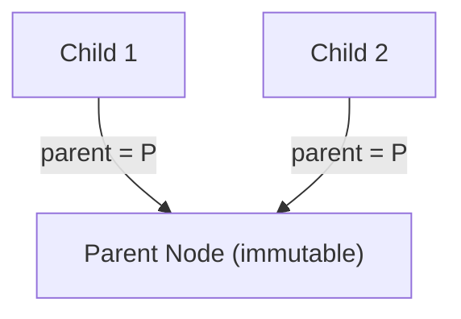

The parent node does not store children.  
Children store the parent.

---

# 3. Real‑Life Analogy: Memories Don’t Change, Context Does

Human memory works similarly:

- You cannot change what you said yesterday  
- But new events can **reinterpret** or **add context** to past memories  
- The past stays fixed; the meaning evolves

Quanda models this perfectly:

- A past Quanda (Q&A pair) is immutable  
- New children add context  
- The parent does not change, but the *tree* grows around it

This mirrors how we understand conversations.

---

# 4. Comparison to GPT Token Immutability

GPT models treat past tokens as immutable:

- Once a token is generated, it cannot be changed  
- New tokens depend on the entire prefix  
- If you change the past, you must regenerate the future

This is why editing earlier messages breaks the future.

### But Quanda improves on this model

Instead of rewriting the future:

- You create a **new branch** (a child Quanda)
- The past remains intact
- The future is preserved
- You can reuse all previous work

This is more efficient and more realistic.

---

# 5. Why This Matters for Real Systems

In real workflows:

- You write documents  
- You generate code  
- You negotiate agreements  
- You spend time producing results

If you mutate the past:

- All downstream work becomes invalid  
- You must redo everything  
- You risk contradictions or data loss

Quanda avoids this by:

- Keeping past nodes immutable  
- Allowing new answers to old questions  
- Preserving all branches  
- Reusing all previous computation

This is a **safer**, **more efficient**, and **more human‑aligned** memory model.

---

# 6. Summary

- `children()` is trivial because Anytree derives children from parent pointers  
- Parents remain immutable because they never store children  
- This matches mathematical tree theory  
- It also matches human memory: past events don’t change, but context grows  
- GPT’s token immutability is similar, but Quanda adds branching  
- Branching avoids breaking the future and preserves all work

This chapter is short, but the idea is foundational:  
**immutability + derived children = stable, reusable, branching conversations.**

# Implementing database  
*MongoDB, real‑time behaviour, and how it complements Anytree*

This chapter explains how MongoDB can act as a **real‑time, multi‑client backend** for Quanda, how it compares to Anytree in speed and purpose, and how `__call__` can be overridden to stream from and to the database.

---

## 1. MongoDB as a real‑time system

MongoDB is a **document database** that:

- Stores JSON‑like documents (BSON)
- Supports **concurrent access** from many clients
- Can be used by:
  - multiple web clients (browsers, services)
  - multiple local processes or workers
- Provides:
  - atomic operations on single documents
  - change streams (watching updates in real time)
  - flexible schemas

In a web‑based Quanda system:

- Each Quanda is a document in MongoDB
- Multiple clients can:
  - read the same Quanda
  - watch its updates
  - create children (new Quandas) concurrently
- The database becomes the **shared source of truth** for all clients.

---

## 2. Why Anytree is faster than MongoDB (and why that’s fine)

Anytree is **in‑memory** and **single‑process**:

- **Implements only one data structure:** a rooted tree
- **Optimized for tree operations:** parent, children, path, descendants
- **No network overhead:** no sockets, no drivers, no serialization
- **No disk I/O:** everything is in RAM

So:

- For **local queries** (path, children, ancestors), Anytree is much faster than MongoDB.
- For **AI‑related systems** that need:
  - tree‑structured prompts
  - branching conversations
  - quick path reconstruction  
  Anytree is ideal.

MongoDB, on the other hand:

- Is slower per query (network + disk + driver overhead)
- But:
  - supports persistence
  - supports multi‑client concurrency
  - survives process restarts
  - scales across machines

**Conclusion:**  
Use Anytree for **in‑memory structure and queries**, MongoDB for **persistence and multi‑client sharing**.

---

## 3. Overriding `__call__` to connect Quanda to the database

The `__call__` method is the **streaming interface** of Quanda.  
We can override it to integrate with MongoDB.

### 3.1 Local streaming (single process)

Basic idea:

```python
def __call__(self):
    # If already finished, just yield the full answer
    if hasattr(self, "A"):
        yield self.A
        return

    answer = ""
    for token in self.generate_tokens_from_model():
        answer += token
        self.save_partial_to_db(answer)  # update MongoDB
        yield token

    self.A = answer
    self.mark_finished_in_db()
```

- While streaming:
  - We update the DB with the current partial answer.
- When finished:
  - We store the final `A`
  - The Quanda becomes immutable.

---

### 3.2 Resuming after process death (retry button)

If the process dies mid‑stream:

- MongoDB still holds the **partial answer**.
- A retry button (or automatic retry) can:
  - read the partial answer from DB
  - resume streaming from where it left off
  - continue updating the DB

The overridden `__call__` can:

1. Load current partial answer from DB  
2. Yield it as the **first chunk**  
3. Continue streaming new tokens and updating DB

---

### 3.3 Multi‑client streaming: shared real‑time view

If one client is actively streaming the answer:

- Other clients can still call `__call__` on the same Quanda.
- Their `__call__` implementation can:
  1. Read the current answer from DB  
  2. Yield the **whole current string** as the first chunk  
  3. Then subscribe to updates (polling or change streams)  
  4. Yield new tokens/chunks as they appear

From the client’s perspective:

- `__call__` always yields a **stream**:
  - first: current full answer so far
  - then: new tokens as they are appended

---

### 3.4 Finished streaming: immutable answer, stable behaviour

Once streaming is finished:

- The document in MongoDB has a final `A` field.
- The Quanda is immutable.
- `__call__` behaviour remains consistent:

```python
def __call__(self):
    # Always safe: if A exists, just yield it
    if hasattr(self, "A"):
        yield self.A
        return
    # Otherwise, stream and persist...
```

Clients that are unaware of the internal state still see:

- A stream that yields the full answer and then ends.

---

## 4. Loading Quanda and its tree from MongoDB

To integrate MongoDB with Anytree:

### 4.1 Loading a single Quanda and its path

When you load a Quanda from DB:

- You also load its **parent chain** (lineage) from the first message to this one.
- For each node in the lineage:
  - You create an Anytree node
  - You attach the Quanda instance to it

This way:

- `quanda.node.path` is fully available
- `messages()` and other path‑based operations work as usual

### 4.2 Loading children on demand

When you call `children()`:

- You query MongoDB for all Quandas whose `parent_id` equals this Quanda’s id.
- For each child:
  - You create a Quanda instance
  - You create an Anytree node with `parent=self.node`

This “awakens” the children into the in‑memory tree.

### 4.3 More complex queries

For more complex operations (e.g., all descendants, subtree analysis):

- You may need to load the entire subtree from MongoDB.
- MongoDB can:
  - find all nodes with a given ancestor (if you store path or depth)
  - rebuild paths
  - find children, siblings, etc.

This is slower than pure Anytree, but:

- It’s still conceptually equivalent
- It preserves the same tree semantics
- It keeps the database **transparent** from the Quanda perspective

---

## 5. Transparency: making MongoDB feel like Anytree

If you design the integration so that:

- Loading a Quanda also loads its path
- `children()` loads direct children
- `__call__` streams via DB state

Then:

- MongoDB becomes a **transparent persistence layer**
- Anytree remains the **in‑memory tree engine**
- Quanda’s interface stays the same:
  - `messages()`
  - `children()`
  - `__call__()`
  - `wait()`
  - `done()`

You get:

- Local speed (Anytree)
- Global consistency (MongoDB)
- Real‑time multi‑client streaming
- Immutable past, shared across all clients

---

## 6. Summary

- **Anytree** is faster because it is:
  - in‑memory
  - single‑structure
  - optimized for tree queries
- **MongoDB** is slower per query but:
  - supports persistence
  - supports multi‑client concurrency
  - survives process restarts
- Overriding `__call__` lets you:
  - stream answers into the DB
  - resume after failures
  - share real‑time streams across clients
- Loading a Quanda from DB along with its path and children makes:
  - MongoDB a transparent backend
  - Anytree the active in‑memory representation
- The result is a system where:
  - past Quandas are immutable
  - the tree is shared and persistent
  - streaming is real‑time and multi‑client aware

This is a practical bridge between **mathematical trees**, **in‑memory Anytree**, and **real‑time, multi‑client MongoDB systems**.
