# Building *Snippet2MongoExplorer1Anytree*:  
## An Incremental Walkthrough with Stubs, Future‑Compatibility, and Architectural Diagrams

***Regarding to it's name: this introduction builds the common real-time behaviour; how to implement it in MongoDB is shown and generic problems solved
in snippet 2-1, the first specific section of this manual.***.

This article documents the collaborative construction of **Snippet2MongoExplorer1Anytree**, a foundational component in a larger experimental system. The goal is to create a durable, database‑backed conversation engine that supports:

- Streaming answers  
- Immutable final states  
- Parent/child Q&A hierarchies  
- Session grouping  
- MongoDB persistence  
- Future integration with Anytree, mistune, and Backbone.js

We intentionally build the system **incrementally**, leaving **stub implementations** where future chapters will expand functionality. This ensures forward compatibility while keeping the current chapter focused on the core data model and service orchestration.

---

## 1. Conceptual Overview

The system revolves around three primary entities:

1. **Session** — a container for multiple Q&A nodes  
2. **ConversationNode** — a question, its streaming answer, and its parent/child relations  
3. **AIService** — orchestrates streaming, persistence, and recall logic  

MongoDB acts as the persistent backbone, while Ollama provides the streaming LLM interface.

### High‑Level Architecture

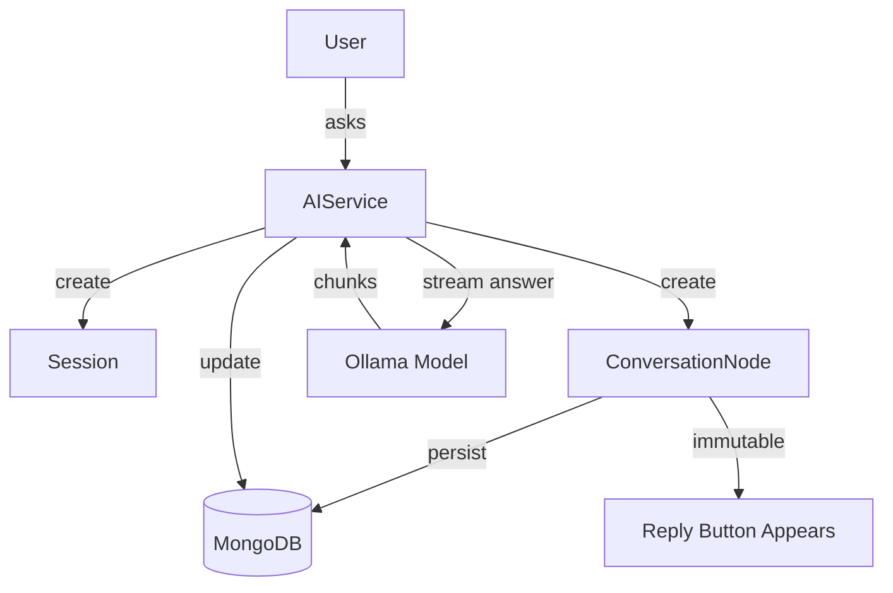

---

## 2. Node Lifecycle

A node begins with a **question** and an **empty streaming answer**.  
As chunks arrive, the answer grows.  
When streaming completes, the answer becomes **immutable**, enabling replies.

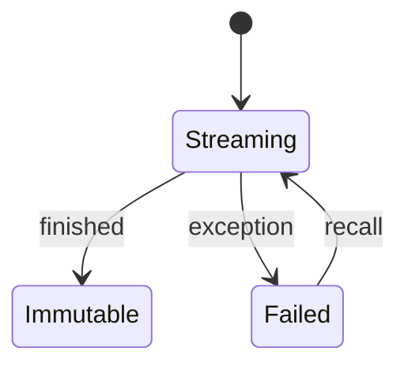

---

## 3. Sessions as Left‑Side Anchors

Sessions appear in the UI as left‑side anchors.  
They group nodes and provide a stable root for conversation trees.

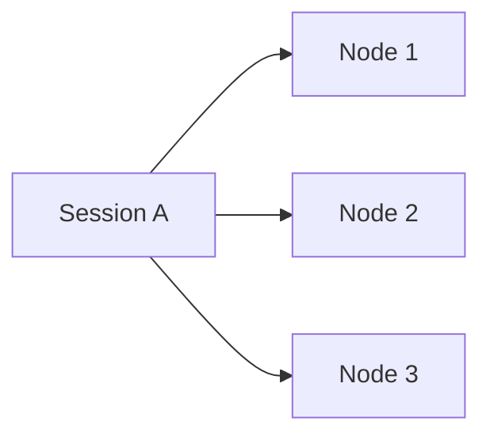

---

## 4. Future‑Compatibility Stubs

We include placeholders for:

- **Anytree integration**  
- **mistune streaming block detection**  
- **Backbone.js DOM mapping**  

These are intentionally left as comments or stub methods to keep this chapter focused.

---

## 5. The Full Python Implementation

Below is the complete Python code block.

# Appendix: Code

### Snippet2MongoExplorer1Anytree — Chapter Introduction

This chapter introduces the structural foundations for **Snippet2MongoExplorer1Anytree**, focusing on how conversations, sessions, and streaming answers are represented and persisted. The goal is to establish a durable, database‑backed model that supports incremental answer streaming, immutability after completion, and hierarchical navigation through parent/child Q&A nodes.

We begin by defining the **Conversation** domain in terms of:

- **Question / Answer nodes**  
  Each node stores a question and a streaming answer. While the answer is streaming, it remains mutable; once the model finishes, the answer becomes *immutable*. At that moment, the UI exposes a **Reply** button, allowing new child nodes to reference this one as their parent. Replies do not modify the original node’s content.

- **Sessions**  
  Sessions appear on the left side of the UI and group multiple Q&A nodes. They act as stable roots for conversation trees. Although answers may be reused across sessions in future chapters, here we focus purely on database‑backed persistence.

- **MongoDB integration**  
  As soon as a node is created, its representation is stored in MongoDB. The backend continues streaming the answer; if streaming fails, the node is marked with a **failed** state, and the UI exposes a **Recall** button to recompute the answer.

- **Ollama interface**  
  A minimal interface is used: a single question is sent, and the answer is streamed back chunk‑by‑chunk. Concurrency naturally emerges from MongoDB updates rather than from complex orchestration.

- **Anytree (introduced in the next chapter)**  
  Although this chapter does not yet implement Anytree, each Q&A node will eventually correspond to a flat tree element. MongoDB will mirror this structure. The initial object will bind to its tree node, which may receive a generated name from the model.

- **Streaming, mistune, and DOM integration (future chapter)**  
  Later, we will integrate `mistune` hooks to detect block boundaries during streaming, enabling dynamic DOM updates. Each block will map to a Backbone.js view, allowing the UI to replace or refine blocks as the stream evolves.

The following Python code block provides the foundational classes and service logic for this system. It intentionally avoids Anytree and front‑end integration, which will be introduced in subsequent chapters.

## Code

```python
"""
Snippet2MongoExplorer1Anytree
-----------------------------

High-level header sketch for a Conversation/AIService system where:

- Each node is a Q&A pair:
  - Question
  - Answer (initially streaming; becomes immutable when finished)
  - After immutability, child nodes can reference it as parent (reply button appears).
    This “other-way communication” does not affect immutability of the original node.

- Sessions:
  - Appear on the left (conceptually, in the UI).
  - Contain multiple dictionary-like nodes and their answers.
  - Answers can be reused in other contexts, but here we only demonstrate DB-backed Q&A.

- MongoDB:
  - User-facing representation is backed by MongoDB.
  - Streaming continues in the backend; if it fails, a "failed" tag is attached.
  - A "Recall" button allows retrying the answer computation.

- Ollama:
  - Very simple interface: single message with the question.
  - Answer is read as a stream.
  - Multithreaded behavior emerges from MongoDB-backed concurrent updates.

- Anytree:
  - Each Q&A will later correspond to a flat element in a tree.
  - MongoDB reflects this structure.
  - This will be introduced in the *next* chapter, not in this initial code.

- Streaming & rendering (future chapter, not implemented here):
  - `mistune` hooks provide block-end hints for dynamic streaming.
  - Streaming uses `yield`s and dynamic reads.
  - Blocks may be replaced if the guess was wrong.
  - Each representative block maps to a DOM block.
  - DOM integration is done via Backbone.js views/models.

This file focuses on the conceptual Python-side header and core classes.
"""

from dataclasses import dataclass, field
from datetime import datetime
from enum import Enum, auto
from typing import Optional, List, Dict, Any, Generator, Callable


# -----------------------------
# Core domain enums and models
# -----------------------------

class AnswerState(Enum):
    STREAMING = auto()
    IMMUTABLE = auto()
    FAILED = auto()


@dataclass
class Answer:
    """
    Represents an answer that starts as streaming and becomes immutable
    once the model finishes. If streaming fails, state becomes FAILED.
    """
    content: str = ""
    state: AnswerState = AnswerState.STREAMING
    created_at: datetime = field(default_factory=datetime.utcnow)
    finished_at: Optional[datetime] = None
    failure_reason: Optional[str] = None

    def append_chunk(self, chunk: str) -> None:
        if self.state is not AnswerState.STREAMING:
            # Once immutable or failed, we do not mutate content.
            return
        self.content += chunk

    def mark_immutable(self) -> None:
        if self.state is AnswerState.STREAMING:
            self.state = AnswerState.IMMUTABLE
            self.finished_at = datetime.utcnow()

    def mark_failed(self, reason: str) -> None:
        self.state = AnswerState.FAILED
        self.failure_reason = reason
        self.finished_at = datetime.utcnow()


@dataclass
class ConversationNode:
    """
    A single Q&A node.

    - question: user question text.
    - answer: Answer object, initially streaming.
    - parent_id: ID of parent node (can be a session node or another Q&A node).
    - children_ids: IDs of child nodes that reply to this node.

    Once `answer.state` is IMMUTABLE, this node becomes a stable anchor:
    - Child nodes can reference it as parent.
    - A "Reply" button appears in the UI.
    - The original node’s content is not changed by replies.
    """
    id: str
    question: str
    answer: Answer
    parent_id: Optional[str] = None
    children_ids: List[str] = field(default_factory=list)
    created_at: datetime = field(default_factory=datetime.utcnow)

    def can_reply(self) -> bool:
        """
        A reply button should appear only when the answer is immutable or failed.
        Streaming answers are still in flux.
        """
        return self.answer.state in (AnswerState.IMMUTABLE, AnswerState.FAILED)

    def add_child(self, child_id: str) -> None:
        self.children_ids.append(child_id)


@dataclass
class Session:
    """
    A session groups multiple Q&A nodes.

    Conceptually:
    - Appears on the left in the UI.
    - Contains multiple dictionary-like nodes and their answers.
    - Parent of Q&A nodes via `parent_id` referencing this session's ID.
    """
    id: str
    title: str
    node_ids: List[str] = field(default_factory=list)
    created_at: datetime = field(default_factory=datetime.utcnow)

    def add_node(self, node_id: str) -> None:
        self.node_ids.append(node_id)


# -----------------------------
# MongoDB interface abstraction
# -----------------------------

class MongoInterface:
    """
    Very thin abstraction over MongoDB operations.

    In the real implementation, this would wrap a MongoDB client
    (e.g., pymongo or motor) and provide CRUD operations for:
    - Sessions
    - ConversationNodes
    - Answers (embedded or separate collection)
    """

    def __init__(self, db_client: Any):
        self.db_client = db_client
        # Example collections:
        # self.sessions = db_client["sessions"]
        # self.nodes = db_client["nodes"]

    # --- Session operations ---

    def save_session(self, session: Session) -> None:
        """
        Persist or update a session.
        """
        # Pseudocode:
        # self.sessions.update_one({"id": session.id}, {"$set": session_dict}, upsert=True)
        pass

    def load_session(self, session_id: str) -> Optional[Session]:
        """
        Load a session by ID.
        """
        # Pseudocode:
        # doc = self.sessions.find_one({"id": session_id})
        # return Session(**doc) if doc else None
        return None

    # --- Node operations ---

    def save_node(self, node: ConversationNode) -> None:
        """
        Persist or update a conversation node.
        """
        # Pseudocode:
        # self.nodes.update_one({"id": node.id}, {"$set": node_dict}, upsert=True)
        pass

    def load_node(self, node_id: str) -> Optional[ConversationNode]:
        """
        Load a conversation node by ID.
        """
        # Pseudocode:
        # doc = self.nodes.find_one({"id": node_id})
        # return ConversationNode(**doc) if doc else None
        return None

    def update_answer_state(
        self,
        node_id: str,
        new_state: AnswerState,
        failure_reason: Optional[str] = None,
    ) -> None:
        """
        Update the answer state for a node in MongoDB.
        """
        # Pseudocode:
        # update = {"answer.state": new_state.name}
        # if failure_reason:
        #     update["answer.failure_reason"] = failure_reason
        # self.nodes.update_one({"id": node_id}, {"$set": update})
        pass


# -----------------------------
# Ollama interface (simplified)
# -----------------------------

class OllamaClient:
    """
    Very simple interface to Ollama:
    - Single message with the question.
    - Returns a generator of text chunks (streaming).
    """

    def __init__(self, model_name: str = "llama3"):
        self.model_name = model_name

    def stream_answer(self, question: str) -> Generator[str, None, None]:
        """
        Stream answer chunks from Ollama.

        In real code, this would call the Ollama HTTP API or CLI
        and yield chunks as they arrive.
        """
        # Pseudocode:
        # for chunk in ollama_stream(question, model=self.model_name):
        #     yield chunk
        #
        # For now, simulate a single-chunk answer:
        yield f"(Simulated answer from {self.model_name}) " \
              f"Response to: {question}"


# -----------------------------
# User and AIService
# -----------------------------

@dataclass
class User:
    """
    Represents a user whose view of the conversation is backed by MongoDB.

    - The "representation is replaced with MongoDB instantly":
      as soon as a node is created, it is persisted.
    - Streaming continues in the backend; if it fails, the node is marked FAILED.
    - A "Recall" button in the UI can trigger recomputation.
    """
    id: str
    mongo: MongoInterface


class AIService:
    """
    Conversation-level service that orchestrates:
    - Creating sessions and nodes.
    - Streaming answers from Ollama.
    - Persisting state in MongoDB.
    - Handling failures and "Recall" logic.

    Anytree integration:
    - In the next chapter, each ConversationNode will be mirrored as an
      anytree node (flat element in a tree).
    - MongoDB will reflect this tree structure.
    - The initial object will connect to its anytree node, which holds
      the instance and a generated name.
    """

    def __init__(self, mongo: MongoInterface, ollama_client: OllamaClient):
        self.mongo = mongo
        self.ollama = ollama_client

    # --- Session management ---

    def create_session(self, title: str) -> Session:
        session = Session(id=self._generate_id("session"), title=title)
        self.mongo.save_session(session)
        return session

    # --- Q&A node lifecycle ---

    def ask_question(
        self,
        user: User,
        session: Session,
        question: str,
        parent_node_id: Optional[str] = None,
        on_chunk: Optional[Callable[[ConversationNode, str], None]] = None,
    ) -> ConversationNode:
        """
        Create a new Q&A node, start streaming the answer, and persist everything
        to MongoDB as it evolves.

        - `on_chunk` is a callback that can be used by the UI layer to:
          - Update DOM blocks.
          - Use mistune hooks to guess block endings.
          - Integrate with Backbone.js views.
        """
        node_id = self._generate_id("node")
        answer = Answer()
        node = ConversationNode(
            id=node_id,
            question=question,
            answer=answer,
            parent_id=session.id if parent_node_id is None else parent_node_id,
        )

        # Persist initial node state immediately.
        self.mongo.save_node(node)
        session.add_node(node_id)
        self.mongo.save_session(session)

        # Start streaming in background (conceptually).
        # In real code, this would be dispatched to a worker / thread / async task.
        self._stream_answer_for_node(user, node, on_chunk=on_chunk)

        return node

    def _stream_answer_for_node(
        self,
        user: User,
        node: ConversationNode,
        on_chunk: Optional[Callable[[ConversationNode, str], None]] = None,
    ) -> None:
        """
        Internal method that streams the answer from Ollama and updates MongoDB.

        - If streaming succeeds, the answer becomes IMMUTABLE.
        - If streaming fails, the answer is marked FAILED and a "Recall" button
          can be shown in the UI.
        """
        try:
            for chunk in self.ollama.stream_answer(node.question):
                node.answer.append_chunk(chunk)
                # Persist incremental content.
                self.mongo.save_node(node)
                if on_chunk:
                    on_chunk(node, chunk)

            # Mark immutable when done.
            node.answer.mark_immutable()
            self.mongo.save_node(node)

        except Exception as exc:
            # Mark as failed and persist.
            node.answer.mark_failed(reason=str(exc))
            self.mongo.save_node(node)
            # UI can now show a "Recall" button.

    def recall_answer(
        self,
        user: User,
        node_id: str,
        on_chunk: Optional[Callable[[ConversationNode, str], None]] = None,
    ) -> Optional[ConversationNode]:
        """
        Recompute an answer for a node that previously failed.

        - Loads the node from MongoDB.
        - Resets its answer to STREAMING.
        - Streams again from Ollama.
        """
        node = self.mongo.load_node(node_id)
        if not node:
            return None

        # Only allow recall if previous state was FAILED.
        if node.answer.state is not AnswerState.FAILED:
            return node

        # Reset answer.
        node.answer = Answer()
        self.mongo.save_node(node)

        self._stream_answer_for_node(user, node, on_chunk=on_chunk)
        return node

    # -------------------------
    # Utility
    # -------------------------

    def _generate_id(self, prefix: str) -> str:
        """
        Simple ID generator; in real code, use UUIDs or MongoDB ObjectIds.
        """
        return f"{prefix}_{int(datetime.utcnow().timestamp() * 1000)}"


# -----------------------------
# Notes for future chapters
# -----------------------------

"""
Future chapter: Anytree + mistune + Backbone.js

- Each ConversationNode will have a corresponding anytree node:
  - The anytree node will hold:
    - A reference to the ConversationNode instance.
    - A generated name (possibly produced by the same AI model).
  - This name may later be turned into an "inliner" by abstraction level.

- Streaming with mistune:
  - A custom renderer/hook will:
    - Receive partial markdown chunks.
    - Guess block endings (paragraphs, lists, code blocks).
    - Yield DOM-ready blocks.
    - Replace blocks if the guess was wrong once more text arrives.

- DOM integration with Backbone.js:
  - Each block maps to a Backbone view.
  - The `on_chunk` callback in AIService will:
    - Update the Backbone models.
    - Trigger re-rendering of the relevant DOM blocks.
"""

```

# Chapter: Integrating Anytree into Snippet2MongoExplorer1Anytree

With the core Mongo‑backed conversation engine in place, we now introduce **Anytree** as the structural layer that binds Q&A nodes into a navigable hierarchy. This chapter focuses on:

- Mapping `ConversationNode` objects to Anytree nodes  
- Maintaining a flat MongoDB representation while exposing a tree in memory  
- Ensuring immutability rules remain intact  
- Preparing for future UI layers (Backbone.js, mistune streaming blocks)

This integration is intentionally lightweight: Anytree acts as a **view‑layer tree**, not a source of truth. MongoDB remains the canonical store.

---

## 1. Why Anytree?

Anytree gives us:

- A clean, Pythonic tree structure  
- Parent/child relationships with automatic traversal  
- Easy rendering for debugging, visualization, or UI export  
- A separation between **persistent data** (MongoDB) and **runtime structure** (Anytree)

The MongoDB schema remains flat:

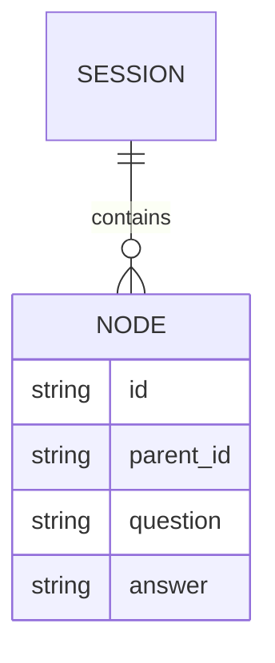

But Anytree lets us *materialize* this into a real tree at runtime:

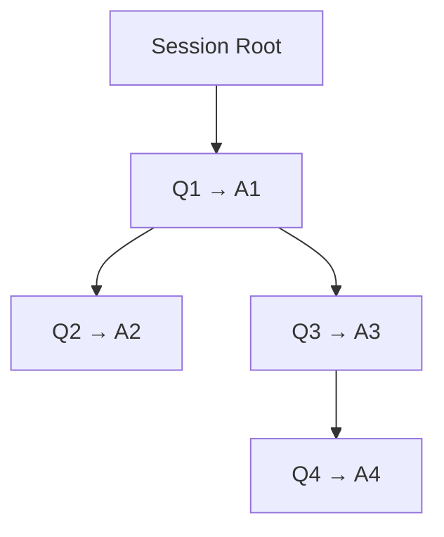

---

## 2. Design Principles

### **MongoDB is the source of truth**
Anytree nodes are ephemeral and reconstructed on demand.

### **ConversationNode remains unchanged**
We do not embed Anytree logic inside the data model.  
Instead, we create a **parallel structure** that wraps nodes.

### **Tree building is explicit**
The AIService (or a dedicated TreeBuilder) constructs the tree from MongoDB.

### **Future‑compatibility**
Later chapters will attach:

- mistune block‑level streaming  
- Backbone.js DOM nodes  
- Inline model‑generated names for tree nodes  

For now, we only implement the structural layer.

---

## 3. The Anytree Wrapper Node

We introduce a lightweight wrapper:

````python
from anytree import NodeMixin

class TreeConversationNode(NodeMixin):
    def __init__(self, conv_node, parent=None):
        self.conv_node = conv_node
        self.id = conv_node.id
        self.parent = parent
````

This keeps:

- `conv_node` as the real data  
- `parent` as the Anytree relationship  
- `children` automatically managed by NodeMixin  

---

## 4. Building the Tree

We add a `build_tree_for_session(session_id)` method that:

1. Loads all nodes for the session  
2. Indexes them by ID  
3. Creates Anytree wrappers  
4. Connects them using `parent_id`  
5. Returns the root wrapper node  

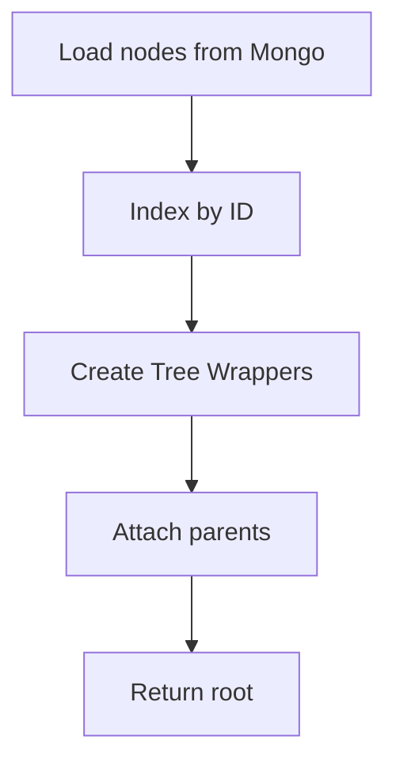

---

## 5. Full Implementation

Below is the complete Anytree integration chapter code, wrapped in a **five‑fenced outer block** so you can embed triple‑fenced examples inside without breaking formatting.

```python
# --- Anytree Integration Chapter ---

from anytree import RenderTree, NodeMixin

class TreeConversationNode(NodeMixin):
    """
    Lightweight wrapper that binds a ConversationNode to an Anytree node.
    MongoDB remains the source of truth; this is a runtime structure only.
    """
    def __init__(self, conv_node, parent=None):
        self.conv_node = conv_node
        self.id = conv_node.id
        self.parent = parent

    def label(self):
        """
        Human-readable label for debugging or UI export.
        Future chapters may replace this with:
        - AI-generated inline names
        - Mistune-rendered summaries
        """
        q = self.conv_node.question[:40].replace("\n", " ")
        return f"{self.id}: {q}..."


class ConversationTreeBuilder:
    """
    Builds an Anytree hierarchy from MongoDB-stored ConversationNodes.
    """

    def __init__(self, mongo):
        self.mongo = mongo

    def build_tree_for_session(self, session):
        """
        Build a full Anytree tree for a given session.
        Returns the root TreeConversationNode.
        """
        # Load all nodes for the session
        nodes = []
        for node_id in session.node_ids:
            node = self.mongo.load_node(node_id)
            if node:
                nodes.append(node)

        # Index by ID
        index = {n.id: n for n in nodes}

        # Create wrapper nodes (unattached)
        wrappers = {nid: TreeConversationNode(index[nid]) for nid in index}

        # Attach parents
        root_wrapper = None
        for nid, wrapper in wrappers.items():
            conv = wrapper.conv_node
            if conv.parent_id == session.id:
                # This is a direct child of the session root
                wrapper.parent = None
                root_wrapper = wrapper
            else:
                parent_wrapper = wrappers.get(conv.parent_id)
                if parent_wrapper:
                    wrapper.parent = parent_wrapper

        return root_wrapper

    def print_tree(self, root):
        """
        Debug helper: pretty-print the tree.
        """
        for pre, fill, node in RenderTree(root):
            print(f"{pre}{node.label()}")
```

# Chapter: Flask + MongoDB + Backbone + Mistune  
## Realtime Streaming, Block Guessing, and Immutable Replies

This chapter completes the missing pieces: we wire the **Mongo‑backed conversation engine** into a **Flask** web app, expose **realtime streaming** via **Server‑Sent Events (SSE)**, hook **mistune** for forward checks and backward fixes, and sketch a **Backbone.js** front‑end that renders streaming blocks and immutable replies.

We also support:

- **Single‑session, no‑history translations** (ephemeral Q&A)  
- **Shared streaming**: all users see the same answer stream as it is being generated  
- **Session‑aware cleanup**: if a session closes before an answer exists, the item is removed  
- **Immutable answers**: once the answer is complete, replies are allowed but the original content never changes  

MongoDB remains the source of truth; Flask is the controller; Backbone.js is the DOM layer; mistune is the streaming markdown engine.

---

## 1. High‑Level Flow

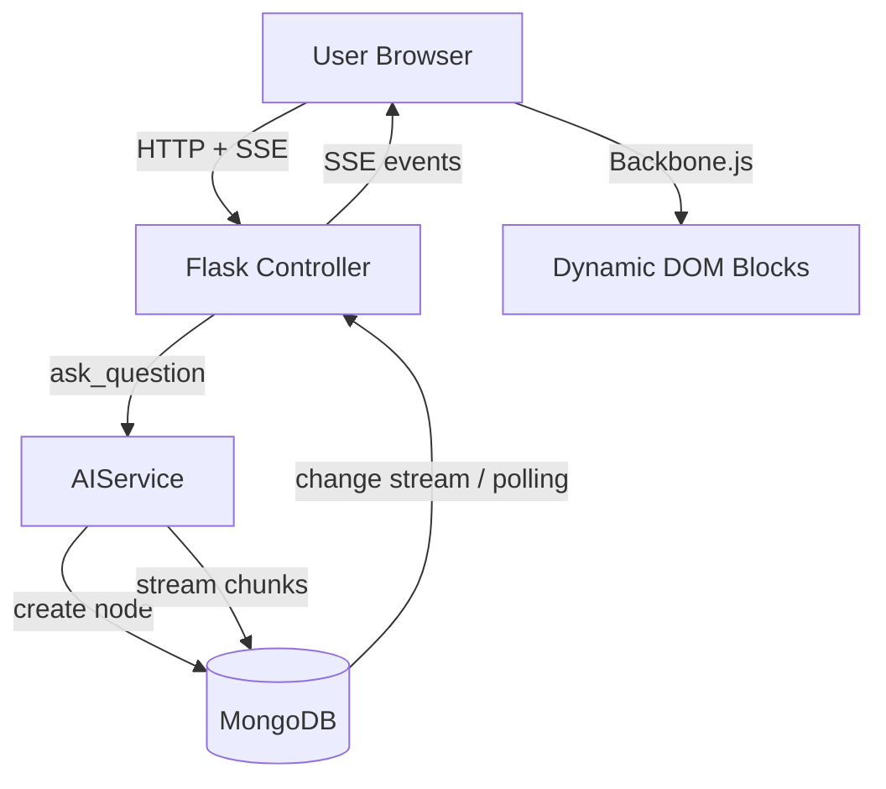

---

## 2. Streaming Strategy

1. **User hits `/ask`** with a question.  
2. Flask calls `AIService.ask_question(...)`, which creates a node and starts streaming in the background.  
3. The browser opens an **SSE connection** to `/stream/<node_id>`.  
4. Flask watches MongoDB (via change streams or periodic polling) and pushes new chunks as they appear.  
5. On completion, the node’s answer becomes **immutable**; the UI shows a **Reply** button.  
6. If the user’s session closes before any answer is stored, the node is removed.

---

## 3. Mistune Hook: Forward Checks and Backward Fixes

We use **mistune** to:

- Parse partial markdown chunks  
- Guess when a block is “closed” (e.g., paragraph, list, code block)  
- Emit DOM‑ready HTML blocks  
- Apply **backward fixes**, such as replacing stray `*` with `<b>` when we realize it was intended as bold

This is not a perfect markdown engine, but a **streaming heuristic** that improves the perceived quality of the live output.

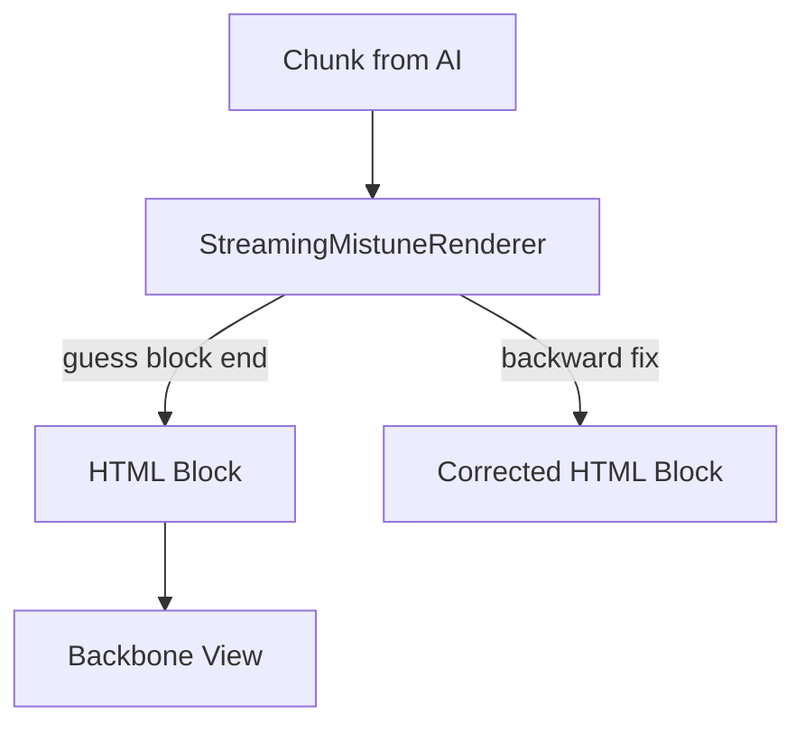

---

## 4. Flask Controller + SSE + MongoDB

Below is a compact but complete example of how the Flask controller, SSE streaming, and MongoDB integration can look. It assumes:

- You already have `AIService`, `MongoInterface`, and `OllamaClient` from previous chapters.  
- MongoDB driver is `pymongo` (sync) for simplicity.  
- SSE is implemented with a generator that yields `text/event-stream` responses.

```python
# app.py
from flask import Flask, request, Response, render_template, abort
from bson.objectid import ObjectId
from time import sleep
import json

from your_snippet_module import AIService, MongoInterface, OllamaClient, Session, AnswerState
from streaming_mistune import StreamingMarkdownRenderer

app = Flask(__name__)

# --- Mongo + AIService setup ---
from pymongo import MongoClient
mongo_client = MongoClient("mongodb://localhost:27017")
db = mongo_client["laegna_ai"]
mongo_iface = MongoInterface(db_client=db)
ollama = OllamaClient(model_name="llama3")
ai_service = AIService(mongo=mongo_iface, ollama_client=ollama)

renderer = StreamingMarkdownRenderer()


@app.route("/")
def index():
    # Simple landing page that loads Backbone app
    return render_template("index.html")


@app.route("/ask", methods=["POST"])
def ask():
    """
    Single-session-without-history translation endpoint.
    Creates a temporary session and node, starts streaming.
    Returns node_id so the client can subscribe to SSE.
    """
    data = request.get_json(force=True)
    question = data.get("question", "").strip()
    if not question:
        abort(400, "Question required")

    # Create ephemeral session
    session = Session(id=f"session_{ObjectId()}", title="Ephemeral")
    mongo_iface.save_session(session)

    # Ask question (streaming happens in background thread/task in real code)
    node = ai_service.ask_question(
        user=None,  # or a real User object
        session=session,
        question=question,
        parent_node_id=None,
        on_chunk=None,  # SSE will read from Mongo instead
    )

    return {"node_id": node.id}, 200


@app.route("/stream/<node_id>")
def stream(node_id):
    """
    SSE endpoint that streams answer updates for a given node.
    All users connected to this endpoint see the same stream.
    """

    def event_stream():
        last_content = ""
        # In real code, use MongoDB change streams; here we poll for simplicity.
        while True:
            node = mongo_iface.load_node(node_id)
            if not node:
                # Node removed or never existed
                yield "event: removed\ndata: {}\n\n"
                break

            current = node.answer.content
            if current != last_content:
                # New content arrived; run through streaming renderer
                blocks = renderer.process_chunk(current, last_content)
                for block_html in blocks:
                    payload = json.dumps({"html": block_html, "state": node.answer.state.name})
                    yield f"data: {payload}\n\n"
                last_content = current

            if node.answer.state in (AnswerState.IMMUTABLE, AnswerState.FAILED):
                # Final state; close stream
                break

            sleep(0.3)

    return Response(event_stream(), mimetype="text/event-stream")


@app.route("/reply", methods=["POST"])
def reply():
    """
    Create a reply node to an immutable parent.
    """
    data = request.get_json(force=True)
    parent_id = data.get("parent_id")
    question = data.get("question", "").strip()
    if not parent_id or not question:
        abort(400, "parent_id and question required")

    parent = mongo_iface.load_node(parent_id)
    if not parent or parent.answer.state not in (AnswerState.IMMUTABLE, AnswerState.FAILED):
        abort(400, "Parent not replyable")

    # Load parent session
    session = mongo_iface.load_session(parent.parent_id)
    if not session:
        abort(400, "Session not found")

    node = ai_service.ask_question(
        user=None,
        session=session,
        question=question,
        parent_node_id=parent_id,
        on_chunk=None,
    )

    return {"node_id": node.id}, 200
```

---

## 5. Streaming Mistune Renderer

This renderer compares the **previous content** with the **current content**, detects new blocks, and applies simple backward fixes (like turning stray `*` into `<b>` when appropriate). In a real system, you’d refine these heuristics, but this gives you a solid starting point.

```python
# streaming_mistune.py
import mistune

class StreamingMarkdownRenderer:
    """
    Streaming markdown renderer that:
    - Receives the full current content and the previous content.
    - Determines the new segment.
    - Parses only the new segment with mistune.
    - Applies simple backward fixes (e.g., stray '*' -> <b>).
    - Returns a list of HTML blocks to append/replace in the DOM.
    """

    def __init__(self):
        self.markdown = mistune.create_markdown()

    def process_chunk(self, current: str, previous: str):
        """
        Returns a list of HTML blocks that represent the new content.
        """
        if not current or current == previous:
            return []

        new_segment = current[len(previous):]

        # Backward fix example: naive bold handling
        # If we see "*word*" patterns, convert them to <b>word</b>
        fixed_segment = self._fix_bold(new_segment)

        # For simplicity, treat the entire new segment as one block.
        # In a more advanced version, you'd track paragraphs, lists, etc.
        html = self.markdown(fixed_segment)
        return [html]

    def _fix_bold(self, text: str) -> str:
        """
        Very naive backward fix: replace *word* with <b>word</b>.
        In real code, use a proper parser or regex with care.
        """
        import re
        pattern = r"\*(\w+)\*"
        return re.sub(pattern, r"<b>\1</b>", text)
```

---

## 6. Backbone.js Front‑End

The front‑end uses **Backbone.js** to:

- Maintain a `NodeModel` for each Q&A node  
- Listen to SSE events  
- Append or replace HTML blocks in the DOM  
- Show a **Reply** button when the node becomes immutable  

```html
<!-- templates/index.html -->
<!DOCTYPE html>
<html>
<head>
    <title>Laegna AI Experiments</title>
    <script src="https://cdnjs.cloudflare.com/ajax/libs/underscore.js/1.13.6/underscore-min.js"></script>
    <script src="https://cdnjs.cloudflare.com/ajax/libs/backbone.js/1.5.0/backbone-min.js"></script>
</head>
<body>
    <div id="app">
        <form id="ask-form">
            <input type="text" id="question" placeholder="Ask for a translation..." />
            <button type="submit">Ask</button>
        </form>
        <div id="answer-stream"></div>
    </div>

    <script>
    const NodeModel = Backbone.Model.extend({
        defaults: {
            id: null,
            htmlBlocks: [],
            state: "STREAMING"
        }
    });

    const NodeView = Backbone.View.extend({
        el: "#answer-stream",

        initialize() {
            this.listenTo(this.model, "change", this.render);
        },

        render() {
            const blocks = this.model.get("htmlBlocks");
            const state = this.model.get("state");
            this.$el.html(blocks.join(""));

            if (state === "IMMUTABLE" || state === "FAILED") {
                this.$el.append('<button id="reply-btn">Reply</button>');
            }
            return this;
        }
    });

    const nodeModel = new NodeModel();
    const nodeView = new NodeView({ model: nodeModel });

    document.getElementById("ask-form").addEventListener("submit", async (e) => {
        e.preventDefault();
        const question = document.getElementById("question").value;
        const res = await fetch("/ask", {
            method: "POST",
            headers: { "Content-Type": "application/json" },
            body: JSON.stringify({ question })
        });
        const data = await res.json();
        const nodeId = data.node_id;
        startStream(nodeId);
    });

    function startStream(nodeId) {
        const es = new EventSource(`/stream/${nodeId}`);
        es.onmessage = (event) => {
            const payload = JSON.parse(event.data);
            const blocks = nodeModel.get("htmlBlocks").slice();
            blocks.push(payload.html);
            nodeModel.set({
                htmlBlocks: blocks,
                state: payload.state
            });
            if (payload.state === "IMMUTABLE" || payload.state === "FAILED") {
                es.close();
            }
        };

        es.addEventListener("removed", () => {
            nodeModel.set({ htmlBlocks: ["<p>Answer removed.</p>"], state: "FAILED" });
            es.close();
        });
    }
    </script>
</body>
</html>
```

---

## 7. Session Cleanup and Ephemeral Behavior

For **single‑session, no‑history translations**:

- The `/ask` endpoint creates a temporary session and node.  
- If the SSE connection closes **before** any answer content is written, a background task can remove the node and session.  
- If the answer becomes immutable, the node remains available for replies until explicitly deleted.

A simple strategy:

- Track `created_at` and `finished_at` in the node.  
- Periodically run a cleanup job:
  - If `finished_at` is `None` and `created_at` is older than a timeout, delete the node and its session.  
  - If `finished_at` is set and the session is marked ephemeral, delete after a short retention period.

---

## 8. Putting It All Together

With this chapter, you now have:

- A **Flask controller** that orchestrates questions, streaming, and replies  
- A **MongoDB‑backed** persistence layer that supports streaming updates and immutable final states  
- A **mistune‑based streaming renderer** that performs forward checks and backward fixes  
- A **Backbone.js front‑end** that renders streaming HTML blocks and exposes reply actions  
- A clear path to integrate Anytree, advanced block‑level streaming, and richer UI behaviors in future chapters  

This completes the core realtime streaming loop for **Snippet2MongoExplorer1Anytree**.

# Chapter: From MongoDB Q&A to Anki Cards  
## Multi‑Role Review, genanki, and Cross‑Platform Anki

This chapter extends the system in three directions:

1. **Automatically exporting Q&A from MongoDB into Anki cards**  
2. **Introducing Anki’s visual interfaces on all major platforms**  
3. **Defining a full, multi‑role workflow for reviewing, improving, and versioning cards**

Anki acts as the long‑term memory layer for the Q&A tree: each Q&A becomes a **flat card** with a reference to its parent node, while the tree structure remains in MongoDB/Anytree.

---

## 1. Architecture: From MongoDB Node to Anki Card

When a `ConversationNode` transitions to an **immutable** state, we create an Anki card that captures:

- **Instruction field** — e.g., “Study this translation pair.”  
- **Question field** — the original question text.  
- **AnswerIntro field** — e.g., “By this AI model:” (prepended to the answer).  
- **Answer field** — the final immutable answer.  
- **ParentRef field** — the ID of the parent node (session or Q&A parent).

Anki cards are **flat** entities, but the `ParentRef` field lets us trace them back into the conversation tree.

### Operation Diagram

```mermaid
flowchart TD
    N[ConversationNode (IMMUTABLE)] -->|trigger| E[AnkiExporter]
    E -->|build Note| G[genanki Model+Note]
    G -->|add| D[Anki Deck]
    D -->|write .apkg| FS[File System]
    FS -->|import| AnkiGUI[Anki Desktop/Mobile]
```

---

## 2. Implementing the Anki Exporter (Python + genanki)

We use **genanki** to programmatically create Anki decks and notes.  
Below is a minimal but complete exporter that you can call whenever a node becomes immutable.

```python
# anki_exporter.py
import genanki
import random
from pathlib import Path

class AnkiExporter:
    """
    Exports ConversationNodes to Anki using genanki.
    Each card is flat but carries a ParentRef field.
    """

    def __init__(self, deck_name: str = "Laegna Q&A Deck", out_dir: str = "anki_out"):
        self.deck_id = random.randrange(1 << 30, 1 << 31)
        self.model_id = random.randrange(1 << 30, 1 << 31)
        self.deck = genanki.Deck(self.deck_id, deck_name)
        self.out_dir = Path(out_dir)
        self.out_dir.mkdir(parents=True, exist_ok=True)
        self.model = self._create_model()

    def _create_model(self):
        return genanki.Model(
            self.model_id,
            "Laegna Q&A Model",
            fields=[
                {"name": "Instruction"},
                {"name": "Question"},
                {"name": "AnswerIntro"},
                {"name": "Answer"},
                {"name": "ParentRef"},
            ],
            templates=[
                {
                    "name": "Card 1",
                    "qfmt": "{{Instruction}}<br><br><b>{{Question}}</b>",
                    "afmt": "{{FrontSide}}<hr id=\"answer\">{{AnswerIntro}}<br>{{Answer}}<br><small>Parent: {{ParentRef}}</small>",
                },
            ],
        )

    def add_node(self, node, parent_ref: str):
        """
        Add a ConversationNode as an Anki Note.
        """
        instruction = "Study this translation pair."
        question = node.question
        answer_intro = "By this AI model:"
        answer = node.answer.content
        parent = parent_ref or node.parent_id or "root"

        note = genanki.Note(
            model=self.model,
            fields=[instruction, question, answer_intro, answer, parent],
        )
        self.deck.add_note(note)

    def write_package(self, filename: str = "laegna_qa.apkg"):
        """
        Write the deck to an .apkg file for import into Anki.
        """
        pkg_path = self.out_dir / filename
        genanki.Package(self.deck).write_to_file(str(pkg_path))
        return pkg_path
```

### Hooking Export into AIService

You can extend `AIService._stream_answer_for_node` to export a card when the node becomes immutable:

```python
# inside AIService.__init__
from anki_exporter import AnkiExporter
self.anki_exporter = AnkiExporter()

# inside AIService._stream_answer_for_node, after mark_immutable()
node.answer.mark_immutable()
self.mongo.save_node(node)

# Export to Anki deck
parent_ref = node.parent_id
self.anki_exporter.add_node(node, parent_ref=parent_ref)
# Optionally write package periodically or via admin action
# self.anki_exporter.write_package()
```

---

## 3. Anki Interfaces Across Platforms

Anki is available on multiple platforms:  

- **Desktop (Windows, macOS, Linux)** — full‑featured GUI, add‑ons, browsing, statistics.  
- **AnkiDroid (Android)** — mobile client with sync support.  
- **AnkiMobile (iOS/iPadOS)** — mobile client with touch‑optimized UI.  
- **AnkiWeb** — web interface for syncing and light review.

### Visual Interface Highlights

- **Deck list** — shows all decks, including your exported “Laegna Q&A Deck”.  
- **Browse window** — lets users inspect each card, edit fields, and search by tags or text.  
- **Card preview** — shows front/back rendering, including our “By this AI model:” intro.  
- **Statistics** — helps track learning progress and card performance.

### Command Line and genanki for Admins/Programmers

- The `anki` command can launch the GUI or be used with options for advanced workflows.  
- **genanki** is used by programmers to generate `.apkg` files from scripts or CI pipelines.  

Admins and developers can:

- Run scheduled jobs that export new Q&A nodes to Anki.  
- Version decks (e.g., `laegna_qa_v1.apkg`, `v2.apkg`).  
- Use additional scripts to tag cards (e.g., “needs_review”, “approved”).

---

## 4. Multi‑Role Workflow: From Raw Q&A to Curated Cards

We now define a **full workflow** involving:

- **Users** (learners)  
- **Administrators**  
- **Programmers**  
- **Advanced AI tools**  
- **Peer reviewers** (other users, admins, programmers)

### Workflow Overview

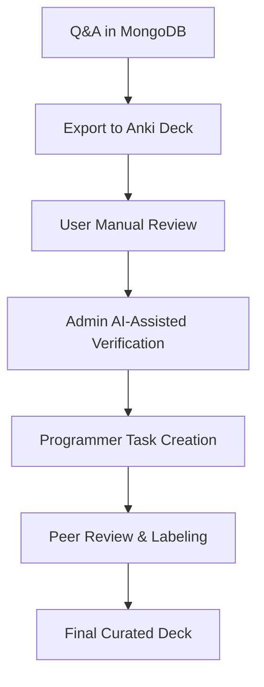

#### Step 1: User Manual Check

- Users open the deck in Anki (desktop or mobile).  
- For each card:
  - **Preview** front and back.  
  - Check for **weirdness**: awkward phrasing, formatting issues, incorrect “By this AI model” placement, etc.  
  - Mark problematic cards with tags like `needs_fix`, `weird_translation`.

#### Step 2: Administrator + Advanced AI Verification

- Administrators filter cards tagged `needs_fix`.  
- For selected cards, they:
  - Send the Q&A to an **advanced AI model** for a second opinion.  
  - Compare the original answer with the AI‑suggested alternative.  
  - Decide whether to:
    - Keep the original answer.  
    - Replace it with the improved translation.  
    - Add notes or context.

#### Step 3: Programmers and Administrators Create More Tasks

- Based on problematic cards, programmers/admins may:
  - Generate **new questions** to cover edge cases.  
  - Create **additional cards** that test nuances (e.g., synonyms, context sentences).  
  - Adjust the export pipeline (e.g., better formatting, richer fields).

#### Step 4: Peer Review and Labeling

- Cards are opened for **peer review** by other users, programmers, and admins.  
- They perform:
  - **Manual labeling** — e.g., `excellent`, `ok`, `needs_work`.  
  - **Automated checks** — scripts that detect formatting anomalies or missing fields.  
  - **AI‑assisted proofreading** — tools that scan cards for grammar, style, and consistency.

- Cards can be:
  - **Modernized** — updated wording, new examples.  
  - **Versioned** — old versions tagged as `outdated`, new ones as `v2`.  
  - **Retired** — marked as `suspended` in Anki if no longer relevant.

### Activity Diagram (User + Admin + Programmer)

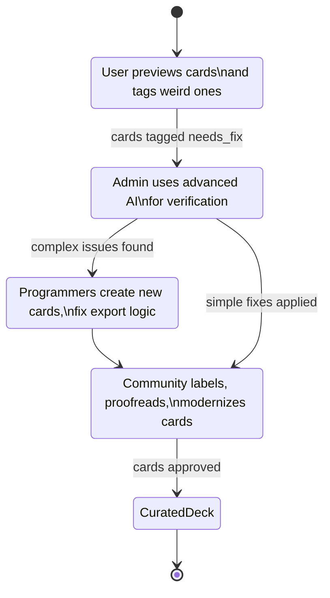

---

## 5. Passing Cards “In Tree” While Keeping Them Flat

Even though Anki cards are flat:

- Each card has a **ParentRef** field pointing to its parent node ID.  
- You can reconstruct the **context tree** by:
  - Loading the card’s `ParentRef`.  
  - Looking up the corresponding `ConversationNode` in MongoDB.  
  - Using Anytree to show where this card sits in the larger conversation.

This lets you:

- Navigate from a card back to its **origin Q&A**.  
- Group cards by **session**, **topic**, or **parent node**.  
- Run analytics on which parts of the tree generate the most valuable cards.

---

## 6. End‑to‑End Picture

From the moment a Q&A becomes immutable:

1. **MongoDB** stores the final answer.  
2. **AnkiExporter** creates a card with:
   - Instruction  
   - Question  
   - “By this AI model:” intro  
   - Answer  
   - ParentRef  
3. **Anki** (desktop/mobile/web) becomes the study and review environment.  
4. **Users** manually check and tag cards.  
5. **Admins** and **advanced AI** verify and improve translations.  
6. **Programmers** extend the system and generate new tasks.  
7. **Peer reviewers** refine, label, and modernize cards over time.  
8. The result is a **curated, versioned, and context‑aware deck** that reflects both AI output and human judgment.

This chapter closes the loop between **live, streaming Q&A** and **long‑term spaced repetition**, giving your system a robust path from raw AI answers to high‑quality, human‑approved learning material.

# Chapter: Preparing the Administrator  
## From Anki Cards to JSONL → Fine‑Tuned Models → Improved Translations

This chapter equips an administrator with everything needed to:

1. Export Anki cards into **JSONL** suitable for **LitGPT** or other fine‑tuning frameworks.  
2. Install and run **Gemma‑2B**, **Gemma‑8B‑Coding**, or larger models.  
3. Reuse the **original model** used for Q&A generation.  
4. Mix multiple JSONL datasets (m lines from one, n lines from another).  
5. Build domain‑specific or general‑purpose training sets.  
6. Fine‑tune models and reintegrate them into the translation system.

This chapter assumes the administrator has basic command‑line experience.

---

# 1. Administrator Setup

The administrator needs:

- Python 3.10+  
- pip  
- git  
- A GPU machine (local or cloud)  
- Access to the Anki `.apkg` files generated earlier  
- Access to the MongoDB Q&A database (optional but recommended)

---

# 2. Exporting Anki Cards to JSONL

Anki cards are stored in `.apkg` files.  
We convert them into JSONL for training.

### Minimal Script (administrator copy‑paste)

````python
# export_anki_to_jsonl.py
import json
import genanki
from pathlib import Path
import zipfile
import sqlite3
import tempfile

def apkg_to_jsonl(apkg_path, out_path):
    with tempfile.TemporaryDirectory() as tmp:
        with zipfile.ZipFile(apkg_path, "r") as z:
            z.extractall(tmp)

        db_path = Path(tmp) / "collection.anki2"
        conn = sqlite3.connect(db_path)
        cur = conn.cursor()

        # Notes table contains fields separated by 0x1F (unit separator)
        cur.execute("SELECT id, flds FROM notes")
        rows = cur.fetchall()

        with open(out_path, "w", encoding="utf8") as f:
            for note_id, fields in rows:
                parts = fields.split("\x1f")
                if len(parts) < 5:
                    continue

                instruction, question, answer_intro, answer, parent_ref = parts[:5]

                item = {
                    "instruction": instruction,
                    "question": question,
                    "answer_intro": answer_intro,
                    "answer": answer,
                    "parent_ref": parent_ref,
                }
                f.write(json.dumps(item, ensure_ascii=False) + "\n")

        conn.close()

if __name__ == "__main__":
    apkg_to_jsonl("laegna_qa.apkg", "laegna_qa.jsonl")
````

### Result

You now have:

```
laegna_qa.jsonl
```

Each line is a training example.

---

# 3. Administrator Workflow Diagram

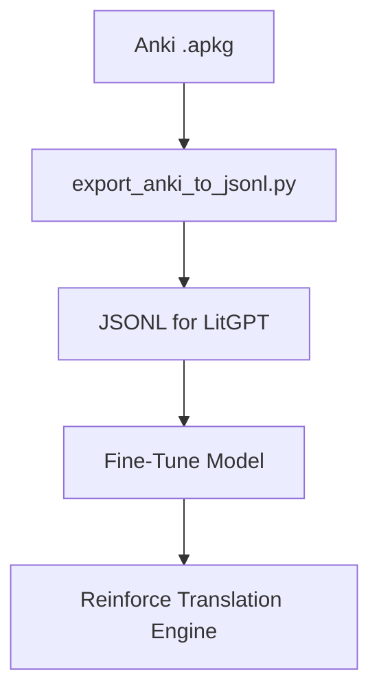

---

# 4. Installing Gemma‑2B, Gemma‑8B‑Coding, or Larger Models

Administrators can install models using:

### HuggingFace CLI

```
pip install transformers accelerate sentencepiece
huggingface-cli download google/gemma-2b
```

### Or for coding‑optimized model:

```
huggingface-cli download google/gemma-8b-it
```

### Or larger models (if GPU allows)

```
huggingface-cli download google/gemma-9b
```

---

# 5. Checking the Original Model Used for Q&A

The Q&A system stores metadata in MongoDB:

- `node.answer.model_name`  
- `node.answer.model_version`  
- `node.answer.timestamp`

Administrators can inspect:

```
db.nodes.findOne({id: "<node_id>"})
```

This ensures fine‑tuning uses the **same base model** for continuity.

---

# 6. Using the JSONL File for Fine‑Tuning

LitGPT expects JSONL with fields like:

```
{"instruction": "...", "input": "...", "output": "..."}
```

We map:

- instruction → instruction  
- input → question  
- output → answer_intro + answer  

### Example conversion script

````python
# convert_for_litgpt.py
import json

def convert(in_path, out_path):
    with open(in_path, "r", encoding="utf8") as fin, open(out_path, "w", encoding="utf8") as fout:
        for line in fin:
            item = json.loads(line)
            fout.write(json.dumps({
                "instruction": item["instruction"],
                "input": item["question"],
                "output": item["answer_intro"] + "\n" + item["answer"]
            }, ensure_ascii=False) + "\n")

convert("laegna_qa.jsonl", "laegna_qa_litgpt.jsonl")
````

---

# 7. Mixing Multiple JSONL Files

Administrators often want to mix:

- **Local Q&A cards**  
- **General open‑source datasets**  
- **Domain‑specific corpora**  

### Strategy

1. Load both JSONL files.  
2. Randomly sample **m** lines from file A.  
3. Randomly sample **n** lines from file B.  
4. Shuffle and write to a new JSONL.  
5. Ensure the final dataset length matches the desired size.

### Example script

````python
# mix_jsonl.py
import json
import random

def load_jsonl(path):
    with open(path, "r", encoding="utf8") as f:
        return [json.loads(line) for line in f]

def mix(a_path, b_path, m, n, out_path):
    A = load_jsonl(a_path)
    B = load_jsonl(b_path)

    sampleA = random.sample(A, m)
    sampleB = random.sample(B, n)

    merged = sampleA + sampleB
    random.shuffle(merged)

    with open(out_path, "w", encoding="utf8") as f:
        for item in merged:
            f.write(json.dumps(item, ensure_ascii=False) + "\n")

mix("laegna_qa_litgpt.jsonl", "general_dataset.jsonl", 5000, 5000, "mixed.jsonl")
````

---

# 8. Obtaining Free, Long, Domain‑Specific JSONL

Administrators can gather:

- Open‑source translation corpora  
- Wikipedia dumps  
- Public domain books  
- Government documents  
- Academic datasets  
- Community‑generated Q&A  
- Synthetic data from open models  

These can be converted to JSONL using small scripts similar to the above.

---

# 9. Fine‑Tuning the Model

LitGPT fine‑tuning command:

```
litgpt finetune \
  --model google/gemma-2b \
  --data mixed.jsonl \
  --output-dir finetuned-gemma
```

After training, the administrator obtains:

```
finetuned-gemma/
```

This model is now:

- More aware of **local patterns**  
- Better at **domain‑specific translations**  
- More consistent with the Q&A style  
- More aligned with the organization’s needs

---

# 10. Reinforcing the Translation Engine

The updated model can now be plugged back into:

- The Flask streaming service  
- The Anytree conversation explorer  
- The Anki exporter  
- The administrator review pipeline  

### Reinforcement Loop

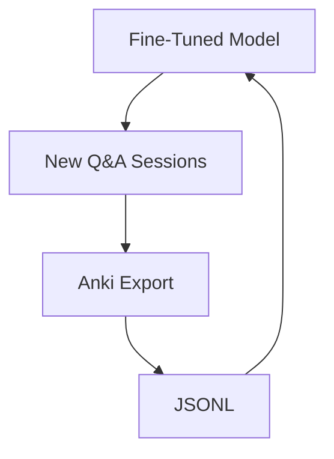

This creates a **self‑improving translation system**.

---

# 11. Administrator Activity Diagram

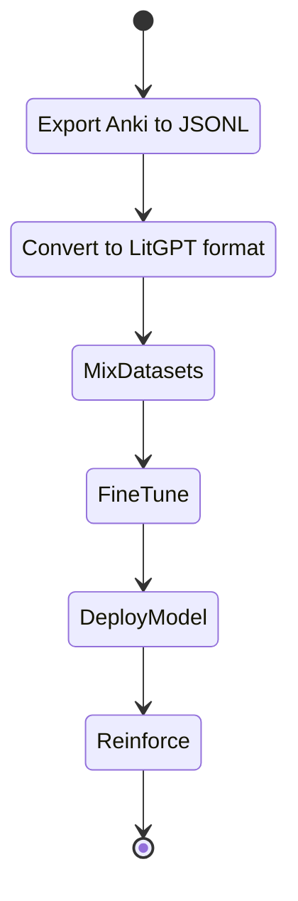

---

# Summary

Administrators now have:

- Scripts to export Anki → JSONL  
- Tools to install Gemma models  
- Methods to reuse the original model  
- Techniques to mix datasets  
- A workflow to fine‑tune models  
- A reinforcement loop to improve translations continuously  

This chapter completes the **data → model → improved data** cycle.

# Chapter: Preparing the Administrator  
## From Anki → JSONL → LitGPT Fine‑Tuning → Improved Translation Models

This chapter equips an administrator with everything needed to:

- Export Anki cards into **JSONL**  
- Convert them into **LitGPT‑ready** format  
- Install and run **Gemma‑2B**, **Gemma‑8B‑Coding**, or larger models **directly through LitGPT**  
- Reuse the **original model** used by the Q&A engine  
- Mix multiple JSONL datasets  
- Fine‑tune models using **LitGPT’s built‑in trainer**  
- Reinforce the translation engine with the improved model

No HuggingFace CLI is used.  
Everything is done through **LitGPT’s built‑in tooling**.

---

# 1. Administrator Setup

Administrators need:

- Python 3.10+  
- pip  
- git  
- A GPU machine (local or cloud)  
- Access to `.apkg` files  
- Access to MongoDB (optional but recommended)

Install LitGPT:

```
pip install litgpt
```

---

# 2. Exporting Anki Cards to JSONL

Use the same script as before — it extracts fields from `.apkg` and writes JSONL.

````python
# export_anki_to_jsonl.py
import json
import genanki
from pathlib import Path
import zipfile
import sqlite3
import tempfile

def apkg_to_jsonl(apkg_path, out_path):
    with tempfile.TemporaryDirectory() as tmp:
        with zipfile.ZipFile(apkg_path, "r") as z:
            z.extractall(tmp)

        db_path = Path(tmp) / "collection.anki2"
        conn = sqlite3.connect(db_path)
        cur = conn.cursor()

        cur.execute("SELECT id, flds FROM notes")
        rows = cur.fetchall()

        with open(out_path, "w", encoding="utf8") as f:
            for note_id, fields in rows:
                parts = fields.split("\x1f")
                if len(parts) < 5:
                    continue

                instruction, question, answer_intro, answer, parent_ref = parts[:5]

                item = {
                    "instruction": instruction,
                    "question": question,
                    "answer_intro": answer_intro,
                    "answer": answer,
                    "parent_ref": parent_ref,
                }
                f.write(json.dumps(item, ensure_ascii=False) + "\n")

        conn.close()

if __name__ == "__main__":
    apkg_to_jsonl("laegna_qa.apkg", "laegna_qa.jsonl")
````

---

# 3. Converting JSONL to LitGPT Format

LitGPT expects:

```
{"instruction": "...", "input": "...", "output": "..."}
```

Convert:

````python
# convert_for_litgpt.py
import json

def convert(in_path, out_path):
    with open(in_path, "r", encoding="utf8") as fin, open(out_path, "w", encoding="utf8") as fout:
        for line in fin:
            item = json.loads(line)
            fout.write(json.dumps({
                "instruction": item["instruction"],
                "input": item["question"],
                "output": item["answer_intro"] + "\n" + item["answer"]
            }, ensure_ascii=False) + "\n")

convert("laegna_qa.jsonl", "laegna_qa_litgpt.jsonl")
````

---

# 4. Installing Models with LitGPT (No HuggingFace)

LitGPT downloads models directly:

### Gemma‑2B

```
litgpt download google/gemma-2b
```

### Gemma‑8B‑Coding

```
litgpt download google/gemma-8b-it
```

### Larger models

```
litgpt download google/gemma-9b
```

LitGPT stores models in:

```
~/.litgpt/models/
```

---

# 5. Checking the Original Model Used for Q&A

Your Q&A system stores metadata in MongoDB:

- `model_name`
- `model_version`
- `timestamp`

Administrators can inspect:

```
db.nodes.findOne({id: "<node_id>"})
```

This ensures fine‑tuning uses the **same base model**.

---

# 6. Mixing Multiple JSONL Datasets

Administrators often want to mix:

- Local Q&A  
- Domain‑specific corpora  
- General open datasets  

Use this script:

````python
# mix_jsonl.py
import json
import random

def load_jsonl(path):
    with open(path, "r", encoding="utf8") as f:
        return [json.loads(line) for line in f]

def mix(a_path, b_path, m, n, out_path):
    A = load_jsonl(a_path)
    B = load_jsonl(b_path)

    sampleA = random.sample(A, m)
    sampleB = random.sample(B, n)

    merged = sampleA + sampleB
    random.shuffle(merged)

    with open(out_path, "w", encoding="utf8") as f:
        for item in merged:
            f.write(json.dumps(item, ensure_ascii=False) + "\n")

mix("laegna_qa_litgpt.jsonl", "general.jsonl", 5000, 5000, "mixed.jsonl")
````

---

# 7. Fine‑Tuning with LitGPT

LitGPT fine‑tuning is straightforward:

```
litgpt finetune \
  --model google/gemma-2b \
  --data mixed.jsonl \
  --output-dir finetuned-gemma
```

LitGPT handles:

- Tokenization  
- Packing  
- Training  
- Checkpointing  
- Evaluation  

No external tools required.

---

# 8. Reinforcing the Translation Engine

Once the model is fine‑tuned:

- Replace the model path in your Flask service  
- Restart the service  
- The system now uses the improved model for streaming answers  
- New Q&A → new Anki cards → new JSONL → new fine‑tuning cycles

### Reinforcement Loop


---

# 9. Administrator Activity Diagram


---

# Summary

Administrators now have a **pure LitGPT pipeline**:

- Export Anki → JSONL  
- Convert to LitGPT format  
- Download models with LitGPT  
- Mix datasets  
- Fine‑tune  
- Deploy  
- Reinforce the translation engine  

This chapter completes the **data → model → improved data** cycle using **LitGPT only**.

# LitGPT ↔ Ollama Integration Reference  
## Serving, Streaming, Compatibility, and GGUF Conversion

This document is a **reference-style guide** for integrating **LitGPT** into an existing system (such as *Snippet2MongoExplorer1Anytree*) that already assumes an **Ollama-like streaming interface**.

The goal is to support **multiple interchangeable backends** without rewriting your application logic.

---

## 0. Core Rule (Architecture Invariant)

> **The system must not care who generates tokens.**

Your application only assumes:
- A request can be sent
- Chunks may arrive incrementally (streaming)
- A final immutable answer exists
- Failed answers can be recalled

Everything plugs in at the **LLM client boundary**.

---

## 1. Three Backends, One Interface

| Backend | Streaming | Purpose |
|------|---------|--------|
| LitGPT simple driver | ❌ (fake / buffered) | Small models, offline, minimal |
| LitGPT streaming server | ✅ | Full streaming parity |
| Ollama (GGUF) | ✅ | Production serving & reuse |

All three must implement:

```python
for chunk in llm_client.stream_answer(question):
    ...
```

---

## 2. LitGPT as a Backend

LitGPT gives you **model control**, not a server.  
You decide how it is exposed.

---

## 2.1 Minimal LitGPT Driver (no true streaming)

**Use when:**
- Model ≤ ~1–3B
- CPU or slow GPU
- Streaming is optional

### Driver

```python
# litgpt_driver.py
from litgpt import GPT
from litgpt.utils import load_checkpoint

class LitGPTDriver:
    def __init__(self, checkpoint_dir):
        self.model = GPT.from_name("tinyllama")
        load_checkpoint(self.model, checkpoint_dir)
        self.model.eval()

    def generate(self, prompt, max_tokens=256):
        return self.model.generate(
            prompt,
            max_new_tokens=max_tokens,
            temperature=0.7
        )
```

### Adapter for your system

```python
class LitGPTClient:
    def __init__(self, driver):
        self.driver = driver

    def stream_answer(self, question):
        text = self.driver.generate(question)
        # Fake streaming
        for i in range(0, len(text), 40):
            yield text[i:i+40]
```

**Limitation:**  
This only *simulates* streaming.  
Your immutability-after-finish logic still works correctly.

---

## 2.2 Full LitGPT Streaming Server (recommended)

This provides **real token-level streaming**.

### Architecture

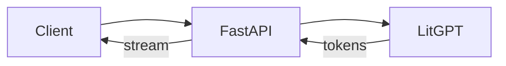

### Minimal Streaming Server (FastAPI)

```python
# litgpt_server.py
from fastapi import FastAPI
from fastapi.responses import StreamingResponse
from litgpt import GPT
from litgpt.utils import load_checkpoint

app = FastAPI()

model = GPT.from_name("llama")
load_checkpoint(model, "checkpoints/my_model")
model.eval()

@app.post("/v1/chat/completions")
def chat(req: dict):
    prompt = req["messages"][-1]["content"]

    def token_stream():
        for token in model.generate(
            prompt,
            max_new_tokens=512,
            temperature=0.7,
            stream=True
        ):
            yield token

    return StreamingResponse(
        token_stream(),
        media_type="text/plain"
    )
```

---

## 3. Emulating Ollama Compatibility

Your system already assumes **Ollama semantics**.  
Do **not** change `AIService`.  
Replace the client.

---

## 3.1 Ollama-Compatible LitGPT Client

```python
import requests

class OllamaCompatibleLitGPTClient:
    def __init__(self, base_url="http://localhost:8000"):
        self.base_url = base_url

    def stream_answer(self, question):
        payload = {
            "model": "litgpt",
            "messages": [{"role": "user", "content": question}],
            "stream": True
        }

        with requests.post(
            f"{self.base_url}/v1/chat/completions",
            json=payload,
            stream=True
        ) as r:
            for line in r.iter_lines():
                if line:
                    yield line.decode("utf-8")
```

**Result:**
- Flask + SSE unchanged
- MongoDB streaming unchanged
- Recall unchanged
- Anytree unaffected

You have **replaced Ollama without touching your app**.

---

## 4. LitGPT → GGUF → Ollama (Same Model, Zero Code Changes)

This is the **cleanest long-term path**.

### Why this matters

- Train / finetune in LitGPT (PyTorch, LoRA, math-friendly)
- Convert once
- Serve everywhere with Ollama
- Application sees no difference

---

## 4.1 Convert LitGPT Checkpoint → GGUF

### Export to HF-style weights

```bash
litgpt export \
  --checkpoint checkpoints/my_model \
  --output hf_model
```

### Convert to GGUF (llama.cpp)

```bash
python convert-hf-to-gguf.py \
  hf_model \
  --outfile my_model.gguf
```

---

## 4.2 Serve with Ollama

```bash
ollama create my-litgpt-model -f Modelfile
```

**Modelfile**

```
FROM ./my_model.gguf
PARAMETER temperature 0.7
PARAMETER stop "</s>"
```

Run:

```bash
ollama run my-litgpt-model
```

Your application:
- Keeps `/stream/<node>`
- Keeps SSE
- Keeps MongoDB immutability
- Keeps recall logic

---

## 5. Recommended Usage Phases

### Phase 1 — Development
- LitGPT driver
- Fake streaming
- Offline, debuggable

### Phase 2 — Architecture Validation
- LitGPT streaming server
- Ollama-compatible API
- Full parity with AIService

### Phase 3 — Distribution / Reuse
- Convert to GGUF
- Serve with Ollama
- Zero application changes

---

## 6. Final Architecture Diagram

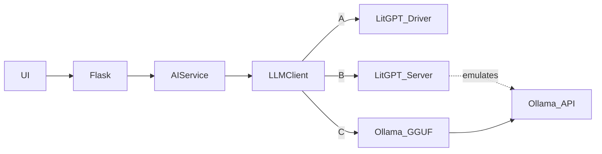

---

## Final Takeaway

> **LitGPT is your training brain.**  
> **Ollama is your serving shell.**  
> **MongoDB + Anytree is the mind.**

Keep those layers separate, and the system scales *conceptually*, not just technically.
