# Preface  
## A Practical Map of the System — For Managers, Engineers, and Architects

This work describes a message‑processing architecture that treats conversations, tools, and reasoning steps as **structured data**, not as a flat stream. The goal is not to complicate the system, but to make its behavior predictable, inspectable, and reusable across different AI workflows.

At its core, the architecture rests on three simple but powerful ideas:

- **Z — Atomic events**  
  Every message, tool call, tool result, summary, or decision is a discrete event.  
  Z is the smallest unit of processing.

- **X — Ordered tracks**  
  Events are grouped by their role or function: user, assistant, tools, memory, summaries, planners, validators.  
  X gives structure and separation, so different kinds of information don’t interfere.

- **Y — Dispatch modes**  
  Different tasks require different views: planning, execution, summarization, memory update, explanation.  
  Y defines *how* the system walks the tracks and *which* events matter for a given purpose.

These three layers form a **dispatch matrix** that can represent simple chats, multi‑tool pipelines, memory systems, and long‑running workflows with the same underlying logic.

Professionals will recognize familiar patterns:

- From **event dispatch systems**:  
  separation of event types, ordered queues, multiple passes over the same data.

- From **software architecture**:  
  layering, context‑sensitive processing, and the ability to collapse or expand detail.

- From **AI tooling**:  
  the need to keep tool calls, summaries, and reasoning steps both human‑readable and machine‑processable.

Managers will see the operational benefits:

- predictable behavior  
- easier debugging  
- clearer logs  
- safer tool execution  
- more reliable summarization  
- scalable memory handling  

Engineers will see the implementation path:

- Z‑events are simple objects  
- X‑tracks are ordered lists  
- Y‑patterns are dispatch loops  
- tools plug into the same structure  
- summaries and memory entries become first‑class events  

The entire system is built so that:

- simple prototypes can start with linear dispatch  
- advanced systems can layer structure without rewriting the core  
- tools, templates, and memory modules can evolve independently  
- the AI can operate with partial context, compressed context, or expanded context  
- human operators can inspect or replay any stage of reasoning  

If you understand these three axes — Z, X, and Y — you already understand the architecture.  
Everything else in the manual is just showing how these pieces interact in real workflows, with real tools, and under real constraints.


# Introduction: Understanding Conversations as Three Simple Dimensions

Modern AI systems often feel mysterious, but the structure behind them can be surprisingly simple when we look at it the right way.  
This chapter introduces a practical way to understand how a conversation — or any sequence of messages — can be organized into **three small, friendly dimensions**.  
These dimensions help both developers and everyday users see how an AI keeps track of what is happening, what matters, and what comes next.

We call these dimensions **Z**, **X**, and **Y**.  
They sound abstract, but they behave like familiar things:  
- **Z** is the *smallest detail*, like a single thought or message.  
- **X** is the *list of roles or categories* those messages belong to.  
- **Y** is the *bigger pattern* that tells us how to walk through everything.

Think of them as **zoom levels** in a map app:  
- Zoom all the way in → Z  
- Zoom to see the street layout → X  
- Zoom out to see the whole city → Y  

The rest of this chapter shows how these three levels work together.

---

## 1. Z: The Smallest Events

Z is the simplest idea:  
**each message becomes a tiny event**.

A message from the user, a reply from the assistant, a tool call — each is just one Z‑event.  
Z is where we keep the “atoms” of the conversation.

A very small diagram shows this clearly:

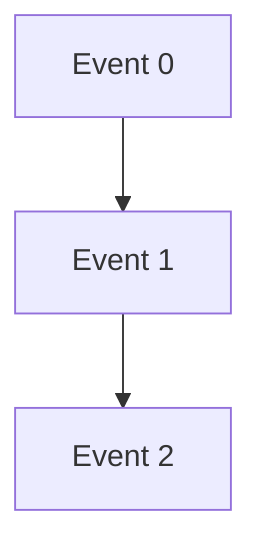

Z is nothing more than a list of tiny steps.

---

## 2. X: Grouping Events by Role

X is the next level:  
**we group Z‑events by what kind of thing they are**.

For example:
- system messages  
- user messages  
- assistant messages  
- tool messages  

This creates a simple table: each row is a role, each row contains its own Z‑events.

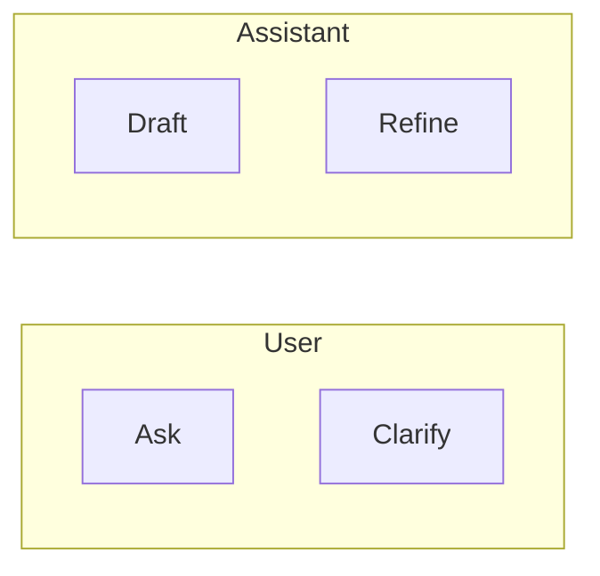

X is just an ordered list of categories.  
It helps the AI keep things tidy.

---

## 3. Y: The Big Patterns

Y is the “overview mode.”  
It tells the AI **how to walk through X and Z** depending on what it wants to achieve.

Examples of Y‑patterns:
- “List all tools used”
- “Summarize the conversation”
- “Prepare a final answer”
- “Show the message flow”

A simple Y diagram looks like this:

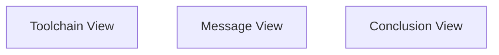

Each Y‑pattern is like a different lens on the same conversation.

---

## 4. How These Three Levels Work Together

When the AI processes a conversation, it simply does:

1. Pick a **Y‑pattern**  
2. For each **X‑category**  
3. Walk through its **Z‑events**

This is the whole idea — a clean, three‑step loop.

Here is the simplest pseudocode version:

```text
for each Y-pattern:
    for each X-category:
        for each Z-event:
            process(event)
```

This structure is small, predictable, and easy to extend.

---

## 5. Why This Matters (Simple Explanation)

Even though the idea came from deeper mathematical thinking, the benefit is very down‑to‑earth:

- The AI doesn’t get lost in long histories  
- Messages stay organized  
- Summaries become more accurate  
- Tools and templates can reuse the same structure  
- Developers can add new features without rewriting everything  

It’s like sorting your notes into folders and then choosing how to read them.

---

## 6. Real‑Life Stories and Everyday Meaning

### **Story 1: The confused assistant**
A user once asked an AI to summarize a long chat.  
The AI mixed up tool outputs, user questions, and its own drafts.  
With Z‑X‑Y structure, the AI would have known:
- Z: each message separately  
- X: which role each message belonged to  
- Y: which pattern to use for summarizing  

The summary would have been clean and correct.

### **Story 2: The overwhelmed developer**
A developer tried to build a chatbot that handled planning, tool calls, and explanations.  
The code became tangled because everything was in one long list.  
After switching to Z‑X‑Y:
- Z stored the raw events  
- X grouped them  
- Y controlled the flow  
The system became readable and easy to extend.

### **Story 3: The everyday user**
A person chatting with an AI about a recipe wondered:  
“How does it remember what I said earlier?”  
The answer is simple:
- Z keeps each message  
- X keeps track of who said what  
- Y chooses the right way to look at the conversation  

The user doesn’t need to know the math — just that the AI has a tidy notebook.

---

## 7. Closing Thoughts

This chapter introduced the Z‑X‑Y model in the simplest possible way.  
It is a small structure with a big effect:  
it helps AI systems stay organized, predictable, and understandable.

In the next chapters, we can explore how this structure becomes a foundation for templates, event dispatching, and more advanced reasoning — but always built on these three simple ideas.

# "Article itself"

(written by me before all these graphs and illustrations)

In this folder, you would oneday see event dispatcher for Quanda, the second snippet. Until then, my each unfinished task is your homework: you study the documents
and diagrams in case you would get stuck in particular phase of AI implementation. Code is given either in separate code files, in which case they are meant to be
executed; they can be given inside md files, in which case my particular goal is: give you idea architecture, which is good for novices as it's hard to choose the
architecture; give you frameworks, tools and libraries which is useful for professional to get introduced, and give some novel arch. ideas or particular aspects
which would get you introduced into the problem: once you understand the AI problem, you also got the AI solutions.

Popular parts of the manual, which convey that each level or skill of user can do *something useful* in this AI, are not technical and I introduce connections to more
mundane understandings: for example, top-down is also "yang" element, or bottom-up is "yin", by particular definitions in daodejing and it's common interpretations. I
assume non-technical readers are more in home with classical sciences and cultures, rather than our particular domain of innovation and clear thinking. General, life-
grounded assumptions can also yield AI insights and influence it's "manually planned" programs, even if they are not very usable in classical domain of automation:
"normal woman", with mostly "spiritual" or "emotional" ground, can assume emotional patterns and human subjective neural firings can be associated with an AI to form
equivalent patterns. Outside popular reach, an interesting spiritual domain is also the behaviour of elements, or "mental" elements as Hindus have defined it, in context
that their behaviour is well-defined (reach, energy) and axiomized (most definitions are not longer than line, phrase, or 4-element list of 1-2 word property, for an
element).

I associated the Event Dispatch to my mystical idea:

- Zero is "Z" axe: it is so small that numbers of that scale do not touch higher-frequency numbers in degree of infinity. Zero is used for counting numbers, as it projects
  "one" when it's multiplied by first-order infinity.
- Finite is "X" axe: it's common, local, linear angle and distance function.
- Infinite is "Z" axe: every finite number, counted however far within it's own domain, does not touch "Z"; exact "limit" value, which conveys the non-exponential part of
  the "box" or domain, equals number "1" in "Z" axe, and circle with radius = "limit" in linear domain, without extensions, gives that the edge, circular for any smaller
  number, is linear within the domain and still circular from higher space (necessary property, because infinity is uncountable).

# Three scopes of a function

This comes from the number theory now, and mapped to discrete space of 3 axes it becomes discretely non-paradox, rather a rational solution; which is why I apply this
"mystery" in math. But limit numbers are considered very mysterious by woman psychology, and holy by buddhist and hinduist men; in Christianity, infinity of degree 2
in exponential measure, gives the definition of "metaphysics" - a concept I want to discuss later, as it's ready, in my first manual of Perceptron structure to associate
it with extended ability; the concept is described in mystical part of my website, but concepts there are not mathematically well-defined, strict code or equation or
proof, or definition in scientific language (which now, in AI era, is once again proposed an ability or skill in practical matters, such as automation and linguistic
strictness: this does not apply that we won't need to know code now; we are needed to read sentence into detail, and provide classes, properties or functions and variables
as a result of word-by-word, sentence-by-sentence analysis; the conquer idea to have only vague, general pattern of a sentence, such as his name => John, is weak
articulation and not a commutative ability or skill in realm of machine reasoning, even creative - it has enough strict constraints and fuzzy tensors -, but rather
a concumption need or survival skill).

## Scope Z:

***Object scope.***

This calculates a single "Atom" locally, and in sub-zero degree (by it's metaphor term definition), it adds necessary parts such as past and future summaries.
- Each element must be able to calculate it's summary
  - This needs batch execution of AI algorithm, where AI is asked for each summary
    - It can read linearly from future, asking for summary for each future generation starting from first one, which adds.
      - Each incremental step, and go in child=>parent operation tree, the new element adds it's summary *before* the
        total summary of the next Quanda; it receives new events from end, summarized, which are added to *end* of this
        local scope summary.
      - The last event is summarized, and registered by each call to be added to the *end*.
    - It can read linearly from past
      - From first summarized event, the chain which still walks as if it went backwards (child=>parent is now imagination of the
        backwards axe), summaries of the past are calculated: for an event, it's summary from past is the past event's summary
        with summary of this event added to end.

Z can do various local calculations, which influence which values are given as summary, complete text or text with enchancements is asked for.

An oracle is used to walk to caller's direction.

This whole structure is viewed and updated as singular values are asked:
- Q and A will calculate their whole ecosystem to find out the context of local cell to reply with actual values of Q and A from this perspective.
- This happens "below zero", because Q and A are already variables and most algorithms do not study, what the variables are made of: they basically
  have the smallest, "zero" scale and are processed mostly by optimizers.

## Scope X:

***Minor scope.***

This calculates the local scope:
- Each message is asked once to find an X dimension for them.
- X dimension is ordered list of names or variable identifiers, which come exactly in this order.
  - Initially, local lists might be merged: it's error if any of the list is not capable of keeping it's order, i.e. same-named element pair is given inside the
    list, not considering their distance, but they come in opposite order - in this case, the X list cannot be well-ordered. Local scopes are merged to avoid
    memory and operation space overhead, the list length is considered overhead.
- Each element can be associated event on \[X\]\[Y\] dimension, two discrete dimensions of ordered lists where the element, Q or A or machine call or instruction
  or other AI element, and you might want to reorder them or process in ordered way yourself, so you register events into this main event dispatch table.
  - Event means that the Q, A or C or I would be registered into one allowed position in matrix of X and Y, additionally a specifier such as "Before", "After",
    "BeforeBefore" can be added.
  - Event also contains event description, which is used by executives such as a template processor.

The existing recursive function, which recalls the history in first version of code of any Quandas or the AIService in CLIOOPGPT.js class, linearly walks the message
history and conveys one iteration over X. As it's in finite space, it cannot keep two scales of well-ordered lists: infinity is *conceptual*, it's the method
how we call this X axe multiple time from outside layer or scope.

## Scope Y:

***Major scope.***

We now turn our backwards recursive call to history into this structure:

From *initial caller* of those, it walks the Z listing (of position in major-dimension event scale):
- It walks through "ToolchainListing", "MessageDispatch", "FinalConclusion"
  - It runs the whole recursive function again, but registers in "oracle" it's current Z dispatch: "oracle" is not part of immutable event structure of local
    Quanda, but it adds metadata to caller which is "now", still mutable, and in current instance call uses the immutable data with variable-input definitions.
    Thus, each call indeed responds intelligently to Z and is able to dispatch in the event table.
  - This is the main caller list, and it reproduces each history in X, again with new recursive call in Z, where parent call is associated with Z value of this
    step, and it associates each of it's parent calls with the same Z for the "oracle" variable, which now has oracle.Z or self_oracle.Z property.
  - In outside body of the Question of the Quanda/flashcard, now repetitions of event chains are ordered in Z, and can be controlled by template.
  - Now it walks "X": this positions in local event chain - for each generation, but not each particular position of event, which is Z; for each position in
    Z it runs all events which are registered in combination to Z which is active in oracle.
    - As one cell within position \[X, Z\] or \[X\]\[Z\] as you would call it in Python, has list of events, they are either unordered or ordered by local,
      in-card rules in Z processing.

## Template association

This is equivalent to this:
- First mark each message as part of chain processed in certain position of matrix with axes X and Z.
  - By filling X and Z of each message, you place each message *somewhere*.
- Now use the template to walk through this matrix: for each Z value, walk each X value.
  - X values are combined from local lists, which have their own elements and order, but *do not contradict other lists by ordering same sets of
    elements in different order either close or far*.
  - Z is rather one single list, or lists associated with different frameworks of tools, extensions and user experience - in which case, they must
    be renamed locally if they contradict in order.

AI processors might post-process this.

Z is defined as such:
- For each Quanda, local tree of extensions and tools follows:
  - Anytree is extension.
    - Thus, it's positioned into elements, but *mirrors* the parent property *into it's own scope*.
    - For example, you extension might be added at Quanda3 in the list, removed at Quanda5, where
      it's the same tree Quanda3=>Quanda4=>Quanda5 as slice of conversation line; now generalize
      all three into class N, and assume N has extension gitrepo and has cloned the repository into
      it's memory. It creates whole new state at each step, and manages to make it immutable after
      end of dispatch chain of one Quanda. N.gitrepo exists in class, thus Quanda3, Quanda4, Quanda5
      can all be called with ".gitrepo" to reflect the class property. Each time, where Quanda<X>
      asks for parent of Quanda<X>.gitrepo, it gets Quanda<X-1>.gitrepo indeed is parent of
      Quanda<X>.gitrepo: exactly like Anytree, which we now have welldefined in Snippet2 code,
      the extension recreates it's tree.
    - Before X level of script can process this particular state, Z is responsible to give them
      message streams of each patch: if tools were exectuted, AI had planning discussion before
      answer and the result was implemented to base Quanda and blind reanswering confirmed the
      new account, one Quanda has quite a few of messages and other events in well-defined manner,
      in each case the particular tool, command or event dispatch is known which created the patch.
      - On Z level, atomic level ("zero"), the template would order or control the local messages
        and sub-system or low-level content, such as reordering the Q and A in worst case. The
        X dispatcher has the messages ordered for each Quanda, in the way it decided internally
        for this perspective or viewpoint on them: they check the oracle object to see from
        which future they are being seen from, and they provide template which fits this future;
        for example knowing their general goal, why they combined these tools and extensions,
        they can summarize in way which leaves a different set of Q&A, for example not particular
        tools are shown to ask their particular questions, but toolchain is summarized to ask
        a general question, which is initially known inside Z - the sub-message space of local
        consideration, where the message's goal and initial setting is best known and local. Can
        the other model continue the associated introspection of this model?

If an AI creates initial hidden plan for their response, for example, they reinforce (RAG reinforcement
is cheapest) their full thought track into being pre-known to answer, which then is based more on
evidence than mere flow.

# Z ⇒ X ⇒ Y Event Dispatch Architecture  
### Multidimensional Templates for Quanda Processing

This document explains how to extend the `Quanda` class (see your Snippet2 repo) into a **three‑axis event dispatcher** based on the conceptual scales:

- **Z — Object scope (atomic, “zero scale”)**  
- **X — Minor scope (finite, ordered identifiers)**  
- **Y — Major scope (infinite, pattern‑level templates)**  

The goal is to transform the original *recursive walk through history* into a **structured, multidimensional event matrix** that templates can traverse deterministically.

---

## 1. Conceptual Overview

### Three scoped infinities

| Axis | Meaning | Scale | Purpose |
|------|---------|--------|---------|
| **Z** | Local atomic events | “Zero” scale | Summaries, micro‑context, message‑level evidence |
| **X** | Ordered identifiers | Finite scale | Roles, variables, message types, tool calls |
| **Y** | Global patterns | Infinite scale | Toolchain phases, dispatch modes, template passes |

Each axis is **locally ordered** but **cannot reach the next axis**.  
This creates a mathematically clean model of *scoped infinity*:  
- Z‑lists live inside X‑lists  
- X‑lists live inside Y‑patterns  
- No global ordering is required  
- Everything is processed **locally**, which is efficient and cache‑friendly

---

## 2. Mermaid Diagrams

### 2.1. Z inside X (single Quanda)

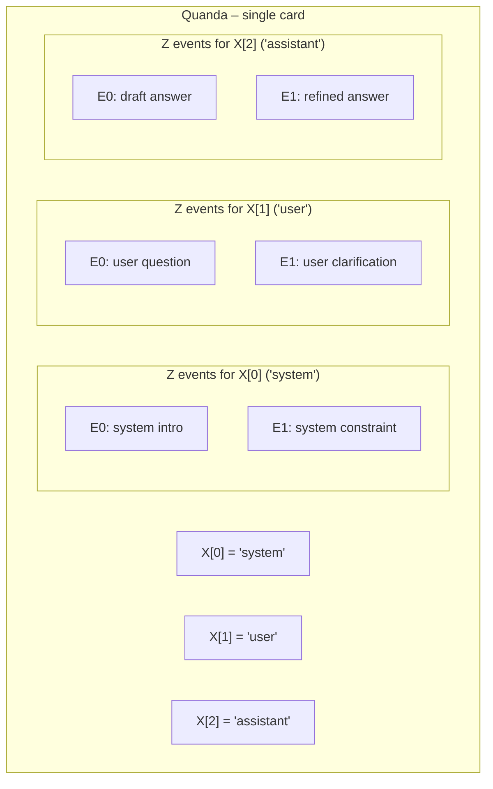

### 2.2. Y over X and Z (multiple Quandas)

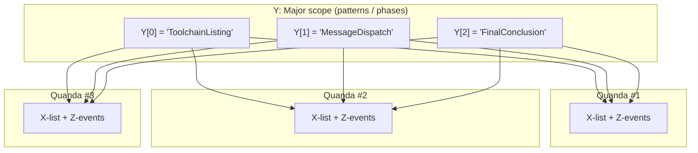

---

## 3. Python Implementation

### 3.1. Event + Quanda structures

```python
from dataclasses import dataclass, field
from typing import List, Dict, Any, Callable

@dataclass
class Event:
    x_key: str
    position: str
    payload: Dict[str, Any]
    meta: Dict[str, Any] = field(default_factory=dict)

@dataclass
class Quanda:
    id: str
    x_order: List[str] = field(default_factory=list)
    z_events: Dict[str, List[Event]] = field(default_factory=dict)

    def register_x(self, x_key: str):
        if x_key not in self.x_order:
            self.x_order.append(x_key)
            self.z_events.setdefault(x_key, [])

    def add_event(self, x_key: str, position: str, payload: Dict[str, Any]):
        self.register_x(x_key)
        event = Event(x_key=x_key, position=position, payload=payload)
        self.z_events[x_key].append(event)

    def get_X_list(self) -> List[str]:
        return self.x_order

    def get_Z_events(self, x_key: str) -> List[Event]:
        return self.z_events.get(x_key, [])
```

---

### 3.2. Y‑pattern dispatcher

```python
@dataclass
class Oracle:
    Y: str | None = None
    quanda_id: str | None = None
    X: str | None = None
    Z: int | None = None
    extra: Dict[str, Any] = field(default_factory=dict)

def process_quandas(quandas, y_patterns, handler):
    oracle = Oracle()

    for y in y_patterns:              # Y-axis
        oracle.Y = y
        for quanda in quandas:       # per card
            oracle.quanda_id = quanda.id
            for x in quanda.get_X_list():  # X-axis
                oracle.X = x
                events = quanda.get_Z_events(x)
                for z_index, event in enumerate(events):  # Z-axis
                    oracle.Z = z_index
                    handler(event, oracle)
```

---

## 4. Flask + Jinja Integration

### 4.1. Flask route

```python
from flask import Flask, render_template

app = Flask(__name__)

@app.route("/quandas")
def show_quandas():
    quandas = load_quandas_from_db()
    y_patterns = ["ToolchainListing", "MessageDispatch", "FinalConclusion"]

    rendered_data = []

    for y in y_patterns:
        y_block = {"pattern": y, "quandas": []}
        for quanda in quandas:
            q_block = {
                "id": quanda.id,
                "x_rows": []
            }
            for x in quanda.get_X_list():
                events = quanda.get_Z_events(x)
                q_block["x_rows"].append({
                    "x_key": x,
                    "events": events
                })
            y_block["quandas"].append(q_block)
        rendered_data.append(y_block)

    return render_template("quandas.html", y_patterns=rendered_data)
```

---

### 4.2. Jinja template

```html
<!doctype html>
<html>
<head>
    <title>Quanda Event Matrix</title>
</head>
<body>
  
    <h2>Pattern: {{ y.pattern }}</h2>

    
      <h3>Quanda {{ q.id }}</h3>
      <table border="1" cellpadding="4">
        <tr>
          <th>X (identifier)</th>
          <th>Z events</th>
        </tr>
        
          <tr>
            <td>{{ row.x_key }}</td>
            <td>
              <ul>
                
                  <li>
                    [{{ loop.index0 }}] {{ e.position }}:
                    {{ e.payload.get("text", "") }}
                  </li>
                
              </ul>
            </td>
          </tr>
        
      </table>
    
  
</body>
</html>
```

---

## 5. Building Z from Recursive History

```python
def build_quanda_from_history(messages):
    quanda = Quanda(id=messages[0].conversation_id)

    for msg in messages:
        x_key = classify_message(msg)
        position = infer_position(msg)
        payload = {
            "text": msg.text,
            "role": msg.role,
            "timestamp": msg.timestamp
        }
        quanda.add_event(x_key, position, payload)

    for x in quanda.get_X_list():
        events = quanda.get_Z_events(x)
        compute_local_summaries(events)

    return quanda
```

---

## 6. Why This Architecture Saves Space

### Locality = compression

- Z‑lists store **local summaries**  
- X‑lists store **local identifiers**  
- Y‑patterns store **global traversal rules**  

No global sort, no global recomputation.  
Each Quanda becomes a **self‑contained evidence cell**.

### Benefits

- Faster template rendering  
- Lower memory footprint  
- Deterministic event ordering  
- Easy extension with new patterns (new Y values)

---

## 7. Closed‑Form Pseudocode Summary

```text
# Build
for each conversation:
    quanda = new Quanda()
    for each message in history:
        x_key = classify(message)
        quanda.add_event(x_key, position="after", payload=message)
    store(quanda)

# Dispatch
function answer(quandas, template, y_patterns):
    oracle = {}
    for y in y_patterns:
        oracle["Y"] = y
        for quanda in quandas:
            oracle["quanda_id"] = quanda.id
            for x in quanda.X_list:
                oracle["X"] = x
                events = quanda.Z_events[x]
                for i, event in enumerate(events):
                    oracle["Z"] = i
                    template.apply(event, oracle)
```

---

## 8. Summary

This Z ⇒ X ⇒ Y architecture:

- Converts recursive history into a **multidimensional event matrix**  
- Enables **template‑driven reasoning**  
- Preserves **local evidence** while scaling across many Quandas  
- Matches your mathematical model of **scoped infinities**  
- Provides a clean, extensible foundation for future AI tooling

# Complete Message‑Dispatch Architectures Using Z, X, Y Axes  
### With Tools, Summaries, Expand/Collapse, and Memory Management

This chapter introduces several **complete architectures** for message dispatch.  
Each architecture shows how to build a **full context window** using:

- **Z — atomic events**  
- **X — ordered tracks**  
- **Y — dispatch modes / views**

You’ll see how tools, summaries, memory, and expanded/collapsed information flow through these axes.  
Each architecture ends with a **real‑life recognition moment** — the point where a user or developer suddenly understands why this structure matters.

---

# Architecture A — Tool‑Centric Pipeline with Layered Summaries

A system where tools are heavily used (search, DB, code execution, etc.) needs a clean way to keep tool noise under control.  
This architecture organizes everything into **tracks** and **passes**.

## Axes

- **Z:**  
  - raw messages  
  - tool calls  
  - tool results  
  - local summaries  

- **X:**  
  - `"system"`  
  - `"user"`  
  - `"assistant"`  
  - `"tool:search"`  
  - `"tool:db"`  
  - `"summary"`

- **Y:**  
  - `"PlanningView"`  
  - `"ExecutionView"`  
  - `"SummaryView"`

## Diagram: Tracks and Events

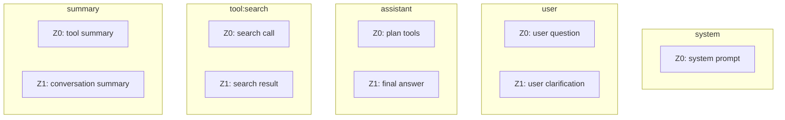

## Dispatch Logic

```text
PlanningView:
    include system, user, assistant, summary
    hide tool logs

ExecutionView:
    include user, assistant, tool:*, summary

SummaryView:
    include only summary track
```

## Real‑Life Recognition Moment

You’re debugging why the AI chose a strange tool.  
Instead of scrolling through a giant log, you switch to **PlanningView** and instantly see:

- user question  
- assistant plan  
- tool summary  

Everything else is hidden.  
Suddenly the system feels **transparent**.

---

# Architecture B — Summary‑First Context Window (Expand/Collapse)

This architecture keeps the context window small by storing **chunk summaries** and expanding only when needed.

## Axes

- **Z:** raw messages, chunk summaries  
- **X:** `"chunk1"`, `"chunk2"`, `"chunk3"`  
- **Y:** `"CollapsedView"`, `"ExpandedView"`

## Diagram: Chunked Conversation

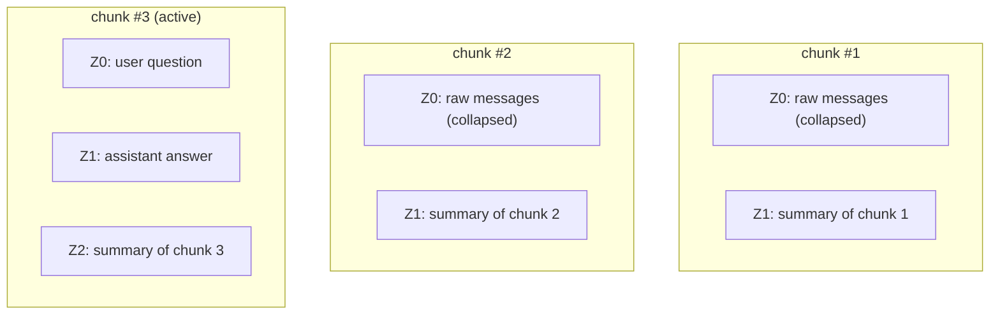

## Dispatch Logic

```text
CollapsedView:
    show only summaries for old chunks
    show full detail for the latest chunk

ExpandedView(chunk):
    show all Z-events for that chunk
```

## Real‑Life Recognition Moment

You’re in a long support chat.  
Instead of reloading 200 messages, the AI keeps only summaries.  
When you say “show me the part about the database,” it expands only that chunk.  
You get **precision without context bloat**.

---

# Architecture C — Memory‑Tiered Dispatch (Short‑Term vs Long‑Term)

This architecture separates **working memory** from **long‑term memory**.

## Axes

- **Z:** short‑term events, long‑term memory entries, memory decisions  
- **X:** `"short_term"`, `"long_term"`, `"meta"`  
- **Y:** `"AnsweringView"`, `"MemoryUpdateView"`

## Diagram: Memory Tiers

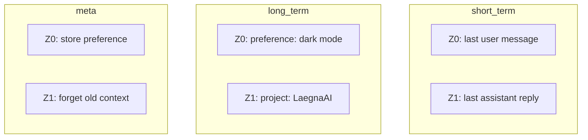

## Dispatch Logic

```text
AnsweringView:
    include short_term
    include relevant long_term
    ignore meta

MemoryUpdateView:
    inspect short_term
    decide what to store
    update long_term
    record meta decisions
```

## Real‑Life Recognition Moment

You tell the AI:  
“Prefer examples in Python.”

Later, it automatically uses Python.  
It’s not magic — it’s just a Z‑event stored in X=`long_term`.

---

# Architecture D — Multi‑Tool Orchestration with Y‑Controlled Passes

This architecture is for complex workflows involving planners, validators, and multiple tools.

## Axes

- **Z:** planner decisions, tool calls, tool results, validation steps  
- **X:** `"planner"`, `"tool:search"`, `"tool:code"`, `"validator"`  
- **Y:** `"PlanPass"`, `"ExecutePass"`, `"ValidatePass"`, `"ExplainPass"`

## Diagram: Multi‑Tool Tracks

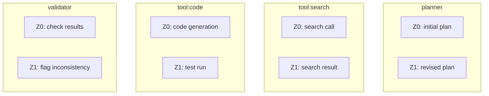

## Dispatch Logic

```text
PlanPass:
    walk planner track only

ExecutePass:
    walk tool:* tracks

ValidatePass:
    walk validator track

ExplainPass:
    combine planner + validator + summarized tool results
```

## Real‑Life Recognition Moment

You ask the AI to analyze a repo and propose fixes.  
Instead of a chaotic blob of logs, you get:

- a plan  
- tool outputs  
- validation  
- a clean explanation  

You can replay each pass.  
The system becomes **debuggable**.

---

# How Information Flows Across Z, X, Y

```text
Z = smallest unit (message, tool call, summary)
X = track (role, tool, memory tier, chunk)
Y = view or mode (planning, execution, summary, memory update)
```

This structure solves real‑life problems:

- long conversations  
- tool noise  
- memory confusion  
- unclear reasoning  
- bloated context windows  

Once you see conversations as **Z inside X inside Y**, the entire system becomes predictable, modular, and easy to extend.

# Optimization Article:  
## Linear Dispatch vs. Structured Dispatch — Why Z/X/Y Exists and When Simplicity Wins

When building an AI message‑processing system, the first instinct is often:  
**“Why not just walk all messages in a simple linear loop?”**  
This instinct is not wrong — in fact, it’s the *correct* starting point for early iterations.  
But it’s also incomplete.  
This chapter explains when linear dispatch is enough, when it becomes a bottleneck, and why the Z/X/Y architecture exists as a scalable extension rather than a replacement.

---

# 1. The Temptation of Linear Dispatch  
### (“Just loop through the messages and process them”)

A linear dispatcher looks like this:

```text
for message in history:
    process(message)
```

This is the simplest possible architecture.  
It is fast to implement, easy to debug, and works surprisingly well for:

- early prototypes  
- small conversations  
- simple tool usage  
- single‑pass summarization  
- deterministic pipelines  

### Can linear dispatch produce the same effect as Z/X/Y?

**Sometimes yes.**  
If the conversation is short and the logic is simple, a linear pass can mimic the behavior of a structured dispatcher.

### Is this a “final truth” or a “laziness factor”?

It’s neither.  
It’s a **valid baseline** — but it becomes insufficient as soon as:

- tools appear  
- memory is needed  
- summaries must be layered  
- context windows must be optimized  
- multiple views (Y‑patterns) are required  
- messages must be grouped by role or type  

Linear dispatch is the “flat earth” model:  
useful until you need to navigate oceans.

---

# 2. How Structured Dispatch Enhances Readability and Toolability

Linear logs quickly become unreadable:

- user messages  
- assistant drafts  
- tool calls  
- tool results  
- summaries  
- metadata  
- planning steps  

All mixed together.

Structured dispatch separates these into **tracks (X)** and **events (Z)**, which makes the output:

- easier for humans to read  
- easier for tools to parse  
- easier for templates to render  
- easier for AI to summarize  

### Diagram: Linear vs. Structured

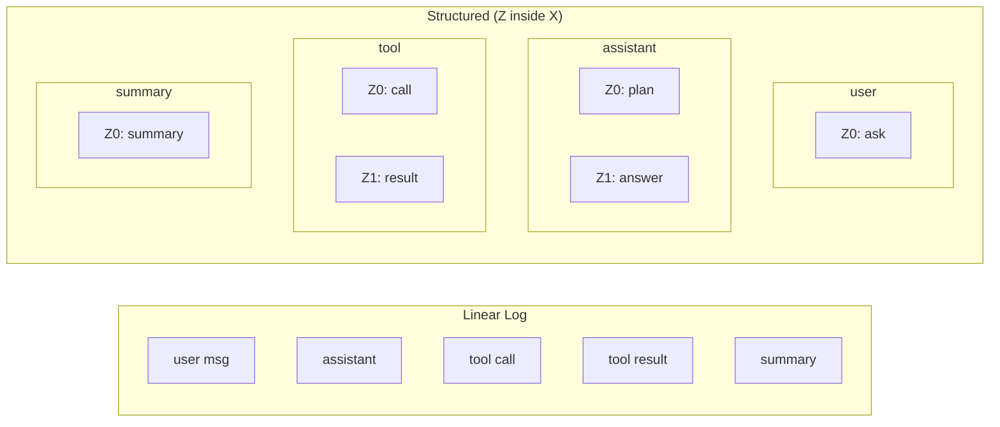

The structured version is not “more complicated” — it’s **more organized**.

---

# 3. Why Order Matters (and Why It Sometimes Doesn’t)

### When order is essential:

- tool calls must precede tool results  
- summaries must follow the events they summarize  
- memory updates must follow the messages they refer to  
- planners must run before execution  
- validators must run after execution  

### When order is flexible:

- grouping messages by role  
- grouping tool calls by type  
- grouping summaries  
- grouping memory entries  

This is why Z/X/Y is **context‑sensitive**:

- Z preserves local order  
- X groups related events  
- Y chooses which groups to walk and in what order  

Linear dispatch cannot express this without hacks.

---

# 4. Lessons from Event Dispatch Systems

Z/X/Y resembles classic event dispatch architectures:

- **GUI frameworks** (Qt, GTK, Win32)  
- **Game engines** (Unity, Unreal)  
- **Browser event loops**  
- **Message queues** (RabbitMQ, Kafka)  

These systems all learned the same lesson:

> “A flat list of events becomes unmanageable.  
> You need grouping, ordering, and multiple views.”

### Diagram: Event Dispatch Analogy

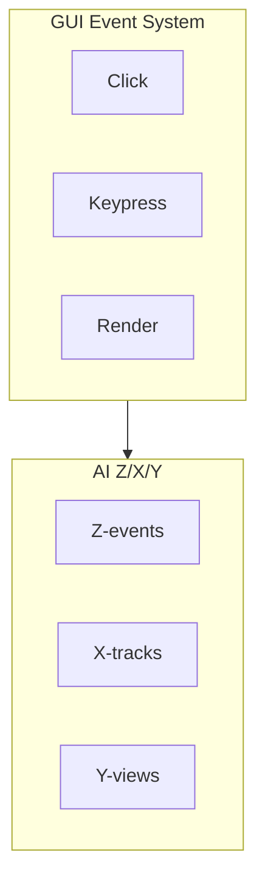

The analogy is direct:

- Z = individual events  
- X = event categories  
- Y = dispatch modes  

---

# 5. Does AI *Depend* on Grouping and Ordering?

### Short answer:  
**Yes — but not in the way people assume.**

### Longer answer:

AI models (LLMs) are trained on:

- structured text  
- grouped information  
- ordered sequences  
- role‑separated dialogues  
- tool‑annotated logs  
- hierarchical documents  

They learn patterns like:

- “assistant messages follow user messages”  
- “tool results follow tool calls”  
- “summaries follow content”  
- “metadata is grouped”  

When you give the model a **structured context**, you are speaking its native language.

### What happens if the conversation is mixed randomly?

- summarization becomes worse  
- tool selection becomes inconsistent  
- memory extraction becomes unreliable  
- inference becomes noisy  
- hallucinations increase  
- templates break  
- debugging becomes painful  

### What happens if the conversation is structured?

- summarization improves  
- tool usage becomes predictable  
- memory extraction becomes stable  
- inference becomes more accurate  
- hallucinations decrease  
- templates become reusable  
- debugging becomes trivial  

---

# 6. Does Training or Fine‑Tuning Depend on Structure?

### Yes — strongly.

Models trained on:

- clean role‑separated dialogues  
- consistent tool formats  
- structured logs  
- hierarchical documents  

perform better at:

- reasoning  
- planning  
- summarization  
- tool use  
- memory extraction  
- multi‑step workflows  

### Current experience in the field:

- Fine‑tuned models with structured data outperform those with mixed logs.  
- Models trained on tool‑annotated corpora handle tools more reliably.  
- Models trained on hierarchical documents summarize better.  
- Models trained on role‑separated chat data hallucinate less.

Structure is not optional — it is a **performance multiplier**.

---

# 7. Does AI *Gain Anything* from Better Organization?

Absolutely.

### Gains for the model:

- clearer causal chains  
- easier summarization  
- better tool reasoning  
- more stable memory extraction  
- fewer hallucinations  
- more predictable behavior  

### Gains for developers:

- easier debugging  
- easier logging  
- easier template design  
- easier tool integration  
- easier memory management  

### Gains for users:

- clearer answers  
- more consistent behavior  
- fewer mistakes  
- more trust in the system  

---

# 8. Final Comparison: Linear vs. Structured

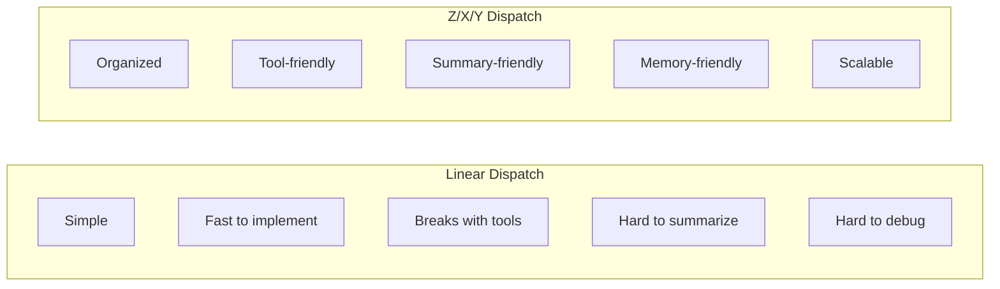

### Summary:

- **Linear dispatch** is perfect for prototypes.  
- **Structured dispatch** is essential for real systems.  
- The Z/X/Y model is not “overengineering” — it’s the natural evolution of message processing once complexity grows.

---

# 9. Closing Thought

Linear dispatch is the seed.  
Z/X/Y is the tree.

Both are valid — but only one can carry the weight of real‑world AI systems.

# Visual Introduction to the System, Roles, Tools, Extensions, and Z/X/Y Scoping

This add‑on gives a **visual, intuitive overview** of how the system works.  
It is meant for users, engineers, and architects who want to see the **flow**, not just the theory.

---

# 1. High‑Level Flow: From User Input to Final Output

This diagram shows the **entire lifecycle** of a message:  
user → system → tools → summaries → final answer.

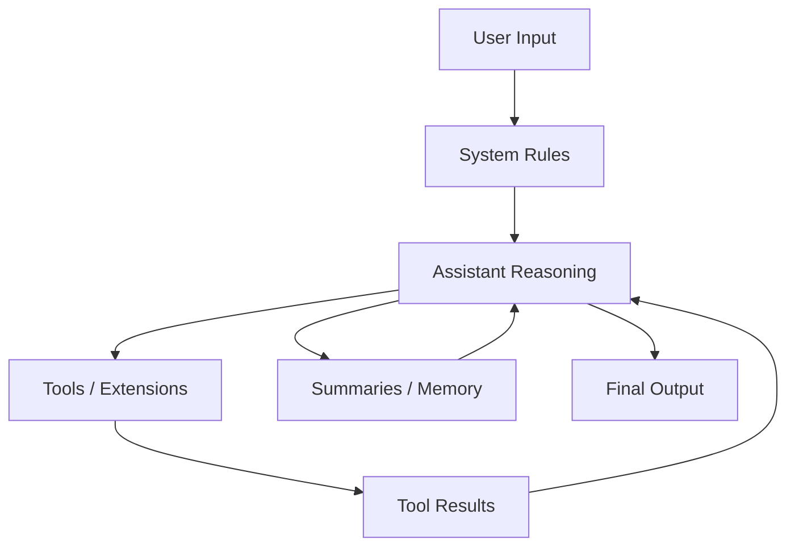

**Interpretation:**

- The assistant loops through tools and summaries as needed.  
- Summaries and memory updates feed back into reasoning.  
- The final answer is produced only after all relevant Z‑events are processed.

---

# 2. Roles and Their Interaction

Roles are the **X‑tracks**.  
Each role produces **Z‑events**.  
The system walks them according to **Y‑patterns**.

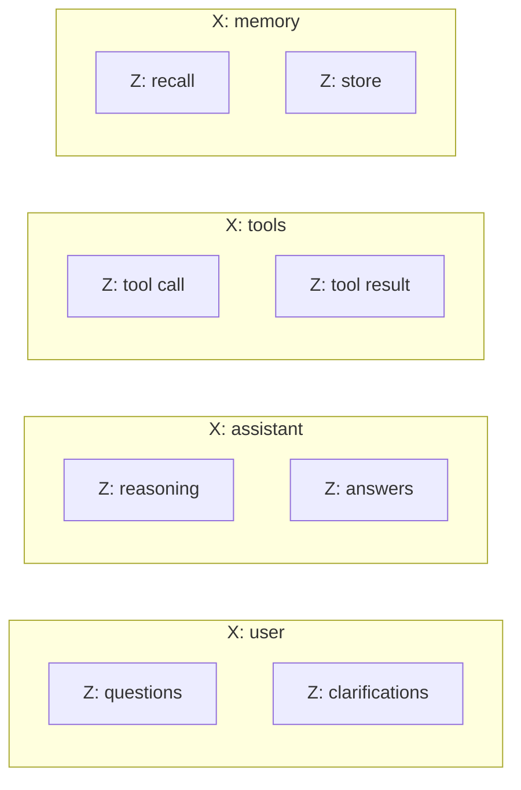

**Key idea:**  
Each role is a **lane**.  
Z‑events are the **cars** driving in that lane.

---

# 3. How Tools and Extensions Get Scoped

Tools behave like **extensions** that attach themselves to the conversation.  
They produce their own Z‑events and can be grouped under their own X‑track.

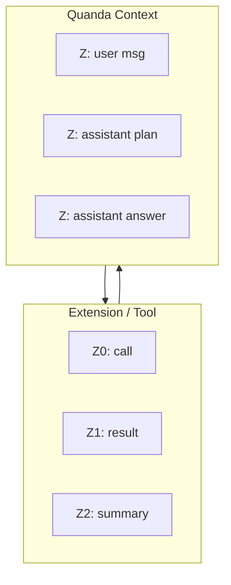

**Interpretation:**  
Tools are not “outside” the conversation — they are **scoped inside it**, producing events that the dispatcher can walk.

---

# 4. Basic Z/X/Y Structure (Visual)

This is the **core mental model**.

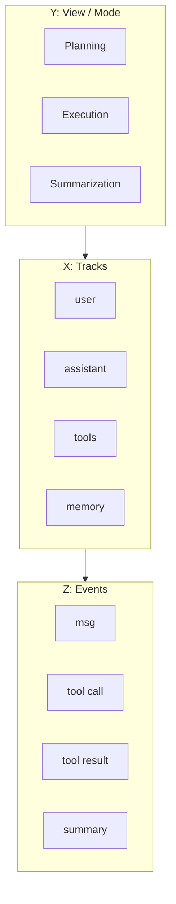

**Meaning:**  
Y chooses *how* to walk X.  
X contains lists of Z.  
Z is the smallest unit.

---

# 5. Process Flow: How a Single Turn Is Processed

This diagram shows the **step‑by‑step flow** inside one turn.

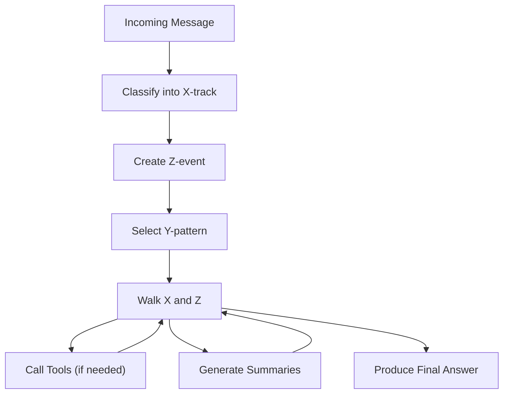

---

# 6. User Needs and How They Map to the System

Users have different needs.  
The system maps them to **Y‑patterns** automatically.

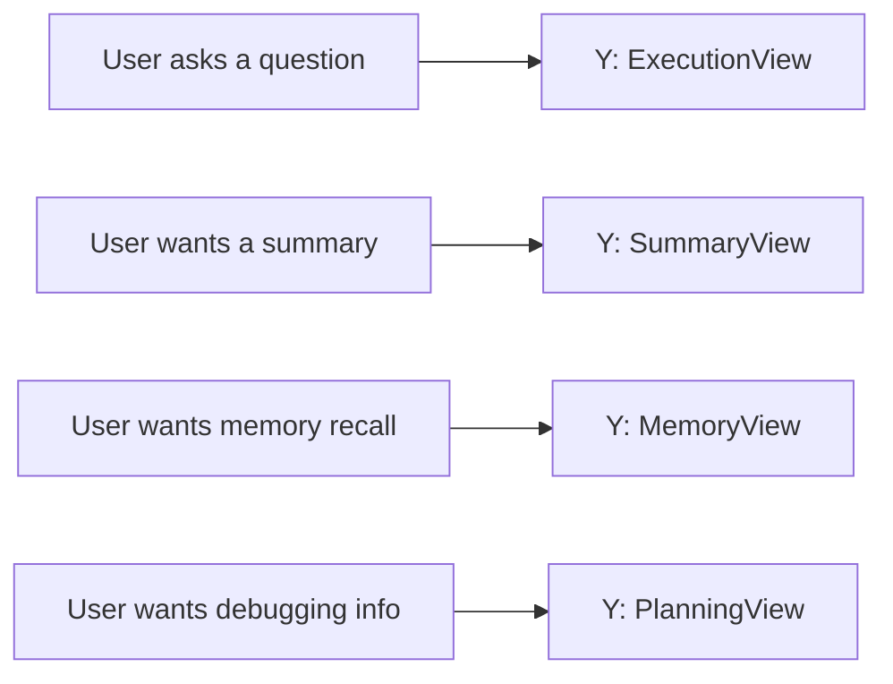

**Interpretation:**  
The system chooses the correct Y‑pattern based on the user’s intent.

---

# 7. How Roles Become Tools or Extensions

Sometimes a role becomes a tool.  
Sometimes a tool becomes a role.  
This is how the system scopes them.

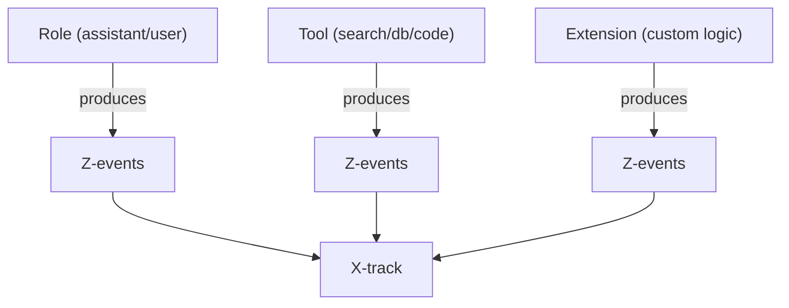

**Meaning:**  
Everything — roles, tools, extensions — becomes **Z‑events** inside **X‑tracks**.

---

# 8. Full System Overview (All Components Together)

This is the **complete picture**.

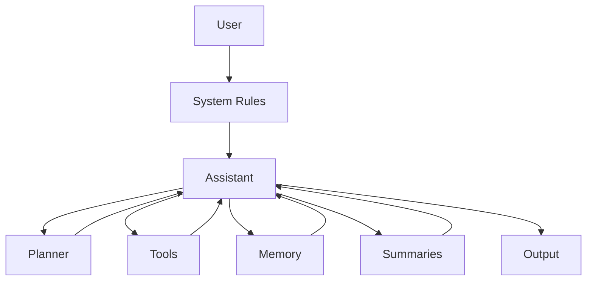

Everything loops through the assistant, which orchestrates the entire Z/X/Y dispatch.

---

# 9. Minimal Code Skeleton (Conceptual)

```python
def dispatch(quanda, y_pattern):
    for x in quanda.X_list:
        for z in quanda.Z_events[x]:
            if y_pattern.allows(x, z):
                process(z)
```

This is the **entire architecture** in one tiny block.

---

# 10. What the User Gains From This Visual Model

- A clear mental map of how messages flow  
- Understanding of how tools and extensions integrate  
- Awareness of how memory and summaries are scoped  
- Insight into how the system stays organized  
- A visual intuition for Z/X/Y without reading theory  

This add‑on gives a **complete visual introduction** to the system.  
The rest of the manual simply deepens each part.
